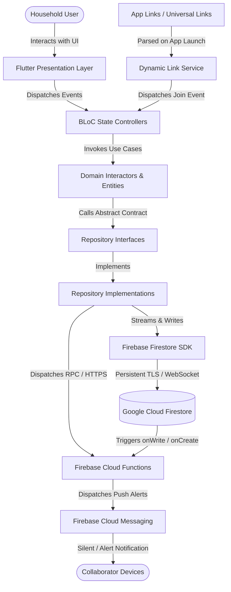
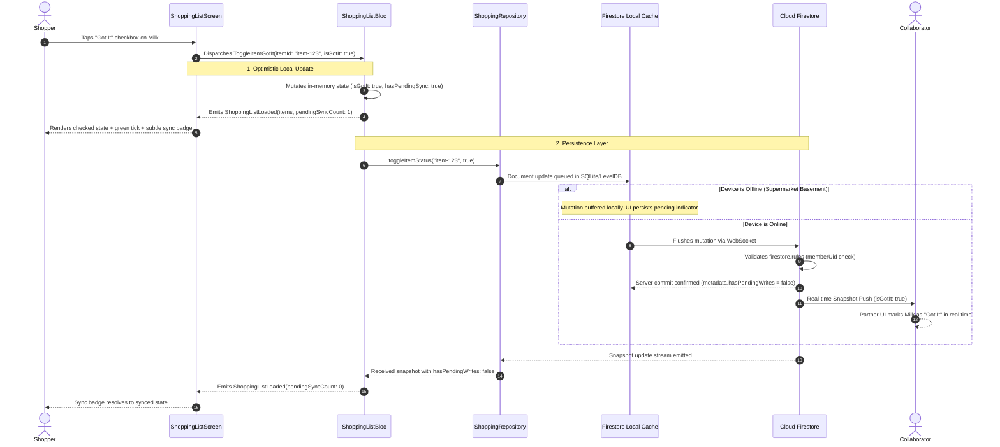
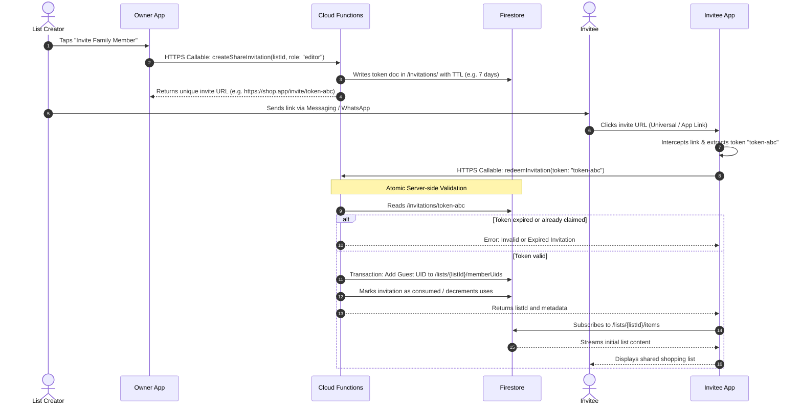

# Architecture Documentation: Shared Shopping List

This document details the high-level architecture, design decisions, data flow, scalability vectors, and security framework for the **Shared Shopping List** cross-platform mobile solution.

---

## 2.1 Chosen Architectural Pattern

### Pattern: Feature-First Clean Architecture + Reactive Serverless (BLoC & Cloud Firestore)

The system adopts a **Feature-First Clean Architecture** on the Flutter client, paired with a **Reactive Serverless Backend** powered by Google Firebase (Firestore, Cloud Auth, Cloud Functions, and Firebase Cloud Messaging).

```
+-------------------------------------------------------------------------+
|                              PRESENTATION                               |
|   Flutter UI Widgets  <====== (Streams/States) ======>  BLoC / Cubit    |
+-------------------------------------------------------------------------+
                                    |
                                    v
+-------------------------------------------------------------------------+
|                                 DOMAIN                                  |
|   Entities (Immutable)  <----  Use Cases / Interactors  <---- Contracts |
+-------------------------------------------------------------------------+
                                    |
                                    v
+-------------------------------------------------------------------------+
|                                  DATA                                   |
|   Repositories (Impl)   <----  Data Sources (Remote Firestore / Cache)  |
+-------------------------------------------------------------------------+
                                    |
            +-----------------------+-----------------------+
            |                                               |
            v                                               v
+-----------------------+                       +-----------------------+
|   Cloud Firestore     |                       | Firebase Functions    |
|   (Direct Access with |                       | (Privileged Serverless|
|   Security Rules)     |                       | Token & Invite Logic) |
+-----------------------+                       +-----------------------+
```

### Architectural Justification
1. **Unidirectional Data Flow (UDF)**: The BLoC pattern ensures strict separation between state transitions and UI rendering. The UI dispatches discrete *Events*, BLoC executes domain logic, and emits immutable *States*. This prevents race conditions during rapid concurrent checkoffs.
2. **Real-time Reactive Sync**: Grocery shopping in a store aisle requires sub-second synchronization between partners. Cloud Firestore's native persistent WebSocket connection and snapshot streams eliminate polling overhead.
3. **Offline-First Resilience**: Supermarkets often suffer from poor cellular reception. Firestore provides built-in multi-tab offline caching with queued mutations (`hasPendingWrites`), which aligns seamlessly with BLoC's state-driven UI indicators.
4. **Cost and Operational Zero-Maintenance**: Serverless Firestore and Cloud Functions automatically scale to zero during idle periods and effortlessly handle spike traffic without requiring container orchestration or VM provisioning.

---

## 2.2 Key Component Interactions



### Communication Channels

1. **Direct Database Access (Controlled by Rules)**:
   - Read/write operations for lists and items bypass custom intermediate microservices and talk directly from the client to **Cloud Firestore**.
   - Security, access control, and structural integrity are strictly governed by server-enforced `firestore.rules`.
2. **Real-Time Snapshot Streams**:
   - The client subscribes to item collections via `collection(...).snapshots(includeMetadataChanges: true)`.
   - Firestore emits real-time deltas directly to BLoC event transformers.
3. **Privileged Serverless Functions (Callable APIs)**:
   - High-privilege tasks (invitation token minting, single-use token redemption, automated staple generation) run inside **Firebase Cloud Functions (Node.js/TypeScript)** with Admin SDK privileges.
4. **Deep Link Ingestion**:
   - OS-level App Links (Android) and Universal Links (iOS) route `https://shoppinglist.app/join?token=XYZ` into the app. A specialized `DynamicLinkService` decodes the token and initiates BLoC invitation processing.

---

## 2.3 Data Flow

### 2.3.1 Item Checkoff ("Got It") Optimistic Lifecycle



### 2.3.2 List Sharing & Deep Link Invitation Flow



---

## 2.4 Scalability & Performance Strategy

1. **Denormalized Authorization Boundaries**:
   - Each `ShoppingList` document maintains an array of `memberUids: string[]`.
   - Security rule lookups do **not** perform expensive recursive collection traversals; permission checks execute in $O(1)$ directly:
     ```javascript
     request.auth.uid in resource.data.memberUids
     ```
2. **Subcollection Segmentation**:
   - List items reside in a subcollection: `/shopping_lists/{listId}/items/{itemId}`.
   - This isolates list updates. Checking off an item updates only a 200-byte item document rather than rewriting a monolithic 50KB parent list document, avoiding Firestore's 1-write-per-second document throughput ceiling.
3. **Query Optimization & Composite Indexes**:
   - Queries fetch only active (non-archived) items:
     ```dart
     firestore.collection('shopping_lists/$listId/items')
              .where('isArchived', isEqualTo: false)
              .orderBy('storeSectionIndex')
              .orderBy('updatedAt', descending: true);
     ```
   - Pre-computed composite indexes in `firestore.indexes.json` ensure constant-time query latency regardless of total archive volume.
4. **BLoC Event Concurrency Transformers**:
   - Search queries and rapid quantity adjustments use `bloc_concurrency` transformers (e.g. `restartable()` or `debounceTime(Duration(milliseconds: 300))`) to throttle writes to the Firestore client SDK.
5. **Memory and Cache Management**:
   - Firestore cache size is bounded to 100MB with LRU eviction.
   - Stream subscriptions are tied strictly to BLoC lifecycles; BLoCs close their Firestore `StreamSubscription` when navigating away from the list screen.

---

## 2.5 Security Considerations

### Authentication & Identity
- **Firebase Authentication** serves as the identity provider.
- **Anonymous-First Onboarding**: Shoppers can instantly start creating items anonymously without signup friction.
- **OAuth SSO & Credential Linking**: When users want cross-device backup or household list sharing, the app performs seamless credential linking (`linkWithCredential`) or direct sign-in with **GitHub OAuth SSO** and Email/Password credentials without losing local anonymous list data.

### Granular Authorization (Firestore Security Rules)
- **Role-Based Access Control (RBAC)**:
  - `owner`: Can update list settings, manage members, delete the list.
  - `editor`: Can read items, create items, toggle "got it", edit quantities.
  - `viewer`: Can read items in real time but cannot modify records.
- **Field-Level Validation**:
  - Security rules enforce strict schema types (e.g., `item.name is string`, `item.quantity > 0`, `item.priceEstimate is number`).
  - Prohibits clients from modifying immutable fields such as `addedByUid` or tampering with `memberUids`.

### Secret Management & Environment Security
- Zero production API secrets are hardcoded in client binaries.
- Client configurations (Firebase API keys, Project IDs) are public identifiers restricted via Google Cloud Console with Android Package SHA-1 fingerprinting and iOS Bundle Identifier whitelisting.
- Backend Cloud Functions use Google Cloud Secret Manager for third-party tokens (e.g., Slack alerts, Twilio SMS).

---

## 2.6 Error Handling & Logging Philosophy

```
Exception (SDK / Network)
         |
         v
Data Source: Catches Exception -> Maps to Domain Failure
         |
         v
Repository: Returns Either<Failure, Success> or Streams
         |
         v
BLoC: Maps Failure -> User-Friendly Error State
         |
         v
UI: Listens to State -> Displays SnackBar / Retry View
```

1. **Failures as First-Class Citizens**:
   - Low-level exceptions (`FirebaseException`, `SocketException`) are caught inside the Data Layer and mapped to domain-specific `Failure` objects:
     - `NetworkFailure` (Offline with no cached snapshot)
     - `PermissionFailure` (User removed from list by owner)
     - `ItemNotFoundFailure` (Concurrent deletion by collaborator)
2. **Optimistic Rollbacks**:
   - If an optimistic write fails (e.g., security violation), BLoC catches the error, rolls back the local item state to the previous snapshot, and emits a notification to the UI.
3. **Structured Observability**:
   - `AppBlocObserver` intercepts every `onEvent`, `onTransition`, and `onError`, logging telemetry to debug consoles during development and piping uncaught crashes to **Firebase Crashlytics** in production.
