# Enterprise Banking Platform - Architecture Documentation

## Table of Contents
1. [Architectural Pattern](#1-architectural-pattern)
2. [Key Component Interactions](#2-key-component-interactions)
3. [Data Flow](#3-data-flow)
4. [Scalability & Performance Strategy](#4-scalability--performance-strategy)
5. [Security Considerations](#5-security-considerations)
6. [Error Handling & Logging Philosophy](#6-error-handling--logging-philosophy)

---

## 1. Architectural Pattern

### 1.1 Chosen Pattern: Event-Driven Microservices with CQRS and Event Sourcing

This platform implements a **reactive event-driven microservices architecture** combining:
- **CQRS (Command Query Responsibility Segregation)** for transaction processing
- **Event Sourcing** for account state management
- **Saga Pattern** for distributed transaction coordination

### 1.2 Justification

| Requirement | Architectural Response |
|------------|----------------------|
| High transaction throughput | Reactive stack (WebFlux) with non-blocking I/O |
| Audit compliance | Event Sourcing provides complete audit trail |
| Complex queries vs writes | CQRS separates read/write models |
| Fault tolerance | Event-driven decoupling, Saga compensation |
| ML integration | Async event streaming to fraud service |
| Scalability | Stateless services, horizontal scaling |

### 1.3 High-Level Architecture Diagram

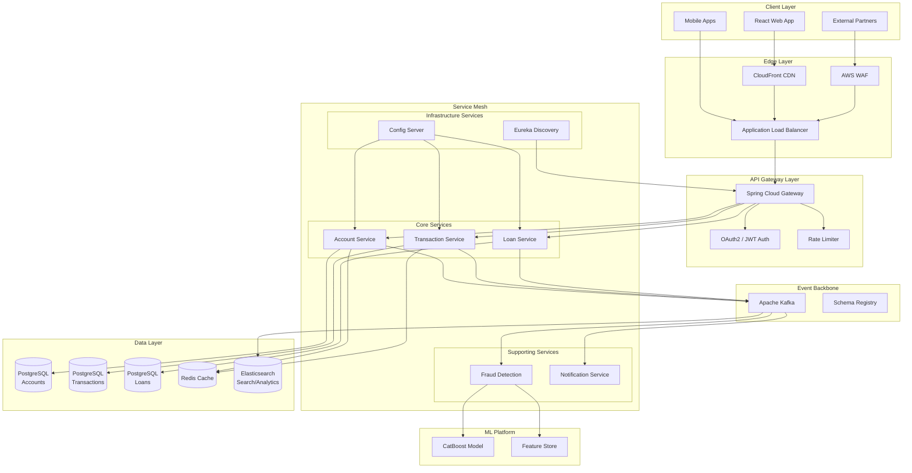

---

## 2. Key Component Interactions

### 2.1 Service Communication Patterns

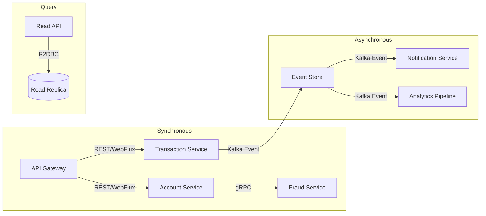

### 2.2 Communication Matrix

| From | To | Protocol | Pattern | Purpose |
|------|-----|----------|---------|---------|
| Gateway | All Services | HTTP/2 | Request-Response | API routing |
| Transaction | Fraud Detection | gRPC | Request-Response | Real-time scoring |
| Account | Event Store | Kafka | Publish | Event sourcing |
| Transaction | Kafka | Kafka | Publish | CQRS events |
| Kafka | Query Service | Kafka | Subscribe | Read model update |
| Services | Config Server | HTTP | Pull | Configuration |
| Services | Discovery | HTTP | Register/Heartbeat | Service mesh |

### 2.3 CQRS Implementation Detail

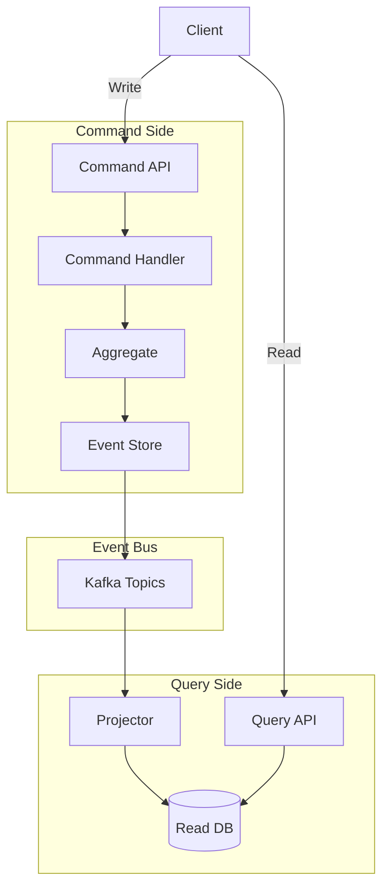

---

## 3. Data Flow

### 3.1 Fund Transfer Flow (Main Use Case)

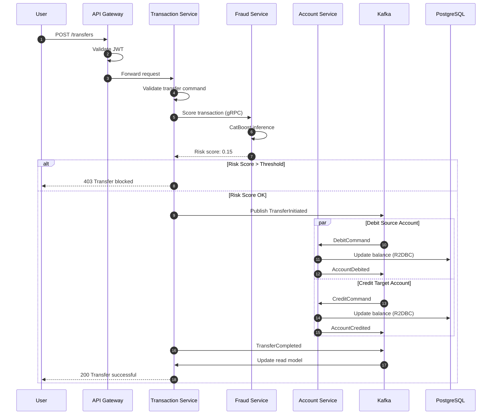

### 3.2 Event Sourcing - Account Lifecycle

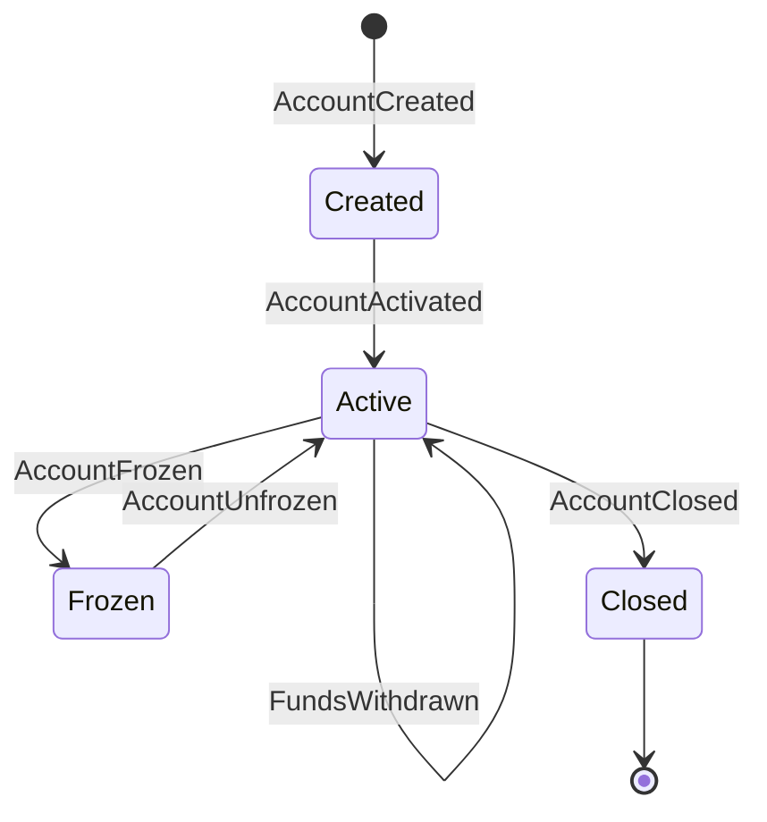

### 3.3 Data Flow Diagram

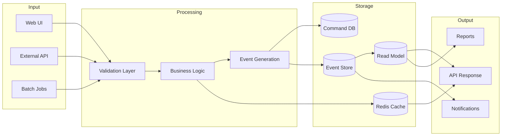

---

## 4. Scalability & Performance Strategy

### 4.1 Horizontal Scaling Architecture

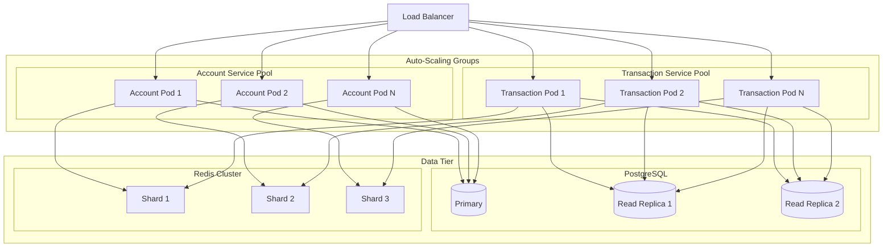

### 4.2 Performance Strategies

| Strategy | Implementation | Expected Gain |
|----------|---------------|---------------|
| **Reactive I/O** | WebFlux + R2DBC | 5-10x throughput |
| **Connection Pooling** | R2DBC Pool | Reduced latency |
| **Caching** | Redis with TTL | 90% cache hit rate |
| **Read Replicas** | PostgreSQL streaming | Scale reads |
| **Event Batching** | Kafka batch producer | Higher throughput |
| **GraalVM Native** | AOT compilation | 50ms startup |
| **Query Optimization** | Materialized views | Fast aggregations |

### 4.3 Capacity Planning

```
Target Metrics:
- 10,000 TPS for account queries
- 1,000 TPS for fund transfers
- < 100ms P99 latency for reads
- < 500ms P99 latency for transfers
- 99.99% availability

Scaling Triggers:
- CPU > 70%: Scale out +2 pods
- Memory > 80%: Scale out +2 pods
- Request queue > 100: Scale out +4 pods
- Error rate > 1%: Alert + investigate
```

---

## 5. Security Considerations

### 5.1 Security Architecture

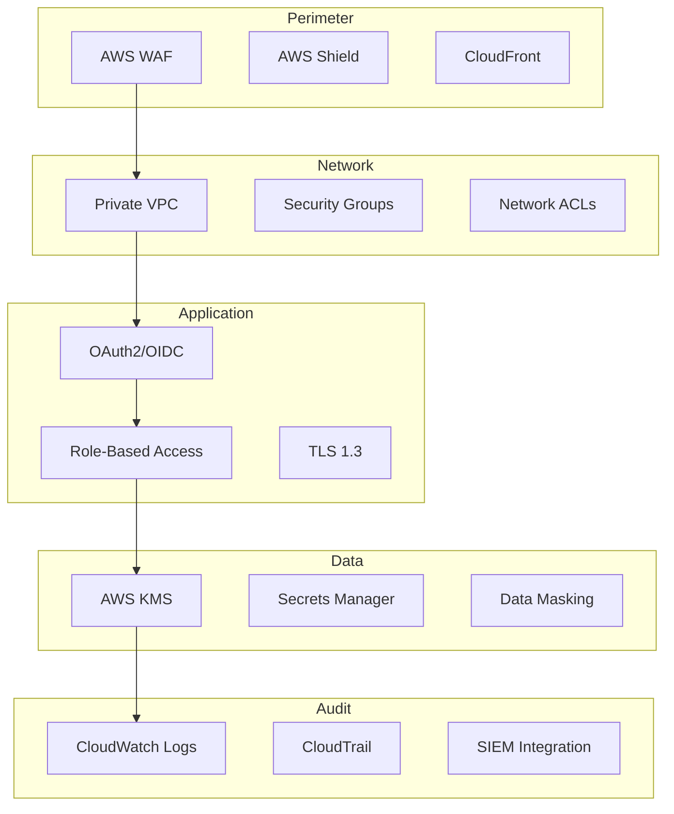

### 5.2 Authentication & Authorization

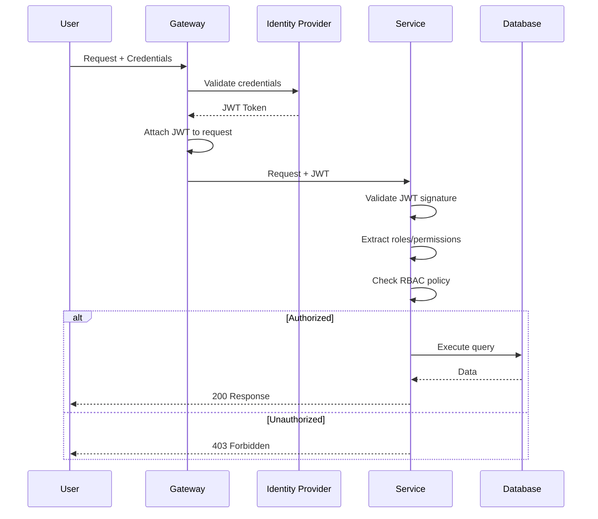

### 5.3 Security Controls Matrix

| Control | Implementation | Layer |
|---------|---------------|-------|
| **Authentication** | OAuth2 + JWT | Application |
| **Authorization** | Spring Security RBAC | Application |
| **API Security** | Rate limiting, WAF | Edge |
| **Data Encryption** | TLS 1.3 in transit, AES-256 at rest | Network/Data |
| **Secret Management** | AWS Secrets Manager | Infrastructure |
| **Input Validation** | Bean Validation, sanitization | Application |
| **SQL Injection** | Parameterized queries (R2DBC) | Data |
| **XSS Prevention** | React auto-escaping, CSP | Frontend |
| **CSRF Protection** | SameSite cookies, tokens | Application |
| **Audit Logging** | All mutations logged | Application |

### 5.4 Data Classification

| Classification | Examples | Protection |
|---------------|----------|------------|
| **PII** | Name, SSN, Address | Encryption, masking |
| **Financial** | Account numbers, balances | Encryption, audit |
| **Authentication** | Passwords, tokens | Hashing, rotation |
| **Public** | Product info | Standard protection |

---

## 6. Error Handling & Logging Philosophy

### 6.1 Error Handling Strategy

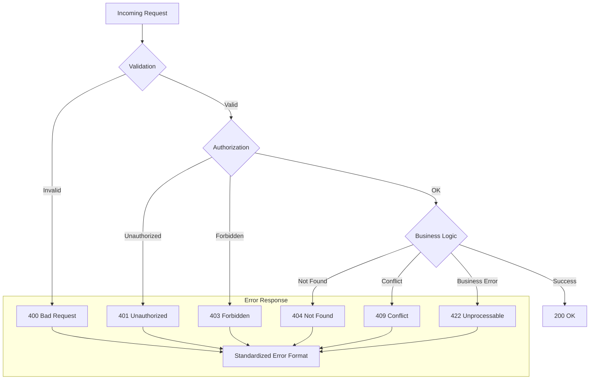

### 6.2 Standardized Error Response Format

```json
{
  "error": {
    "code": "INSUFFICIENT_FUNDS",
    "message": "Account has insufficient balance for this transfer",
    "details": {
      "accountId": "ACC-12345",
      "requestedAmount": 1000.00,
      "availableBalance": 500.00
    },
    "traceId": "abc-123-def-456",
    "timestamp": "2026-01-17T10:30:00Z",
    "path": "/api/v1/transfers"
  }
}
```

### 6.3 Logging Architecture

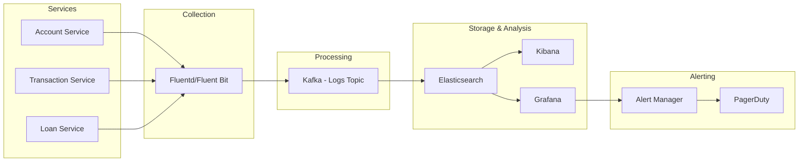

### 6.4 Logging Standards

| Level | Usage | Example |
|-------|-------|---------|
| **ERROR** | Unrecoverable failures | Database connection lost |
| **WARN** | Recoverable issues | Retry succeeded after failure |
| **INFO** | Business events | Transfer completed |
| **DEBUG** | Diagnostic info | Request/response details |
| **TRACE** | Fine-grained debug | Method entry/exit |

### 6.5 Structured Log Format

```json
{
  "timestamp": "2026-01-17T10:30:00.123Z",
  "level": "INFO",
  "service": "transaction-service",
  "traceId": "abc-123",
  "spanId": "def-456",
  "userId": "USR-789",
  "action": "TRANSFER_COMPLETED",
  "message": "Fund transfer completed successfully",
  "metadata": {
    "sourceAccount": "ACC-111",
    "targetAccount": "ACC-222",
    "amount": 500.00,
    "currency": "USD",
    "durationMs": 145
  }
}
```

### 6.6 Distributed Tracing

```mermaid
gantt
    title Request Trace Timeline
    dateFormat X
    axisFormat %L ms

    section Gateway
    JWT Validation    :0, 5
    Route Resolution  :5, 8

    section Transaction
    Command Handling  :10, 25

    section Fraud Check
    ML Inference      :25, 45

    section Account
    Debit Operation   :50, 70
    Credit Operation  :50, 75

    section Event Store
    Persist Events    :80, 95

    section Response
    Build Response    :95, 100
```

### 6.7 Resilience Patterns (Resilience4j)

```java
// Circuit Breaker Configuration
@CircuitBreaker(name = "fraudService", fallbackMethod = "fallbackFraudCheck")
@Retry(name = "fraudService")
@TimeLimiter(name = "fraudService")
public Mono<RiskScore> checkFraud(Transaction tx) {
    return fraudClient.score(tx);
}

// Fallback - allow transaction with elevated logging
public Mono<RiskScore> fallbackFraudCheck(Transaction tx, Exception e) {
    log.warn("Fraud service unavailable, applying manual review flag");
    return Mono.just(RiskScore.MANUAL_REVIEW);
}
```

---

## Appendix A: Technology Decision Records

### ADR-001: Reactive Stack Selection
**Decision**: Use Spring WebFlux with R2DBC
**Rationale**: High concurrency requirement for banking transactions
**Trade-offs**: Steeper learning curve, debugging complexity

### ADR-002: Event Sourcing for Accounts
**Decision**: Implement event sourcing for account aggregate
**Rationale**: Complete audit trail required by compliance
**Trade-offs**: Increased storage, replay complexity

### ADR-003: CQRS for Transactions
**Decision**: Separate read and write models
**Rationale**: Different scaling needs for queries vs commands
**Trade-offs**: Eventual consistency, increased complexity

---

*Document Version: 1.0*
*Last Updated: 2026-01-17*
