# Healthcare Claims Processing - Architecture Documentation

## 1. Executive Summary

This document describes the architecture for the Healthcare Claims Processing system, a cloud-native application designed to process insurance claims with automated adjudication, ML-powered fraud detection, and real-time integration with external scoring APIs.

---

## 2. Architectural Pattern

### 2.1 Chosen Pattern: Event-Driven Microservices with CQRS

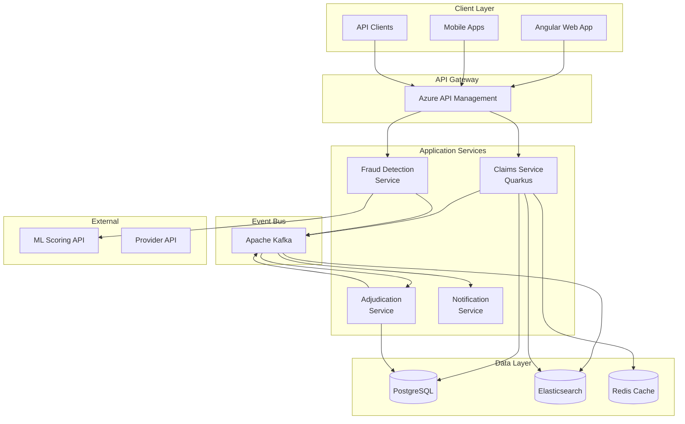

### 2.2 Pattern Justification

| Requirement | How Architecture Addresses It |
|-------------|------------------------------|
| **High Throughput** | Kafka enables async processing, prevents blocking |
| **Low Latency** | Quarkus native compilation achieves <100ms cold starts |
| **Fraud Detection** | Event-driven allows real-time ML scoring integration |
| **Auditability** | Event sourcing provides complete claim history |
| **Scalability** | Stateless services scale horizontally on Azure Functions |
| **Resilience** | Decoupled services fail independently |

---

## 3. Key Component Interactions

### 3.1 Service Communication Matrix

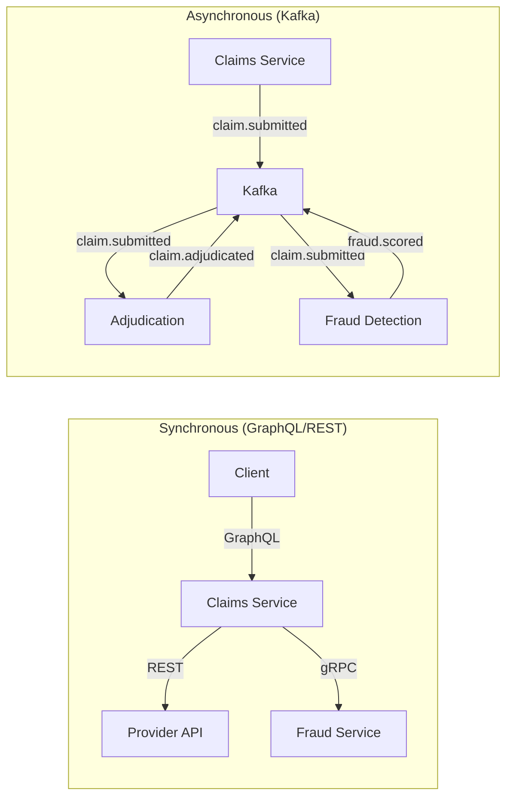

### 3.2 Communication Patterns

| Pattern | Use Case | Technology |
|---------|----------|------------|
| Request/Response | User queries, CRUD operations | GraphQL, REST |
| Publish/Subscribe | Claim events, fraud alerts | Kafka Topics |
| Event Sourcing | Claim state tracking | Kafka + PostgreSQL |
| CQRS | Separate read/write models | Elasticsearch (read), PostgreSQL (write) |

---

## 4. Data Flow

### 4.1 Claim Submission Flow

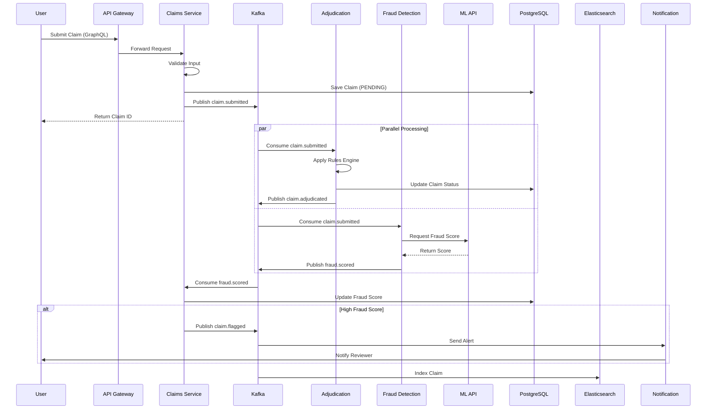

### 4.2 Claim State Machine

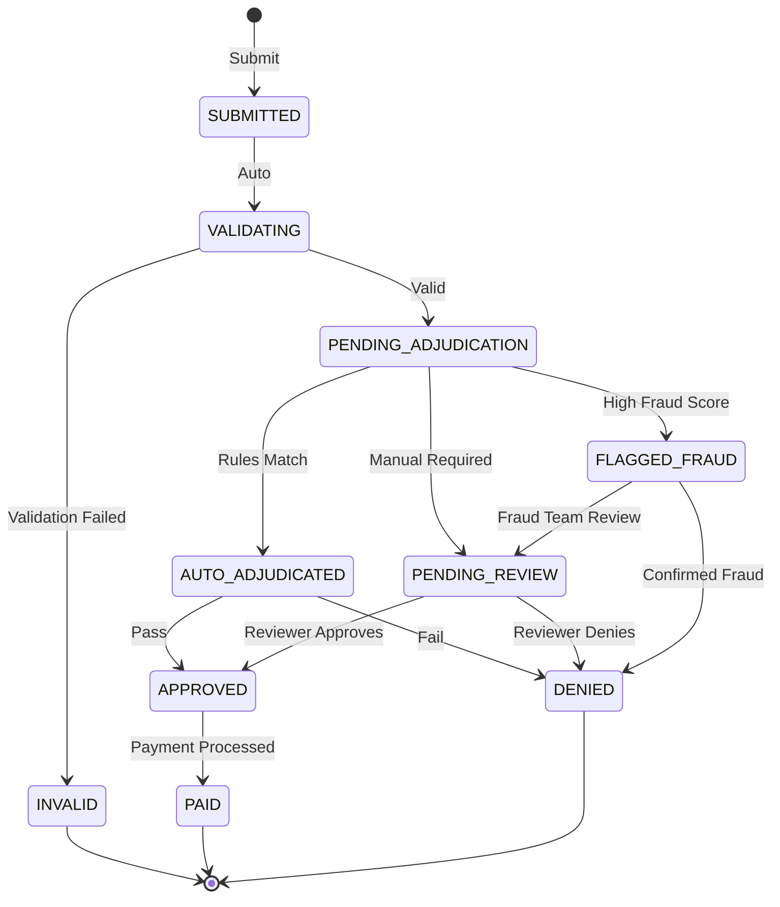

---

## 5. Component Architecture

### 5.1 Claims Service (Core)

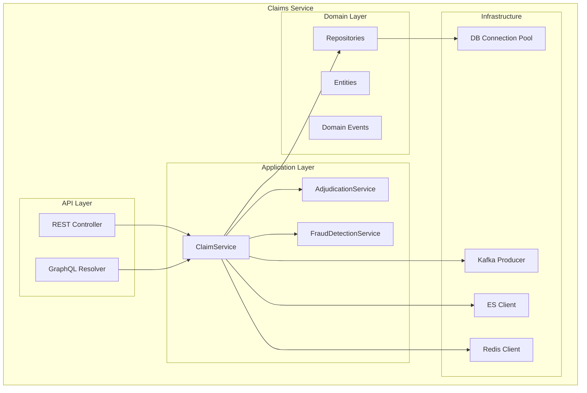

### 5.2 Domain Model

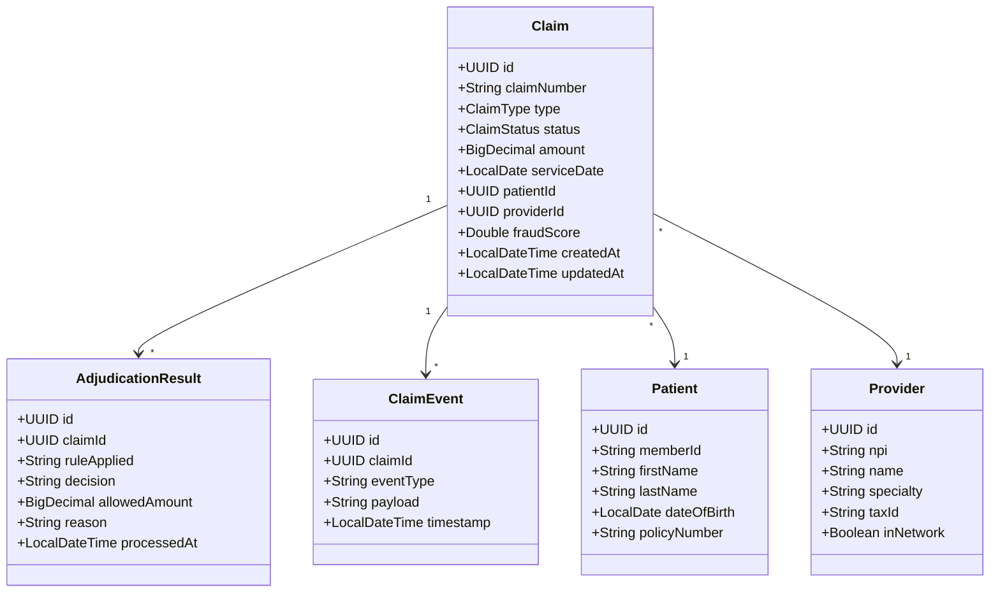

---

## 6. Scalability & Performance Strategy

### 6.1 Scaling Architecture

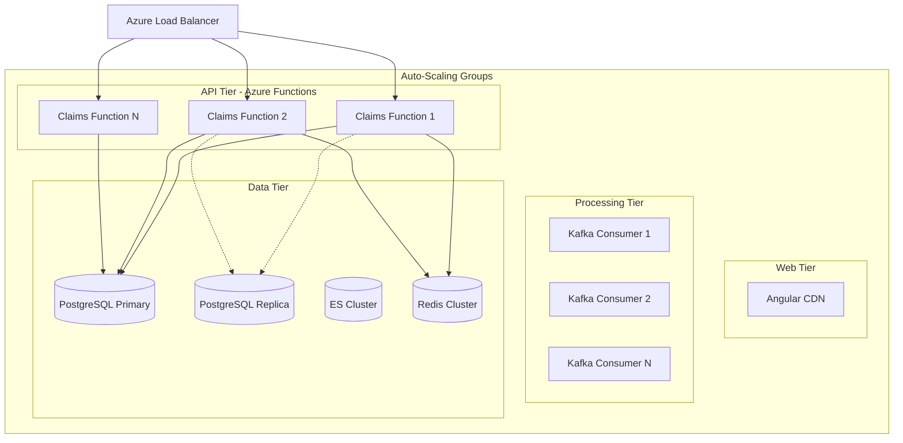

### 6.2 Performance Targets

| Metric | Target | Strategy |
|--------|--------|----------|
| API Response Time (p99) | < 200ms | Reactive I/O, caching |
| Cold Start | < 100ms | Quarkus native, minimal deps |
| Throughput | 10,000 claims/min | Kafka partitioning, horizontal scaling |
| Search Latency | < 50ms | Elasticsearch optimization |
| Database Connections | Pool: 20-100 | PgBouncer connection pooling |

### 6.3 Caching Strategy

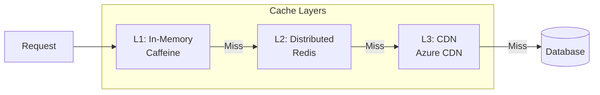

**Cache TTLs:**
- Provider lookups: 1 hour
- Patient data: 15 minutes
- Claim status: 30 seconds
- Rules configuration: 5 minutes

---

## 7. Security Architecture

### 7.1 Security Layers

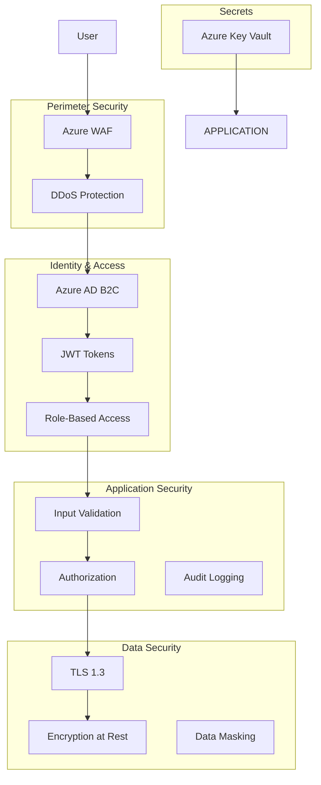

### 7.2 Authentication Flow

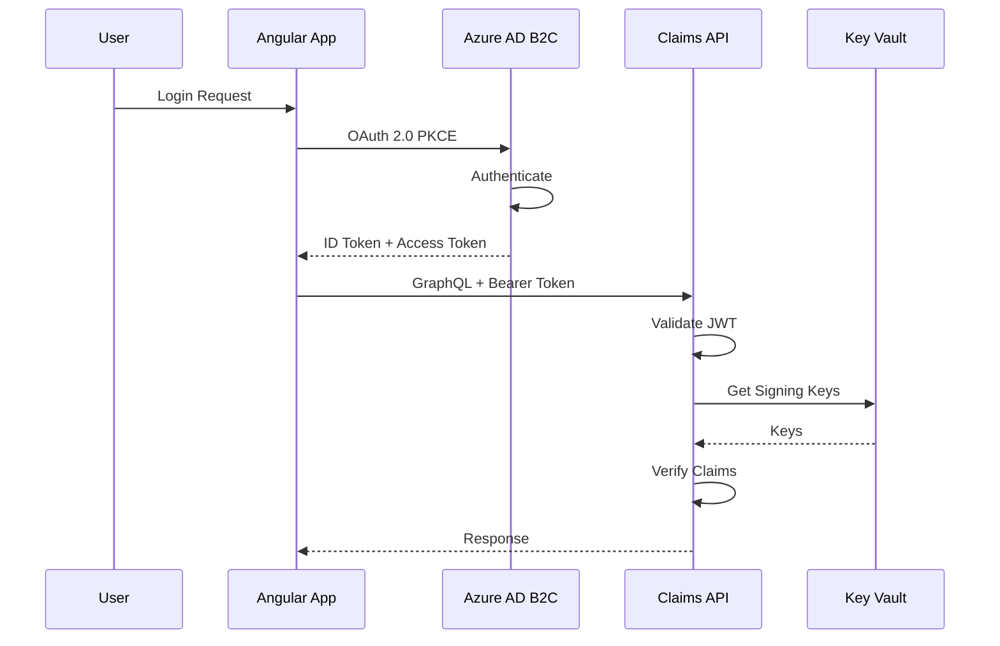

### 7.3 Security Controls

| Layer | Control | Implementation |
|-------|---------|----------------|
| Network | Firewall | Azure NSG, WAF rules |
| Transport | Encryption | TLS 1.3 everywhere |
| Identity | Authentication | Azure AD B2C, OAuth 2.0 |
| Authorization | RBAC | Claims-based, fine-grained |
| Data | Encryption | AES-256 at rest |
| Data | Masking | PHI fields masked in logs |
| Audit | Logging | All access logged, immutable |
| Secrets | Management | Azure Key Vault, no hardcoding |

### 7.4 HIPAA Compliance Considerations

- PHI data encrypted at rest and in transit
- Audit logging for all data access
- Role-based access with minimum privilege
- Data masking in non-production environments
- Business Associate Agreements (BAA) with cloud providers

---

## 8. Error Handling & Logging

### 8.1 Error Handling Strategy

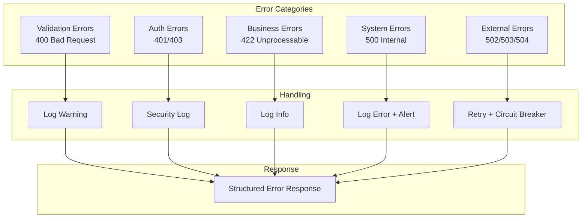

### 8.2 Structured Logging Format

```json
{
  "timestamp": "2024-01-15T10:30:00.000Z",
  "level": "ERROR",
  "service": "claims-service",
  "traceId": "abc123",
  "spanId": "def456",
  "userId": "user-789",
  "claimId": "claim-012",
  "message": "Failed to process claim",
  "error": {
    "type": "AdjudicationException",
    "message": "Rule engine timeout",
    "stackTrace": "..."
  },
  "context": {
    "claimType": "MEDICAL",
    "amount": 1500.00
  }
}
```

### 8.3 Observability Stack

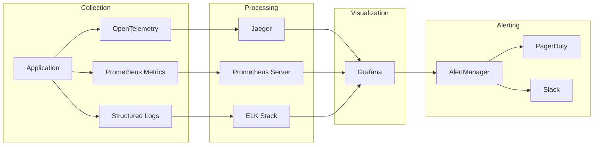

---

## 9. Infrastructure Architecture

### 9.1 Azure Deployment

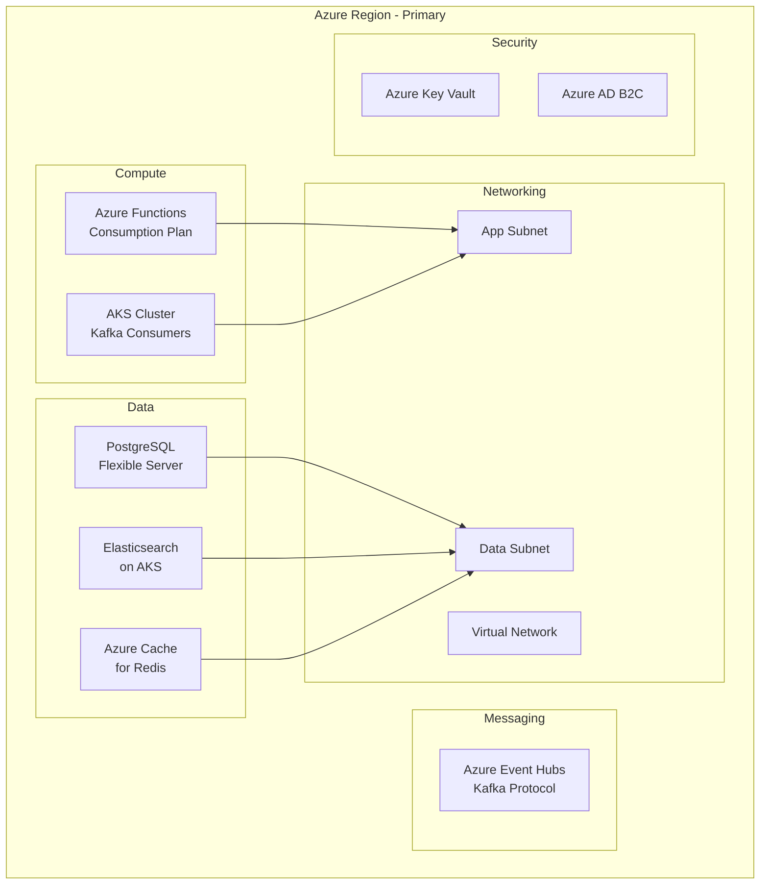

### 9.2 Disaster Recovery

| Component | RPO | RTO | Strategy |
|-----------|-----|-----|----------|
| PostgreSQL | 5 min | 30 min | Geo-replication, PITR |
| Kafka | 0 | 15 min | Multi-AZ, replication |
| Elasticsearch | 1 hour | 1 hour | Snapshots to blob storage |
| Functions | 0 | 5 min | Multi-region deployment |

---

## 10. API Design

### 10.1 GraphQL Schema Overview

```graphql
type Query {
  claim(id: ID!): Claim
  claims(filter: ClaimFilter, pagination: Pagination): ClaimConnection
  searchClaims(query: String!): [Claim]
}

type Mutation {
  submitClaim(input: ClaimInput!): Claim
  updateClaimStatus(id: ID!, status: ClaimStatus!): Claim
  approveClaim(id: ID!, notes: String): Claim
  denyClaim(id: ID!, reason: String!): Claim
}

type Subscription {
  claimStatusChanged(claimId: ID!): ClaimStatusEvent
  fraudAlerts: FraudAlert
}
```

### 10.2 REST Endpoints (Fallback)

| Method | Endpoint | Description |
|--------|----------|-------------|
| POST | /api/v1/claims | Submit new claim |
| GET | /api/v1/claims/{id} | Get claim by ID |
| GET | /api/v1/claims | List claims with filters |
| PATCH | /api/v1/claims/{id}/status | Update claim status |
| GET | /api/v1/claims/{id}/history | Get claim history |
| GET | /api/v1/health | Health check |

---

## 11. Fraud Detection Service Architecture

### 11.1 Service Overview

The Fraud Detection Service is a standalone Python FastAPI microservice that provides ML-powered fraud scoring for healthcare claims.

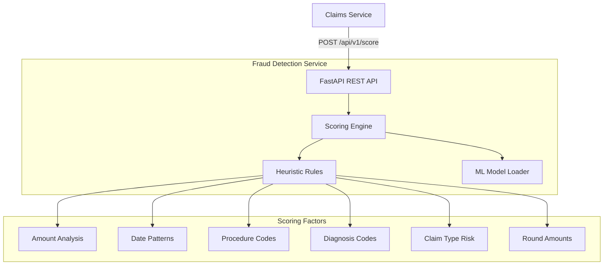

### 11.2 Fraud Scoring API

| Endpoint | Method | Description |
|----------|--------|-------------|
| `/api/v1/score` | POST | Score a claim for fraud |
| `/health` | GET | Health check |
| `/api/v1/metrics` | GET | Service metrics |
| `/api/v1/model/info` | GET | Model information |
| `/docs` | GET | Swagger UI |

### 11.3 Risk Levels

| Score Range | Risk Level | Recommended Action |
|-------------|------------|-------------------|
| 0.0 - 0.3 | LOW | Auto-approve |
| 0.3 - 0.5 | MEDIUM | Flag for review |
| 0.5 - 0.7 | HIGH | Manual review required |
| 0.7 - 1.0 | CRITICAL | Deny / SIU referral |

### 11.4 Scoring Factors

| Factor | Weight | Description |
|--------|--------|-------------|
| Extreme Amount ($50k+) | 0.30 | Very high claim amounts |
| Very High Amount ($15k+) | 0.20 | High claim amounts |
| High Amount ($5k+) | 0.10 | Above-average amounts |
| Future Service Date | 0.40 | Invalid future dates |
| Weekend Service | 0.08 | Services on weekends |
| High-Risk Procedures | 0.05-0.10 | Flagged CPT codes |
| Vague Diagnoses | 0.04-0.08 | Non-specific ICD-10 |
| Round Amounts | 0.04-0.08 | Suspicious round figures |

### 11.5 Integration with Claims Service

```java
// FraudScoringClient.java - Backend integration
@ApplicationScoped
public class FraudScoringClient {
    @ConfigProperty(name = "fraud.api.url")
    String fraudApiUrl;  // http://fraud-detection:8090

    public Uni<Double> getScore(Claim claim) {
        // POST to /api/v1/score
        // Returns fraud probability 0.0 - 1.0
    }
}
```

### 11.6 Extending with Real ML

The service is designed to be extended with real ML models:

```python
# Example: Adding scikit-learn model
import joblib

class FraudScoringEngine:
    def __init__(self):
        self.model = joblib.load("models/fraud_model.pkl")

    def score(self, request):
        features = self._extract_features(request)
        return self.model.predict_proba(features)[0][1]
```

---

## 12. Technology Stack Summary

| Layer | Technology | Version |
|-------|------------|---------|
| Runtime | Java | 21 (LTS) |
| Framework | Quarkus | 3.x |
| ORM | Hibernate Reactive | 2.x |
| Database | PostgreSQL | 15 |
| Message Broker | Kafka (Event Hubs) | 3.x |
| Search | Elasticsearch | 8.x |
| Cache | Redis | 7.x |
| Frontend | Angular | 17 |
| API | GraphQL + REST | - |
| **Fraud Detection** | **Python FastAPI** | **3.11** |
| Cloud | Azure | - |
| IaC | Terraform | 1.5+ |
| CI/CD | GitHub Actions | - |
