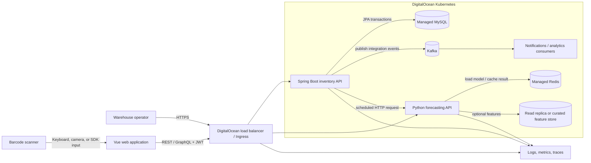
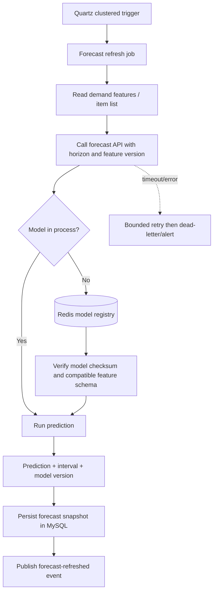

# Inventory Management System — Architecture

## Architectural goals

The design favors correct stock counts, explicit contracts, independently scalable stateless workloads, and a low operational burden. MySQL is the source of truth. Kafka and Redis are supporting infrastructure and must never become the only copy of authoritative inventory state.

## 2.1 Chosen architectural pattern

The system uses a **modular monolith with event-driven integrations**, plus one independently deployed **forecasting microservice**.

The Spring Boot application keeps transaction-heavy inventory capabilities in one deployable unit. Feature packages provide boundaries without paying the distributed-transaction, tracing, versioning, and deployment costs of many small services. The Python service is separate because its runtime, libraries, scaling profile, and release cadence differ substantially from the Java domain application. Kafka decouples durable integration work, while synchronous REST is reserved for interactions that need an immediate answer.

This is an intentional starting point, not a permanent limit. A module should be extracted only when it has a clear owner and contract, needs materially different scaling or availability, and can own its data without distributed transactions.



### Backend boundaries

The scaffold implements the inventory feature as a vertical slice: HTTP and GraphQL adapters call an application service, which enforces transactions and maps domain entities to DTOs. Repositories are internal persistence ports. Messaging and scheduling are adapters around the same domain/application boundary.

Rules for dependencies:

- Web, GraphQL, messaging consumers, and Quartz jobs may call application services.
- Application services may use repositories and domain objects.
- Domain objects do not depend on controllers, Kafka, Redis, or transport DTOs.
- No service outside the Spring application reads or writes the inventory tables directly.
- The forecast service does not modify inventory; it returns predictions carrying a model version.

## 2.2 Key component interactions

| Interaction | Protocol | Consistency | Design rule |
|---|---|---|---|
| Vue → backend | HTTPS REST for commands and common queries; GraphQL for composed read screens | Immediate response | JWT, request ID, validation, bounded timeouts |
| Backend → MySQL | JPA/JDBC within local transactions | Strong | MySQL is authoritative; migrations only through Flyway |
| Backend → Kafka | Transactional outbox relay | At-least-once | Events have stable IDs; consumers use a durable inbox; schema is versioned |
| Quartz → forecast service | Internal HTTP | Eventual | Short timeout, retry with jitter, circuit breaker; do not hold DB transactions open |
| Forecast service → Redis | Redis protocol | Eventual/cache semantics | Keys include model/version; tolerate cache loss and rebuild |
| Kafka → downstream consumers | Consumer groups | At-least-once and ordered per key | Partition stock events by inventory-item ID |
| Backend → observability stack | OTLP/Prometheus/structured stdout | Best effort | Never block a stock transaction on telemetry export |

Every stock mutation writes an outbox row in the same MySQL transaction. The scheduled relay locks unpublished rows, publishes keyed JSON, and records attempts/publication time. The low-stock consumer writes a composite event/consumer inbox key before committing its side effect, so redelivery is safe.

## 2.3 Data flow

### Barcode-driven stock update

```mermaid
sequenceDiagram
    autonumber
    actor User as Warehouse operator
    participant UI as Vue + barcode adapter
    participant API as Spring REST API
    participant Auth as OIDC/JWT validator
    participant DB as MySQL
    participant Outbox as Outbox relay
    participant Bus as Kafka
    participant Consumer as Analytics/notification consumer

    User->>UI: Scan barcode and enter adjustment
    UI->>UI: Normalize input and attach idempotency key
    UI->>API: POST /api/v1/inventory/{id}/adjustments\nJWT + Idempotency-Key
    API->>Auth: Validate signature, issuer, audience, scopes
    Auth-->>API: Principal + permissions
    API->>API: Validate command and business invariants
    API->>DB: Begin transaction; lock/check version
    DB-->>API: Current inventory row
    API->>DB: Update quantity and append movement
    API->>DB: Insert stock-changed outbox record
    DB-->>API: Commit
    API-->>UI: 200 inventory representation + ETag
    UI-->>User: Show confirmed quantity
    Outbox->>DB: Claim unpublished records
    Outbox->>Bus: Publish keyed event
    Bus-->>Outbox: Acknowledge
    Outbox->>DB: Mark published
    Bus->>Consumer: Deliver event (possibly more than once)
    Consumer->>Consumer: Deduplicate by eventId and process
```

### Forecast refresh



### API contract conventions

- REST paths are versioned under `/api/v1`; requests use Bean Validation; errors use `application/problem+json`.
- Collection endpoints use stable sorting and bounded page/size pagination; a cursor contract can be added without changing command APIs.
- Commands accept an idempotency key; concurrent updates use a JPA version/ETag.
- GraphQL is query-focused at first. Mutations follow the same service and authorization rules as REST.
- Kafka contracts use JSON Schema initially. Compatibility is backward-compatible within a major event version.

## 2.4 Scalability and performance strategy

| Concern | Initial strategy | Growth path |
|---|---|---|
| API throughput | Stateless Spring pods, HikariCP bounds, horizontal pod autoscaling | Scale on request latency and CPU; isolate heavy consumers into separate deployments |
| Write contention | Short transactions, optimistic versioning, indexed lookups | Per-item command partitioning or selective pessimistic locking for hot SKUs |
| Read load | Projection DTOs, pagination, correct composite indexes | Read replicas and purpose-built projections after measuring replication-lag tolerance |
| Async work | Kafka partitions keyed by item ID | Increase partitions and consumer replicas while preserving per-item order |
| Forecasting | Independent pods, loaded model reused in process | Separate CPU/GPU node pool, batch inference, autoscale on queue depth/latency |
| Scheduling | Quartz JDBC job store with clustering | Split scheduler worker deployment and shard jobs if needed |
| Redis | Versioned keys with TTL and memory policy | Managed cluster; never rely on Redis for authoritative inventory |
| Database | Managed MySQL, connection limits, Flyway, backups | Vertical scale, read replicas, archival/partitioning; shard only with proven need |

Performance controls include bounded payloads, request/connection timeouts, database statement timeouts, bulkhead-limited downstream calls, backpressure on Kafka consumers, and graceful shutdown. Cache decisions require measured hit rates and an explicit invalidation owner. A stale forecast is acceptable if marked with its generation time; a stale stock count is generally not.

Capacity tests should model barcode bursts at shift changes, bulk receipts, hot-SKU contention, Kafka lag, model cold starts, and database failover. SLOs should track availability, p95/p99 latency, stock-command error rate, consumer lag, forecast age, and reconciliation differences.

## 2.5 Security considerations

### Authentication and authorization

- Use an external OpenID Connect provider. The browser uses Authorization Code with PKCE; the API validates short-lived JWTs locally.
- Enforce scopes at controller and service boundaries and warehouse-level access with method authorization. Default deny.
- Use workload identities or narrowly scoped service credentials for service-to-service calls. Do not propagate an operator token to infrastructure.
- Separate admin operations, record security-sensitive audit events, and require MFA through the identity provider.

The `local` profile creates a scoped anonymous development principal and is selected explicitly by Compose. The default configuration fails closed. The `secure` profile validates JWT signature, issuer, expiry, audience, and scopes with exact-origin CORS; Kubernetes selects this profile and fails startup when required values are absent.

### Data and API protection

- TLS terminates at the load balancer and is re-encrypted internally where the threat model requires it.
- Managed databases use encryption at rest, private networking, restricted database users, automated backups, and tested point-in-time recovery.
- Validate all inputs, cap page/body sizes, reject unknown/unsafe content types, and never construct SQL from scanner text.
- Configure CORS to exact UI origins, rate-limit by principal/IP, and protect mutations against replay with idempotency keys.
- Disable GraphQL introspection in production unless operationally required; apply depth, complexity, alias, and pagination limits.
- Swagger UI is disabled or access-controlled in production; OpenAPI JSON can be published as a build artifact.

### Secrets and supply chain

- Store production secrets in a managed secret store or GitLab protected masked/file variables and synchronize them into Kubernetes; never commit rendered secrets.
- Rotate database, Kafka, Redis, signing, and registry credentials. Mount secrets as files where clients allow it.
- Pin base images by digest for releases, generate an SBOM, sign images, scan dependencies/images, and enforce admission policy.
- Run containers as non-root with read-only filesystems, dropped Linux capabilities, resource limits, network policies, and dedicated service accounts.

## 2.6 Error handling and logging philosophy

### Error categories

| Category | HTTP behavior | Retry? | Logging/alerting |
|---|---|---|---|
| Validation/business rejection | 400 or 409 problem response | No, until input/state changes | INFO; metric by stable error code |
| Missing resource | 404 problem response | No | INFO, normally no alert |
| Authentication/authorization | 401/403 without sensitive detail | Only after re-auth | Security audit; alert on anomaly |
| Optimistic-lock conflict | 409 with current-state guidance | Safe bounded retry or user refresh | INFO; watch contention metric |
| Transient dependency failure | 503 with correlation ID and `Retry-After` when suitable | Yes, bounded/jittered if idempotent | WARN; alert on error-budget impact |
| Unexpected defect | 500 generic problem response | Usually no | ERROR with stack trace; page on SLO impact |
| Async poison message | No HTTP response; retry then dead-letter | Bounded | ERROR with event ID; alert on DLQ growth |

Every public error has a stable machine-readable code, a human-safe message, and a correlation ID. Stack traces, SQL details, tokens, connection strings, model payloads, and personal data never appear in client responses.

Applications write structured JSON to stdout. Standard fields are timestamp, level, service, environment, trace/span ID, request/correlation ID, principal/tenant where lawful, route or event type, event ID, item/warehouse identifiers, duration, outcome, and stable error code. High-cardinality identifiers belong in logs/traces rather than metric labels.

OpenTelemetry propagates W3C trace context over HTTP and Kafka headers. Metrics use Micrometer/Prometheus on Java and the OpenTelemetry/Prometheus stack in Python. Health endpoints distinguish liveness (process can run) from readiness (instance can serve); temporary Kafka or Redis loss should not cause destructive restart loops unless that dependency is essential for the endpoint.

### Resilience rules

- Retry only transient failures and only idempotent operations; use exponential backoff with jitter and a total deadline.
- Put explicit connect, read, write, and acquisition timeouts on every remote call.
- Use circuit breakers and concurrency bulkheads around forecasting and other non-authoritative services.
- Preserve failed event payloads in a secured dead-letter topic and provide replay tooling with audit controls.
- Reconcile inventory totals against the immutable movement ledger on a schedule and alert on any difference.

## Architecture decision checkpoints

Before production, record ADRs for the identity provider, Kafka hosting, outbox implementation, stock concurrency model, audit retention, model registry format, Kubernetes secret integration, and observability vendor. Revisit the architecture when ownership, availability, scaling, regulatory, or data-sovereignty constraints change—not merely because the codebase grows.
