# Inventory Management System — Technical Notes

These notes are implementation guidance for the scaffold, with emphasis on safe inventory writes and predictable operations.

## 3.1 CI/CD pipeline design

GitLab CI is the delivery authority. Merge requests run verification without credentials. Protected default-branch and tag pipelines may publish images and deploy through environment-scoped credentials.

```mermaid
flowchart LR
    Source[Commit / merge request] --> Lint[Lint + format + schema checks]
    Lint --> Unit[Unit tests + coverage]
    Unit --> Integration[Integration tests with service containers]
    Integration --> Build[Build immutable artifacts]
    Build --> Scan[SAST + dependency/image scan + SBOM]
    Scan --> Publish[Publish images by commit SHA]
    Publish --> Dev[Auto-deploy dev]
    Dev --> Smoke[Smoke + contract checks]
    Smoke --> Stage[Deploy staging]
    Stage --> E2E[E2E + load + migration rehearsal]
    E2E --> Approve{Protected approval}
    Approve --> Prod[Progressive production deploy]
    Prod --> Verify[SLO verification / rollback]
```



| Stage | Required work | Artifacts / gate |
|---|---|---|
| Validate | Maven formatting/compile, ESLint/Prettier, TypeScript, Python lint/type checks, JSON/YAML/Kustomize validation, event schema compatibility | Fast feedback; fail on generated-contract drift |
| Test | JUnit/Mockito unit tests, Vitest component tests, pytest, Testcontainers integration tests | JUnit reports and coverage; new/changed code target at least 80% branch coverage |
| Build | Reproducible JAR and static UI, Python dependency installation, multi-stage OCI images | Images tagged with immutable commit SHA and OCI labels |
| Secure | Secret scan, SAST, dependency/license scan, image scan, SBOM, signature | Block exploitable critical/high findings under an agreed SLA policy |
| Deploy dev | Apply migrations once, deploy Kustomize overlay, wait for rollout | Automatic from default branch; ephemeral MR environments are optional |
| Deploy staging | Promote the exact images tested in dev | Migration rehearsal, E2E, scanner test, restore/replay exercises |
| Deploy production | Manual protected environment or approved release tag | Rolling/canary deploy; no rebuild; automatic verification and rollback decision |

Pipeline practices:

- Cache Maven and npm downloads by lockfile/checksum, but never cache build outputs across untrusted branches.
- Build once and promote by digest. Environment configuration changes; the image does not.
- Use GitLab `resource_group` to serialize deployments per environment and `interruptible` jobs for superseded validation pipelines.
- Run schema migrations as a dedicated pre-deploy Kubernetes Job with a database advisory lock. Application pods use a database user without DDL privileges.
- Use expand/migrate/contract database changes: deploy backward-compatible schema, migrate data, deploy readers/writers, then remove obsolete columns in a later release.
- Record deployment, migration, image digest, actor, and result. Keep an immediately usable previous manifest.

The checked-in pipeline is deliberately executable as a baseline. Production policy should add the security scanners supported by the organization and its GitLab tier.

## 3.2 Testing strategy

### Test layers

| Layer | Tools | Focus | Suggested target |
|---|---|---|---|
| Java unit | JUnit 5, AssertJ, Mockito | Domain invariants, service orchestration, mapping, error paths | Fast majority; ≥80% changed-line and branch coverage |
| Java slice | `@WebMvcTest`, Spring Security test, GraphQL tester | Validation, authorization, serialization, problem responses | Every endpoint and permission class |
| Java integration | Spring Boot Test, Testcontainers MySQL/Kafka/Redis | Flyway, JPA mappings/locking, outbox, real broker behavior | Critical commands and infrastructure boundaries |
| Vue unit/component | Vitest, Vue Test Utils, Testing Library, MSW | Loading/error/empty/success states, scanner normalization, accessibility | Critical operator workflows |
| Python unit/API | pytest, FastAPI TestClient, fakeredis | Model selection, schema rejection, health and timeout behavior | Prediction contract and version behavior |
| Contract | OpenAPI diff, JSON Schema compatibility, consumer contract tests | Backward compatibility across deployables | Every contract change |
| End-to-end | Playwright | Login, scan, adjust, concurrent conflict, offline retry, permissions | Small stable smoke suite per deploy |
| Performance | k6 or Gatling | Shift-change bursts, hot SKU, pagination, failover | Before release; scheduled baseline regression |

Coverage is a risk indicator, not the objective. Mutation tests (PIT for Java) on inventory arithmetic and concurrency logic provide more confidence than line coverage alone.

### Important scenarios

- Two operators update the same SKU concurrently; one receives a conflict or both are serialized with no lost update.
- A scanner resends a request after a timeout; its idempotency key prevents duplicate stock movement.
- Database commit succeeds while Kafka is unavailable; the outbox retains and later publishes exactly one logical event.
- A Kafka event is delivered twice; each consumer produces one logical side effect.
- Redis is empty or unavailable; stock APIs remain correct and predictions fail gracefully or use an explicitly marked last-known forecast.
- A new model is incompatible or has a bad checksum; the service retains the last known good model.
- Time zones, decimal/quantity limits, invalid barcode text, large pages, and unauthorized warehouse access are rejected correctly.

Test data should be built through fixtures/builders, never copied from production. CI uses ephemeral containers. Staging contains synthetic, resettable data and production-like topology.

## 3.3 Deployment strategy

Each deployable uses a multi-stage container build, a non-root runtime user, health checks, and graceful shutdown. Local Docker Compose includes infrastructure for developer convenience. Production uses DOKS for application workloads and preferably DigitalOcean managed MySQL and Redis; Kafka should be a managed offering or a separately operated cluster with clear ownership.

| Workload | Kubernetes shape | Scaling signal | Availability notes |
|---|---|---|---|
| Vue frontend | Nginx Deployment + ClusterIP Service | CPU/request rate | At least two replicas in production |
| Spring backend | Deployment + Service + HPA + PDB | CPU plus p95 latency/request rate | Topology spread and graceful disruption protection are included; tune replica/PDB values to cluster capacity |
| Forecast service | Deployment + Service + HPA | CPU, prediction latency, queue depth | Longer startup probe if model loading is slow |
| Migration | One-shot pre-deploy Job | Not scaled | Must complete before incompatible application rollout |
| MySQL/Redis/Kafka | Managed/private services preferred | Provider-specific | Backups, TLS, monitoring, and tested recovery required |

Use Kustomize base plus small environment overlays. GitLab substitutes immutable image digests and applies the rendered manifests. The ingress routes `/api`, `/graphql`, and backend documentation endpoints to Spring, `/forecast` only if it must be public (normally it should remain internal), and `/` to the UI.

Production rollout:

1. Verify backups, capacity, change window, and compatible migration.
2. Apply expand-only migration and verify it.
3. Roll out a canary or small percentage; verify readiness, errors, latency, database saturation, and Kafka lag.
4. Complete rollout if SLOs remain healthy; otherwise roll back the application and forward-fix migrations.
5. Run smoke checks and record the release. Perform contract cleanup in a later release.

## 3.4 Environment management

Spring production configuration fails startup when datasource, CORS, issuer, or audience values are absent. Development defaults exist only in the explicitly activated local profile. Vite variables are compiled into public browser code and can never contain secrets. Python follows the same environment contract. Kubernetes ConfigMaps contain non-sensitive values; Secrets are provisioned externally.

| Environment | Data/services | Deployment | Guardrails |
|---|---|---|---|
| Local | Docker Compose and synthetic seed data | Developer command | Debug logs allowed; permissive auth only on loopback |
| Test/CI | Ephemeral service containers | Per pipeline | Deterministic clocks/seeds; no shared state or cloud credentials for MR tests |
| Development | Shared managed sandbox | Automatic default-branch deploy | Short retention; restricted but convenient access |
| Staging | Production-like topology and synthetic data | Promotion after dev | Production auth/security; migration, E2E, restore, and load rehearsal |
| Production | Isolated managed services | Protected approval/tag | Least privilege, high availability, audit, backups, alerting |

The root `.env.example` is the canonical local template. Copy it to `.env`, use non-production credentials, and do not commit it. Important rules:

- Fail startup when a required production value is absent; do not silently use a development secret.
- Validate configuration types/ranges at startup and log only non-sensitive effective settings.
- Name variables consistently: `MYSQL_*`, `SPRING_*`, `KAFKA_*`, `REDIS_*`, `FORECAST_*`, `VITE_*`.
- Secret values live in GitLab protected variables or a secret manager. Rotate them without rebuilding images.
- Keep feature flags separate from secrets. Give every flag an owner and removal date.

## 3.5 Version control workflow

Use **trunk-based development with short-lived branches**. This matches continuous delivery better than long-lived Gitflow branches and reduces merge and migration drift.

- Protect `main`; require merge requests, successful required jobs, review, and resolved discussions.
- Branch briefly with names such as `feat/stock-adjustment` or `fix/idempotency-race`; rebase/merge frequently and delete after merge.
- Keep commits cohesive and use Conventional Commit prefixes so release notes can be automated.
- Put incomplete behavior behind server-side flags while keeping the default branch deployable.
- Release immutable semantic-version tags after staging evidence; hotfixes use the same pipeline and review path.
- Use `CODEOWNERS` for migrations, security configuration, shared contracts, and production infrastructure once teams are established.
- Never rewrite protected branch/tag history. Signed commits/tags are recommended for releases.

## 3.6 Common pitfalls

| Pitfall | Consequence | Prevention |
|---|---|---|
| Treating stock as simple CRUD | Lost updates and no audit trail | Immutable movement ledger, idempotency, version checks, transactional service |
| Publishing Kafka after a DB commit | Missing events on crash; duplicates on retry | Transactional outbox and idempotent consumers |
| Assuming Kafka means exactly once | Duplicate downstream side effects | Stable event IDs, consumer inbox/deduplication, keyed ordering |
| Letting Hibernate change schemas | Environment drift and unsafe rollout | `ddl-auto=validate`; Flyway-only migrations |
| Quartz in-memory job store across replicas | Duplicate/missed schedules | JDBC job store, clustering, idempotent jobs, misfire policy |
| Open Session in View / N+1 GraphQL queries | Hidden database work and latency spikes | Disable OSIV; explicit projections/entity graphs and GraphQL DataLoader |
| Unbounded GraphQL queries | Resource exhaustion | Depth/complexity/page limits, persisted operations where useful |
| Using Redis as inventory truth | Data loss or stale counts | MySQL remains authoritative; Redis keys are reconstructable |
| Loading a model for each request | High latency and memory churn | Load once, atomically swap validated versions, warm readiness |
| Storing pickled models from untrusted sources | Remote code execution risk | Trusted registry, signed/checksummed artifacts, safer formats such as ONNX where possible |
| Exposing `VITE_*` secrets | Credentials shipped to every browser | Browser variables contain public configuration only |
| Camera-only barcode workflow | Poor compatibility and accessibility | Support keyboard-wedge scanners first, camera as progressive enhancement |
| Huge container build contexts | Slow CI and secret leakage risk | `.dockerignore`, multi-stage builds, pinned minimal runtime images |
| Readiness tied to every optional dependency | Restart storms during Redis/Kafka outage | Liveness checks process health; readiness reflects only serving prerequisites |
| HPA without resource requests | Unstable scheduling/scaling | Set measured requests/limits and scale on useful signals |
| Breaking DB migrations during rolling deploys | Old and new pods cannot coexist | Expand/migrate/contract across releases |

## Local operating commands

```powershell
Copy-Item .env.example .env
docker compose up --build -d
Invoke-RestMethod http://localhost:8080/actuator/health
Invoke-RestMethod http://localhost:8000/health/ready
```

Run backend tests with `mvn -f backend/pom.xml verify`, frontend checks with `npm --prefix frontend run check`, and install forecast development dependencies from forecast-service/requirements-dev.txt before running pytest. The PowerShell scripts provide convenience wrappers but the underlying commands remain CI-compatible.
