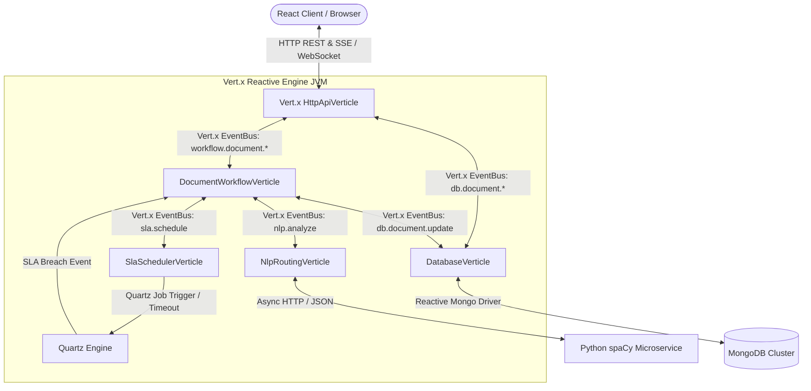
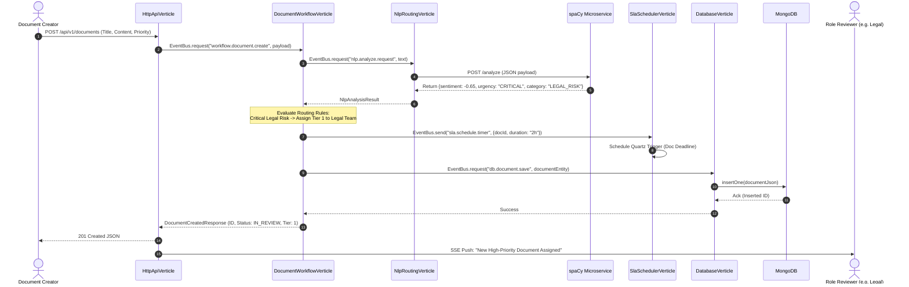
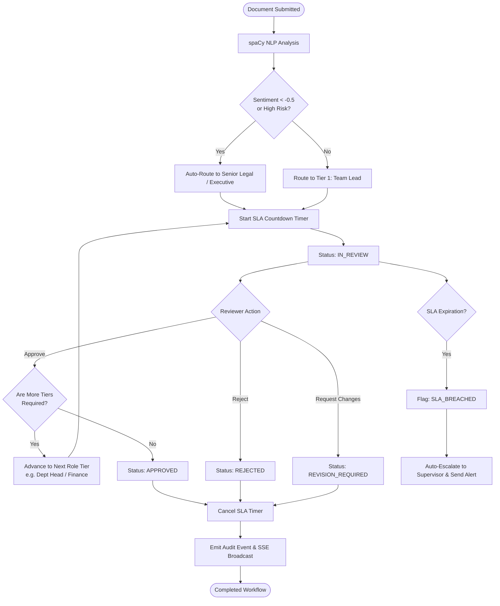

# Document Approval Workflow - Architecture Documentation

## 2.1 Chosen Architectural Pattern: Reactive Event-Driven Microservices

The **Document Approval Workflow** system is engineered using a **Reactive, Event-Driven Actor-like Pattern** powered by **Eclipse Vert.x (Java 17)**, paired with a polyglot Python **spaCy NLP Microservice**, and a **MongoDB** document store.

### Architectural Justification
1. **Ultra-High Concurrency & Low Latency**: Unlike traditional thread-per-request architectures (e.g., standard Spring MVC), Eclipse Vert.x utilizes an asynchronous, non-blocking **Multi-Reactor pattern** (Event Loops). A small pool of threads handles tens of thousands of concurrent document status updates, SLA checks, and live push notifications without thread-exhaustion overhead.
2. **Decoupled Asynchronous EventBus**: Vert.x provides an in-memory distributed EventBus that decouples the system into modular **Verticles** (actor-like units of computation). Each verticle can be scaled, paused, or restarted independently.
3. **Polyglot NLP Integration**: Document text classification and sentiment polarity are offloaded asynchronously via non-blocking WebClient calls to a specialized Python spaCy service, preventing heavy CPU-bound machine learning tasks from stalling core business transaction threads.
4. **Flexible Schema with MongoDB**: Enterprise documents undergo dynamic lifecycle mutations (dynamic approval tiers, arbitrary metadata, NLP entity tags, and append-only audit histories). MongoDB’s BSON document model provides natural hierarchy, atomic sub-document updates, and fast indexed queries.

---

## 2.2 Key Component Interactions

The system comprises 5 key component categories interacting asynchronously:

### 1. Client-to-Backend Layer
- **HTTP REST APIs**: Used for document ingestion, user authentication, review decisions (Approve, Reject, Request Changes), and manual escalations.
- **Server-Sent Events (SSE) / WebSockets**: Unidirectional/bidirectional real-time streams pushing instant approval stage transitions, SLA breach warnings, and peer comments directly to reviewers' dashboards.

### 2. Vert.x Internal EventBus Communication
The Vert.x EventBus serves as the internal message fabric with standard point-to-point, publish-subscribe, and request-response patterns:
- `workflow.document.create`: Dispatched by `HttpApiVerticle` upon receiving a new document.
- `nlp.analyze.request`: Sent to `NlpRoutingVerticle` to extract sentiment, urgency, and category.
- `sla.schedule.timer`: Sent to `SlaSchedulerVerticle` to register precision deadlines in Quartz.
- `db.document.save` / `db.document.find`: Consumed by `DatabaseVerticle` for reactive persistence.
- `workflow.events.stream`: PubSub channel broadcasting state updates to connected SSE clients.

### 3. Asynchronous SLA Scheduling (Quartz Integration)
- `SlaSchedulerVerticle` interacts with the **Quartz Scheduler Engine**. When an approval tier is activated, a timer is registered.
- If an approval action is not completed before the configured duration (e.g., 4 hours for Tier-1, 24 hours for Tier-2), Quartz triggers an SLA breach event across the EventBus, prompting automatic escalation or manager alerts.

### 4. Machine Learning & NLP Service
- `NlpRoutingVerticle` communicates with the `nlp-service` (FastAPI + spaCy) via Vert.x non-blocking `WebClient`.
- High negative sentiment or urgent keywords (e.g., "urgent legal dispute", "regulatory penalty") dynamically escalate the document directly to higher-tier reviewers (Legal / Executive).

### 5. Reactive Persistence Layer
- `DatabaseVerticle` executes non-blocking MongoDB queries using the official reactive streams driver.
- Supports atomic updates (`$set`, `$push`) for document status transitions and audit logs.

---

## 2.3 Comprehensive Data Flow

### Sequence Diagram: Document Ingestion, NLP Analysis, Dynamic Routing & SLA Initiation

### Flowchart: Multi-Level Approval State Machine & SLA Breach Escalation

---

## 2.4 Scalability & Performance Strategy

1. **Multi-Verticle Worker Pool Scaling**:
   - Vert.x creates one event loop per CPU core. 
   - CPU-bound tasks (e.g., heavy JSON parsing, cryptographic signing, or Quartz schedule calculations) run on dedicated **Worker Verticle Pools** (`setWorker(true)`), preserving 100% responsiveness on the standard event loops.
2. **Distributed Cluster EventBus**:
   - In clustered mode, Vert.x utilizes **Hazelcast** or **Infinispan** to form a seamless peer-to-peer cluster. EventBus messages transparently route across multiple JVM instances without an external broker.
3. **MongoDB Connection Pooling & Sharding**:
   - Configured with reactive connection pooling (min 10, max 100 connections per instance).
   - Read operations for reporting and dashboard queries utilize secondary replica sets with read preference `secondaryPreferred`.
   - Documents are partitioned using compound shard keys `{ department: 1, createdAt: 1 }`.
4. **Backpressure & Reactive Streams**:
   - Document upload streams and export aggregations leverage Vert.x `ReadStream` and `WriteStream` with automated pause/resume flow control to prevent Out-Of-Memory (OOM) errors during high-volume spikes.

---

## 2.5 Security Considerations

1. **Authentication & Identity Propagation**:
   - Stateless **JSON Web Tokens (JWT)** with HMAC-SHA256 / RSA-256 signatures.
   - JWT tokens are validated at the `HttpApiVerticle` edge; user claims (ID, roles, department) are injected into the Vert.x `RoutingContext` and forwarded over the EventBus.
2. **Role-Based Access Control (RBAC)**:
   - Strict role hierarchy: `CREATOR`, `TEAM_LEAD`, `DEPARTMENT_HEAD`, `LEGAL_COUNSEL`, `FINANCE_CONTROLLER`, `EXECUTIVE`, `ADMIN`.
   - Action authorization prevents users from reviewing documents outside their authorized department or approval tier.
3. **Data Protection at Rest & In Transit**:
   - TLS 1.3 enforced for all external HTTPS client traffic and internal REST calls to the Python spaCy microservice.
   - Sensitive document content fields can be encrypted at the application layer using AES-GCM-256 before persistence in MongoDB.
4. **Input Validation & Sanitization**:
   - Strict JSON schema validation at the HTTP boundary using Vert.x Web Validation to mitigate Injection and XSS attacks.

---

## 2.6 Error Handling & Logging Philosophy

1. **Reactive Failure Bubbling**:
   - Asynchronous Vert.x `Future` chains never throw uncaught runtime exceptions into the event loop. Failures are captured via `.onFailure()` handlers and converted into structured domain failure codes (`DOCUMENT_NOT_FOUND`, `INVALID_STATE_TRANSITION`, `SLA_ALREADY_EXPIRED`, `NLP_SERVICE_UNAVAILABLE`).
2. **Circuit Breaker Pattern**:
   - Calls to external dependencies (e.g., Python spaCy microservice) are wrapped in `Vert.x CircuitBreaker`. If spaCy is down, requests gracefully fall back to rule-based keyword classification without crashing the workflow.
3. **Structured Contextual Logging (SLF4J + MDC)**:
   - Every incoming request is assigned a unique `X-Correlation-ID` (UUID).
   - Correlation IDs are preserved across EventBus messages and logged in JSON format with timestamps, thread names, verticle IDs, and document IDs for centralized ingestion by Elasticsearch / Grafana Loki.
