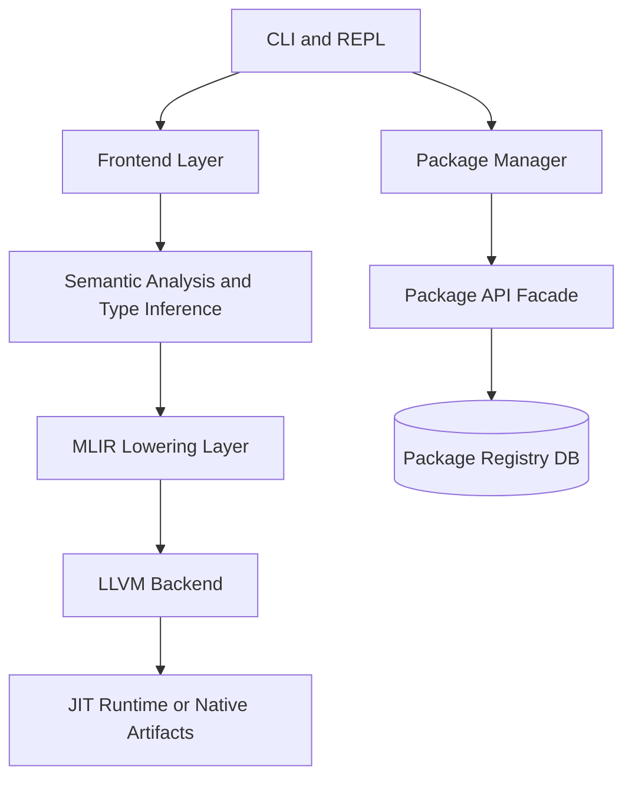
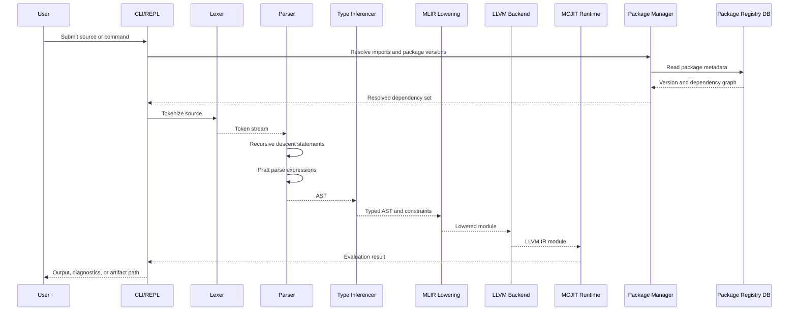

# Programming Language Architecture

## 2.1 Chosen Architectural Pattern

The project uses a **layered compiler monolith with modular service boundaries**.

This is the right starting point because compiler stages need tight in-process access to ASTs, diagnostics, type information, MLIR modules, LLVM modules, and JIT state. Splitting these stages into services too early would add serialization cost and operational complexity without improving the core developer workflow. Package registry concerns are kept behind `PackageManager` and `PackageApi` interfaces so they can later move to a separate service.

## 2.2 Key Component Interactions

- CLI and REPL call compiler APIs directly in-process for low latency.
- Frontend produces ASTs and diagnostics without depending on backend implementation details.
- Semantic analysis consumes ASTs and produces typed AST metadata plus inference diagnostics.
- MLIR lowering converts higher-level data transformation concepts into optimizable intermediate operations.
- LLVM backend converts typed AST or lowered MLIR into LLVM IR, then optionally emits objects or executes through JIT.
- Package manager calls the package API facade for CRUD operations around package metadata, versions, and dependency manifests.
- Registry storage is represented by PostgreSQL migrations and an in-process package service boundary. A hardened HTTP or RPC boundary can wrap the same facade when the registry is deployed independently.

Communication style:

- **API calls:** C++ library calls between compiler layers; future HTTP/RPC for registry operations.
- **Message queues:** Not required for the compiler path. Future package publishing workflows can emit asynchronous scan/sign/index jobs.
- **Direct database access:** Limited to package registry persistence components.
- **Event buses:** Optional future addition for package publication, vulnerability scan results, and audit events.

## 2.3 Data Flow

## 2.4 Scalability & Performance Strategy

- Keep compiler stages in-process to avoid serialization overhead.
- Use immutable or clearly owned AST nodes to simplify concurrency and incremental compilation.
- Cache package resolution results using lockfiles and registry ETags/checksums.
- Make parser and type inference deterministic to support reproducible builds.
- Isolate hot paths: tokenization, Pratt expression parsing, constraint solving, MLIR canonicalization, and LLVM optimization.
- Add compiler phase timing and structured logs from the start.
- Use MLIR for domain operations that benefit from high-level optimization before lowering to LLVM.
- Support native builds and JIT evaluation through shared backend interfaces.

Future scaling paths:

- Split package registry into a standalone service if package traffic grows independently from compiler usage.
- Add remote build cache and precompiled package artifacts.
- Add worker queues for package indexing, vulnerability scanning, and documentation generation.
- Add distributed CI runners for OS and architecture matrix builds.

## 2.5 Security Considerations

### Authentication & Authorization

- Local compiler commands should not require authentication.
- Package publishing and deletion must require authenticated identities.
- Use scoped registry tokens for read, publish, yank, and admin operations.
- Enforce authorization at the package API boundary, not in CLI-only code.

### Data Protection

- Store package checksums and signed metadata for tamper detection.
- Avoid persisting secrets in lockfiles, manifests, logs, or crash dumps.
- Use TLS for all remote registry communication.
- Encrypt production databases and backups at rest.

### API Security

- Validate package names, semantic versions, dependency constraints, and manifest payloads.
- Rate-limit package publish and search endpoints.
- Apply request size limits to manifests and archives.
- Prefer parameterized SQL queries in the registry service.

### Secret Management

- Use environment variables only as injection points, not as a long-term secret store.
- In production, pull secrets from the deployment platform's secret manager.
- Rotate registry signing keys and publishing tokens.
- Keep `.env.example` complete but non-sensitive.

## 2.6 Error Handling & Logging Philosophy

- Compiler diagnostics should be structured, source-aware, and recoverable where possible.
- Internal compiler errors should include phase, module, and stable diagnostic codes.
- Package manager errors should distinguish validation failures, version conflicts, network failures, registry authorization failures, and corrupted package metadata.
- Logs should be structured and phase-oriented: `frontend.lex`, `frontend.parse`, `semantics.infer`, `backend.codegen`, `runtime.jit`, `pkg.resolve`, and `api.registry`.
- User-facing CLI output should stay concise; detailed traces should require explicit verbosity flags.
- CI logs should include compiler version, LLVM version, CMake preset, target triple, and failing test seed when available.
