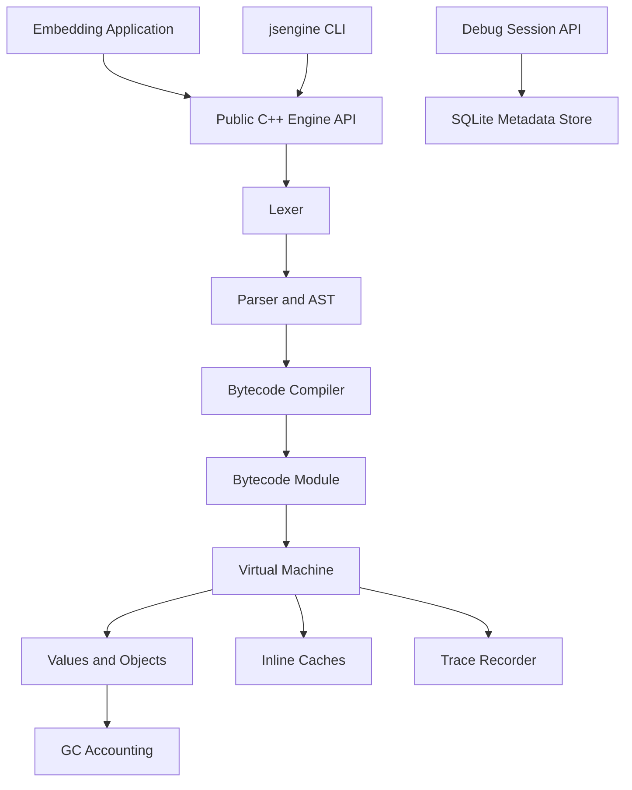
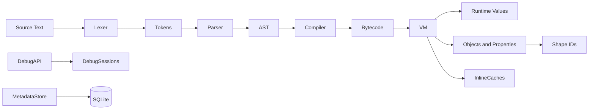
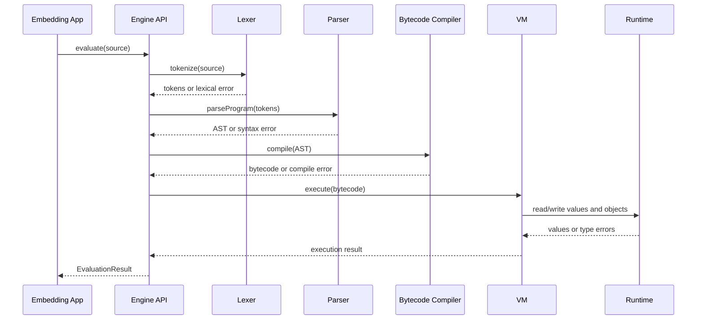

# JavaScript Engine Architecture

## 2.1 Chosen Architectural Pattern

The engine uses a layered modular monolith. It builds as one embeddable C++ library plus a CLI, while keeping clear internal boundaries between compiler frontend, bytecode VM, runtime services, debug API, metadata storage, and host integration.

This pattern suits an embedded runtime because execution stays in-process, memory ownership is explicit, and there is no network or service boundary in the core engine.

## 2.2 Key Component Interactions

- Public API calls: embedders call `jsengine::Engine::evaluate(source)` and receive `EvaluationResult`.
- Direct in-process calls: lexer, parser, bytecode compiler, VM, runtime objects, inline caches, and trace recorder communicate through C++ types.
- Storage access: `MetadataStore` owns SQLite connections and persists key/value settings, module-cache entries, and runtime events.
- Debug API: `DebugSessionApi` exposes create, list, get, update, and delete operations with validation and JSON-style responses.

## 2.3 Data Flow

## 2.4 Scalability & Performance Strategy

- Bytecode keeps constants and names in pools so instructions stay compact.
- The VM uses a straightforward switch dispatch loop that is portable across GCC, Clang, and MSVC.
- Object shape IDs support cache invalidation strategies and current inline-cache state tracking.
- Property access updates per-site caches during execution.
- GC accounting exposes allocation and collection state for future host policies without hiding memory behavior.
- SQLite metadata is isolated behind `MetadataStore`, so embedders can replace or wrap it without changing the VM.

## 2.5 Security Considerations

- The core engine has no listener or remote debug server by default.
- Debug-session APIs validate inputs and return structured errors.
- SQLite access uses prepared statements and bound parameters.
- Runtime errors are returned through result objects instead of escaping across the public API.
- Local secrets stay out of source control and are documented through `.env.example`.

## 2.6 Error Handling & Logging Philosophy

Recoverable failures are explicit:

- Lexical and parse errors include line and column.
- Compile errors identify unsupported AST shapes.
- Runtime errors include categories such as `ReferenceError` and `TypeError`.
- API errors use HTTP-like status codes and JSON bodies.
- Storage errors are retained in `MetadataStore::lastError()`.

The core library avoids throwing exceptions across its public API during normal evaluation.
