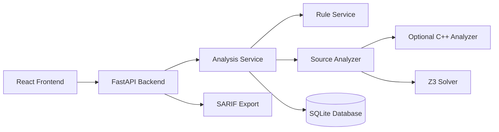
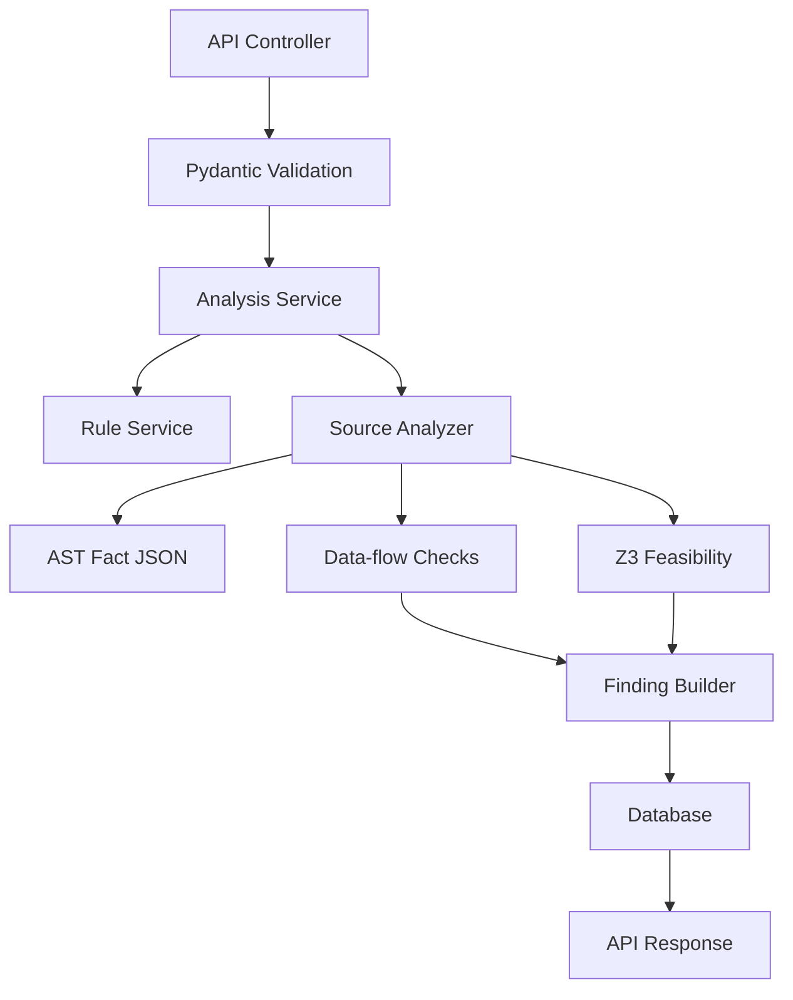
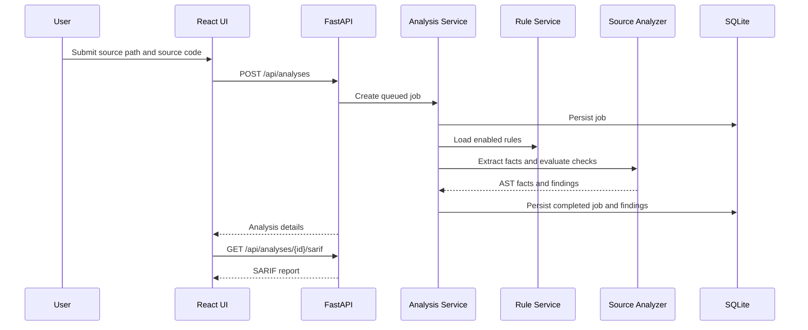

# Static Analyzer Architecture

## Architectural Pattern

The application is a **modular layered monolith with an external analyzer boundary**. FastAPI owns HTTP, persistence, orchestration, rule execution, and SARIF export. The C++ analyzer produces normalized source facts when compiled; the backend includes an equivalent local scanner so development, tests, and Docker remain runnable without a prebuilt binary.

## Component Interactions

- The React frontend calls FastAPI REST endpoints under `/api`.
- FastAPI validates request bodies with Pydantic models.
- `AnalysisService` owns job lifecycle and database persistence.
- `RuleService` loads and validates YAML rule packs.
- `SourceAnalyzer` extracts facts, runs deterministic static checks, and uses Z3 for path feasibility.
- `SarifService` converts persisted findings into SARIF 2.1.0.
- SQLite is used by local and Docker deployments; the SQLAlchemy session layer can be pointed at another SQL database with a different `DATABASE_URL`.

## Data Flow

## Scalability And Performance

- The API has no in-memory job state, so multiple backend replicas can share the same database.
- Source-size limits prevent accidental oversized requests.
- Analysis facts are persisted with each job, avoiding repeated extraction for result views.
- SARIF export is generated from stored results.
- The external analyzer boundary allows heavier parsing to move into a dedicated worker or container without changing API contracts.

## Security

- Inputs are validated for size, type, path control characters, and enum values.
- Source code is treated as sensitive data and is not stored separately from normalized analysis facts.
- Error responses expose actionable but sanitized messages.
- Docker Compose keeps persistent data in a named volume.
- `.env.example` contains non-secret defaults; real secrets belong in runtime secret management.

## Error Handling And Logging

- API controllers translate not-found and rule-configuration errors into stable HTTP responses.
- Analysis execution failures are persisted as failed jobs with `error_message`.
- Subprocess failures from the external analyzer fall back to internal scanning, keeping local analysis available.
- Database startup applies migrations once per process startup.
