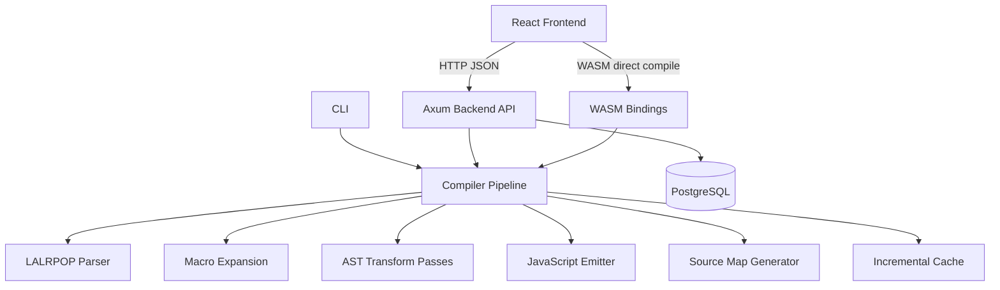
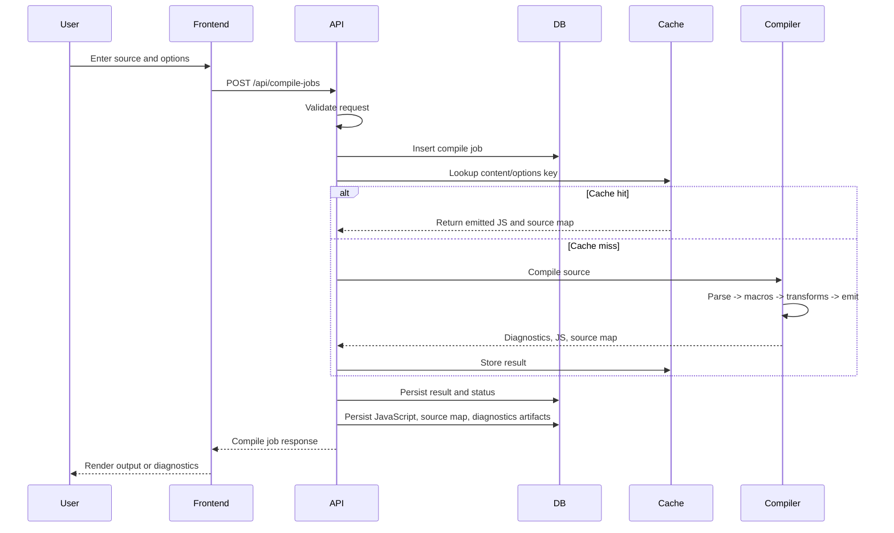

# Source-to-Source Transpiler Architecture

## 2.1 Chosen Architectural Pattern

The recommended architecture is a modular layered monolith backed by a Rust workspace. The core compiler is split into independently testable crates, while the API, CLI, and WASM bindings reuse the same parser, transformation, macro, incremental, and source-map modules.

This pattern is suitable because the product needs strong internal consistency, deterministic compilation behavior, and low operational complexity. Splitting the compiler into microservices would add serialization, deployment, and versioning overhead before the domain boundaries are stable. Workspace crates provide clean ownership boundaries without forcing distributed-system complexity.

## 2.2 Key Component Interactions

- Frontend to backend: REST/JSON API calls for creating, reading, updating, deleting, and running compile jobs.
- Frontend to WASM: direct in-browser transpilation for fast local previews and offline-friendly workflows.
- Backend to compiler core: direct Rust crate calls, avoiding network boundaries in the hot compile path.
- Backend to database: direct SQL access through a repository/service layer, with migrations stored in `migrations`.
- Frontend to artifacts: REST reads under `/api/compile-jobs/{id}/artifacts` for generated JavaScript, source maps, and diagnostics.
- Compiler pipeline to incremental cache: direct trait-based calls so cache storage can later be swapped between memory, database, filesystem, or object storage.
- CI/CD to services: pipeline jobs run format, lint, test, build, and container validation before deployment.

Message queues are not required for the initial version. If compile jobs become long-running, the API should publish `CompileJobRequested` events to a worker queue and return immediately with job status polling.

## 2.3 Data Flow

Typical compile flow:

1. User submits source code and compiler options in the frontend.
2. Frontend posts a compile job to the backend API.
3. API validates input and stores the requested job.
4. Compile service checks the incremental cache.
5. Parser builds an AST from source text.
6. Macro expander rewrites macro invocations into AST nodes.
7. Transform passes lower and optimize the AST.
8. Emitter produces JavaScript and source-map metadata.
9. Backend persists the result and returns it to the frontend.

## 2.4 Scalability & Performance Strategy

- Keep the compiler pipeline in-process for low latency and predictable behavior.
- Use immutable or copy-on-write AST patterns where possible to make transformation passes easier to reason about.
- Compute incremental cache keys from source content, compiler version, macro inputs, and compiler options.
- Persist source maps and emitted JavaScript separately from job metadata once outputs become large.
- Add queue-backed workers only when compile latency exceeds interactive thresholds or concurrent usage grows.
- Expose WASM compilation for local browser previews to reduce backend load.
- Add benchmark gates for parser throughput, transform pass cost, and cache hit performance.

## 2.5 Security Considerations

### Authentication & Authorization

- Start with API keys or session-backed authentication for private deployments.
- Add organization/project scoping before multi-tenant usage.
- Enforce authorization at the service layer, not only in route handlers.

### Data Protection

- Treat source code as sensitive customer data.
- Encrypt database storage at rest using managed database features.
- Avoid logging full source payloads, emitted artifacts, credentials, or macro expansion inputs.
- Define retention windows for compile jobs and generated outputs.

### API Security

- Validate request size, source length, compiler options, and macro recursion limits.
- Use structured request validation and return stable diagnostic envelopes.
- Add rate limits for unauthenticated and low-trust clients.
- Set CORS to explicit allowed origins in production.

### Secret Management

- Use environment variables only as runtime injection points.
- Store production secrets in the cloud provider secret manager or CI/CD secret store.
- Never commit `.env` files or generated credentials.
- Rotate database credentials and API keys with documented operational steps.

## 2.6 Error Handling & Logging Philosophy

Errors should be typed, structured, and mapped consistently across layers:

- Parser and transform failures return diagnostics with source spans and stable codes.
- Backend validation failures return `400` with machine-readable field errors.
- Missing compile jobs return `404`.
- Unexpected internal failures return `500` with a correlation ID and no sensitive payloads.
- Logs should use structured JSON in staging/production and human-readable logs in local development.
- Traces should follow a compile request across route handling, validation, cache lookup, parsing, transformation, emission, and persistence.
- Metrics should track compile latency, cache hit rate, diagnostic rate, API error rate, and job throughput.
