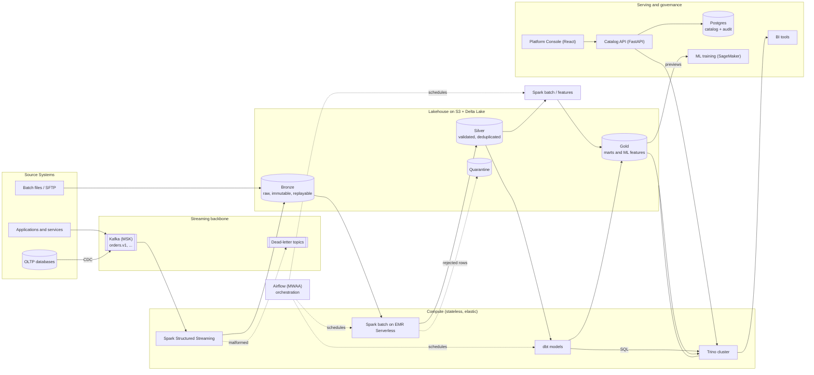
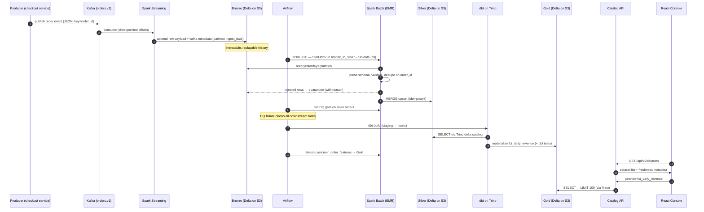

# Data Lakehouse Platform — Architecture

## 2.1 Chosen Architectural Pattern

**Medallion Lakehouse (layered data architecture) with event-driven ingestion,
orchestrated batch refinement, and a thin service layer for governance.**

The platform is *not* a microservices system and *not* a classic warehouse. It is a
**storage-centric architecture**: a single durable substrate (S3 + Delta Lake) that
multiple decoupled compute engines (Spark, Trino, dbt) read from and write to under
ACID guarantees, with Airflow coordinating batch movement between layers and Kafka
decoupling producers from the platform.

### Why this pattern fits

| Requirement | How the pattern answers it |
|---|---|
| Enterprise governed/audited layers | Bronze/Silver/Gold **is** the governance model: each promotion is a quality + contract gate, every write is a Delta commit with history (who/when/what), plus an application-level audit table. |
| ACID on cheap storage | Delta Lake transaction log over S3 gives serializable writes, time travel, and schema enforcement without warehouse lock-in. |
| Large-scale processing + ML training | Storage/compute separation: Spark clusters are ephemeral and sized per job; ML reads Gold feature tables directly from S3 — no export hop. |
| Interactive SQL for analysts | Trino queries the same Delta tables in place; dbt gives analysts a governed, tested modeling workflow without touching Spark. |
| Team scale | One writer per table per layer, contracts at layer boundaries — teams work on layers independently without a distributed-monolith of services. |

**Rejected alternatives.** A pure warehouse (Redshift/Snowflake-only) duplicates
storage for ML and locks transformation into one engine. Full microservices adds
network/service overhead where the real interfaces are *tables, topics, and DAGs*,
not APIs. Lambda architecture (separate speed/batch code paths) is avoided —
Structured Streaming writing Delta gives one code path for both.

---

## 2.2 Key Component Interactions

Interfaces between components are deliberately few and typed:

1. **Kafka topics (async events)** — producers → platform. Versioned contracts
   (`orders.v1`); breaking change ⇒ new topic (`orders.v2`), never in-place mutation.
   Malformed messages go to `<topic>.dlq` with a reason header.
2. **Delta tables (data contracts)** — the primary interface *inside* the platform.
   Rule of ownership: **Spark writes Bronze and Silver; dbt (via Trino) writes Gold
   marts; nothing writes across layers.** Consumers depend on table schemas, which are
   registered in the catalog and enforced on write.
3. **Airflow → compute (control plane API calls)** — Airflow never processes data; it
   calls EMR Serverless (`StartJobRun`) for Spark and runs `dbt build` for marts.
   Cross-DAG dependencies use Airflow *Datasets* (data-aware scheduling), not sensors.
4. **REST (sync API calls)** — React Console → Catalog API (JSON/HTTPS); Catalog API →
   Trino (table previews) and → Postgres (metadata + audit); **Spark jobs → Catalog
   API** (best-effort self-registration of datasets, schema versions, and row counts
   after every materialization — `lakehouse/common/catalog.py`). BI tools → Trino.
5. **Direct database access** — only the Catalog API touches Postgres. No other
   component may read/write the catalog DB.
6. **Platform event bus (ops events)** — every catalog mutation is fanned out to the
   Kafka topic `platform.audit.v1` (`app/services/audit_publisher.py`) for alerting
   and downstream consumers; the `audit_events` DB row written in the same
   transaction remains the source of truth.

### Catalog API surface (v1)

| Method & path | Purpose | Auth |
|---|---|---|
| `GET /healthz`, `GET /readyz` | liveness / readiness (DB fatal, Trino reported) | none |
| `GET /api/v1/datasets` | list; filters: `layer`, exact `name`, pagination | any principal |
| `POST /api/v1/datasets` | register a dataset | writer role |
| `GET/PATCH/DELETE /api/v1/datasets/{id}` | read / update owner+description / delete | writer for mutations |
| `GET/POST /api/v1/datasets/{id}/versions` | schema version history / append next version | writer for POST |
| `GET /api/v1/datasets/{id}/preview` | LIMIT-capped read-only sample via Trino | any principal |
| `GET /api/v1/audit` | audit trail; filters: entity, actor, pagination | any principal |

Errors are RFC 7807 problem responses; every response carries an `X-Request-ID`.

---

## 2.3 Data Flow

Typical path of an order event, end to end:

Two consumption paths from Gold: **analysts/BI** query through Trino;
**ML training** reads feature tables directly from S3 with point-in-time filters
(`feature_date <= label_date`) to avoid leakage.

Backfills follow the identical path: re-run `bronze_to_silver --run-date X` — safe
because Bronze is immutable and Silver writes are `MERGE` (idempotent).

---

## 2.4 Scalability & Performance Strategy

- **Storage/compute separation** — S3 scales without intervention; compute is
  ephemeral. EMR Serverless auto-scales executors per job stage and to zero after.
- **Kafka** — partition count sized on target throughput (start 12 for `orders.v1`),
  keyed by `order_id` for per-key ordering. Consumer lag is the primary scaling metric.
- **Streaming writes** — `availableNow` micro-batch triggers for cost-controlled
  near-real-time; move to continuous processing only when latency SLA demands it.
- **Delta layout** — partition by low-cardinality date (`ingest_date` / `event_date`);
  Z-ORDER (or liquid clustering on Databricks) on hot predicates (`customer_id`);
  scheduled compaction targets 128–512 MB files to fight the small-file problem.
- **Idempotent, partition-scoped jobs** — writers touch disjoint partitions, avoiding
  Delta optimistic-concurrency conflicts and enabling parallel backfills.
- **Trino** — independent scaling of coordinator/workers; fault-tolerant execution
  with S3 spill for large queries; resource groups isolate BI from ad-hoc users.
- **dbt** — thread parallelism per model DAG; incremental materializations on large
  marts (merge on Delta) instead of full rebuilds.
- **Growth path** — new domains add topics + tables, not new infrastructure; multiple
  EMR applications isolate noisy workloads; Trino federation (Postgres catalog config
  already included) postpones data movement.

---

## 2.5 Security Considerations

**Authentication & authorization**
- Humans: SSO (OIDC — Cognito or corporate IdP) → JWT for Console + Catalog API.
  `app/core/security.py` verifies RS256 tokens against the IdP JWKS (signature,
  expiry, audience) and maps a configurable roles claim. Mutations require a writer
  role (`platform-admin`, `data-engineer`); reads require any valid principal.
  With no `AUTH_JWKS_URL` configured the API runs in explicit development mode
  (local admin principal) — production environments always set it.
- Workloads: IAM roles only — EMR job execution role, MWAA execution role, ECS task
  role. No static AWS keys anywhere. CI uses GitHub OIDC federation to assume
  per-environment deploy roles.
- Data access: S3 bucket policies per layer; Lake Formation for table/column-level
  grants (analysts see Gold, engineers see Silver+, Bronze is platform-only).

**Data protection**
- SSE-KMS with per-layer keys; bucket policies deny non-TLS and unencrypted puts;
  S3 public access blocked at the account level.
- PII: tagged in the catalog; tokenized/hashed at the Bronze→Silver boundary so raw
  identifiers never propagate; column masking for `analyst` role via Lake Formation.
- Retention: Bronze lifecycle to infrequent-access/Glacier; GDPR erasure via Delta
  `DELETE` + `VACUUM` runbook.

**API security**
- All input validated by Pydantic schemas (types, patterns, bounds) before any logic.
- CORS restricted to the Console origin; rate limiting at the ALB/API-gateway tier.
- Principle of least privilege for the API's own credentials (Trino user is read-only;
  Postgres user owns only catalog schema).

**Secret management**
- AWS Secrets Manager is the source of truth (DB creds, Kafka SASL, Trino).
  Airflow reads connections via the Secrets Manager backend; ECS injects secrets as
  env vars at task start; local dev uses `.env` (gitignored, `.env.example` committed).
- CI: GitHub environments + OIDC; no secrets in workflow files; pre-commit
  `detect-private-key` guard.

**Audit**
- Three complementary trails: CloudTrail (infra), Delta transaction history
  (data: every commit records operation + job identity), and the `audit_events`
  table (application actions via the Catalog API).

---

## 2.6 Error Handling & Logging Philosophy

**Principles**

1. **Fail loudly, retry deliberately.** Jobs raise on unexpected errors and exit
   non-zero. Retries happen at the orchestration layer (Airflow: 2 retries,
   exponential backoff) — safe because every task is idempotent (MERGE writes,
   partition overwrites, checkpointed streams).
2. **Expected bad data is routed, not raised.** Malformed Kafka messages → DLQ topic;
   rows failing validation → quarantine table with `reason` + `source_offset` columns.
   The pipeline degrades by *narrowing data*, never by silently passing bad rows.
3. **Quality failures block promotion.** A failed DQ gate stops downstream tasks for
   that table only; parallel domains continue. Severity tiers: `warn` (log + metric)
   vs `fail` (block + page).
4. **Errors carry context.** Every log line includes `run_id`, `dag_id`, `task_id`,
   `table`, `run_date` — enough to reproduce with a single backfill command.

**Logging stack**

- Structured JSON logs everywhere (`lakehouse.common.logging`); no print statements.
- Spark/EMR + MWAA + ECS logs → CloudWatch → OpenSearch for search/dashboards.
- Metrics: pipeline durations, rows in/out per layer, DQ pass rates, Kafka consumer
  lag, Delta table file counts/sizes → CloudWatch metrics; alarms on SLA misses and
  DQ failures (SNS → Slack/PagerDuty).
- Frontend/API: errors surface as typed problem responses (never stack traces to
  clients); API logs request id per call; React shows actionable error states with
  retry (see `DatasetTable.tsx`).

**Error taxonomy**

| Class | Example | Handling |
|---|---|---|
| Transient infra | S3 throttle, EMR capacity | Airflow retry w/ backoff |
| Bad data (expected) | unparsable JSON, null key | DLQ / quarantine + metric, pipeline continues |
| Contract violation | producer schema drift | quarantine + `fail` DQ tier + page producer team |
| Logic bug | wrong aggregate | tests in CI; time-travel restore runbook for data repair |
| Security | auth failure spikes | 401/403 + audit event + alarm |
