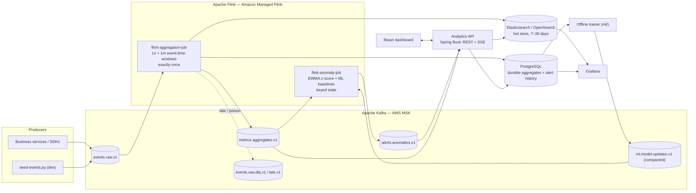
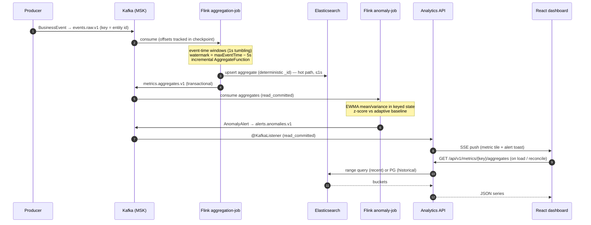
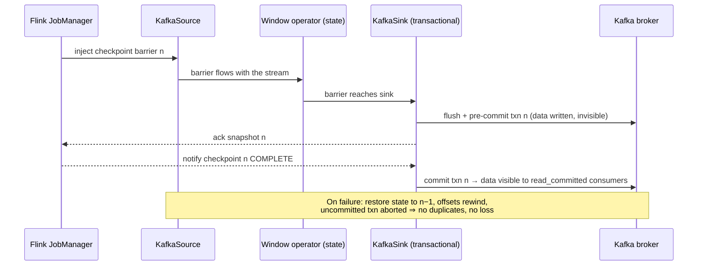

# Real-Time Analytics Pipeline — Architecture

## 2.1 Chosen Architectural Pattern

**Event-driven streaming architecture (Kappa) with CQRS-style serving.**

- **Kappa, not Lambda:** there is a *single* processing path — the stream. Historical answers come from replaying Kafka or querying materialized aggregates, not from a parallel batch layer. With Flink providing exactly-once stateful processing, a batch "correction" layer adds operational cost without adding trust. If a job's logic changes, we replay from Kafka (retention ≥ 7 days on raw events) into new output topics/indices.
- **CQRS-style serving:** the **write path** is owned exclusively by Flink jobs (they materialize aggregates into Elasticsearch and PostgreSQL); the **read path** is the Analytics API + Grafana, which never write analytical data. This keeps the latency-critical path free of request/response coupling and makes read stores replaceable.
- **Why it fits:** the business requirement is *sub-second metrics* and *streaming anomaly detection* — both are push-based, stateful, time-windowed problems. A request/response microservice mesh or a batch warehouse cannot meet the latency budget; a streaming dataflow is the natural shape. The deliberately small number of deployables (2 Flink jobs, 1 API, 1 SPA) keeps a small team productive while each unit still scales independently.

### System components

## 2.2 Key Component Interactions

| From → To | Mechanism | Contract | Delivery guarantee |
|---|---|---|---|
| Producers → Kafka | Kafka producer, `acks=all`, idempotence on | `BusinessEvent` JSON v1 (`schemaVersion` field) | At-least-once into `events.raw.v1` |
| Kafka → Flink jobs | `KafkaSource` (partition-aware, offsets in checkpoint) | Topic + schema | Exactly-once (offsets committed with checkpoint) |
| Aggregation job → Kafka | `KafkaSink`, `DeliveryGuarantee.EXACTLY_ONCE` (transactions) | `MetricAggregate` JSON | Exactly-once for `read_committed` consumers |
| Aggregation job → Elasticsearch | Bulk sink, **deterministic `_id`** = `metricKey\|window\|start\|dimHash` | Index template `metrics-aggregates-*` | At-least-once + idempotent upsert ⇒ **effectively-once** |
| Aggregation job → PostgreSQL | JDBC `INSERT … ON CONFLICT DO UPDATE` on the natural key | `metric_aggregates` table | Effectively-once (idempotent) |
| Anomaly job → Kafka | Transactional `KafkaSink` to `alerts.anomalies.v1` | `AnomalyAlert` JSON | Exactly-once |
| API → ES / PG | ES client (hot, last hours) / JDBC (history) | Query DTOs | Read-only |
| API → Frontend | REST (JSON, problem+details errors) + **SSE** for live pushes | `/api/v1/**`, `text/event-stream` | SSE is fire-and-forget; UI reconciles via REST |
| API ← Kafka | Consumer with `isolation.level=read_committed` | aggregates + alerts topics | Required — otherwise exactly-once is lost at the last hop |
| Grafana → ES / PG | Native datasources (provisioned) | index pattern / SQL | Read-only |
| Trainer → Anomaly job | Compacted control topic `ml.model-updates.v1` → Flink **broadcast state** | Model-params JSON, versioned | Latest-wins per metric key |

Interaction rules:
- **No synchronous calls inside the pipeline.** Flink jobs never call services; enrichment data arrives via broadcast/lookup state, models via the control topic.
- **The API is the only thing the frontend talks to.** UI never touches Kafka/ES/PG directly.
- **Kafka is the only integration bus.** Any future consumer (e.g., a data lake sink) subscribes to `metrics.aggregates.v1` — no point-to-point integrations.

## 2.3 Data Flow

Typical path — a business event becomes a dashboard update and (possibly) an alert:

### Exactly-once: how it actually works here

Flink checkpoints (every 5–10s) snapshot **source offsets + all operator state + sink transaction status** atomically. Kafka sinks participate via two-phase commit:

Consequences we design around:

1. **Transactional output latency = checkpoint interval.** Data in `metrics.aggregates.v1` becomes visible only when a checkpoint completes. That is why the **sub-second hot path goes directly to Elasticsearch with idempotent upserts** (visible immediately, effectively-once), while the **Kafka topic is the correctness backbone** for downstream consumers (anomaly job, API history ingest). Checkpoint interval is 5s in prod — alert freshness ≈ 5–7s end-to-end via Kafka, dashboard freshness < 1s via ES.
2. **Every consumer of transactional topics must set `isolation.level=read_committed`** (the anomaly job and the API do). Otherwise they read aborted/duplicate data and the guarantee silently evaporates.
3. **Producer transaction timeout** (`transaction.timeout.ms=600000`) must be ≤ broker `transaction.max.timeout.ms` (set to 900000 in the MSK configuration). Each job uses a unique `transactionalIdPrefix`.
4. **Idempotence keys everywhere else:** ES `_id` and the PG primary key are both derived from `(metricKey, windowSize, windowStart, dimensionsHash)` — replays after recovery overwrite, never duplicate.

## 2.4 Scalability & Performance Strategy

**Partitioning is the unit of scale.** `events.raw.v1` starts at 12 partitions keyed by entity id; Flink source parallelism ≤ partition count. Scaling sequence: raise Flink parallelism → add partitions (safe here: windows key on `metricKey`, not partition) → add MSK brokers.

| Component | Scales by | Notes |
|---|---|---|
| MSK | Brokers + partitions; provisioned throughput | 3 AZs, RF=3, `min.insync.replicas=2` |
| Flink | Parallelism / KPUs (Managed Flink autoscaling) | Incremental RocksDB checkpoints to S3; unaligned checkpoints under backpressure |
| Windows | Incremental `AggregateFunction` | State per (key×window) is O(1) — count/sum/min/max, never buffered events |
| Rollups | Cascade 1s → 1m | 1m windows re-aggregate 60 small records, not raw events |
| Elasticsearch | Data nodes + shards; ILM rollover | Daily indices `metrics-aggregates-YYYY.MM.DD`, hot 7d → delete 30d |
| PostgreSQL | Read replicas; native partitions by `window_start` | Serves history + alert workflow, not hot dashboards |
| API | Stateless → ECS horizontal autoscale | SSE fan-out is memory-bound; ~10k connections/task, LB with stickiness off (SSE is server-push only) |
| Frontend | S3 + CloudFront | Static, trivially scalable |

**Latency budget (p99, event → dashboard):** produce→broker 50ms · broker→Flink 50ms · window close wait (1s window) ≤ 1s framing + watermark lag 200ms · ES upsert+refresh 300ms · SSE push 100ms ⇒ *new data visible ≤ ~1s after window close*. Skew/hot keys are mitigated by incremental pre-aggregation; if one metric key dominates, salt the key for the 1s stage and merge in the 1m stage (documented TODO in the job).

**Backpressure policy:** never drop in-band; Kafka absorbs bursts (that is its job), Flink signals backpressure upstream, autoscaler reacts. Load-shedding, if ever needed, happens at the producer edge, not mid-pipeline.

## 2.5 Security Considerations

- **Authentication & authorization**
  - Humans: Amazon Cognito (OIDC). React obtains JWT; the API validates issuer/audience via Spring Security resource-server. Roles: `viewer` (read), `operator` (ack alerts), `admin` (metric definitions).
  - Services: IAM everywhere — MSK **IAM SASL** auth (per-topic IAM policies: aggregation job can write only `metrics.*`, anomaly job read `metrics.*`/write `alerts.*`), OpenSearch fine-grained access with IAM role mapping, RDS IAM auth or Secrets Manager credentials.
  - Grafana: Amazon Managed Grafana with IAM Identity Center SSO; datasources read-only DB user.
- **Network:** everything in private subnets of one VPC; MSK/ES/RDS have no public endpoints; only ALB (API) and CloudFront (SPA) are public. Security groups follow "producer SG → broker port 9098" style pairwise rules.
- **Data protection:** TLS in transit end-to-end (MSK TLS, HTTPS everywhere); at rest via KMS (MSK volumes, S3 checkpoint/artifact buckets, RDS, OpenSearch). Policy: **no PII in `events.raw.v1`** — events carry opaque ids; joining PII happens in systems with row-level control, not the analytics plane. Kafka retention doubles as data-retention control (raw 7d).
- **API security:** JWT on every route (SSE included — token via `Authorization` header on the EventSource polyfill or short-lived signed query token), strict CORS to the SPA origin, rate limiting at ALB/WAF, problem-details errors that never leak internals, input validation at the edge (Bean Validation).
- **Secrets:** AWS Secrets Manager / SSM Parameter Store, injected at deploy time (ECS task role, Managed Flink runtime properties). Nothing secret in the repo — `.env` is git-ignored, `.env.example` documents shape only. GitHub Actions uses **OIDC role assumption** — no long-lived AWS keys in CI.

## 2.6 Error Handling & Logging Philosophy

**Principle: the stream must keep flowing; errors are data.** A malformed event must never crash a job or stall a partition.

- **Poison pills:** deserialization failures are caught in the serde, counted (`deserialize.failures` metric), logged at WARN with topic/partition/offset (never the payload at INFO), and routed to `events.raw.dlq.v1` wrapped in an error envelope `{originalTopic, partition, offset, error, receivedAt, base64Payload}`. DLQ has its own retention and a replay runbook.
- **Late events:** watermarks tolerate 5s disorder; later events go to a **side output** → `events.raw.late.v1` and a `late-events` counter. Alert if late ratio > 0.1% — that means a producer's clock or our watermark budget is wrong. Windows do not use `allowedLateness` re-firing (downstream upserts would flap); lateness budget is handled in the watermark.
- **Transient sink failures:** retry with exponential backoff inside the sink (ES bulk retry on 429/503); if retries exhaust, the checkpoint fails and the job restarts from the last consistent state — correctness over availability, bounded by `tolerableCheckpointFailureNumber`.
- **API errors:** RFC 7807 problem-details from a single `@RestControllerAdvice`; validation errors enumerate fields; 5xx are logged with stack + trace id, returned without internals.
- **Frontend:** every remote call surfaces one of loading / error-with-retry / empty / data. SSE disconnects show a "live paused — reconnecting" pill rather than silently stale numbers.
- **Logging:** structured JSON everywhere (Flink log4j2 JSON layout, Logback encoder in the API) with `service`, `env`, `traceId`, and `eventId` where applicable → CloudWatch Logs. The `eventId` UUID minted at produce time is the cross-system correlation key.
- **Observability of the pipeline itself** (this is what pages people): consumer lag per group, checkpoint duration/size/failures, watermark lag vs wall clock, DLQ/late rates, ES bulk rejections, SSE connection count — all on a Grafana "pipeline health" board with alert rules. Business anomaly alerts and operational alerts stay in **separate channels**.

## 2.7 Decision Log (ADR summary)

| # | Decision | Why | Revisit when |
|---|---|---|---|
| 1 | Kappa over Lambda | One codebase, replay covers corrections | Regulatory batch reconciliation appears |
| 2 | Amazon Managed Flink over self-managed on EKS | No cluster ops for a small team; native checkpoint mgmt | Need custom Flink version/plugins or GPU inference |
| 3 | OpenSearch (AWS) fulfilling the "Elasticsearch" slot | Managed, IAM-integrated; API-compatible for our usage | Heavy reliance on X-Pack-only features |
| 4 | JSON now, Avro+Glue Schema Registry later | Velocity first; `schemaVersion` field reserved from day 1 | ≥2 producer teams or breaking change needed |
| 5 | Dual sink: ES direct (idempotent) + Kafka transactional | Sub-second dashboards *and* exactly-once downstream | If ES visibility may lag to checkpoint cadence, drop direct sink |
| 6 | EWMA z-score online + offline-trained seasonal baselines via broadcast | Alert in-stream in ms; retrain without redeploying the job | Model complexity outgrows params-on-a-topic (move scoring to ONNX in-job) |
| 7 | SSE over WebSocket for UI pushes | One-directional fan-out, plain HTTP, trivial LB story | UI needs client→server streaming |
| 8 | Minimal custom HTTP/JDBC sinks (and API-side ES queries) instead of version-coupled connector artifacts | ~200 auditable lines each on stable wire APIs (`_bulk`, `_search`, JDBC); one artifact works on ES 8 *and* AWS OpenSearch; failure semantics explicit (flush-on-checkpoint + idempotent upsert = effectively-once) | A connector feature we actually need (ILM-aware routing, async batching beyond bulk) |
