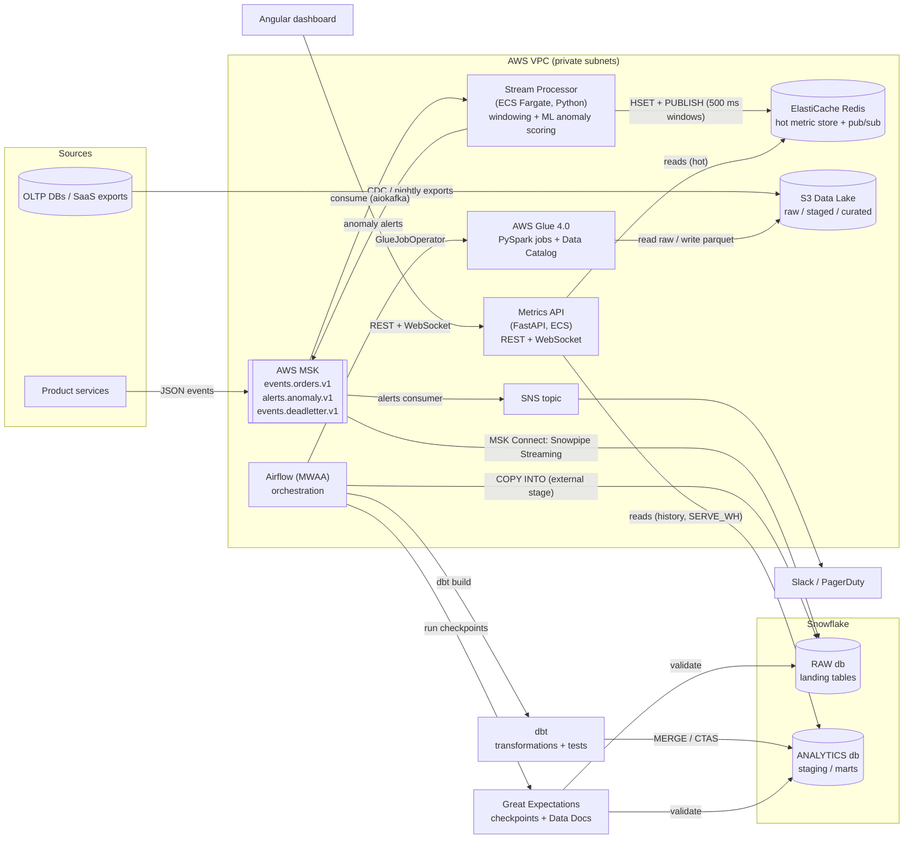
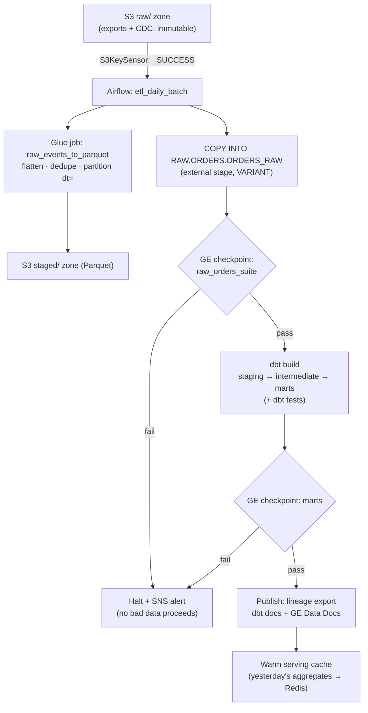

# ETL Pipeline Builder — Architecture

This document describes the system architecture. See [PROJECT-PLAN.md](./PROJECT-PLAN.md) for the
file layout and roadmap, and [TECH-NOTES.md](./TECH-NOTES.md) for operational guidance.

---

## 2.1 Chosen Architectural Pattern

**Event-driven hybrid: a Kappa-style *speed layer* over Kafka (AWS MSK) for sub-second metrics,
plus a governed *batch ELT layer* (S3 → Glue → Snowflake → dbt) orchestrated by Airflow.**

### Why this pattern

The two business requirements pull in opposite directions:

| Requirement | Implication |
|---|---|
| Real-time business metrics, **sub-second latency** | A cloud warehouse cannot serve p99 < 1 s dashboards under concurrency. The hot path must be *warehouse-free*: Kafka → in-memory windowing → Redis → WebSocket push. |
| Trusted, auditable business metrics + lineage | Needs the classic governed ELT stack: raw immutable landing, dbt transformations with tests, Great Expectations gates, versioned DDL. |
| **ML anomaly detection** on streaming data | Inference must live *inside* the stream processor (no network hop per event); training/retraining is a batch concern → Airflow owns the retrain loop, the processor consumes published model artifacts. |

So we deliberately run **two planes over one event source**:

- **Speed plane (seconds of retention, milliseconds of latency):** MSK → Python stream processor
  (ECS Fargate) → 500 ms tumbling windows → ElastiCache Redis (hot store + pub/sub) → FastAPI
  WebSocket → Angular. The anomaly detector scores every window inline and publishes alerts.
- **Batch plane (hours of latency, years of retention, full governance):** the *same* events are
  delivered to Snowflake `RAW` via MSK Connect (Snowpipe Streaming), joined by file-based sources
  landed in S3 and normalized by Glue. Airflow runs Glue → `COPY INTO` → dbt → Great Expectations
  nightly. dbt marts are the *system of record*; the speed plane is a *fast approximation* that is
  reconciled daily (classic Kappa reconciliation).

Alternatives considered and rejected:

- **Warehouse-only (“just query Snowflake often”)** — cannot meet the latency SLO; per-query cost
  at dashboard refresh rates is prohibitive.
- **Full Lambda with Spark Structured Streaming / Flink** — more capable windowing, but adds a
  cluster to operate. A single-purpose Python consumer on Fargate is sufficient for windowed
  counters/sums and keeps the team’s language surface to Python + SQL + TypeScript. Revisit if
  stateful joins across streams appear (then: Kinesis Data Analytics for Flink or Spark on EMR).
- **Microservices everywhere** — the serving API is one small stateless service; splitting it
  further adds operational cost with no isolation benefit at this scale.

## 2.2 Key Component Interactions



Interaction contracts:

| Channel | Technology | Contract |
|---|---|---|
| Producers → platform | Kafka topic `events.orders.v1` | Versioned JSON envelope (`event_id`, `event_type`, `ts_ms`, payload). Breaking change ⇒ new topic version (`.v2`), dual-publish during migration. Unparseable messages → `events.deadletter.v1` (base64 payload + error, replayable). |
| Processor → dashboard | Redis: hash `metric:{name}` (current) + zset `metric:{name}:history` (rolling live window) + pub/sub `metrics.updates` → FastAPI WS `/api/v1/metrics/stream` | Fire-and-forget push; Redis is a *cache*, losing it degrades to “stale tiles”, never data loss (warehouse is the record). History members keyed by window start ⇒ idempotent under redelivery. |
| Processor → alert feed / on-call | Kafka `alerts.anomaly.v1` → API background consumer → Redis (`alerts:*`, with acks); cloud adds the SNS bridge for paging | At-least-once; keyed/deduped on `alert_id`; publisher enforces a per-metric cooldown. |
| Retrain loop → processor | Airflow publishes tuned params to Redis hash `anomaly:model` (+ S3 archive) | Processor polls and hot-swaps per-metric thresholds — no restart, no consumer-group rebalance. |
| Streaming → warehouse | MSK Connect (Snowflake connector, Snowpipe Streaming) → `RAW.EVENTS.STREAM_EVENTS` | Exactly-once via connector offsets; `VARIANT` payload, schema applied in dbt staging. |
| Airflow → everything | Operators (Glue, SQL, Bash/ECS) | Airflow *orchestrates but never transforms*; transform logic lives in Glue jobs, dbt models, and `dags/common/` pure modules so it is testable outside the scheduler. |
| API → warehouse | `SERVE_WH` (read-only role `REPORTER`) for daily history; `RAW.METADATA.PIPELINES` when `PIPELINE_STORE=snowflake` (Redis backend is the local default) | Only marts + metadata are queryable; raw schemas are not granted. |
| Angular → API | REST (`/api/v1/*`) + one WS | OpenAPI-documented; Pydantic validates every input at the edge; credentials attached per `AUTH_MODE` (WS uses query-param token). |

## 2.3 Data Flow

### Hot path — an order event to a moving dashboard tile (< 1 s)

```mermaid
sequenceDiagram
    autonumber
    participant P as Producer service
    participant K as MSK events.orders.v1
    participant SP as Stream Processor
    participant R as Redis (hot store)
    participant SF as Snowflake RAW (via MSK Connect)
    participant A as Metrics API (WS)
    participant UI as Angular Dashboard

    P->>K: OrderPlaced {event_id, ts_ms, amount}   (t0)
    K->>SP: poll batch (≤ 50 ms)
    SP->>SP: assign to 500 ms tumbling window;<br/>on watermark: emit MetricPoints
    SP->>SP: EWMA anomaly score per metric
    SP->>R: HSET metric:orders_per_second + PUBLISH metrics.updates
    K-->>SF: async, seconds-level (Snowpipe Streaming)
    R-->>A: pub/sub message
    A-->>UI: WebSocket push               (t0 + <1 s)
    alt anomaly score ≥ threshold
        SP->>K: publish to alerts.anomaly.v1
        K-->>UI: (via API alert feed) + SNS to Slack/PagerDuty
    end
```

Latency budget (p99 targets): producer→broker 50 ms · consume+window ≤ 550 ms (window width
dominates) · Redis+WS+render 150 ms ⇒ **≈ 750 ms end-to-end**, leaving headroom under the 1 s SLO.
The window width (500 ms) is the tuning knob between latency and metric stability.

### Batch path — nightly governed ELT



This is a **write–audit–publish** pattern: data is validated *before* it becomes visible to marts
consumers, at two gates (raw ingest, post-transform).

### Lineage

- **dbt manifest** provides model-level lineage (source → staging → mart), exported per run by
  `scripts/export_dbt_lineage.py` and published with dbt docs.
- **Great Expectations** validation results are stored per run (`RAW.METADATA.DATA_QUALITY_RESULTS`
  + Data Docs), attaching quality evidence to each dataset version.
- TODO (Phase 3): emit **OpenLineage** events from Airflow and dbt to a Marquez/DataHub backend to
  fuse orchestration, transformation, and quality lineage into one graph.

## 2.4 Scalability & Performance Strategy

| Layer | Scaling axis | Mechanism |
|---|---|---|
| MSK | Partitions & brokers | `events.orders.v1` starts at 6 partitions (dev) / 24 (prod); keyed by `customer_id` for per-key ordering. Brokers scale vertically first (m7g family), storage via EBS autoscaling. |
| Stream processor | Horizontal, partition-bound | Stateless-per-window Fargate tasks in one consumer group; ECS autoscaling on the `MaxOffsetLag` CloudWatch metric. Max useful parallelism = partition count. Window state is per-task and small (counters), so rebalance cost is one window’s worth of data. |
| Redis | Vertical → cluster mode | Metrics hot set is tiny (KBs); pub/sub fan-out grows with API replicas — move to cluster mode / sharded pub/sub if API replicas exceed ~20. |
| API | Horizontal, stateless | Behind ALB; WebSocket sticky by connection only. Scale on active WS connections + CPU. |
| Snowflake | Independent per-workload warehouses | `LOAD_WH` (ingest), `TRANSFORM_WH` (dbt), `SERVE_WH` (API/BI, multi-cluster in prod for concurrency). Auto-suspend 60 s. Growth = size up TRANSFORM_WH for the nightly window only. |
| Glue | DPU count | Jobs are partition-parallel over `dt=`; enable auto-scaling workers. |
| Angular | CDN | Static build; API is the only dynamic dependency. |

Performance guardrails:

- **The hot path never blocks on the warehouse or disk.** Snowflake ingestion is a *branch* off
  Kafka (MSK Connect), not a step in the metric path.
- Backpressure: if the processor lags, windows close late but remain *correct* (watermark-driven);
  the dashboard shows a staleness indicator fed by the `window_start_ms` of the last update.
- Replayability: Kafka retention (7 days) + immutable S3 raw zone + Snowflake Time Travel give
  three independent recovery levers.

## 2.5 Security Considerations

**Identity & access**

- Humans: SSO into AWS (Identity Center) and Snowflake (SAML). No shared accounts.
- Workloads: IAM task roles per ECS service; **MSK IAM (SASL/IAM)** auth — no broker passwords.
- CI/CD: GitHub Actions **OIDC federation** into per-environment deploy roles; zero long-lived AWS
  keys in GitHub secrets.
- Snowflake services: dedicated users with **key-pair auth** (no passwords), one per plane:
  `LOADER` (COPY/Snowpipe), `TRANSFORMER` (dbt), `REPORTER` (API, read-only marts). RBAC grants are
  codified in `migrations/V1.0.0`.

**API & frontend**

- AuthN (implemented, `AUTH_MODE`): `none` (local compose) · `api_key` (X-API-Key header /
  query param) · `jwt` — HS256 shared secret or RS256 against any OIDC IdP's JWKS URL
  (Cognito/Entra/Keycloak). One HTTPConnection-based dependency guards REST *and* the
  WebSocket (browsers pass `?token=`); `/healthz` stays open for LB probes; misconfig
  fails **closed**. Angular attaches credentials via interceptor (localStorage JWT wins
  over build-time API key).
- AuthZ: role claims map to viewer/operator (pipeline CRUD requires operator) — wired when
  the IdP lands (claims are already surfaced by `decode_token`).
- Input validation: Pydantic v2 models at every endpoint (patterns, ranges, length caps);
  WebSocket is push-only (server → client) so it accepts no client payloads.
- CORS pinned to known origins; request-id middleware + JSON access logs on every call;
  rate limiting at the ALB/WAF.

**Data protection**

- TLS in transit everywhere (MSK TLS, Redis in-transit encryption, HTTPS).
- At rest: S3 SSE-KMS, MSK KMS volumes, Snowflake default encryption; ElastiCache at-rest enabled.
- PII: masked in Snowflake via masking policies + object tags (Phase 3); Glue jobs drop/hash direct
  identifiers before the staged zone; raw zone bucket policy restricted to the Glue role.

**Secrets**

- Runtime secrets live in **AWS Secrets Manager / SSM Parameter Store**, injected into ECS task
  definitions and MWAA; never baked into images.
- Local dev uses `.env` (gitignored); `.env.example` is the documented contract.
- Airflow connections (`snowflake_default`, `aws_default`) come from the MWAA secrets backend.

## 2.6 Error Handling & Logging Philosophy

**Principles**

1. **Fail loudly at boundaries, never silently degrade data.** A failed GE checkpoint *stops* the
   DAG (write–audit–publish); partial marts are never published.
2. **At-least-once + idempotent sinks** on the streaming plane: offsets commit only after sink
   success; Redis writes are last-write-wins per window key; warehouse ingest dedupes on
   `event_id` in dbt staging (`row_number()` pattern). Duplicates are handled, losses are not.
3. **Poison pills are quarantined, not fatal:** malformed messages go to `events.deadletter.v1`
   with error context; the consumer keeps moving. DLQ depth is alarmed.
4. **Retries with backoff for transient faults only** (Airflow `retries=2`, exponential backoff;
   aiokafka reconnect; Redis client retry). Logic errors surface immediately — no retry loops
   around bugs.
5. **Every failure has an owner and a channel:** Airflow `on_failure_callback` → SNS → Slack;
   anomaly alerts are business alerts (separate channel from pipeline failures to avoid
   alert-fatigue cross-contamination).

**Logging & observability**

- Structured JSON logs (stdlib logging with JSON formatter; correlation fields: `event_id`,
  `dag_run_id`, `window_start_ms`) → CloudWatch Logs; retention 30/90 days by env.
- Metrics: processor exposes counters (events consumed, late-dropped, DLQ, window emit latency);
  CloudWatch alarms on consumer lag, DLQ rate, WS error rate, Airflow SLA misses.
- Error taxonomy drives routing: **pipeline failure** (SNS → on-call), **data-quality failure**
  (GE gate, SNS → data team), **business anomaly** (detector, SNS → metric owner + dashboard feed).
- Airflow task SLAs (`sla_miss_callback`) catch “slow but not failed” — the most dangerous state.
- User-facing: the Angular dashboard surfaces staleness and connection loss explicitly (grey tiles
  + reconnect banner) rather than showing frozen numbers as if they were live.
