# ETL Pipeline Builder — Technical Notes

Actionable engineering guidance for this repository. Companion to
[ARCHITECTURE.md](./ARCHITECTURE.md) and [PROJECT-PLAN.md](./PROJECT-PLAN.md).

---

## 3.1 CI/CD Pipeline Design

Two workflows plus an infrastructure workflow (see `.github/workflows/`):

```mermaid
flowchart LR
    PR["Pull request"] --> L["Lint<br/>ruff · mypy · sqlfluff · eslint · tf fmt"]
    L --> T["Unit tests<br/>pytest (api, streaming, glue, dags)<br/>karma (frontend)"]
    T --> C["Compile checks<br/>dbt parse · terraform validate · ng build"]
    C --> M["Merge to master"]
    M --> B["Build & push images → ECR<br/>api · processor · frontend"]
    B --> D1["Deploy dev<br/>DAGs→S3 · schemachange · ECS redeploy"]
    D1 --> S1["Smoke: /healthz + seeded event round-trip"]
    S1 --> D2["Deploy staging (auto)"]
    D2 --> D3["Deploy prod<br/>(GitHub environment approval)"]
```



| Stage | Job(s) in `ci.yml` | Fails the build when |
|---|---|---|
| Lint | `python-quality`, `sql-lint`, `frontend`, `terraform` | ruff/ruff-format, mypy, sqlfluff, eslint, `terraform fmt -check` violations |
| Test | `python-quality` (pytest+coverage), `frontend` (karma headless), `airflow-dags` (DagBag integrity) | any test failure; DAG import error |
| Compile | `dbt-parse`, `terraform validate`, `ng build` | dbt project or HCL or TS does not compile |
| Build | `cd.yml → build-push` (matrix: api/processor/frontend) | docker build fails |
| Deploy | `cd.yml → deploy-*` | smoke test failure blocks promotion |

Rules of thumb:

- **Path filters** keep feedback fast: a docs-only PR runs almost nothing; a `dbt/**` change runs
  dbt + sqlfluff jobs only, plus the always-on lint job.
- **OIDC, not keys:** every AWS step uses `aws-actions/configure-aws-credentials` with
  `role-to-assume`; roles are per-environment with least privilege.
- dbt **CI target** (`ci`) builds into a PR-scoped schema (`ANALYTICS.CI_PR_<n>`) so PRs can run
  `dbt build --select state:modified+` against production data safely (Slim CI, Phase 2).
- Deployments are **immutable**: images tagged with the git SHA; “deploy” = point ECS at a new tag
  + sync DAGs; rollback = redeploy previous SHA.

## 3.2 Testing Strategy

Test pyramid per component — fast and hermetic at the bottom, few and end-to-end at the top:

| Layer | Tooling | Target / gate |
|---|---|---|
| Python unit | `pytest` + `pytest-cov` (repo-root config in `pyproject.toml`) | ≥ 80 % on `streaming/processor` and `api/app`; the windowing + anomaly code is pure logic — keep it at ~100 % |
| API contract | FastAPI `TestClient` with dependency-injection overrides (no live Redis/Snowflake) | every route: happy path, validation (422), missing (404), degraded (503) |
| DAG integrity | `DagBag` import test + hygiene assertions (`airflow/tests`) | zero import errors; `catchup=False`, retries ≥ 1, tags present on every DAG |
| dbt | generic tests (`unique`, `not_null`, `relationships`, `accepted_values`) + singular tests + `dbt parse` in CI | every mart column documented & key-tested; parse must pass on every PR |
| Data quality (runtime) | Great Expectations checkpoints as DAG gates | raw + marts suites must pass before publish |
| Glue | `pytest` with a local `SparkSession` (marker `glue`, excluded by default; run in a Linux container/CI) | `transform()` is a pure function — test dedupe, casts, quarantine reasons |
| Airflow-adjacent logic | plain `pytest` on `dags/common/` pure modules (no Airflow needed) | training fit/eval, health checks, cache warmer; **detector↔replay parity test** pins the training replica to the processor math |
| Frontend unit | Karma/Jasmine (`HttpTestingController` for services; TestBed + stub services for components) | services, dashboard states (tiles/empty/stale), value formatting |
| Integration | `ci.yml → integration`: compose kafka+redis+api+processor, then `scripts/smoke_e2e.sh` (seed → live metrics → rolling history → pipeline CRUD → alert feed) | golden-path smoke on every PR/merge; run locally with `make smoke` |
| E2E (Phase 3) | Playwright against the dev stack | dashboard renders live tile; alert feed shows injected anomaly |
| Load (Phase 3) | k6 (WS soak) + `seed_kafka_events.py --rate 5000` | p99 producer→dashboard < 1 s sustained |

Conventions: tests live next to their component (`<component>/tests/`); no test reaches a real
cloud service — anything non-hermetic is an integration test behind a compose profile or a marker.

## 3.3 Deployment Strategy

**Containerized services** (multi-stage Dockerfiles, non-root users):

| Unit | Runtime | Deploy mechanism |
|---|---|---|
| `api` (FastAPI) | ECS Fargate behind ALB | CD: push image → `aws ecs update-service`; blue/green via CodeDeploy in Phase 3 |
| `streaming/processor` | ECS Fargate (no LB) | Same; scale-out bound by Kafka partitions; drain via SIGTERM → commit offsets → exit |
| `frontend` (Angular) | nginx container (dev/small) → **S3 + CloudFront (prod, recommended)** | CD builds `ng build` artifacts; prod syncs `dist/` to S3 + CF invalidation |
| Airflow DAGs | MWAA | `aws s3 sync airflow/dags → s3://<mwaa-bucket>/dags` (MWAA picks up in ~30 s); `requirements.txt` version bump updates the environment |
| dbt | Runs *as a container task* (ECS RunTask) triggered by Airflow — not inside MWAA’s Python env | image built from repo `dbt/` in Phase 2 |
| Snowflake DDL | `schemachange` step in CD (versioned, forward-only) | `schemachange -f migrations/ ...` per environment |
| Glue scripts | S3 artifacts bucket | CD uploads `glue/jobs/*.py`; Terraform pins the job to the script path |
| AWS infra | Terraform, per-env root modules | `infra.yml`: plan on PR, apply on master (dev) / manual dispatch with environment approval (staging, prod) |

Environment promotion is **artifact promotion**, not rebuild: the same image SHA moves
dev → staging → prod.

## 3.4 Environment Management

Three long-lived environments + local:

| | local | dev | staging | prod |
|---|---|---|---|---|
| Kafka | compose `apache/kafka` | MSK 2 brokers, t3.small | MSK 3 brokers | MSK 3+ brokers, m7g |
| Airflow | compose `airflow standalone` | MWAA disabled by default (cost) → local | MWAA mw1.small | MWAA mw1.medium |
| Snowflake | shared dev account, `DEV_` prefixed schemas | same account, `dev` role set | dedicated staging DB (zero-copy clone of prod) | prod account/DB |
| Config source | `.env` file | SSM/Secrets Manager | SSM/Secrets Manager | SSM/Secrets Manager |

Rules:

- **`.env.example` is the single documented contract** for every configuration key. Services read
  config exclusively through their settings modules (`pydantic-settings`); nothing reads ad-hoc
  env vars scattered in code.
- Precedence: process env > `.env` (local only). In AWS, ECS task definitions and MWAA inject
  values from SSM/Secrets Manager — the `.env` file never ships in an image.
- dbt targets (`dev`/`ci`/`prod`) and Terraform workspaces-per-directory map 1:1 to environments.
- Config lists (e.g. CORS origins) are comma-separated strings, parsed in code — avoids the
  “JSON in env var” trap with pydantic-settings.

### `.env.example` template

The canonical file lives at the repo root (`.env.example`); reproduced here:

```dotenv
# ── Environment ───────────────────────────────────────────────
APP_ENV=dev
AWS_REGION=eu-central-1
AWS_PROFILE=default            # local only; CI/CD uses OIDC roles

# ── Data lake / batch ─────────────────────────────────────────
LAKE_BUCKET=etl-pipeline-builder-dev-lake
ARTIFACTS_BUCKET=etl-pipeline-builder-dev-artifacts
MWAA_DAGS_BUCKET=etl-pipeline-builder-dev-mwaa

# ── Kafka / MSK ───────────────────────────────────────────────
KAFKA_BOOTSTRAP_SERVERS=localhost:29092
KAFKA_EVENTS_TOPIC=events.orders.v1
KAFKA_ALERTS_TOPIC=alerts.anomaly.v1
KAFKA_DLQ_TOPIC=events.deadletter.v1
KAFKA_CONSUMER_GROUP=metrics-processor

# ── Hot store / streaming tuning ──────────────────────────────
REDIS_URL=redis://localhost:6379/0
METRICS_CHANNEL=metrics.updates
WINDOW_MS=500
ALLOWED_LATENESS_MS=1000
ANOMALY_ALPHA=0.05
ANOMALY_Z_THRESHOLD=4.0
ANOMALY_WARMUP=120

# ── Snowflake (key-pair auth in cloud envs; see §3.6) ─────────
SNOWFLAKE_ACCOUNT=xy12345.eu-central-1
SNOWFLAKE_USER=ETL_SERVICE
SNOWFLAKE_PASSWORD=change-me
SNOWFLAKE_ROLE=TRANSFORMER
SNOWFLAKE_WAREHOUSE=TRANSFORM_WH
SNOWFLAKE_DATABASE=ANALYTICS

# ── dbt / Great Expectations ──────────────────────────────────
DBT_TARGET=dev
DBT_PROJECT_DIR=./dbt
DBT_PROFILES_DIR=./dbt/profiles
GE_ROOT_DIR=./great_expectations

# ── API / frontend ────────────────────────────────────────────
CORS_ORIGINS=http://localhost:4200,http://localhost:8081
HISTORY_SOURCE=redis           # redis (local) | snowflake (cloud daily history)
PIPELINE_STORE=redis           # redis (local) | snowflake (RAW.METADATA.PIPELINES)
ALERTS_CONSUMER_ENABLED=true

# ── API security (ARCHITECTURE §2.5) ──────────────────────────
AUTH_MODE=none                 # none | api_key | jwt
API_KEY=
JWT_SECRET=                    # HS256 … or JWKS below for any OIDC IdP
JWT_JWKS_URL=
JWT_AUDIENCE=
JWT_ISSUER=

# ── Alerting ──────────────────────────────────────────────────
ALERTS_SNS_TOPIC_ARN=
SLACK_WEBHOOK_URL=
```

Backend-selection rule of thumb: **local/dev keeps everything on the compose stack**
(`HISTORY_SOURCE=redis`, `PIPELINE_STORE=redis`, `AUTH_MODE=none`); **cloud environments
flip to the warehouse-backed variants** (`snowflake`, `jwt`) via SSM — same code paths,
selected by config, both covered by tests.

## 3.5 Version Control Workflow

**Trunk-based development** with short-lived branches:

- `master` is always deployable; every merge auto-deploys to dev and (after smoke) staging.
- Branches: `feat/<slug>`, `fix/<slug>`, `chore/<slug>` — life expectancy ≤ 2–3 days; PRs small.
- Releases to prod: manual `cd.yml` dispatch (or tag `vX.Y.Z`) with GitHub **environment
  protection** approval — the release *is* an already-tested artifact promotion.
- Conventional Commits (`feat:`, `fix:`, `chore:` …) → changelog automation later.

Why not Gitflow: a data platform ships **pipelines and schema changes continuously**; long-lived
`develop`/release branches make dbt model drift and Snowflake migration ordering painful
(migrations are forward-only and numbered — parallel release branches invite version collisions).
Trunk-based keeps one linear migration history and matches the “artifact promotion” CD model.

Repo hygiene: branch protection on `master` (required checks: all `ci.yml` jobs), CODEOWNERS
review on `migrations/**`, `infrastructure/**`, `dbt/models/marts/**`.

## 3.6 Common Pitfalls (this stack specifically)

1. **Serving “real-time” from Snowflake.** Sub-second dashboards from a warehouse fail on latency
   *and* cost. Keep the hot path Kafka→Redis; Snowflake answers history. Reconcile daily.
2. **Running dbt inside MWAA.** dbt and MWAA pin conflicting versions of shared libraries; MWAA
   env updates take ~20–30 min per attempt. Run dbt in its own container via `EcsRunTaskOperator`
   (the BashOperator in the stub is local-dev only).
3. **MWAA deploy latency & DAG imports.** DAG files are parsed every ~30 s — keep module-level
   code cheap (no boto3 clients or DB calls at import time; the stubs import lazily inside
   callables). A slow import blocks *every* DAG.
4. **Great Expectations version churn.** GX 1.x broke the 0.18 API (checkpoints, fluent
   datasources). This repo pins `great-expectations==0.18.*`; migrating is a deliberate Phase 3
   task, not a Dependabot auto-merge.
5. **Kafka rebalances vs. your latency SLO.** Every processor deploy triggers a consumer-group
   rebalance (seconds of pause). Use `CooperativeStickyAssignor`, deploy rolling-one-at-a-time,
   and don’t autoscale aggressively on spiky lag.
6. **At-least-once means duplicates.** Design every sink idempotent from day one: Redis writes are
   keyed per window; warehouse dedupe on `event_id` lives in `stg_stream_events`. Never “count on
   consume”.
7. **Late events silently skewing metrics.** The aggregator drops events older than the watermark
   and *counts them* (`late_events_dropped`). Alarm on that counter; tune `ALLOWED_LATENESS_MS`
   before touching window width.
8. **Snowflake cost leaks.** Warehouses left resumed, `SELECT *` from BI on raw tables, dbt
   full-refreshing giant incrementals. Mitigations: auto-suspend 60 s, `REPORTER` sees marts only,
   `query_tag` per service, weekly cost report by tag.
9. **schemachange is forward-only.** There is no `down.sql`. Write additive migrations
   (add-column, new-table), backfill, then drop in a later migration once nothing reads the old
   shape. Never edit an applied migration file — its checksum is recorded.
10. **VARIANT-first ingestion cuts both ways.** Landing raw JSON as `VARIANT` decouples producers
    from DDL, but every downstream cast lives in dbt staging — enforce contracts there with dbt
    tests + GE, or schema drift becomes a 2 a.m. surprise.
11. **Angular + WebSocket churn.** Recreate the WS with backoff (`retry({delay})` in the service),
    surface “disconnected” state in the UI, and keep change detection `OnPush` with signals —
    naive zone-driven updates at 2 msg/s × 50 tiles will melt the dashboard.
12. **Terraform vs. reality on MSK/MWAA.** Both take 20–40 min to create/update; plan around it
    (separate `infra.yml` runs, never inline with app deploys), and never let two applies race —
    state locking via DynamoDB is configured, keep it.
13. **Windows-based local dev.** PySpark workers are unreliable on Windows; Glue tests are marked
    (`-m glue`) and run in Linux CI/containers. The compose stack is the supported local path.
