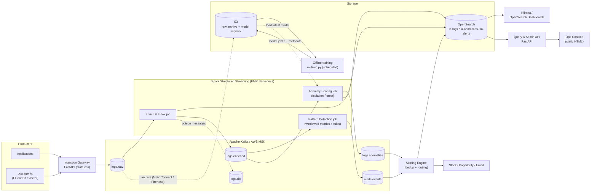
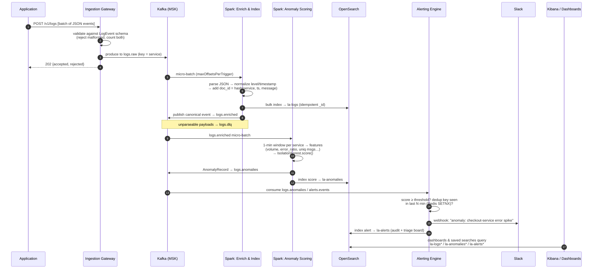

# Log Analytics Platform — Architecture

## 2.1 Chosen Architectural Pattern

**Event-driven streaming pipeline (Kappa architecture) with a thin service layer around it.**

- **Kappa, not Lambda:** there is a single processing path — everything is a stream. Kafka is
  the durable, replayable backbone (raw logs are also archived to S3 for long retention and
  model training). There is no separate batch codebase to keep in sync; "batch" needs
  (ML training, backfills) are served by replaying Kafka/S3 history through the same
  transformation code (`common/` + `ml/` are shared by streaming jobs and offline training).
- **Thin services, fat pipeline:** the three long-running Python services (ingestion gateway,
  alerting engine, query/admin API) are small, stateless, independently deployable Fargate
  containers. All heavy lifting (parsing, enrichment, windowed aggregation, ML scoring)
  happens inside Spark Structured Streaming jobs.
- **Why this fits:** log analytics is inherently append-only, high-volume, and time-ordered —
  the textbook streaming workload. Kafka decouples producers from consumers (a slow
  Elasticsearch never back-pressures application logging), Spark gives windowed stateful
  processing + ML integration, and OpenSearch/Kibana are purpose-built for log search and
  dashboards. A monolith would couple ingestion availability to processing availability; a
  fine-grained microservice mesh would add operational cost with no benefit at this team size.

**Key design rules**

1. Business logic lives in pure Python modules (`common/`, `ml/`, `alerting/rules.py`) that are
   Spark-free and unit-testable in milliseconds. Spark jobs are thin adapters over them.
2. Every inter-component contract is a versioned schema (`common/models.py` — `LogEvent`,
   `AnomalyRecord`, `AlertEvent`). Kafka messages are JSON conforming to these models.
3. Everything written to OpenSearch has a deterministic `_id` (content hash), making all
   writes idempotent — the foundation of the effectively-once story (§2.6).
4. Search schema is code: versioned migrations in `elasticsearch/migrations/`, applied by an
   idempotent runner in CI/CD before app deployment.

## 2.2 Key Component Interactions

| Interaction | Mechanism | Notes |
|---|---|---|
| Apps/agents → Gateway | HTTPS `POST /v1/logs` (batch JSON) | Fluent Bit / Vector agents or direct SDK; API-key auth; 202 with accept/reject counts |
| Gateway → pipeline | Kafka `logs.raw` | keyed by `service` → per-service ordering preserved |
| Spark enrich job → storage | `foreachBatch` bulk REST to OpenSearch (`la-logs` write alias) | idempotent `_id`; failures → retry then `logs.dlq` |
| Spark enrich job → downstream | Kafka `logs.enriched` | canonical normalized stream consumed by detection/scoring jobs |
| Pattern detection → alerting | Kafka `alerts.events` | rule hits as `AlertEvent` JSON |
| Anomaly scoring → alerting | Kafka `logs.anomalies` | `AnomalyRecord` per service-window; also indexed to `la-anomalies` |
| Alerting engine → humans | HTTPS webhooks (Slack live, PagerDuty stub) + `la-alerts` index | Redis `SETNX` TTL dedup before dispatch |
| Query API → OpenSearch | REST `_search` (SigV4 in AWS) | the only reader-facing DB access; UI/console never hits OpenSearch directly |
| Kibana/Dashboards → OpenSearch | native | dashboards exported to `kibana/` as code |
| ML training ↔ storage | reads history (OpenSearch/S3), writes model to registry (S3) | scoring job loads `latest` model at start / on refresh interval |
| CI/CD → AWS | GitHub Actions OIDC → ECR, ECS, EMR Serverless, migrations | no long-lived credentials |

**Message bus is the integration point.** Services never call each other synchronously except
at the read path (console → API → OpenSearch). Adding a new consumer (e.g., a billing meter
or a security scanner) is a new consumer group on `logs.enriched` — zero changes upstream.

## 2.3 Data Flow

Typical path of a single log line, from emission to a dashboard and (if anomalous) a Slack ping:

Checkpointing: every Spark job owns a dedicated checkpoint directory (S3 in AWS). On restart it
resumes from committed Kafka offsets; combined with deterministic `_id`s, reprocessing a batch
overwrites the same documents instead of duplicating them (**effectively-once** delivery to
OpenSearch).

## 2.4 Scalability & Performance Strategy

- **Ingestion tier scales horizontally and statelessly.** The gateway holds no state; ECS
  autoscaling on CPU/req-rate. Kafka absorbs any burst — OpenSearch indexing lag never
  back-pressures producers.
- **Kafka partitioning is the unit of parallelism.** `logs.raw` / `logs.enriched` start at 12
  partitions (keyed by `service` for ordering); scaling reads = adding Spark executors up to
  the partition count. Partition counts are set in `common/kafka.py` and applied by
  `scripts/create_kafka_topics.py` — one place to change.
- **Spark elasticity:** EMR Serverless scales executors with load between configured min/max;
  `maxOffsetsPerTrigger` bounds micro-batch size so recovery after downtime is smooth rather
  than one giant batch. Stateful windows carry watermarks (`withWatermark`) so state is
  bounded and late data is handled explicitly.
- **OpenSearch:** time-based rollover indices (`la-logs-000001…`) behind a write alias, sized
  ~30 GB/shard; ISM moves indices hot → warm (force-merged, fewer replicas) → delete/UltraWarm.
  Search targets narrow time ranges via the alias; mappings are `dynamic: false` with
  `flat_object` attributes to prevent mapping explosion from arbitrary log fields.
- **Hot paths avoid the database.** Detection and scoring read Kafka, not OpenSearch;
  OpenSearch serves humans (dashboards, API), not the pipeline.
- **Cost levers:** compression on producers (gzip), `best_compression` codec on warm indices,
  raw-archive to S3 (cheap) instead of long OpenSearch retention, EMR Serverless auto-stop
  for the training job.

## 2.5 Security Considerations

- **Authentication & authorization**
  - Gateway: per-team API keys (header `X-API-Key`) at MVP → mTLS or Cognito/OIDC client-creds
    later; keys map to a `team` claim stamped onto events for tenancy filtering.
  - Query API: OIDC (SSO) bearer tokens; role-based filters (team → allowed `service` values)
    enforced server-side, never in the browser.
  - Dashboards: SSO via OpenSearch fine-grained access control; read-only roles by default.
  - AWS: services use narrowly-scoped IAM task roles; humans use SSO; CI uses GitHub OIDC
    federation (`iam.tf`) — **no static AWS keys anywhere**.
- **Data protection**
  - TLS in transit everywhere (MSK TLS listeners, OpenSearch HTTPS, ALB HTTPS).
  - Encryption at rest: MSK (KMS), OpenSearch EBS (KMS), S3 (SSE-KMS).
  - PII discipline: logs are the classic PII leak vector — the enrichment job carries a
    redaction hook (TODO in `transforms/enrichment.py`) for known patterns (emails, tokens);
    retention limits enforced by ISM are part of the compliance story.
- **API security:** strict input validation (Pydantic) at both FastAPI edges, request size
  caps, rate limiting at the gateway (TODO: token bucket / WAF), no OpenSearch DSL passthrough —
  the search endpoint exposes a constrained query surface only.
- **Secret management:** local = `.env` (gitignored, `.env.example` documents shape); AWS =
  Secrets Manager / SSM Parameter Store injected into ECS task definitions and EMR job
  configs by Terraform; CI = GitHub Environments secrets. Secrets never appear in code,
  images, or logs (the JSON formatter is the single choke point for future scrubbing).

## 2.6 Error Handling & Logging Philosophy

- **The platform logs like its own best customer:** every service emits structured JSON via
  `common/logging.py` (timestamp, level, service, message, context) — the exact `LogEvent`
  shape the platform ingests. Dev is dogfooding from day one.
- **Errors are data, not noise:**
  - *Poison messages* never kill a job: parse failures are split off and produced to
    `logs.dlq` with the original payload + error reason; a replay tool is a Phase-3 item.
  - *Transient sink failures* (OpenSearch 429/5xx): bounded exponential-backoff retries inside
    `foreachBatch`; if the batch still fails, the job crashes loudly and resumes from the
    checkpoint — no silent data loss, duplicates absorbed by idempotent `_id`s.
  - *Alert delivery failures* degrade in order: notifier retry → alternate channel → always
    indexed in `la-alerts` (the index is the source of truth; Slack is best-effort).
- **Fail fast at the edges, be forgiving in the middle:** the gateway rejects malformed events
  per-item (batch keeps flowing, response reports both counts); inside the pipeline unknown
  extra fields are tolerated (`extra="ignore"`, `dynamic: false`) so producers can evolve.
- **Exceptions carry context, once:** raise with context, catch at the entrypoint, log a single
  structured ERROR with stack + correlating ids (`trace_id`, Kafka topic/partition/offset).
  No log-and-rethrow ladders.
- **Observability of the platform itself (meta-monitoring):** consumer-group lag, batch
  duration vs. trigger interval, DLQ rate, indexing error rate, alert-delivery failures — each
  is a metric with an alarm. The platform must never be the last to know it's down.
  (CloudWatch + a small `la-platform-*` self-log index.)
