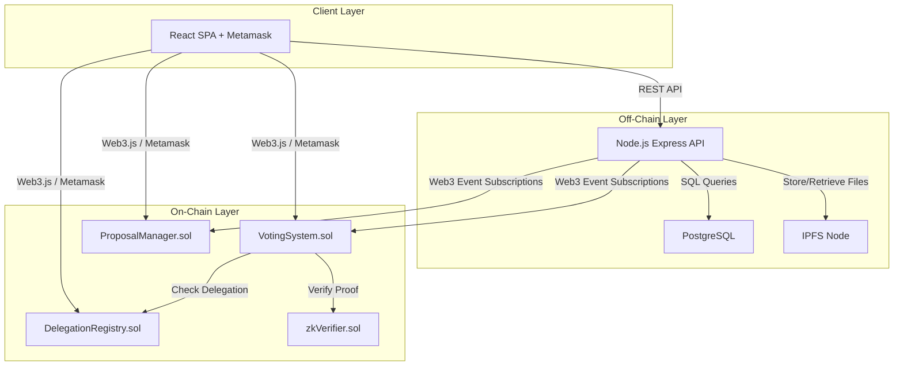
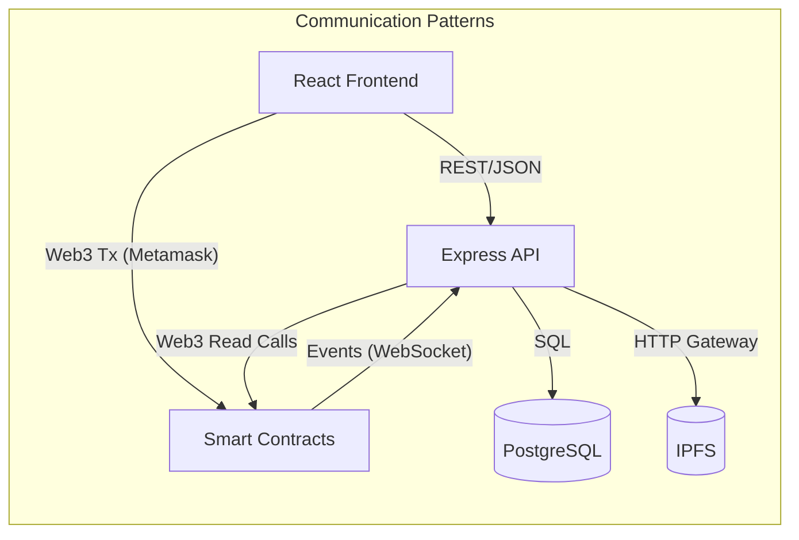
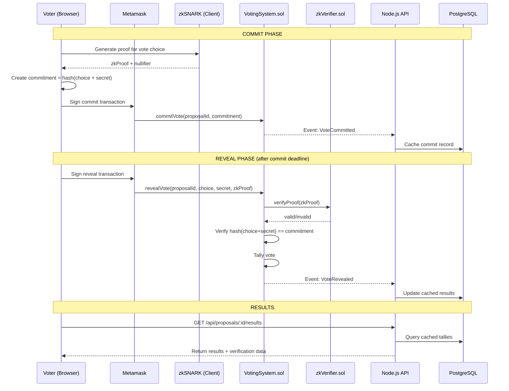
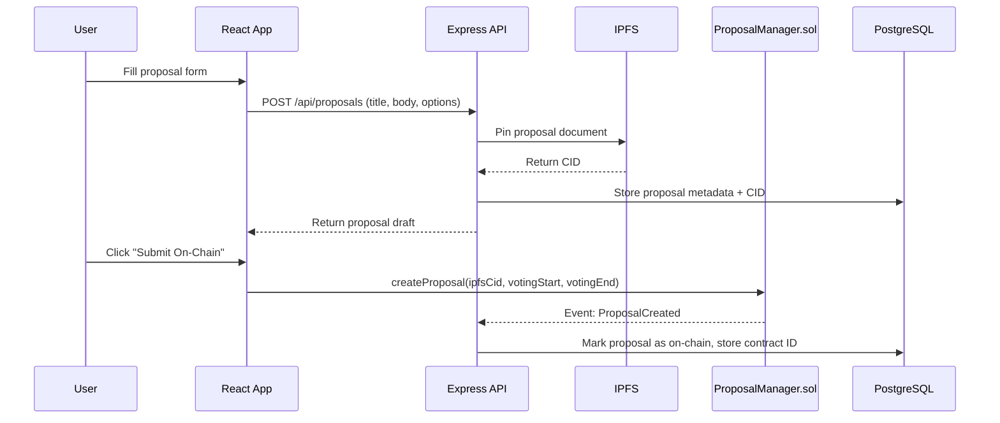

# Voting System - Architecture

## 2.1 Chosen Architectural Pattern

**Pattern: Event-Driven Layered Architecture with On-Chain/Off-Chain Separation**

The system uses a layered architecture split between on-chain (Ethereum smart contracts) and off-chain (Node.js API + PostgreSQL) components, connected by blockchain events.

**Justification:**
- **On-chain layer** handles voting integrity, delegation, and zkSNARK verification — these require trustless execution and immutability.
- **Off-chain layer** handles proposal metadata, user profiles, caching, and IPFS coordination — these need performance and flexibility that blockchains cannot provide cheaply.
- **Event-driven coupling** keeps the two layers loosely connected. The backend listens to contract events (via Web3 subscriptions) and syncs state to PostgreSQL for fast queries.
- This avoids the cost of storing everything on-chain while preserving the trust guarantees where they matter most.

## 2.2 Key Component Interactions

### API Calls (REST)
- **Frontend → Backend:** Proposal CRUD, cached vote results, user profile management, IPFS upload triggers.
- **Frontend → Blockchain (direct):** Vote submission (commit/reveal), delegation transactions, proof verification — all signed via Metamask.

### Blockchain Events (Event-Driven)
- **Contracts → Backend:** The Node.js backend subscribes to contract events:
  - `VoteCommitted(proposalId, voter)` — tracks commit phase progress
  - `VoteRevealed(proposalId, voter, choice)` — updates cached tallies
  - `ProposalCreated(id, creator)` — syncs new proposals to PostgreSQL
  - `DelegationChanged(from, to)` — updates delegation graph cache

### Direct Database Access
- Only the Node.js API layer reads/writes PostgreSQL. No direct DB access from frontend or contracts.

### IPFS Integration
- Proposal documents (full text, amendments) are stored on IPFS.
- The backend pins content and stores CID references in PostgreSQL.
- Contracts store only the IPFS CID hash for on-chain anchoring.

## 2.3 Data Flow

### Voting Flow (Commit-Reveal with zkSNARK)

### Proposal Creation Flow

## 2.4 Scalability & Performance Strategy

### Current Scale Design
- **Single Express API instance** behind a reverse proxy — sufficient for DAO-scale (hundreds to low thousands of concurrent users).
- **PostgreSQL** caches on-chain data for fast reads — avoids expensive RPC calls for listing proposals and viewing results.
- **IPFS** offloads document storage from both the database and blockchain.

### Growth Path
- **Read scaling:** Add Redis cache in front of PostgreSQL for hot data (active proposals, current results).
- **Event processing:** Extract event listener into a separate worker process if event volume grows.
- **Frontend:** Already static (React SPA on IPFS) — scales horizontally by nature.
- **Multi-chain:** Abstract `blockchain.service.js` behind an interface to support L2s (Polygon, Arbitrum) for lower gas costs.

### Performance Considerations
- Commit-reveal is a two-transaction flow — UI must clearly guide users through both phases.
- zkSNARK proof generation happens client-side; proving key must be cached in browser after first download (~15-50MB depending on circuit complexity).
- Batch event processing for catch-up sync when backend restarts.

## 2.5 Security Considerations

### Authentication & Authorization
- **Wallet-based auth:** Users authenticate by signing a challenge message with their Ethereum private key (via Metamask). The backend verifies the signature to derive the wallet address.
- **No passwords:** All identity is tied to Ethereum addresses.
- **Role-based access:** Contract-level roles (admin, voter, delegate) enforced via OpenZeppelin `AccessControl`.

### Smart Contract Security
- **MythX automated auditing:** Run on every CI build to catch reentrancy, integer overflow, and access control issues.
- **Commit-reveal scheme:** Prevents vote buying (votes are hidden during commit phase) and last-minute manipulation (commitments are locked before reveal).
- **zkSNARK verification:** On-chain verifier ensures vote validity without revealing the vote.
- **Solhint + Slither:** Static analysis in CI pipeline.

### Data Protection
- Vote choices are never stored in plaintext on-chain during the commit phase.
- Off-chain PostgreSQL stores only public data (proposals, cached results) — no private keys or vote secrets.
- IPFS content is public by nature; sensitive governance documents should be encrypted before upload.

### API Security
- Rate limiting on all endpoints.
- Input validation via `express-validator` on every route.
- CORS restricted to known frontend origins.
- Helmet.js for HTTP security headers.

### Secret Management
- `.env` files for local development (never committed).
- GitHub Actions secrets for CI/CD (contract deployer private key, Infura API key, PostgreSQL credentials).
- No secrets stored in smart contracts — use environment variables and secure key management.

## 2.6 Error Handling & Logging Philosophy

### Strategy
- **Structured logging** with `winston` — JSON format in production, pretty-print in development.
- **Log levels:** `error` for failures requiring attention, `warn` for degraded states, `info` for business events, `debug` for development.
- **Correlation IDs:** Each API request gets a unique ID propagated through all log entries for traceability.

### Error Handling Layers
1. **Smart contracts:** `require()` statements with descriptive revert messages. Events emitted for all state changes.
2. **API middleware:** Global error handler catches unhandled errors, logs them, and returns consistent JSON error responses (`{ error: { code, message } }`).
3. **Frontend:** React Error Boundaries catch render failures. API errors displayed via toast notifications with retry options.
4. **Blockchain errors:** Web3 transaction failures parsed into user-friendly messages (insufficient gas, rejected by user, contract revert reason).

### Monitoring
- Backend health-check endpoint (`GET /health`) for uptime monitoring.
- Contract event listener heartbeat — alert if event processing falls behind.
- Structured logs shipped to centralized logging (ELK stack or similar) in production.
