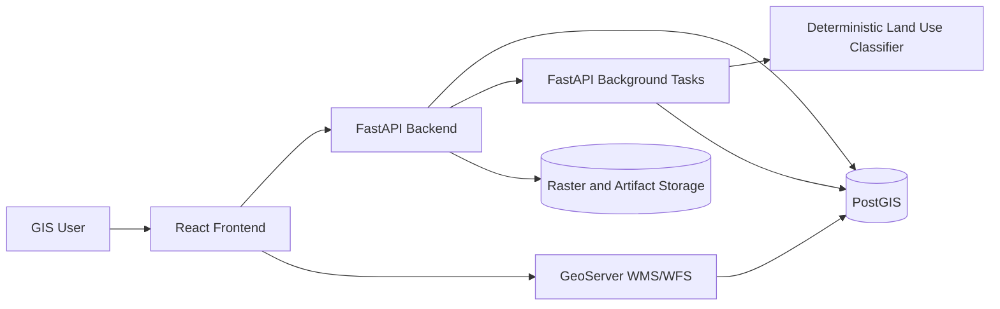
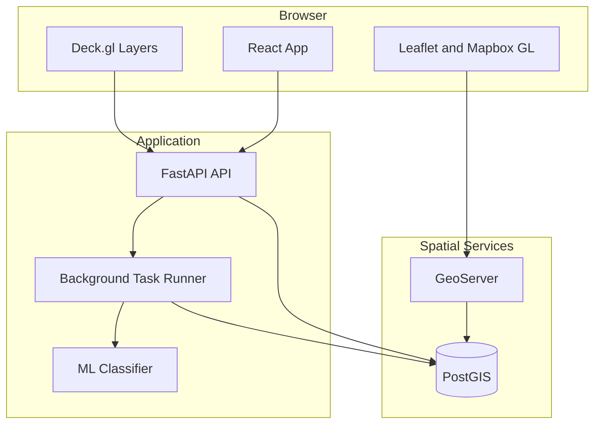
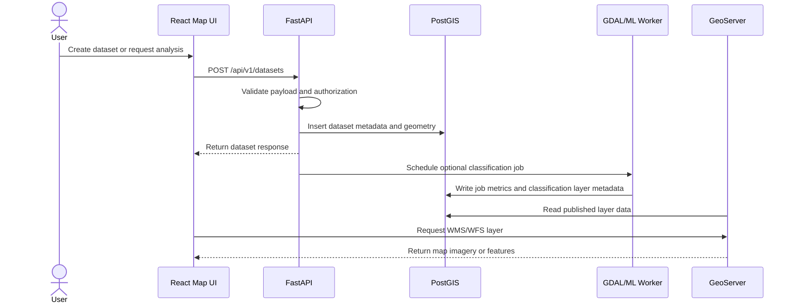

# Geospatial Analytics Platform - Architecture

## 1. Chosen Architectural Pattern

The recommended starting architecture is a modular monolith backed by managed or containerized infrastructure services.

FastAPI owns API orchestration, validation, authorization, spatial business logic, and ML job coordination. PostGIS owns authoritative spatial persistence and query execution. GeoServer exposes interoperable WMS/WFS services from curated layers. React, Leaflet, Mapbox GL, and Deck.gl provide interactive map and WebGL visualization.

This pattern is suitable because the platform has strong domain coupling across datasets, layers, analyses, and jobs. A modular monolith keeps deployment simple on AWS EC2 while preserving clean module boundaries that can later be split into services if ingestion, ML processing, or tile delivery grows independently.

## 2. Key Component Interactions

- The frontend calls FastAPI over REST for dataset metadata, analysis requests, authentication context, and job status.
- The frontend calls GeoServer WMS/WFS endpoints for standards-based map visualization and feature access.
- FastAPI accesses PostGIS through SQLAlchemy for transactional operations and through spatial SQL for analytics.
- GeoServer accesses PostGIS directly through a datastore configured from environment variables during startup.
- Long-running ML classification tasks run through FastAPI background tasks or explicit run endpoints.
- The job service boundary is isolated so AWS SQS or Redis-backed workers can replace in-process background execution later.

## 3. Data Flow

Typical vector dataset flow:

1. A user creates or uploads a dataset from the frontend.
2. FastAPI validates the request and stores metadata.
3. A background job uses GDAL where needed to normalize spatial data.
4. PostGIS stores geometries with SRID constraints and spatial indexes.
5. GeoServer publishes eligible layers through WMS/WFS.
6. The frontend renders metadata from FastAPI and map layers from GeoServer or API-driven Deck.gl data.

## 4. Scalability & Performance Strategy

- Keep PostGIS as the spatial source of truth and tune it with GiST/SP-GiST indexes, partitioning for very large datasets, and query plan review.
- Use GeoServer for interoperable map services and cache rendered tiles with GeoWebCache when read traffic grows.
- Use Deck.gl for high-density browser visualization where WMS tiles are not interactive enough.
- Move heavier GDAL and ML work behind the existing job service boundary as workload grows.
- Store large rasters and ML artifacts outside the relational database, while persisting metadata and derived vector outputs in PostGIS.
- Add read replicas only after query patterns are measured; many GIS bottlenecks are index, projection, and geometry-size problems before they are raw database capacity problems.
- Keep backend modules isolated so ingestion, ML, or map-serving responsibilities can later become separate services.

## 5. Security Considerations

- Authentication should use OIDC/SAML with short-lived access tokens and refresh token policies managed by the identity provider.
- Authorization should be role-based at minimum, with dataset/project ownership checks for sensitive spatial data.
- API input must be validated with Pydantic schemas and constrained geometry handling.
- Use separate database roles for API writes, GeoServer reads, migrations, and administrative operations.
- Protect all production traffic with TLS, strict CORS, rate limits, and request size limits for uploads.
- Keep secrets in AWS Systems Manager Parameter Store, AWS Secrets Manager, or a comparable secret manager. Do not commit production secrets.
- Audit access to sensitive datasets, exports, administrative actions, and ML-derived outputs.

## 6. Error Handling & Logging Philosophy

- Use structured JSON logs with request IDs, user IDs where safe, dataset IDs, job IDs, and correlation IDs.
- Return stable API error shapes with machine-readable error codes and human-readable messages.
- Avoid leaking SQL, filesystem paths, stack traces, or secret values in client responses.
- Treat long-running job failures as first-class states with retry metadata and operator-visible diagnostics.
- Capture frontend errors with source maps in staging and production, while filtering sensitive map payloads.
- Emit metrics for API latency, database query time, job duration, GeoServer response time, and ML inference throughput.
