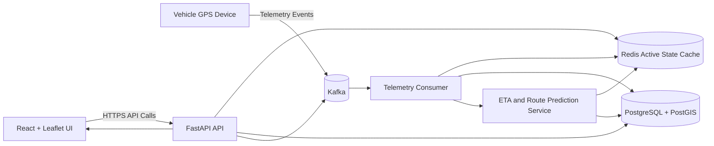
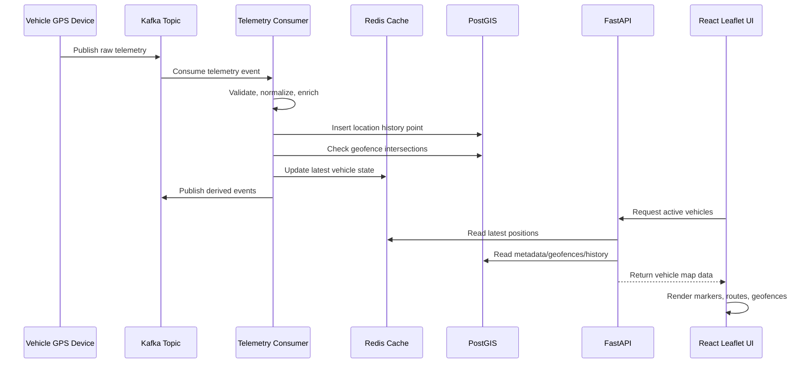

# Fleet Management System Architecture

## 2.1 Chosen Architectural Pattern

The system uses a modular event-driven service architecture:

- FastAPI backend as the primary API boundary.
- Kafka as the telemetry and domain-event backbone.
- PostGIS as the authoritative spatial database.
- Redis as a low-latency cache for active vehicle state and geofence lookups.
- React and Leaflet as the operational UI.
- AWS ECS as the container runtime.

This approach is suitable because fleet tracking has two different traffic profiles: user-driven API requests and high-volume telemetry streams. Keeping the API modular while using Kafka for telemetry ingestion allows the system to scale ingestion independently from read-heavy map and dashboard workflows.

## 2.2 Key Component Interactions

### API Calls

The frontend communicates with FastAPI over HTTPS. API routes are responsible for validation, authorization, response shaping, and delegating business logic to services.

Typical API groups:

- `/health`: service status.
- `/api/v1/vehicles`: vehicle CRUD and current location.
- `/api/v1/geofences`: geofence management.
- `/api/v1/trips`: trip history and playback.
- `/api/v1/routes`: route options, ETA, and prediction results.

### Message Queues

Kafka handles telemetry and asynchronous business events:

- `vehicle.telemetry.received`: raw GPS payloads from devices or gateways.
- `vehicle.location.updated`: normalized location update after validation.
- `geofence.event.detected`: enter/exit/dwell events.
- `route.eta.updated`: ETA calculation updates.

### Direct Database Access

Only backend services and workers access PostGIS directly. The frontend never connects to the database. PostGIS stores authoritative spatial records, historical telemetry, trips, geofences, and prediction snapshots.

### Event Buses

Kafka is the primary event bus. Redis pub/sub or streams may be used later for short-lived real-time UI fan-out, but Kafka remains the durable event log for telemetry workflows.

## 2.3 Data Flow

User-driven data follows a conventional request path:

1. React captures user input such as creating a geofence or editing vehicle metadata.
2. FastAPI validates the request with Pydantic schemas.
3. Service layer enforces business rules.
4. PostGIS stores authoritative records.
5. Redis is invalidated or refreshed for low-latency reads.
6. The API returns a typed response to the UI.

Telemetry data follows an event-driven path:

1. Devices or gateways publish GPS messages to Kafka.
2. Consumers normalize and validate payloads.
3. Latest state is cached in Redis.
4. Historical state is inserted into PostGIS.
5. Geofence checks and ETA recalculation are triggered.

## 2.4 Scalability & Performance Strategy

- Scale FastAPI services horizontally behind an AWS Application Load Balancer.
- Scale Kafka consumers by partitioning telemetry topics by `vehicle_id` or fleet/tenant key.
- Use Redis for current vehicle positions to avoid repeatedly querying hot telemetry rows.
- Use PostGIS GiST indexes for geospatial queries.
- Partition large telemetry tables by time and optionally by tenant/fleet.
- Keep route prediction jobs asynchronous when calculations are expensive.
- Use read replicas for historical analytics when operational reads grow.
- Add WebSocket or server-sent events later for live updates if polling becomes inefficient.

## 2.5 Security Considerations

### Authentication and Authorization

Use OIDC-compatible authentication with JWT access tokens. Enforce tenant and role authorization in the service layer, not only at route boundaries.

### Data Protection

- Encrypt data in transit with TLS.
- Encrypt RDS, Redis, Kafka, and container secrets at rest.
- Treat location history as sensitive operational data.
- Define retention policies for historical traffic and telemetry.

### API Security

- Validate all requests with Pydantic.
- Apply rate limiting to public and device-ingestion endpoints.
- Use CORS allowlists per environment.
- Use request size limits for telemetry ingestion.
- Avoid exposing raw database errors to clients.

### Secret Management

Use AWS Secrets Manager or SSM Parameter Store for production secrets. Local `.env` files are allowed for development only and must not be committed.

## 2.6 Error Handling & Logging Philosophy

Errors should be explicit, structured, and observable:

- API responses use consistent error envelopes with stable codes.
- Backend logs use structured JSON with request IDs, tenant IDs, vehicle IDs, and Kafka offsets where applicable.
- Worker failures should distinguish retryable errors from poison messages.
- Kafka consumers should use dead-letter topics for invalid or repeatedly failing telemetry events.
- Frontend components should show clear loading, empty, and error states.
- Metrics should capture API latency, error rate, Kafka lag, PostGIS query latency, and ETA calculation duration.
