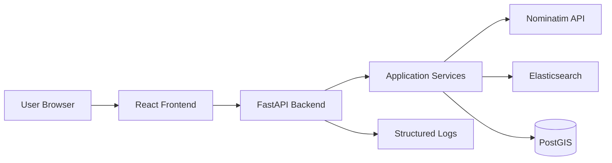
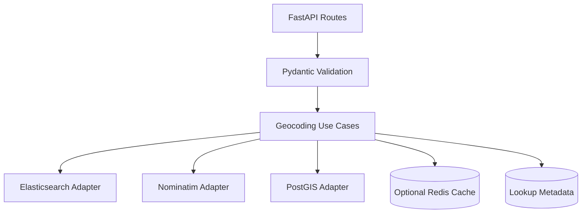
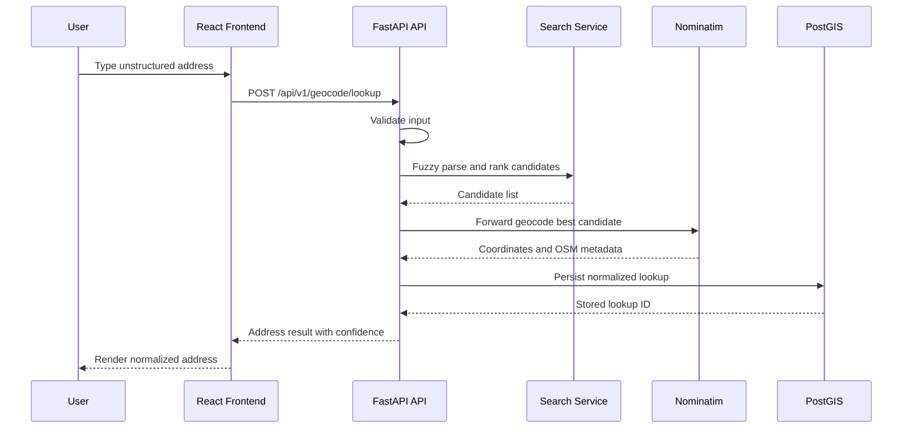
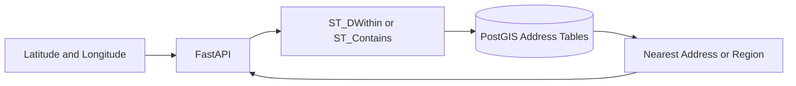
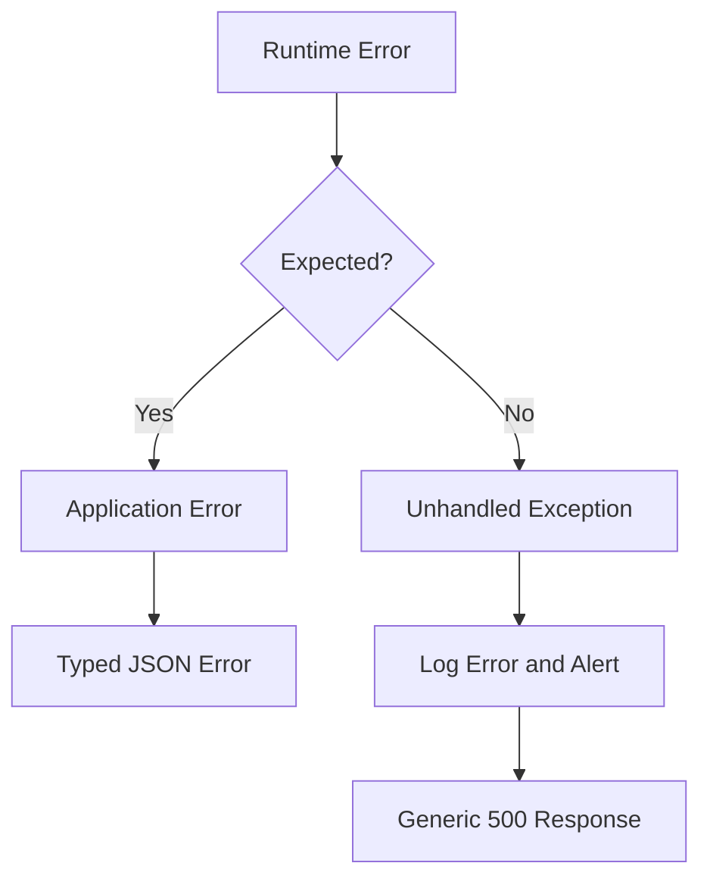

# Address Geocoding Service Architecture

> **Implementation note:** The diagrams below show the originally envisioned design,
> which included Elasticsearch as a dedicated search tier. The implemented MVP instead
> uses PostgreSQL `pg_trgm` trigram similarity for fuzzy search/autocomplete, so the
> "Elasticsearch" nodes map onto the existing PostGIS database. Reintroduce a dedicated
> search engine only if scale or ranking requirements outgrow trigram search.

## 1. Chosen Architectural Pattern

The recommended pattern is a layered modular monolith with external data services.

The backend starts as one FastAPI deployment with clear module boundaries: API routes, application services, data access, and infrastructure adapters. This is suitable because the domain is cohesive, the team can move quickly, and operational complexity stays low while still allowing heavy dependencies such as PostGIS, Elasticsearch, and Nominatim to scale independently.

If usage grows, the highest-pressure modules can later be extracted into independent services: search indexing, batch import, cache warming, and analytics.

## 2. Key Component Interactions

- React communicates with FastAPI through HTTPS JSON APIs.
- FastAPI routes validate requests with Pydantic schemas and delegate business rules to services.
- The geocoding service calls Nominatim for OpenStreetMap forward geocoding.
- The search service uses Elasticsearch for fuzzy parsing, autocomplete, and candidate ranking.
- The reverse geocoding service queries PostGIS directly for spatial lookup operations.
- A future asynchronous worker can subscribe to events for indexing, analytics, or cache warming.

## 3. Data Flow

Typical address lookup:

1. A user enters an unstructured address in the React UI.
2. The frontend calls `/api/v1/geocode/lookup`.
3. FastAPI validates the request and attaches request context.
4. Elasticsearch produces normalized candidates and fuzzy matches.
5. Nominatim resolves the best candidate to geographic coordinates.
6. PostGIS stores the lookup result and supports spatial enrichment.
7. The API returns normalized address data, confidence score, and coordinates.

Reverse geocoding:

## 4. Scalability & Performance Strategy

- Keep FastAPI stateless so multiple instances can run behind Nginx or an AWS load balancer.
- Use async HTTP clients and database drivers where practical to prevent blocking under load.
- Cache frequent Nominatim lookups to reduce upstream latency and respect usage policies.
- Use Elasticsearch index aliases for zero-downtime reindexing.
- Partition or archive lookup history if write volume becomes high.
- Add database indexes for spatial geometry, normalized address text, and provider IDs.
- Use connection pooling for PostGIS and bounded concurrency for Nominatim calls.
- Define latency budgets for autocomplete, lookup, and reverse geocoding separately.

## 5. Security Considerations

### Authentication and Authorization

- Use API keys or OAuth2 bearer tokens for production API clients.
- Apply role-based access to administrative endpoints such as reindexing or metrics.
- Keep public lookup endpoints rate limited even when unauthenticated access is allowed.

### Data Protection

- Avoid storing raw user input longer than the business requires.
- Store lookup history with retention policies and clear ownership metadata.
- Use TLS for browser-to-API and service-to-service traffic.
- Encrypt production database volumes and backups.

### API Security

- Validate all request bodies with Pydantic.
- Enforce request size limits for unstructured address input.
- Add rate limiting per IP and per API key.
- Return generic error messages to clients while logging detailed server context.

### Secret Management

- Never commit secrets to git.
- Use GitHub Actions secrets for CI/CD.
- Use AWS Systems Manager Parameter Store or AWS Secrets Manager on EC2.
- Inject configuration through environment variables.

## 6. Error Handling & Logging Philosophy

- Use typed application exceptions for expected failures such as validation failure, no match, upstream timeout, and provider rate limit.
- Convert exceptions to consistent JSON error responses at the API boundary.
- Include request IDs in every log line and API response header.
- Log structured JSON in production with fields for route, status code, latency, client ID, provider, and error category.
- Treat Nominatim, Elasticsearch, and PostGIS failures as independently observable dependencies.
- Never log secrets, full authorization headers, or sensitive user metadata.

