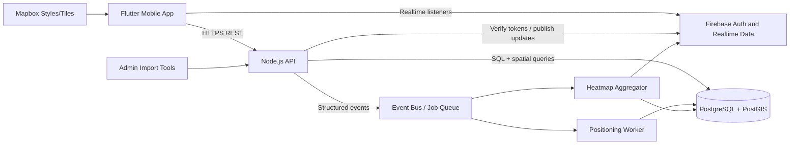
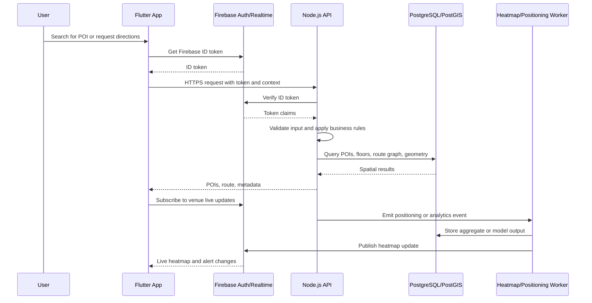

# Indoor Mapping App - Architecture

## 1. Chosen Architectural Pattern

The recommended starting point is a **modular monolith backend with event-driven
extensions**.

The Node.js API should begin as one deployable service with clear internal
modules for venues, POIs, route graphs, positioning, heatmaps, and user context.
This keeps the operational footprint manageable while the domain model is still
evolving. PostgreSQL/PostGIS remains the system of record for spatial data.
Firebase is used for authentication integration, real-time updates, push
notifications, and mobile-friendly live data channels.

As traffic grows, high-volume workloads can be split out without changing the
mobile contract:

- Positioning event ingestion and ML inference can move to dedicated workers.
- Heatmap aggregation can move to scheduled or stream-processing jobs.
- Venue import tooling can become a separate admin service.
- Read-heavy POI and route queries can gain cache layers or read replicas.

## 2. Key Component Interactions

### Flutter Mobile App

- Calls the Node.js API for POI search, venue metadata, route requests, and
  positioning event submission.
- Uses Mapbox SDK for map rendering, indoor layers, floor switching, and route
  overlays.
- Uses Firebase Authentication for identity and obtains ID tokens for API calls.
- Subscribes to Firebase real-time channels for crowd heatmaps, alerts, route
  closures, and venue updates.

### Node.js API

- Exposes REST endpoints for mobile and future admin clients.
- Verifies Firebase ID tokens before accessing user-specific or write endpoints.
- Uses service classes for business rules and repositories/database modules for
  data access.
- Writes structured operational events to a job queue for expensive asynchronous
  work.

### PostgreSQL/PostGIS

- Stores venues, floors, POIs, geometry, route graph nodes/edges, beacon anchors,
  WiFi fingerprints, anonymized positioning events, and heatmap cells.
- Provides spatial indexes for fast containment, nearest-neighbor, path, and
  intersection queries.

### Firebase

- Handles authentication and token issuance.
- Provides real-time fanout for frequently changing data that does not need to be
  queried geospatially by the client.
- Stores operational live state such as venue alerts, floor crowd levels, and
  route disruptions.

### Event Bus and Workers

- Receives events from the API for positioning, heatmap aggregation, and import
  tasks.
- Allows CPU-heavy or bursty work to scale independently from user-facing API
  latency.
- Can be implemented first with a managed queue, BullMQ/Redis, Cloud Tasks, or a
  cloud-native event system depending on deployment constraints.

## 3. Data Flow

The common read path starts in the mobile app. The app sends the user's search
term, venue, floor, and optional location context to the API. The API validates
the request, executes spatial queries in PostGIS, and returns ranked POIs. Live
crowd updates are delivered separately through Firebase listeners.

## 4. Scalability and Performance Strategy

- Keep mobile API responses coarse enough for low-latency mobile networks, but
  avoid over-fetching full venue datasets by default.
- Use PostGIS `GIST` indexes for geometry columns and targeted B-tree indexes for
  venue, floor, category, and status filters.
- Cache stable venue metadata and POI categories at the API or CDN edge.
- Use Firebase real-time fanout for live operational state instead of polling.
- Batch positioning events on the device and ingest them asynchronously where
  possible.
- Separate hot paths:
  - API handles validation and synchronous reads.
  - Workers handle ML positioning inference, model updates, and heatmap
    aggregation.
  - PostgreSQL read replicas can serve high-volume search and routing queries.
- Track slow spatial queries with `EXPLAIN ANALYZE` during performance testing.

## 5. Security Considerations

### Authentication and Authorization

- Use Firebase Authentication for mobile identity.
- Require Firebase ID tokens on all user-specific, write, and analytics
  endpoints.
- Map token claims to application roles such as user, venue operator, admin, and
  support.
- Enforce venue-level authorization in the API service layer, not only in route
  handlers.

### Data Protection

- Treat raw positioning data as sensitive.
- Store the minimum viable user identifier for navigation history and analytics.
- Use anonymization or pseudonymization for heatmap aggregation.
- Define retention windows for raw WiFi/BLE scans and location events.
- Encrypt data in transit with TLS and use managed database encryption at rest.

### API Security

- Validate all request bodies and query parameters with schemas.
- Rate-limit positioning ingest, search, login-adjacent, and admin endpoints.
- Avoid exposing raw SQL errors to clients.
- Restrict CORS to approved web/admin origins when browser clients are added.
- Use parameterized SQL for every database query.

### Secret Management

- Do not commit real Firebase service account keys, Mapbox tokens, or database
  credentials.
- Use Codemagic and cloud secret stores for CI/CD secrets.
- Use separate credentials per environment.
- Rotate production credentials and revoke leaked tokens immediately.

## 6. Error Handling and Logging Philosophy

- Return stable API error shapes with `code`, `message`, and optional
  `details`.
- Use domain-specific errors in services, then translate them to HTTP responses
  at the middleware boundary.
- Log structured JSON on the backend with request IDs, user IDs where allowed,
  venue IDs, latency, route name, and error codes.
- Avoid logging raw WiFi/BLE scans, access tokens, precise user coordinates, or
  other sensitive payloads.
- Use Flutter error boundaries and crash reporting for uncaught exceptions.
- Report recoverable mobile failures with clear retry states: offline,
  permission denied, positioning unavailable, map style unavailable, and route
  stale.
- Alert on symptoms that affect users: elevated 5xx rate, slow POI search,
  failed route generation, queue backlog, Firebase publish failures, and mobile
  crash spikes.
