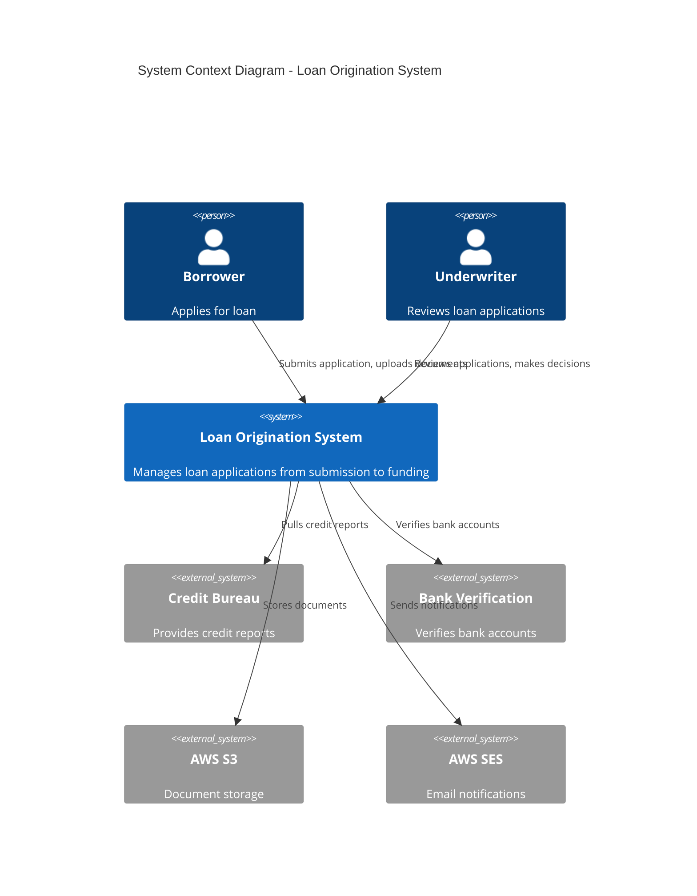
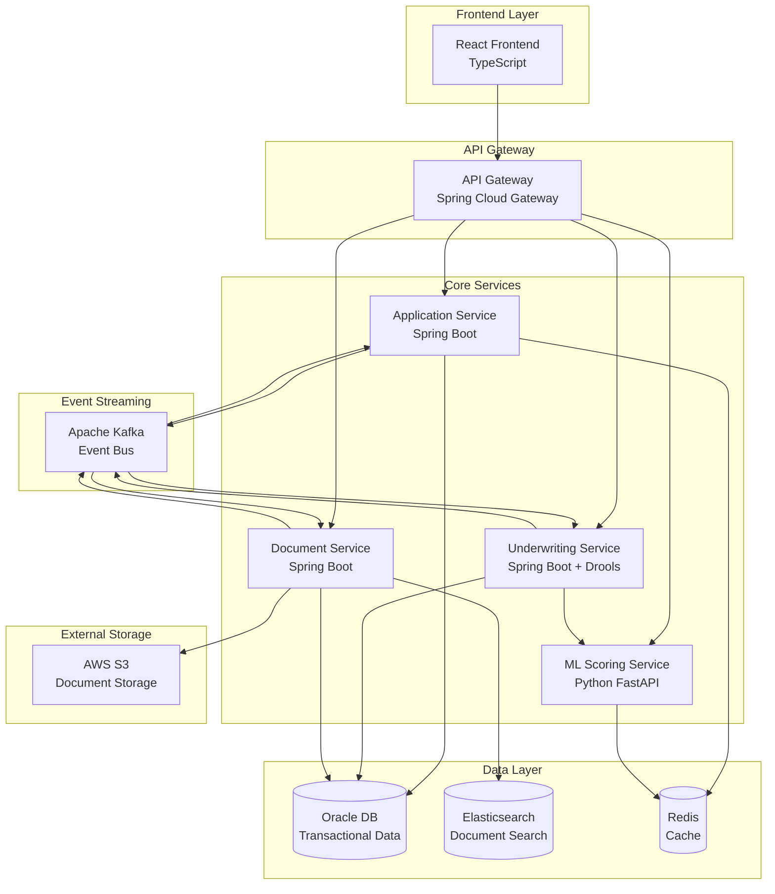
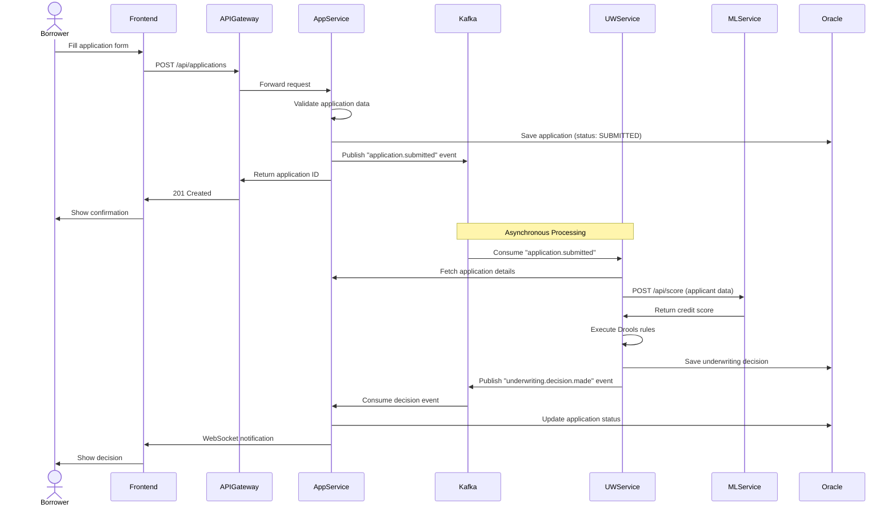
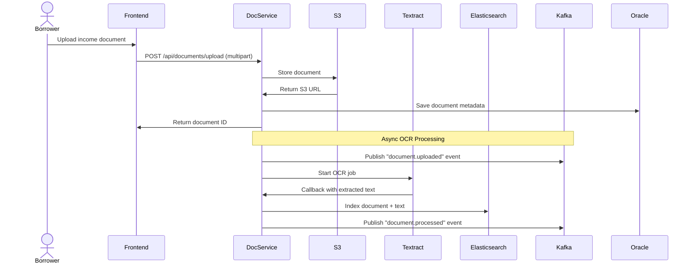
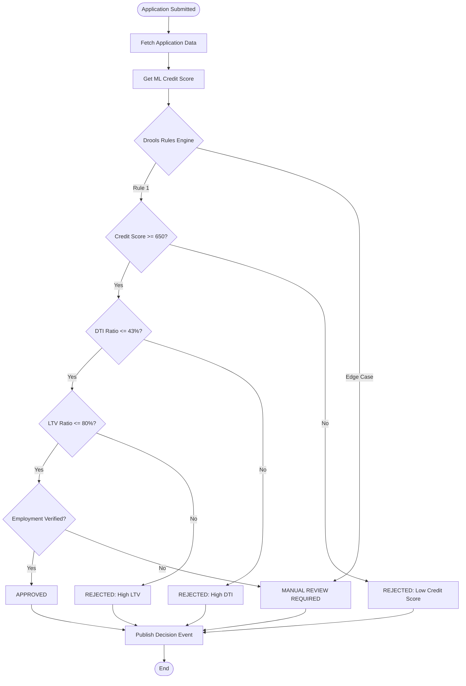
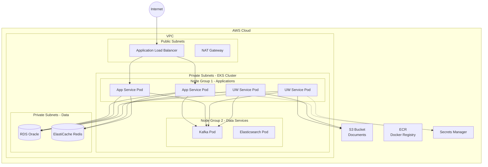

# Loan Origination System - Architecture Documentation

## 1. Chosen Architectural Pattern: **Event-Driven Microservices with CQRS**

### Pattern Overview
The Loan Origination System employs an **Event-Driven Microservices Architecture** with **Command Query Responsibility Segregation (CQRS)** for complex loan processing workflows.

### Justification

**Why Event-Driven?**
- Loan origination is inherently an asynchronous, multi-stage process
- Events provide natural audit trail for regulatory compliance
- Enables loose coupling between application submission, underwriting, and funding
- Supports complex business workflows with multiple decision points
- Facilitates integration with external systems (credit bureaus, bank verification)

**Why Microservices?**
- Allows independent scaling of computationally intensive components (ML scoring, document processing)
- Different teams can own different services (application management, underwriting, document management)
- Technology flexibility (Java for business logic, Python for ML)
- Fault isolation - underwriting service failure doesn't block application submission

**Why CQRS?**
- Write operations (loan applications) require strong consistency and complex validation
- Read operations (dashboards, reporting) need high performance with denormalized data
- Separate read/write paths enable optimized data models for each use case
- Event sourcing provides complete audit history of loan decisions

---

## 2. System Architecture Overview



---

## 3. Component Architecture



### 3.1 Service Responsibilities

#### Application Service
- **Purpose:** Manage loan application lifecycle
- **Responsibilities:**
  - Accept and validate loan applications
  - Store applicant information
  - Orchestrate application workflow
  - Emit application events
- **Technology:** Spring Boot, Spring Data JPA, Oracle
- **Scaling:** Horizontally scalable (stateless)

#### Underwriting Service
- **Purpose:** Automated and manual underwriting decisions
- **Responsibilities:**
  - Execute Drools rules engine for policy evaluation
  - Integrate ML credit scoring
  - Make approve/deny/refer decisions
  - Route edge cases to manual review queue
- **Technology:** Spring Boot, Drools, Kafka
- **Scaling:** Horizontally scalable, CPU-intensive

#### Document Service
- **Purpose:** Document management and search
- **Responsibilities:**
  - Handle document uploads (income statements, IDs, bank statements)
  - Index documents in Elasticsearch
  - OCR processing for document data extraction
  - Full-text search across documents
- **Technology:** Spring Boot, Elasticsearch, AWS S3, AWS Textract
- **Scaling:** Horizontally scalable, I/O-intensive

#### ML Scoring Service
- **Purpose:** Credit risk scoring using machine learning
- **Responsibilities:**
  - Serve XGBoost model predictions
  - Calculate credit risk score (0-1000)
  - Provide feature importance for explainability
  - Model versioning and A/B testing
- **Technology:** Python, FastAPI, XGBoost, scikit-learn
- **Scaling:** Horizontally scalable, model serving optimized

---

## 4. Key Component Interactions

### 4.1 Synchronous Communication (REST APIs)
- Frontend ↔ API Gateway: HTTPS REST
- API Gateway ↔ Services: Internal REST APIs
- Underwriting Service ↔ ML Service: REST (credit score request)
- Document Service ↔ AWS S3: AWS SDK

### 4.2 Asynchronous Communication (Kafka Events)
- Application Service → Kafka: `application.submitted`, `application.updated`
- Underwriting Service → Kafka: `underwriting.decision.made`, `underwriting.manual.review.required`
- Document Service → Kafka: `document.uploaded`, `document.processed`
- All Services ← Kafka: Event consumers for CQRS read models

### 4.3 Database Access
- Each service owns its database schema (microservices pattern)
- No cross-service database queries (enforce bounded contexts)
- Oracle database partitioned by service schema

### 4.4 Event Bus (Kafka)
- Central nervous system for event-driven communication
- All state changes published as events
- Enables event sourcing and audit trail
- Dead-letter queues for failed event processing

---

## 5. Data Flow Diagrams

### 5.1 Loan Application Submission Flow



### 5.2 Document Upload & Processing Flow



### 5.3 Underwriting Decision Flow with Drools



---

## 6. Scalability & Performance Strategy

### 6.1 Horizontal Scaling
- All services are **stateless** and can scale horizontally on Kubernetes
- Kubernetes Horizontal Pod Autoscaler (HPA) based on CPU/memory metrics
- Target: 70% CPU utilization triggers auto-scaling

### 6.2 Database Scaling
- **Oracle RAC** (Real Application Clusters) for high availability
- **Read replicas** for read-heavy queries (reporting, dashboards)
- **Partitioning** by date (monthly partitions for historical data)
- **Indexing strategy:**
  - B-tree indexes on foreign keys and query predicates
  - Function-based indexes for computed columns

### 6.3 Caching Strategy
- **Redis** for frequently accessed data:
  - User sessions (TTL: 30 minutes)
  - Loan product configurations (TTL: 1 hour)
  - ML model predictions (TTL: 5 minutes)
- **Cache invalidation:** Event-driven (Kafka events trigger cache eviction)

### 6.4 Kafka Performance
- **Partitioning strategy:** Partition by application ID for ordering guarantees
- **Replication factor:** 3 (fault tolerance)
- **Consumer groups:** One per service for load distribution
- **Retention:** 7 days for replay capability

### 6.5 Elasticsearch Performance
- **Sharding:** 5 primary shards per index
- **Replica shards:** 1 replica for high availability
- **Index rollover:** Monthly indices with aliases
- **Query optimization:** Use filters over queries for cacheable results

### 6.6 Performance Targets
| Metric | Target |
|--------|--------|
| API response time (p95) | < 500ms |
| Loan application submission | < 2 seconds |
| Automated underwriting decision | < 30 seconds |
| Document upload | < 5 seconds |
| Search query response | < 200ms |
| System throughput | 1000 applications/hour |

---

## 7. Security Considerations

### 7.1 Authentication & Authorization
- **OAuth 2.0 + JWT** for API authentication
- **Keycloak** as identity provider (self-hosted)
- **Role-Based Access Control (RBAC):**
  - `BORROWER`: Submit applications, view own applications
  - `UNDERWRITER`: Review applications, make decisions
  - `ADMIN`: System configuration, user management
- **Token expiration:** Access tokens (15 min), refresh tokens (7 days)

### 7.2 Data Protection
- **Encryption at rest:**
  - Oracle Transparent Data Encryption (TDE)
  - S3 bucket encryption (AES-256)
  - Elasticsearch encryption plugin
- **Encryption in transit:**
  - TLS 1.3 for all API calls
  - Kafka SSL/TLS for inter-service communication
- **PII data handling:**
  - Masking in logs (SSN, bank account numbers)
  - Field-level encryption for sensitive data
  - Data retention policies (GDPR compliance)

### 7.3 API Security
- **API Gateway rate limiting:** 100 requests/minute per user
- **DDoS protection:** AWS WAF + Shield
- **Input validation:** JSR-303 Bean Validation
- **SQL injection prevention:** Prepared statements (JPA)
- **CORS policy:** Whitelist frontend domain only

### 7.4 Secret Management
- **AWS Secrets Manager** for storing:
  - Database credentials
  - API keys (third-party integrations)
  - Kafka credentials
- **Kubernetes secrets** for service-to-service auth
- **Secret rotation:** Automated 90-day rotation

### 7.5 Audit Trail
- All loan decisions logged to immutable audit log
- Kafka events provide complete event history
- Elasticsearch audit index for compliance queries
- Retention: 7 years (regulatory requirement)

---

## 8. Error Handling & Logging Philosophy

### 8.1 Error Handling Strategy

#### Service-Level Error Handling
```java
// Global exception handler in Spring Boot
@RestControllerAdvice
public class GlobalExceptionHandler {
    
    @ExceptionHandler(BusinessRuleException.class)
    public ResponseEntity<ErrorResponse> handleBusinessRule(BusinessRuleException ex) {
        // 400 Bad Request for business rule violations
        return ResponseEntity.badRequest().body(new ErrorResponse(ex.getMessage()));
    }
    
    @ExceptionHandler(ResourceNotFoundException.class)
    public ResponseEntity<ErrorResponse> handleNotFound(ResourceNotFoundException ex) {
        // 404 Not Found
        return ResponseEntity.notFound().build();
    }
    
    @ExceptionHandler(Exception.class)
    public ResponseEntity<ErrorResponse> handleGeneric(Exception ex) {
        // 500 Internal Server Error (log full stack trace)
        log.error("Unexpected error", ex);
        return ResponseEntity.internalServerError()
            .body(new ErrorResponse("An unexpected error occurred"));
    }
}
```

#### Kafka Error Handling
- **Retry mechanism:** Exponential backoff (3 attempts)
- **Dead-Letter Queue (DLQ):** Failed messages routed to DLQ topic
- **Idempotent consumers:** Use unique message IDs to prevent duplicate processing
- **Circuit breaker:** Stop consuming if error rate > 50%

#### Drools Error Handling
- Rules wrapped in try-catch to prevent rule failures from crashing the engine
- Rule execution failures logged with rule name and application ID
- Fallback: Route to manual review if rules fail

### 8.2 Logging Strategy

#### Log Levels
- **ERROR:** System failures, unrecoverable errors
- **WARN:** Degraded functionality, fallback to manual review
- **INFO:** Business events (application submitted, decision made)
- **DEBUG:** Detailed troubleshooting (disabled in production)

#### Structured Logging
```json
{
  "timestamp": "2026-02-16T10:30:00Z",
  "level": "INFO",
  "service": "underwriting-service",
  "traceId": "abc123",
  "spanId": "xyz789",
  "applicationId": "LA-2026-001234",
  "event": "underwriting.decision.made",
  "decision": "APPROVED",
  "creditScore": 720,
  "executionTimeMs": 450
}
```

#### Log Aggregation
- **ELK Stack (Elasticsearch, Logstash, Kibana)**
- Logs shipped from containers to Logstash
- Centralized Elasticsearch cluster for log storage
- Kibana dashboards for log analysis

#### Distributed Tracing
- **Spring Cloud Sleuth + Zipkin**
- Every request gets unique `traceId`
- Trace propagated across service boundaries
- Visualize end-to-end request flow

### 8.3 Monitoring & Alerting

#### Metrics (Prometheus)
- **Application metrics:** Request rate, error rate, latency (RED metrics)
- **Business metrics:** Applications submitted, approval rate, avg decision time
- **Infrastructure metrics:** CPU, memory, disk, network

#### Alerts (Alertmanager)
- **Critical:** Service down, database connection pool exhausted
- **Warning:** High error rate (>5%), slow response time (>1s p95)
- **Info:** Deployment completed, scale-up triggered

#### Dashboards (Grafana)
- **Operational dashboard:** Service health, request rates, error rates
- **Business dashboard:** Daily applications, approval rates, revenue projections
- **Infrastructure dashboard:** Kubernetes cluster health, resource utilization

---

## 9. Deployment Architecture (AWS EKS)



### Deployment Specifications
- **EKS Version:** 1.28
- **Node Groups:**
  - Application nodes: t3.xlarge (4 vCPU, 16 GB RAM) - Auto-scaling 3-10 nodes
  - Data services nodes: r6i.xlarge (4 vCPU, 32 GB RAM) - Fixed 3 nodes
- **Storage:** EBS gp3 volumes for persistent data
- **Networking:** VPC with 3 availability zones for high availability

---

## 10. Architecture Decision Records (ADRs)

### ADR-001: Use Drools for Underwriting Rules
**Decision:** Use Drools rules engine instead of hardcoded business logic.
**Rationale:**
- Business rules change frequently (regulatory updates)
- Non-technical underwriters need to modify rules
- Drools provides declarative rule syntax (easier to audit)
- Supports complex rule chaining and inference

### ADR-002: Use Kafka for Event Sourcing
**Decision:** Use Apache Kafka as event store and message bus.
**Rationale:**
- High throughput (millions of events/day)
- Durable event log (replay capability)
- Decouples services (async communication)
- Native support for event-driven architectures

### ADR-003: Separate ML Service from Core Application
**Decision:** Deploy ML scoring as separate Python service.
**Rationale:**
- Python ecosystem superior for ML (XGBoost, scikit-learn)
- Independent scaling of ML inference
- Model deployment without redeploying core services
- Different release cycles for model vs. application

### ADR-004: Use Elasticsearch for Document Search
**Decision:** Use Elasticsearch instead of Oracle full-text search.
**Rationale:**
- Superior full-text search capabilities
- Scales horizontally for large document corpus
- Rich query DSL for complex searches
- Better performance for unstructured text

---

## 11. Future Architecture Evolution

### Phase 2 Enhancements
- **GraphQL API** for flexible frontend queries
- **Service mesh** (Istio) for advanced traffic management
- **Feature flags** (LaunchDarkly) for gradual rollouts
- **Real-time analytics** (Apache Flink) for fraud detection

### Phase 3 Enhancements
- **Multi-region deployment** for disaster recovery
- **Blockchain** for immutable loan history (regulatory compliance)
- **AI-powered document verification** (reduce manual review)
- **Open banking integration** for real-time income verification
