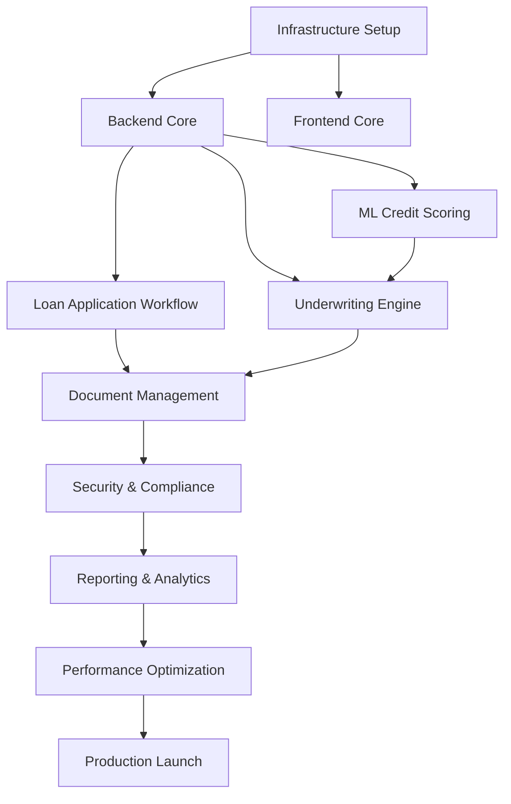

# Loan Origination System - Project Plan

## 1. Project File Structure

```
loan-origination-system/
├── backend/                                    # Spring Boot backend
│   ├── src/
│   │   ├── main/
│   │   │   ├── java/com/loanorigination/
│   │   │   │   ├── controller/                # REST controllers
│   │   │   │   │   ├── LoanApplicationController.java
│   │   │   │   │   ├── UnderwritingController.java
│   │   │   │   │   └── DocumentController.java
│   │   │   │   ├── service/                   # Business logic
│   │   │   │   │   ├── LoanApplicationService.java
│   │   │   │   │   ├── UnderwritingService.java
│   │   │   │   │   ├── CreditScoringService.java
│   │   │   │   │   └── DocumentService.java
│   │   │   │   ├── repository/                # JPA repositories
│   │   │   │   │   ├── LoanApplicationRepository.java
│   │   │   │   │   └── ApplicantRepository.java
│   │   │   │   ├── model/                     # JPA entities
│   │   │   │   │   ├── LoanApplication.java
│   │   │   │   │   ├── Applicant.java
│   │   │   │   │   └── UnderwritingDecision.java
│   │   │   │   ├── dto/                       # Data Transfer Objects
│   │   │   │   │   ├── LoanApplicationDto.java
│   │   │   │   │   └── UnderwritingResultDto.java
│   │   │   │   ├── config/                    # Configuration classes
│   │   │   │   │   ├── KafkaConfig.java
│   │   │   │   │   ├── DroolsConfig.java
│   │   │   │   │   ├── ElasticsearchConfig.java
│   │   │   │   │   └── SecurityConfig.java
│   │   │   │   ├── kafka/                     # Kafka producers/consumers
│   │   │   │   │   ├── LoanEventProducer.java
│   │   │   │   │   └── LoanEventConsumer.java
│   │   │   │   ├── drools/                    # Drools rules engine
│   │   │   │   │   └── UnderwritingRulesService.java
│   │   │   │   ├── ml/                        # ML integration
│   │   │   │   │   └── CreditScoringClient.java
│   │   │   │   └── LoanOriginationApplication.java
│   │   │   └── resources/
│   │   │       ├── application.yml
│   │   │       ├── application-dev.yml
│   │   │       ├── application-staging.yml
│   │   │       ├── application-prod.yml
│   │   │       ├── drools/                    # Drools rule files
│   │   │       │   ├── underwriting-rules.drl
│   │   │       │   └── credit-policy-rules.drl
│   │   │       └── db/migration/              # Flyway migrations
│   │   │           ├── V1__create_loan_application_tables.sql
│   │   │           └── V2__create_underwriting_tables.sql
│   │   └── test/
│   │       └── java/com/loanorigination/
│   │           ├── controller/
│   │           ├── service/
│   │           └── integration/
│   ├── pom.xml
│   └── Dockerfile
│
├── frontend/                                   # React TypeScript frontend
│   ├── src/
│   │   ├── components/
│   │   │   ├── LoanApplicationForm.tsx
│   │   │   ├── DocumentUpload.tsx
│   │   │   └── UnderwritingDashboard.tsx
│   │   ├── services/
│   │   │   ├── api.ts
│   │   │   └── loanService.ts
│   │   ├── types/
│   │   │   └── loan.types.ts
│   │   ├── hooks/
│   │   │   └── useLoanApplication.ts
│   │   ├── App.tsx
│   │   └── index.tsx
│   ├── public/
│   ├── package.json
│   ├── tsconfig.json
│   └── Dockerfile
│
├── ml-service/                                 # Python ML service for credit scoring
│   ├── src/
│   │   ├── api/
│   │   │   └── scoring_api.py
│   │   ├── models/
│   │   │   └── xgboost_model.py
│   │   └── main.py
│   ├── models/                                 # Trained model artifacts
│   │   └── credit_scoring_model.pkl
│   ├── requirements.txt
│   └── Dockerfile
│
├── infrastructure/                             # Infrastructure as Code
│   ├── kubernetes/                            # K8s manifests
│   │   ├── namespace.yaml
│   │   ├── backend-deployment.yaml
│   │   ├── frontend-deployment.yaml
│   │   ├── ml-service-deployment.yaml
│   │   ├── kafka-statefulset.yaml
│   │   ├── elasticsearch-statefulset.yaml
│   │   ├── configmap.yaml
│   │   └── ingress.yaml
│   ├── terraform/                             # AWS infrastructure
│   │   ├── main.tf
│   │   ├── eks.tf
│   │   ├── rds.tf
│   │   ├── vpc.tf
│   │   └── variables.tf
│   └── jenkins/
│       └── Jenkinsfile
│
├── .github/workflows/                          # GitHub Actions CI/CD
│   ├── backend-ci.yml
│   ├── frontend-ci.yml
│   └── deploy.yml
│
├── docs/                                       # Documentation
│   ├── PROJECT-PLAN.md
│   ├── ARCHITECTURE.md
│   ├── TECH-NOTES.md
│   └── API.md
│
├── .env.example                                # Environment template
├── .gitignore
├── docker-compose.yml                          # Local development
└── README.md
```

## 2. Implementation TODO List

### Phase 1: Foundation (Weeks 1-3) - HIGH PRIORITY

#### Infrastructure Setup
- [ ] Set up AWS EKS cluster using Terraform
- [ ] Configure VPC, subnets, and security groups
- [ ] Provision RDS Oracle database instance
- [ ] Set up Kafka cluster on EKS (using Strimzi operator)
- [ ] Deploy Elasticsearch cluster
- [ ] Configure AWS ECR for Docker image registry
- [ ] Set up Jenkins CI/CD server

#### Backend Core
- [ ] Initialize Spring Boot project with required dependencies
- [ ] Configure Spring Data JPA with Oracle
- [ ] Implement database migration with Flyway
- [ ] Create core domain models (LoanApplication, Applicant, UnderwritingDecision)
- [ ] Set up Drools rules engine configuration
- [ ] Configure Kafka producers and consumers
- [ ] Implement Elasticsearch document indexing
- [ ] Create basic REST API endpoints for loan applications

#### Frontend Core
- [ ] Initialize React TypeScript project with Vite
- [ ] Set up routing with React Router
- [ ] Create base layout and navigation components
- [ ] Implement API client service layer
- [ ] Set up state management (React Query/Redux)

#### Development Environment
- [ ] Create docker-compose for local development
- [ ] Configure environment variable management
- [ ] Set up code linting (ESLint, Checkstyle)
- [ ] Configure unit testing frameworks (JUnit, Jest)

---

### Phase 2: Core Features (Weeks 4-8) - MEDIUM PRIORITY

#### Loan Application Workflow
- [ ] Implement loan application submission endpoint
- [ ] Create multi-step application form in frontend
- [ ] Add applicant information capture
- [ ] Implement loan product selection logic
- [ ] Create validation rules for application data
- [ ] Emit Kafka events for application lifecycle (submitted, in-review, approved, rejected)

#### Underwriting Engine
- [ ] Define Drools rules for underwriting policies
  - [ ] Credit score thresholds
  - [ ] Debt-to-income ratio rules
  - [ ] Loan-to-value ratio rules
  - [ ] Employment verification rules
- [ ] Integrate Drools rules execution in UnderwritingService
- [ ] Create automated underwriting decision workflow
- [ ] Implement manual underwriting queue for edge cases

#### ML Credit Scoring Service
- [ ] Build Python FastAPI service for ML predictions
- [ ] Train XGBoost model on historical loan data
- [ ] Create model versioning and rollback strategy
- [ ] Implement REST API for credit score predictions
- [ ] Add model monitoring and drift detection

#### Document Management
- [ ] Implement document upload API (income verification, ID, bank statements)
- [ ] Index documents in Elasticsearch
- [ ] Create full-text search functionality
- [ ] Implement document OCR integration (AWS Textract)
- [ ] Build document viewer component in frontend

#### Event Sourcing
- [ ] Design event schemas for all loan lifecycle events
- [ ] Implement Kafka event producers across services
- [ ] Create event consumers for audit log
- [ ] Build event replay mechanism for debugging
- [ ] Implement CQRS pattern for read-optimized queries

---

### Phase 3: Advanced Features (Weeks 9-12) - MEDIUM PRIORITY

#### Security & Compliance
- [ ] Implement OAuth2/JWT authentication
- [ ] Add role-based access control (RBAC)
- [ ] Implement audit logging for all sensitive operations
- [ ] Add data encryption at rest and in transit
- [ ] Implement PII data masking in logs
- [ ] Add GDPR compliance features (data export, deletion)

#### Workflow & Notifications
- [ ] Create loan application status dashboard
- [ ] Implement email notifications for application status changes
- [ ] Add SMS notifications integration (AWS SNS)
- [ ] Create webhook system for third-party integrations
- [ ] Implement SLA tracking for underwriting decisions

#### Reporting & Analytics
- [ ] Create loan portfolio analytics dashboard
- [ ] Implement loan approval rate metrics
- [ ] Add underwriting decision time tracking
- [ ] Create credit risk reporting
- [ ] Implement business intelligence exports

#### Integration Testing
- [ ] Write integration tests for critical workflows
- [ ] Create end-to-end test suite with Selenium/Cypress
- [ ] Implement performance testing with JMeter
- [ ] Add contract testing for microservice communication
- [ ] Create chaos engineering tests for resilience

---

### Phase 4: Polish & Optimization (Weeks 13-16) - LOWER PRIORITY

#### Performance Optimization
- [ ] Implement database query optimization and indexing
- [ ] Add Redis caching layer for frequently accessed data
- [ ] Optimize Elasticsearch queries
- [ ] Implement API rate limiting
- [ ] Add database connection pooling tuning
- [ ] Optimize Docker images for faster deployments

#### Monitoring & Observability
- [ ] Set up Prometheus for metrics collection
- [ ] Configure Grafana dashboards
- [ ] Implement distributed tracing with Jaeger
- [ ] Add application performance monitoring (APM)
- [ ] Create alerting rules for critical failures
- [ ] Implement log aggregation with ELK stack

#### CI/CD Pipeline Enhancements
- [ ] Add automated security scanning (Snyk, SonarQube)
- [ ] Implement blue-green deployment strategy
- [ ] Add automated rollback on deployment failure
- [ ] Create staging environment auto-deployment
- [ ] Implement feature flags for gradual rollouts

#### Documentation
- [ ] Complete API documentation with OpenAPI/Swagger
- [ ] Write deployment runbooks
- [ ] Create disaster recovery procedures
- [ ] Document architecture decision records (ADRs)
- [ ] Create onboarding guide for new developers

#### User Experience Enhancements
- [ ] Implement progressive web app (PWA) features
- [ ] Add mobile-responsive design improvements
- [ ] Create accessibility compliance (WCAG 2.1)
- [ ] Implement internationalization (i18n)
- [ ] Add advanced search and filtering

---

## 3. Critical Path Dependencies



## 4. Team Allocation Recommendations

- **Backend Team (3-4 developers):** Spring Boot, Drools, Kafka integration
- **Frontend Team (2-3 developers):** React, TypeScript, UI/UX
- **ML Engineer (1-2 developers):** XGBoost model, Python service
- **DevOps Engineer (1-2 developers):** AWS EKS, CI/CD, monitoring
- **QA Engineer (1-2 developers):** Test automation, performance testing

## 5. Risk Mitigation

| Risk | Mitigation Strategy |
|------|---------------------|
| Oracle database performance issues | Early load testing, proper indexing, query optimization |
| Drools rules complexity | Start with simple rules, incremental complexity, extensive testing |
| Kafka message loss | Implement idempotent consumers, dead-letter queues |
| ML model drift | Continuous monitoring, retraining pipeline |
| EKS deployment complexity | Use Helm charts, infrastructure as code, staged rollouts |
| Regulatory compliance | Early legal review, audit trail for all decisions |

## 6. Success Metrics

- Loan application processing time < 2 minutes (automated decisions)
- System uptime > 99.9%
- API response time p95 < 500ms
- ML model accuracy > 85%
- Zero security vulnerabilities in production
- Test coverage > 80%
