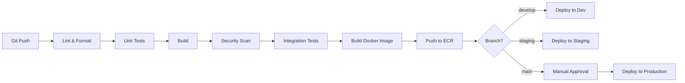

# Loan Origination System - Technical Notes

## 1. CI/CD Pipeline Design

### 1.1 Pipeline Stages Overview



### 1.2 Backend Pipeline (Jenkins)

```groovy
pipeline {
    agent any
    
    stages {
        stage('Checkout') {
            steps {
                checkout scm
            }
        }
        
        stage('Lint & Format Check') {
            steps {
                sh './mvnw checkstyle:check'
                sh './mvnw spotless:check'
            }
        }
        
        stage('Unit Tests') {
            steps {
                sh './mvnw test'
            }
            post {
                always {
                    junit 'target/surefire-reports/*.xml'
                    jacoco execPattern: 'target/jacoco.exec'
                }
            }
        }
        
        stage('Build') {
            steps {
                sh './mvnw clean package -DskipTests'
            }
        }
        
        stage('Security Scan') {
            parallel {
                stage('Dependency Check') {
                    steps {
                        sh './mvnw dependency-check:check'
                    }
                }
                stage('SonarQube Analysis') {
                    steps {
                        withSonarQubeEnv('SonarQube') {
                            sh './mvnw sonar:sonar'
                        }
                    }
                }
            }
        }
        
        stage('Integration Tests') {
            steps {
                sh './mvnw verify -P integration-tests'
            }
        }
        
        stage('Build Docker Image') {
            steps {
                script {
                    def appVersion = sh(returnStdout: true, script: './mvnw help:evaluate -Dexpression=project.version -q -DforceStdout').trim()
                    docker.build("loan-origination-backend:${appVersion}")
                }
            }
        }
        
        stage('Push to ECR') {
            steps {
                script {
                    docker.withRegistry('https://123456789.dkr.ecr.us-east-1.amazonaws.com', 'ecr:us-east-1:aws-credentials') {
                        docker.image("loan-origination-backend:${appVersion}").push()
                        docker.image("loan-origination-backend:${appVersion}").push('latest')
                    }
                }
            }
        }
        
        stage('Deploy') {
            when {
                branch 'main'
            }
            steps {
                input message: 'Deploy to production?'
                sh 'kubectl apply -f infrastructure/kubernetes/'
                sh "kubectl set image deployment/backend-deployment backend=123456789.dkr.ecr.us-east-1.amazonaws.com/loan-origination-backend:${appVersion}"
            }
        }
    }
    
    post {
        failure {
            slackSend channel: '#deployments', color: 'danger', message: "Build failed: ${env.JOB_NAME} ${env.BUILD_NUMBER}"
        }
        success {
            slackSend channel: '#deployments', color: 'good', message: "Build successful: ${env.JOB_NAME} ${env.BUILD_NUMBER}"
        }
    }
}
```

### 1.3 Frontend Pipeline (GitHub Actions)

```yaml
name: Frontend CI/CD

on:
  push:
    branches: [main, develop]
  pull_request:
    branches: [main]

jobs:
  test:
    runs-on: ubuntu-latest
    steps:
      - uses: actions/checkout@v3
      
      - name: Setup Node.js
        uses: actions/setup-node@v3
        with:
          node-version: '18'
          cache: 'npm'
          cache-dependency-path: frontend/package-lock.json
      
      - name: Install dependencies
        run: npm ci
        working-directory: ./frontend
      
      - name: Lint
        run: npm run lint
        working-directory: ./frontend
      
      - name: Type check
        run: npm run type-check
        working-directory: ./frontend
      
      - name: Unit tests
        run: npm run test:coverage
        working-directory: ./frontend
      
      - name: Upload coverage
        uses: codecov/codecov-action@v3
        with:
          files: ./frontend/coverage/lcov.info
  
  build:
    needs: test
    runs-on: ubuntu-latest
    steps:
      - uses: actions/checkout@v3
      
      - name: Configure AWS credentials
        uses: aws-actions/configure-aws-credentials@v2
        with:
          aws-access-key-id: ${{ secrets.AWS_ACCESS_KEY_ID }}
          aws-secret-access-key: ${{ secrets.AWS_SECRET_ACCESS_KEY }}
          aws-region: us-east-1
      
      - name: Login to ECR
        uses: aws-actions/amazon-ecr-login@v1
      
      - name: Build and push Docker image
        env:
          ECR_REGISTRY: ${{ steps.login-ecr.outputs.registry }}
          IMAGE_TAG: ${{ github.sha }}
        run: |
          docker build -t $ECR_REGISTRY/loan-origination-frontend:$IMAGE_TAG ./frontend
          docker push $ECR_REGISTRY/loan-origination-frontend:$IMAGE_TAG
  
  deploy:
    needs: build
    if: github.ref == 'refs/heads/main'
    runs-on: ubuntu-latest
    steps:
      - name: Deploy to EKS
        run: |
          aws eks update-kubeconfig --name loan-origination-cluster --region us-east-1
          kubectl set image deployment/frontend-deployment frontend=$ECR_REGISTRY/loan-origination-frontend:$IMAGE_TAG
          kubectl rollout status deployment/frontend-deployment
```

---

## 2. Testing Strategy

### 2.1 Test Pyramid

```
       /\
      /  \     E2E Tests (5%)
     /____\    - Critical user journeys
    /      \   - Selenium/Cypress
   /________\  Integration Tests (20%)
  /          \ - API contracts
 /____________\- Service integration
/______________\ Unit Tests (75%)
                - Business logic
                - Pure functions
```

### 2.2 Unit Testing

#### Backend (JUnit 5 + Mockito)

**Coverage Target:** 80% line coverage, 70% branch coverage

```java
// Example: LoanApplicationService unit test
@ExtendWith(MockitoExtension.class)
class LoanApplicationServiceTest {
    
    @Mock
    private LoanApplicationRepository repository;
    
    @Mock
    private KafkaEventProducer eventProducer;
    
    @InjectMocks
    private LoanApplicationService service;
    
    @Test
    void submitApplication_ValidData_ShouldSaveAndPublishEvent() {
        // Given
        LoanApplicationDto dto = createValidApplication();
        LoanApplication entity = new LoanApplication();
        when(repository.save(any())).thenReturn(entity);
        
        // When
        LoanApplication result = service.submitApplication(dto);
        
        // Then
        assertThat(result).isNotNull();
        verify(repository).save(any(LoanApplication.class));
        verify(eventProducer).publishApplicationSubmitted(any());
    }
    
    @Test
    void submitApplication_InvalidDTI_ShouldThrowException() {
        // Given
        LoanApplicationDto dto = createApplicationWithHighDTI();
        
        // When & Then
        assertThatThrownBy(() -> service.submitApplication(dto))
            .isInstanceOf(BusinessRuleException.class)
            .hasMessageContaining("DTI ratio exceeds maximum");
    }
}
```

#### Frontend (Jest + React Testing Library)

**Coverage Target:** 70% for UI components, 90% for utilities

```typescript
// Example: LoanApplicationForm component test
import { render, screen, fireEvent, waitFor } from '@testing-library/react';
import { LoanApplicationForm } from './LoanApplicationForm';

describe('LoanApplicationForm', () => {
  it('should submit valid application', async () => {
    const mockSubmit = jest.fn();
    render(<LoanApplicationForm onSubmit={mockSubmit} />);
    
    // Fill form
    fireEvent.change(screen.getByLabelText(/loan amount/i), {
      target: { value: '50000' }
    });
    fireEvent.change(screen.getByLabelText(/annual income/i), {
      target: { value: '80000' }
    });
    
    // Submit
    fireEvent.click(screen.getByRole('button', { name: /submit/i }));
    
    // Assert
    await waitFor(() => {
      expect(mockSubmit).toHaveBeenCalledWith({
        loanAmount: 50000,
        annualIncome: 80000
      });
    });
  });
  
  it('should show validation error for negative loan amount', () => {
    render(<LoanApplicationForm onSubmit={jest.fn()} />);
    
    fireEvent.change(screen.getByLabelText(/loan amount/i), {
      target: { value: '-1000' }
    });
    fireEvent.blur(screen.getByLabelText(/loan amount/i));
    
    expect(screen.getByText(/loan amount must be positive/i)).toBeInTheDocument();
  });
});
```

### 2.3 Integration Testing

#### Backend Integration Tests (Spring Boot Test)

```java
@SpringBootTest(webEnvironment = WebEnvironment.RANDOM_PORT)
@Testcontainers
class LoanApplicationIntegrationTest {
    
    @Container
    static OracleContainer oracle = new OracleContainer("gvenzl/oracle-xe:21-slim");
    
    @Container
    static KafkaContainer kafka = new KafkaContainer(DockerImageName.parse("confluentinc/cp-kafka:7.4.0"));
    
    @Autowired
    private TestRestTemplate restTemplate;
    
    @Test
    void submitApplication_EndToEnd_ShouldProcessSuccessfully() {
        // Given
        LoanApplicationDto application = createValidApplication();
        
        // When
        ResponseEntity<LoanApplicationDto> response = restTemplate.postForEntity(
            "/api/applications",
            application,
            LoanApplicationDto.class
        );
        
        // Then
        assertThat(response.getStatusCode()).isEqualTo(HttpStatus.CREATED);
        assertThat(response.getBody().getId()).isNotNull();
        
        // Verify Kafka event published
        // ... Kafka consumer verification
    }
}
```

#### Contract Testing (Pact)

```java
@ExtendWith(PactConsumerTestExt.class)
@PactTestFor(providerName = "ml-scoring-service")
class MLScoringServiceContractTest {
    
    @Pact(consumer = "underwriting-service")
    public RequestResponsePact createPact(PactDslWithProvider builder) {
        return builder
            .given("applicant data exists")
            .uponReceiving("request for credit score")
            .path("/api/score")
            .method("POST")
            .body(new PactDslJsonBody()
                .numberType("annualIncome", 80000)
                .numberType("existingDebt", 15000))
            .willRespondWith()
            .status(200)
            .body(new PactDslJsonBody()
                .numberType("creditScore", 720)
                .numberType("riskScore", 0.15))
            .toPact();
    }
    
    @Test
    @PactTestFor(pactMethod = "createPact")
    void testCreditScoreRequest(MockServer mockServer) {
        // Test implementation
    }
}
```

### 2.4 End-to-End Testing (Cypress)

```javascript
// cypress/e2e/loan-application.cy.js
describe('Loan Application Workflow', () => {
  beforeEach(() => {
    cy.login('borrower@example.com', 'password');
  });
  
  it('should complete full loan application journey', () => {
    // Navigate to application page
    cy.visit('/apply');
    
    // Fill application form
    cy.get('[data-testid="loan-amount"]').type('50000');
    cy.get('[data-testid="loan-purpose"]').select('Home Purchase');
    cy.get('[data-testid="annual-income"]').type('80000');
    cy.get('[data-testid="employment-status"]').select('Full-time');
    
    // Upload documents
    cy.get('[data-testid="income-document"]').attachFile('income-statement.pdf');
    cy.get('[data-testid="id-document"]').attachFile('drivers-license.jpg');
    
    // Submit application
    cy.get('[data-testid="submit-button"]').click();
    
    // Verify confirmation page
    cy.url().should('include', '/application/confirmation');
    cy.contains('Application submitted successfully').should('be.visible');
    cy.get('[data-testid="application-id"]').should('not.be.empty');
    
    // Wait for underwriting decision (async)
    cy.wait(5000); // In real test, use polling or websocket
    
    // Check application status
    cy.visit('/applications');
    cy.get('[data-testid="application-status"]').should('contain', 'Under Review');
  });
});
```

### 2.5 Performance Testing (JMeter)

**Load Test Scenario:**
- Ramp-up: 0 to 500 users over 5 minutes
- Steady state: 500 concurrent users for 15 minutes
- Key transactions:
  - Submit loan application (60% of traffic)
  - Check application status (30% of traffic)
  - Upload document (10% of traffic)

**Performance Acceptance Criteria:**
- 95th percentile response time < 500ms
- Error rate < 1%
- Throughput > 1000 requests/second

---

## 3. Deployment Strategy

### 3.1 Containerization with Docker

#### Backend Dockerfile (Multi-stage)

```dockerfile
# Build stage
FROM maven:3.9-eclipse-temurin-17 AS build
WORKDIR /app
COPY pom.xml .
RUN mvn dependency:go-offline

COPY src ./src
RUN mvn clean package -DskipTests

# Runtime stage
FROM eclipse-temurin:17-jre-alpine
WORKDIR /app

# Create non-root user
RUN addgroup -g 1001 appuser && adduser -D -u 1001 -G appuser appuser

COPY --from=build /app/target/*.jar app.jar
RUN chown appuser:appuser app.jar

USER appuser

EXPOSE 8080

ENTRYPOINT ["java", "-XX:+UseContainerSupport", "-XX:MaxRAMPercentage=75.0", "-jar", "app.jar"]
```

#### Frontend Dockerfile

```dockerfile
# Build stage
FROM node:18-alpine AS build
WORKDIR /app
COPY package*.json ./
RUN npm ci

COPY . .
RUN npm run build

# Runtime stage (nginx)
FROM nginx:alpine
COPY --from=build /app/dist /usr/share/nginx/html
COPY nginx.conf /etc/nginx/conf.d/default.conf

EXPOSE 80
CMD ["nginx", "-g", "daemon off;"]
```

### 3.2 Kubernetes Deployment Strategy

#### Rolling Update Configuration

```yaml
apiVersion: apps/v1
kind: Deployment
metadata:
  name: backend-deployment
spec:
  replicas: 3
  strategy:
    type: RollingUpdate
    rollingUpdate:
      maxSurge: 1
      maxUnavailable: 0  # Zero-downtime deployment
  template:
    spec:
      containers:
      - name: backend
        image: 123456789.dkr.ecr.us-east-1.amazonaws.com/loan-origination-backend:latest
        resources:
          requests:
            memory: "512Mi"
            cpu: "250m"
          limits:
            memory: "1Gi"
            cpu: "500m"
        readinessProbe:
          httpGet:
            path: /actuator/health/readiness
            port: 8080
          initialDelaySeconds: 30
          periodSeconds: 10
        livenessProbe:
          httpGet:
            path: /actuator/health/liveness
            port: 8080
          initialDelaySeconds: 60
          periodSeconds: 30
```

#### Blue-Green Deployment (Advanced)

```yaml
# Blue deployment (current production)
apiVersion: apps/v1
kind: Deployment
metadata:
  name: backend-blue
  labels:
    version: blue
spec:
  replicas: 3
  selector:
    matchLabels:
      app: backend
      version: blue

---
# Green deployment (new version)
apiVersion: apps/v1
kind: Deployment
metadata:
  name: backend-green
  labels:
    version: green
spec:
  replicas: 3
  selector:
    matchLabels:
      app: backend
      version: green

---
# Service routes to blue (switch to green after validation)
apiVersion: v1
kind: Service
metadata:
  name: backend-service
spec:
  selector:
    app: backend
    version: blue  # Change to 'green' to switch traffic
  ports:
  - port: 80
    targetPort: 8080
```

### 3.3 Database Migration Strategy

**Tool:** Flyway (integrated with Spring Boot)

**Migration Workflow:**
1. Developer creates migration script: `V3__add_credit_score_column.sql`
2. CI pipeline validates migration (syntax check, dry-run on test DB)
3. Deployment applies migration before starting new application version
4. Rollback plan: Keep backward-compatible schemas for N-1 version

**Example Migration:**

```sql
-- V3__add_credit_score_column.sql
ALTER TABLE loan_application 
ADD COLUMN credit_score NUMBER(3) NULL;

CREATE INDEX idx_loan_app_credit_score 
ON loan_application(credit_score);

COMMENT ON COLUMN loan_application.credit_score 
IS 'ML-predicted credit score (300-850)';
```

---

## 4. Environment Management

### 4.1 Environment Configuration Strategy

**Environments:**
1. **Local Development:** Docker Compose, in-memory databases
2. **Dev (Shared):** EKS cluster, shared Oracle RDS, Kafka
3. **Staging:** Production-like, separate AWS account, blue-green deployments
4. **Production:** Multi-AZ, auto-scaling, full monitoring

### 4.2 Configuration Hierarchy

```
application.yml (defaults)
├── application-dev.yml (overrides for dev)
├── application-staging.yml (overrides for staging)
└── application-prod.yml (overrides for production)
```

### 4.3 Environment Variables Template

**File:** `.env.example`

```bash
# Database Configuration
DB_HOST=localhost
DB_PORT=1521
DB_NAME=LOANDB
DB_USERNAME=loan_user
DB_PASSWORD=changeme

# Kafka Configuration
KAFKA_BOOTSTRAP_SERVERS=localhost:9092
KAFKA_TOPIC_APPLICATION_EVENTS=loan.application.events
KAFKA_CONSUMER_GROUP=loan-origination-group

# Elasticsearch Configuration
ES_HOST=localhost
ES_PORT=9200
ES_USERNAME=elastic
ES_PASSWORD=changeme

# Redis Configuration
REDIS_HOST=localhost
REDIS_PORT=6379
REDIS_PASSWORD=

# AWS Configuration
AWS_REGION=us-east-1
AWS_S3_BUCKET=loan-documents-dev
AWS_ACCESS_KEY_ID=
AWS_SECRET_ACCESS_KEY=

# ML Service Configuration
ML_SERVICE_URL=http://localhost:8001
ML_SERVICE_TIMEOUT_MS=5000

# Security Configuration
JWT_SECRET=your-256-bit-secret
JWT_EXPIRATION_MS=900000

# Feature Flags
FEATURE_ML_SCORING_ENABLED=true
FEATURE_AUTO_UNDERWRITING_ENABLED=true

# Monitoring
PROMETHEUS_ENABLED=true
LOGGING_LEVEL=INFO
```

### 4.4 Secrets Management

**Development:** `.env` file (gitignored)
**Staging/Production:** AWS Secrets Manager

```java
// Fetch secrets from AWS Secrets Manager
@Configuration
public class SecretsConfig {
    
    @Bean
    public SecretsManagerClient secretsClient() {
        return SecretsManagerClient.builder()
            .region(Region.US_EAST_1)
            .build();
    }
    
    @Bean
    public DataSource dataSource(SecretsManagerClient client) {
        String secretValue = client.getSecretValue(
            r -> r.secretId("prod/loan-origination/db-credentials")
        ).secretString();
        
        JsonNode secret = objectMapper.readTree(secretValue);
        
        HikariConfig config = new HikariConfig();
        config.setJdbcUrl(secret.get("url").asText());
        config.setUsername(secret.get("username").asText());
        config.setPassword(secret.get("password").asText());
        
        return new HikariDataSource(config);
    }
}
```

---

## 5. Version Control Workflow

### 5.1 Recommended Strategy: **GitHub Flow** (Simplified)

**Rationale:**
- Fast-paced development with frequent deployments
- Main branch always deployable
- Simple branching model (no long-lived release branches)
- Works well with CI/CD automation

### 5.2 Branch Structure

```
main (production)
  ↑
  └─ feature/loan-application-validation
  └─ feature/drools-underwriting
  └─ bugfix/document-upload-timeout
  └─ hotfix/security-vulnerability
```

### 5.3 Workflow Steps

1. **Create Feature Branch**
   ```bash
   git checkout -b feature/ml-credit-scoring
   ```

2. **Develop & Commit**
   ```bash
   git add .
   git commit -m "feat: implement ML credit scoring integration"
   ```

3. **Push & Create Pull Request**
   ```bash
   git push origin feature/ml-credit-scoring
   # Create PR on GitHub
   ```

4. **Code Review**
   - At least 1 approval required
   - CI pipeline must pass (lint, tests, security scan)
   - SonarQube quality gate must pass

5. **Merge to Main**
   - Squash commits for clean history
   - Auto-deploy to dev environment
   - Manual approval for production deployment

### 5.4 Commit Message Convention (Conventional Commits)

```
<type>(<scope>): <subject>

<body>

<footer>
```

**Types:**
- `feat`: New feature
- `fix`: Bug fix
- `docs`: Documentation changes
- `refactor`: Code refactoring
- `test`: Adding tests
- `chore`: Build/tooling changes

**Examples:**
```
feat(underwriting): add Drools rules for DTI ratio check

Implemented rules engine to validate debt-to-income ratio
against policy thresholds (max 43% for conventional loans).

Closes #123
```

```
fix(kafka): resolve duplicate message processing

Added idempotency check using message ID to prevent
duplicate event processing in underwriting consumer.

Fixes #456
```

---

## 6. Common Pitfalls & Solutions

### 6.1 Drools Performance Issues

**Pitfall:** Complex rule sets with cross-product joins cause slow rule execution.

**Solution:**
- Keep rules simple and focused
- Use rule salience to control execution order
- Avoid Cartesian products in rule conditions
- Add monitoring for rule execution time
- Cache rule session instances

```java
// Bad: Cross-product join
rule "Complex Rule"
when
    $app : LoanApplication()
    $policy : UnderwritingPolicy()
    $score : CreditScore()
then
    // Slow execution
end

// Good: Specific matching
rule "Focused Rule"
when
    $app : LoanApplication(status == "SUBMITTED")
    $score : CreditScore(this.applicationId == $app.id, score >= 650)
then
    // Fast execution
end
```

### 6.2 Kafka Message Ordering

**Pitfall:** Messages processed out-of-order in parallel consumers.

**Solution:**
- Partition by application ID to maintain order per application
- Use single-threaded consumer for ordered processing
- Implement idempotent message handling
- Add sequence numbers to events

```java
// Producer: Partition by application ID
producerRecord.key(applicationId); // Ensures same partition

// Consumer: Process in order
@KafkaListener(topics = "loan.events", concurrency = "1")
public void consume(ConsumerRecord<String, LoanEvent> record) {
    // Processes messages in order per partition
}
```

### 6.3 Oracle Database Connection Pool Exhaustion

**Pitfall:** Connection leaks under high load cause application hangs.

**Solution:**
- Configure HikariCP with proper pool sizing
- Set connection timeout and idle timeout
- Monitor connection pool metrics
- Use `@Transactional` correctly

```yaml
# application.yml
spring:
  datasource:
    hikari:
      maximum-pool-size: 20
      minimum-idle: 5
      connection-timeout: 30000
      idle-timeout: 600000
      max-lifetime: 1800000
      leak-detection-threshold: 60000
```

### 6.4 Elasticsearch Index Explosion

**Pitfall:** Creating new index for each document type causes mapping explosion.

**Solution:**
- Use index aliases for logical grouping
- Implement index lifecycle management (ILM)
- Use monthly rollover indices
- Archive old indices to cold storage

```json
PUT _index_template/loan_documents_template
{
  "index_patterns": ["loan-documents-*"],
  "template": {
    "settings": {
      "number_of_shards": 5,
      "number_of_replicas": 1
    },
    "aliases": {
      "loan-documents": {}
    }
  }
}
```

### 6.5 XGBoost Model Inference Latency

**Pitfall:** ML model prediction takes > 1 second, blocking underwriting flow.

**Solution:**
- Cache predictions in Redis (TTL: 5 minutes)
- Batch predictions for multiple applications
- Use ONNX runtime for faster inference
- Implement circuit breaker for ML service failures

```python
# FastAPI with caching
from functools import lru_cache

@lru_cache(maxsize=1000)
def predict_credit_score(applicant_hash: str):
    # Model inference
    return model.predict(features)
```

### 6.6 Kubernetes Pod Evictions

**Pitfall:** Pods evicted under memory pressure, causing service disruptions.

**Solution:**
- Set resource requests = limits (guaranteed QoS)
- Configure JVM heap size to 75% of container memory
- Use Pod Disruption Budgets (PDB)
- Implement graceful shutdown

```yaml
resources:
  requests:
    memory: "1Gi"
    cpu: "500m"
  limits:
    memory: "1Gi"  # Same as request = Guaranteed QoS
    cpu: "500m"

# JVM options
JAVA_OPTS: "-XX:MaxRAMPercentage=75.0 -XX:+UseContainerSupport"
```

### 6.7 Event Replay Issues

**Pitfall:** Replaying Kafka events causes duplicate loan applications.

**Solution:**
- Implement idempotency keys in events
- Use database constraints (unique indexes)
- Check for existing records before creating
- Store processed event IDs in deduplication table

```java
@Transactional
public void handleApplicationSubmitted(LoanEvent event) {
    // Check if event already processed
    if (processedEventRepository.existsByEventId(event.getId())) {
        log.info("Event already processed: {}", event.getId());
        return;
    }
    
    // Process event
    // ...
    
    // Mark event as processed
    processedEventRepository.save(new ProcessedEvent(event.getId()));
}
```

---

## 7. Monitoring & Alerting Configuration

### 7.1 Key Metrics to Monitor

#### Application Metrics (Micrometer + Prometheus)

```java
@Component
public class LoanApplicationMetrics {
    private final MeterRegistry registry;
    
    public LoanApplicationMetrics(MeterRegistry registry) {
        this.registry = registry;
    }
    
    public void recordApplicationSubmitted(String loanType) {
        Counter.builder("loan.application.submitted")
            .tag("loan_type", loanType)
            .register(registry)
            .increment();
    }
    
    public void recordUnderwritingDecision(String decision, long durationMs) {
        Timer.builder("loan.underwriting.decision")
            .tag("decision", decision)
            .register(registry)
            .record(durationMs, TimeUnit.MILLISECONDS);
        
        Counter.builder("loan.underwriting.decision.count")
            .tag("decision", decision)
            .register(registry)
            .increment();
    }
}
```

#### Critical Alerts

| Alert | Condition | Severity | Action |
|-------|-----------|----------|--------|
| Service Down | Up metric == 0 for 2 minutes | Critical | Page on-call engineer |
| High Error Rate | Error rate > 5% for 5 minutes | Critical | Investigate immediately |
| Slow Response Time | P95 latency > 1s for 10 minutes | Warning | Check logs, scale up |
| Database Connections Low | Available connections < 20% | Warning | Investigate connection leaks |
| Kafka Consumer Lag | Lag > 10,000 messages | Warning | Scale consumers |
| ML Service Unavailable | Circuit breaker open for 5 minutes | Warning | Fallback to manual review |

### 7.2 Grafana Dashboard Layout

**Dashboard 1: Operational Health**
- Service uptime (availability %)
- Request rate (requests/second)
- Error rate (%)
- Response time (p50, p95, p99)
- Active database connections

**Dashboard 2: Business Metrics**
- Applications submitted (last 24 hours)
- Approval rate (%)
- Average underwriting time
- Document processing backlog
- Revenue pipeline

---

## 8. Local Development Setup

### 8.1 Docker Compose for Local Environment

```yaml
version: '3.8'

services:
  oracle:
    image: gvenzl/oracle-xe:21-slim
    ports:
      - "1521:1521"
    environment:
      ORACLE_PASSWORD: oracle
    volumes:
      - oracle-data:/opt/oracle/oradata
  
  kafka:
    image: confluentinc/cp-kafka:7.4.0
    ports:
      - "9092:9092"
    environment:
      KAFKA_BROKER_ID: 1
      KAFKA_ZOOKEEPER_CONNECT: zookeeper:2181
      KAFKA_ADVERTISED_LISTENERS: PLAINTEXT://localhost:9092
    depends_on:
      - zookeeper
  
  zookeeper:
    image: confluentinc/cp-zookeeper:7.4.0
    ports:
      - "2181:2181"
    environment:
      ZOOKEEPER_CLIENT_PORT: 2181
  
  elasticsearch:
    image: docker.elastic.co/elasticsearch/elasticsearch:8.9.0
    ports:
      - "9200:9200"
    environment:
      discovery.type: single-node
      xpack.security.enabled: false
    volumes:
      - es-data:/usr/share/elasticsearch/data
  
  redis:
    image: redis:7-alpine
    ports:
      - "6379:6379"
  
  ml-service:
    build: ./ml-service
    ports:
      - "8001:8001"
    volumes:
      - ./ml-service/models:/app/models

volumes:
  oracle-data:
  es-data:
```

### 8.2 Developer Onboarding Checklist

```markdown
# Developer Setup Guide

## Prerequisites
- [ ] Install Java 17 JDK
- [ ] Install Maven 3.9+
- [ ] Install Node.js 18+
- [ ] Install Docker Desktop
- [ ] Install AWS CLI
- [ ] Install kubectl
- [ ] Install IDE (IntelliJ IDEA recommended)

## Repository Setup
- [ ] Clone repository: `git clone https://github.com/company/loan-origination-system.git`
- [ ] Copy `.env.example` to `.env` and configure
- [ ] Start local services: `docker-compose up -d`
- [ ] Build backend: `cd backend && ./mvnw clean install`
- [ ] Build frontend: `cd frontend && npm install && npm run dev`
- [ ] Run backend: `./mvnw spring-boot:run`
- [ ] Access application: http://localhost:3000

## Verification
- [ ] Backend health check: http://localhost:8080/actuator/health
- [ ] Swagger UI: http://localhost:8080/swagger-ui.html
- [ ] Kafka topics created: `docker exec -it kafka kafka-topics --list --bootstrap-server localhost:9092`
- [ ] Elasticsearch running: `curl http://localhost:9200`
- [ ] Run tests: `./mvnw test`
```

---

## 9. Security Best Practices

### 9.1 OWASP Top 10 Mitigation

| Vulnerability | Mitigation |
|---------------|------------|
| Injection | Prepared statements, input validation, ORM (JPA) |
| Broken Authentication | OAuth2 + JWT, MFA, secure password storage (bcrypt) |
| Sensitive Data Exposure | TLS 1.3, field-level encryption, data masking |
| XML External Entities | Disable XML external entity processing |
| Broken Access Control | RBAC, method-level security annotations |
| Security Misconfiguration | Security headers, disable default accounts |
| XSS | React auto-escaping, CSP headers |
| Insecure Deserialization | Validate deserialized objects, use safe libraries |
| Known Vulnerabilities | Automated dependency scanning (Snyk, Dependabot) |
| Insufficient Logging | Centralized logging, audit trail for sensitive operations |

### 9.2 Spring Security Configuration

```java
@Configuration
@EnableWebSecurity
public class SecurityConfig {
    
    @Bean
    public SecurityFilterChain filterChain(HttpSecurity http) throws Exception {
        http
            .csrf().disable() // API uses JWT
            .authorizeHttpRequests(auth -> auth
                .requestMatchers("/actuator/health").permitAll()
                .requestMatchers("/api/applications/**").hasRole("BORROWER")
                .requestMatchers("/api/underwriting/**").hasRole("UNDERWRITER")
                .requestMatchers("/api/admin/**").hasRole("ADMIN")
                .anyRequest().authenticated()
            )
            .oauth2ResourceServer(oauth2 -> oauth2.jwt())
            .sessionManagement(session -> session
                .sessionCreationPolicy(SessionCreationPolicy.STATELESS)
            );
        
        return http.build();
    }
}
```

---

## 10. Performance Optimization Checklist

- [ ] Enable database query logging in dev (identify N+1 queries)
- [ ] Add database indexes on foreign keys and query predicates
- [ ] Configure JPA batch inserts (batch size: 50)
- [ ] Enable HTTP/2 for frontend API calls
- [ ] Implement lazy loading for large data sets
- [ ] Use Redis caching for read-heavy endpoints
- [ ] Configure CDN for static assets (CloudFront)
- [ ] Enable gzip compression for API responses
- [ ] Optimize Docker images (multi-stage builds, minimal base images)
- [ ] Configure connection pooling (HikariCP, Redis connection pool)
- [ ] Implement circuit breakers for external service calls
- [ ] Use async processing for non-blocking operations
- [ ] Profile application with JProfiler/YourKit
- [ ] Load test with realistic traffic patterns
