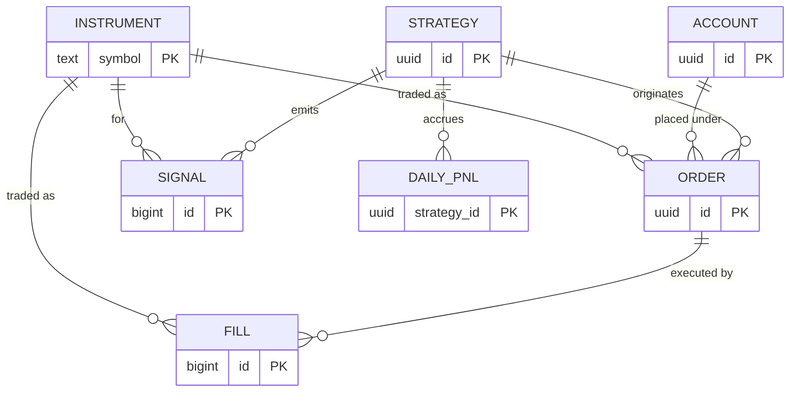

# Database Schema

PostgreSQL 16 is the **system of record**. Schema is managed as forward-only,
hand-reviewed SQL migrations in [`../migrations`](../migrations) (never ORM
auto-migrations — finance audits require reviewable DDL, see TECH-NOTES §3.3).

## Entity-Relationship Overview



## Conventions

| Rule | Rationale |
|------|-----------|
| Money columns are `NUMERIC`, never `float`/`double` | Avoids rounding drift in cash/PnL (TECH-NOTES §3.6). |
| Timestamps are `timestamptz`, stored UTC | Distributed-system clock correctness (§3.6). |
| `(account_id, client_order_id)` is UNIQUE | Enforces order idempotency at the DB layer. |
| `fill` / `signal` are append-only | Immutable audit trail for compliance. |
| `correlation_id` on order/signal | Trace a fill back to the originating tick. |

## Applying migrations

```bash
psql "$DATABASE_URL" -f migrations/V0001__initial_schema.sql
psql "$DATABASE_URL" -f migrations/V0002__strategies_and_signals.sql
```

In CI/CD these run as a gated step against staging before prod (TECH-NOTES §3.3).

## Production notes

- Partition `fill` and `signal` by day (declarative partitioning) once volume warrants.
- Primary + streaming replica; backups via WAL archiving / PITR.
- At-rest encryption (LUKS/TDE); least-privilege roles (`app_rw`, `app_ro`, `migrator`).
