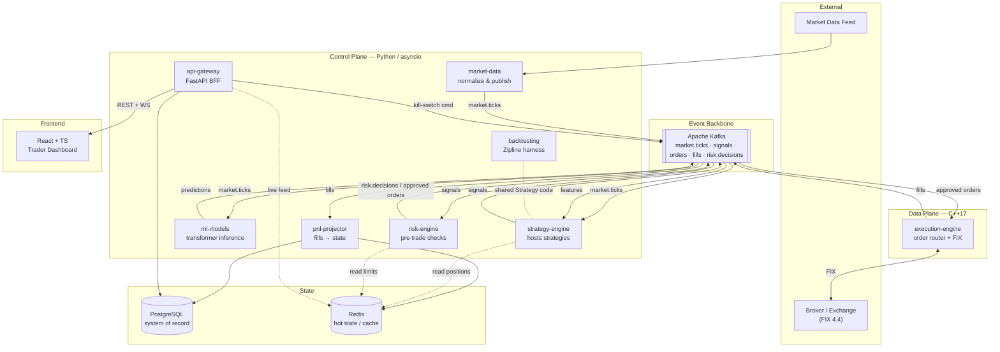
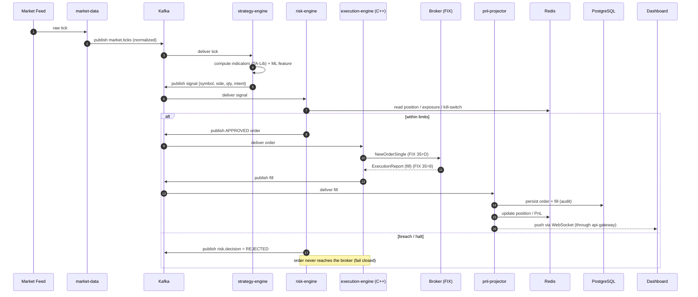
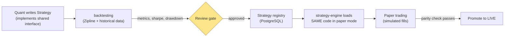
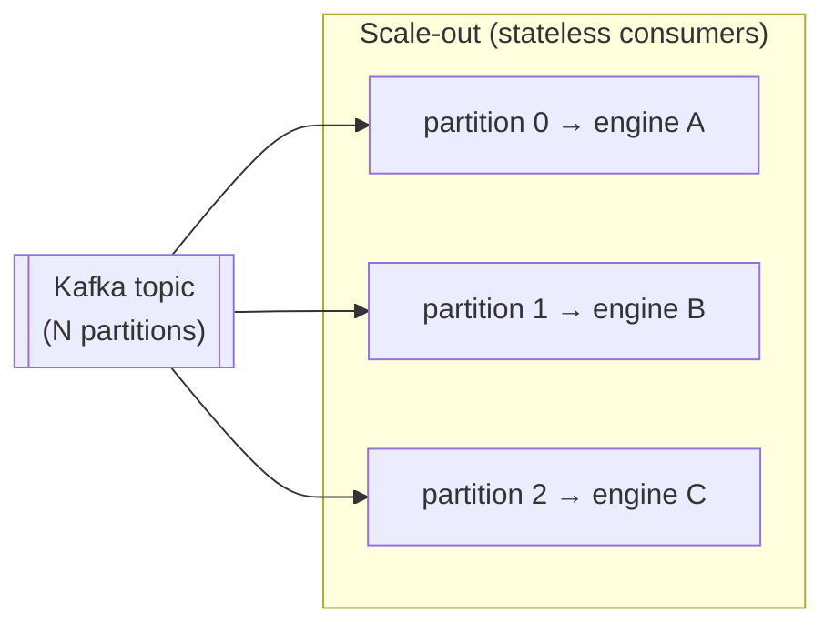
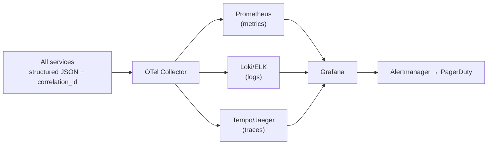
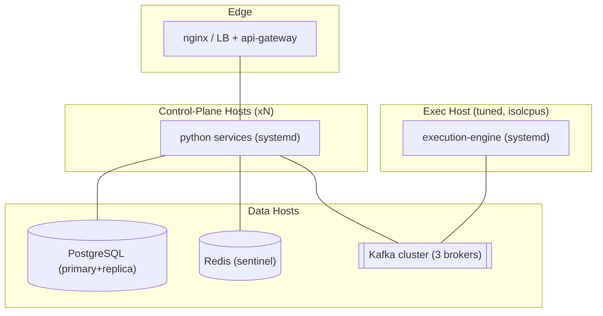

# Algorithmic Trading Platform — Architecture

> **Audience:** Engineers, SREs, quants onboarding to the platform.
> **Companion docs:** [`PROJECT-PLAN.md`](./PROJECT-PLAN.md) · [`TECH-NOTES.md`](./TECH-NOTES.md)

---

## 2.1 Architectural Pattern — Event-Driven Microservices with a Latency-Critical Core

The platform is an **event-driven system** built around an immutable Kafka event log, decomposed
into independently deployable services, with a **single latency-critical C++ core** carved out of
the order hot-path.

### Why this pattern (and not the alternatives)

| Candidate | Verdict | Reasoning |
|-----------|---------|-----------|
| **Layered monolith** | ❌ | A single process can't co-locate Python research code and microsecond-deterministic execution. GC pauses and the GIL are disqualifying on the hot-path. |
| **Pure microservices (REST/gRPC everywhere)** | ❌ | Synchronous request/response per tick adds tail latency and couples services. Markets are a *stream*, not a request. |
| **Serverless / FaaS** | ❌ | Cold starts, no control over CPU pinning/NICs, and per-invocation cost model are wrong for a long-lived, latency-bound, bare-metal workload. |
| **Event-driven microservices + C++ core** | ✅ | Decouples services via the log (replay, audit, backpressure), keeps research in Python, and isolates the deterministic path in C++. Matches a finance/HFT reality. |

**Key split — Control Plane vs Data Plane**

- **Control plane (Python, asyncio):** strategy hosting, market-data normalization, risk policy,
  backtesting, ML, API/UI. Optimizes for *developer velocity* and *rich libraries*. Tolerates
  millisecond latencies.
- **Data plane (C++17):** the order router + FIX engine. Optimizes for *deterministic microsecond
  latency*. No dynamic allocation on the hot-path, no blocking I/O, no Python.

The two planes communicate **only** through Kafka (asynchronous events) and a thin command/heartbeat
channel — never via in-process calls.

---

## 2.2 System Components & Interactions

### Interaction mechanisms (deliberately heterogeneous)

| Path | Mechanism | Why |
|------|-----------|-----|
| Market data, signals, orders, fills | **Kafka topics** | Streaming, replayable, backpressure-aware, the audit log. |
| Order hot-path risk check | **In-line synchronous (Redis-backed)** | Risk must approve *before* the order leaves; bounded, microsecond-budget. |
| Frontend ↔ backend | **REST (commands/CRUD) + WebSocket (live stream)** | REST for mutations; WS for low-latency PnL/blotter push. |
| Hot state reads (positions, latest quote, rate limits) | **Redis** | Sub-millisecond, shared across services. |
| System of record (orders, fills, audit, strategy config) | **PostgreSQL** | Durable, transactional, queryable for compliance. |
| ML predictions | **Kafka topic `predictions`** | Decouples model serving cadence from strategy tick rate. |

---

## 2.3 Data Flow

### 2.3.1 Live order lifecycle (the critical path)

### 2.3.2 Research → production parity flow

> **Parity invariant:** the indicator/signal code that runs in `backtesting` is imported from
> `shared/trading_common` and executed unchanged by `strategy-engine`. A CI test feeds identical
> historical bars to both and asserts byte-identical signal sequences.

---

## 2.4 Scalability & Performance Strategy

**Horizontal (control plane)**
- Strategies are **partitioned by instrument** across Kafka partitions; add `strategy-engine`
  instances to scale strategy count linearly. Consumer groups rebalance automatically.
- `market-data`, `ml-models`, and `pnl-projector` are stateless consumers — scale by partition count.
- `api-gateway` is stateless behind a load balancer; sticky sessions only for WebSocket affinity.

**Vertical & latency (data plane)**
- `execution-engine` runs as a **single pinned process per trading venue**, threads pinned to
  isolated cores (`isolcpus`), busy-polling the FIX socket. Scaling = more venues, not more threads.
- Pre-allocated object pools; zero allocation and zero locks on the order hot-path (SPSC ring buffers).
- Redis holds the hot working set so the path never touches Postgres synchronously.

**Data tiering**
- **Redis (hot):** latest quote, live positions, rate-limit counters — ms TTL / overwrite.
- **PostgreSQL (warm):** orders, fills, strategy config, daily PnL — durable, indexed, partitioned by date.
- **Object store / data lake (cold):** historical ticks & backtest archives (Parquet) — cheap, batch.

**Backpressure & throughput**
- Kafka decouples producers from consumers; a slow ML model can lag without stalling execution.
- Per-topic retention tuned: `market.ticks` short (replay window), `orders`/`fills` long (audit).

---

## 2.5 Security Considerations

| Domain | Approach |
|--------|----------|
| **AuthN** | Operators authenticate to `api-gateway` via OIDC (SSO). Service-to-service uses **mTLS** on an internal network; Kafka uses SASL/SCRAM + TLS. |
| **AuthZ** | RBAC: `viewer` (read PnL), `trader` (start/stop strategies, kill-switch), `admin` (config, limits). Enforced at the gateway *and* re-checked on privileged commands (kill-switch is double-confirmed). |
| **Data protection** | TLS in transit everywhere. PostgreSQL at-rest encryption (LUKS / TDE). PII and account credentials never logged. Broker credentials only in the execution host's memory. |
| **API security** | Input validation via Pydantic at the edge; rate limiting per principal (Redis token bucket); strict CORS; no trading mutation without CSRF/Origin checks; idempotency keys on order-affecting commands. |
| **Secret management** | **HashiCorp Vault** is the source of truth. Bare-metal services fetch secrets at boot via Vault agent → injected as env / tmpfs files. **Nothing secret in git or `config/`.** `.env.example` documents names only. |
| **Network** | Execution & broker links on an isolated VLAN; only `api-gateway` is reachable from the operator network; default-deny firewall; the broker FIX endpoint is IP-allowlisted. |
| **Audit** | Every order/fill/risk decision and every operator action (start/stop/kill/limit-change) is an immutable, timestamped event — non-repudiable trade reconstruction for compliance. |
| **Kill-switch** | Hardware/software dead-man: loss of heartbeat from risk-engine or operator panic flattens positions and disables new orders. **Fail closed.** |

---

## 2.6 Error Handling & Logging Philosophy

**Principle: in trading, an unhandled error must reduce risk, never increase it.** When in doubt, halt.

**Error classification**

| Class | Example | Reaction |
|-------|---------|----------|
| **Transient** | Kafka rebalance, broker reconnect | Bounded retry with backoff + jitter; circuit-breaker per dependency. |
| **Data integrity** | Stale tick (timestamp > threshold), crossed book, NaN indicator | **Halt the affected instrument**; emit `risk.decision = HALT`; alert. |
| **Risk breach** | Position/notional cap exceeded | Reject order, log decision, page on repeated breaches. |
| **Fatal / invariant** | Position reconciliation mismatch vs broker | Engage kill-switch, flatten, stop trading, human-in-the-loop. |

**Logging**
- **Structured JSON logs** (one event per line) with a mandatory context envelope:
  `correlation_id`, `strategy_id`, `order_id`, `symbol`, `service`, `env`, `ts_utc`.
- A `correlation_id` is minted at the originating tick and **propagated across every hop** (Kafka
  header → C++ engine → fill → projector → UI) so a fill can be traced back to the tick that caused it.
- Log **levels by intent:** `INFO` = business events, `WARN` = degraded/halt, `ERROR` = invariant
  violated. The order hot-path logs to a lock-free async sink (never blocks).

**Observability stack**
- **Metrics:** Prometheus (latency histograms p50/p99/p99.9 on the order path, lag, fill rates).
- **Tracing:** OpenTelemetry spans across the control plane (the C++ path emits coarse spans only).
- **Dashboards/Alerts:** Grafana + Alertmanager → PagerDuty for risk/halt/latency-SLO breaches.

---

## Appendix A — Canonical Kafka Topics

| Topic | Producer | Consumers | Key | Retention |
|-------|----------|-----------|-----|-----------|
| `market.ticks` | market-data | strategy-engine, ml-models | symbol | short (hours) |
| `predictions` | ml-models | strategy-engine | symbol | short |
| `signals` | strategy-engine | risk-engine | strategy_id | medium |
| `orders` | risk-engine | execution-engine | account+symbol | **long (audit)** |
| `fills` | execution-engine | pnl-projector, risk-engine | account+symbol | **long (audit)** |
| `risk.decisions` | risk-engine | pnl-projector, api-gateway | strategy_id | **long (audit)** |
| `commands` | api-gateway | strategy-engine, execution-engine | target | medium |

## Appendix B — Deployment Topology (Bare Metal)

## Appendix C — Implementation Mapping (code ↔ diagram)

How the implementation realizes the diagrams above:

| Concept in the diagrams | Code |
|-------------------------|------|
| Event backbone (Kafka) | `trading_common.messaging.MessageBus` with two backends: `InMemoryBus` (single-process: dev, tests, the orchestrator) and `KafkaBus` (production). Chosen by `make_bus(KAFKA_BOOTSTRAP_SERVERS)`. Every service depends only on this interface. |
| market-data | `market_data.MarketDataPublisher` (+ `SimulatedFeed`, `BarAggregator`) → `market.ticks` / `market.bars`. |
| strategy-engine | `strategy_engine.StrategyEngine` over the bus; strategies loaded from the DB via `strategy_engine.registry`. |
| risk-engine | `risk_engine.RiskService` consumes `signals`, emits APPROVED `orders` or REJECTED `risk.decisions` (fail closed). |
| execution-engine (live) | C++ `execution-engine/` (FIX). **Paper/backtest mode** substitutes `trading_common.sim.PaperBroker`, which consumes `orders` and emits `fills` via `PaperMatchingEngine`. |
| pnl-projector | `pnl_projector.ProjectorService` folds `fills` into positions/PnL → PostgreSQL (+ Redis store). |
| api-gateway | `api_gateway` (FastAPI): CRUD, positions/PnL, WebSocket, OpenAPI. |
| State | `trading_common.db` (SQLAlchemy async; SQLite dev/tests, PostgreSQL prod) + `PositionStore` (in-memory / Redis). |

The **orchestrator** (`orchestrator.PaperTradingApp`) wires every service into one process over
`InMemoryBus` for local paper trading and the end-to-end integration test. Because each component
talks only to the bus, the same code runs distributed over Kafka in production — the wiring is
identical, only the bus backend changes.
