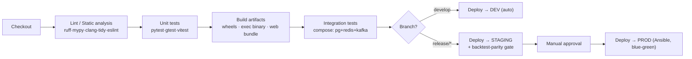
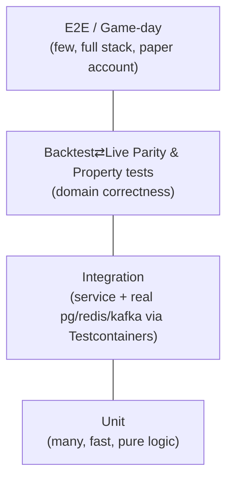
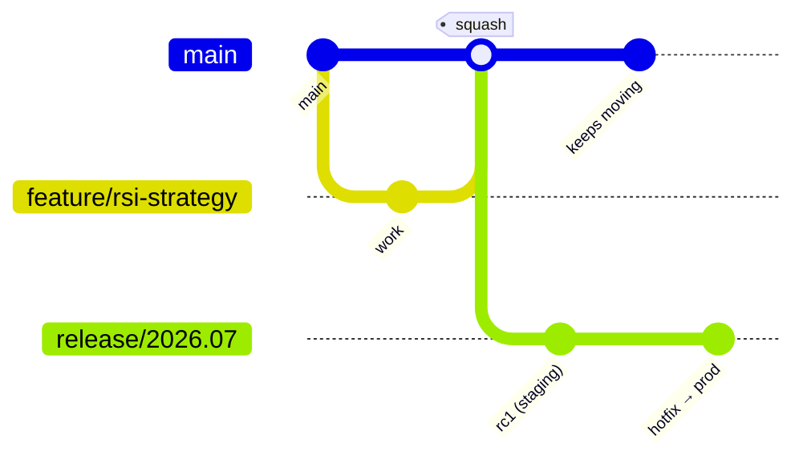

# Algorithmic Trading Platform — Technical Notes

> Actionable engineering guidance for building, testing, deploying, and operating the platform.
> Companion to [`ARCHITECTURE.md`](./ARCHITECTURE.md) and [`PROJECT-PLAN.md`](./PROJECT-PLAN.md).

---

## 3.1 CI/CD Pipeline Design (Jenkins, bare metal)

The pipeline is defined in [`/Jenkinsfile`](../Jenkinsfile) (declarative). It is **polyglot**:
Python control plane, C++ execution engine, and the React frontend each have a lane, gated by a
shared quality bar.



**Stage detail**

| Stage | Python | C++ | Frontend |
|-------|--------|-----|----------|
| Lint | `ruff`, `black --check`, `mypy` | `clang-format --dry-run`, `clang-tidy` | `eslint`, `tsc --noEmit`, `prettier --check` |
| Test | `pytest --cov` (fail < target) | `ctest` (GoogleTest) | `vitest run --coverage` |
| Build | `python -m build` (wheels) | `cmake --build` (Release+LTO) | `vite build` |
| Package | versioned wheels → internal index | binary + debug symbols → artifact store | static bundle → artifact store |
| Deploy | Ansible → systemd units | Ansible → tuned exec host | rsync to nginx + cache-bust |

**Conventions**
- One pipeline, parallel lanes (Jenkins `parallel {}`); fail-fast on lint.
- Artifacts are immutable and **versioned by git SHA**; the same artifact promotes dev→staging→prod.
- **Prod deploy is gated** on (a) green staging integration tests, (b) backtest-parity test, (c) manual approval by Risk for any change touching `risk-engine` or `execution-engine`.
- Secrets injected by the Jenkins Vault plugin at deploy time — never baked into artifacts.

---

## 3.2 Testing Strategy

A trading platform's test pyramid has an extra, non-negotiable layer: **financial-correctness tests**.



**Unit**
- Python: `pytest` + `hypothesis` for indicator math (property tests: e.g. SMA of constant series = the constant). Target **≥ 85%** line coverage on `strategy-engine`, `risk-engine`, `trading_common`; **100%** on risk-limit logic.
- C++: **GoogleTest** for the order router and FIX message encode/decode; deterministic, no network.
- Frontend: **Vitest** + React Testing Library for components and hooks; mock the API client.

**Integration**
- **Testcontainers** spins up real PostgreSQL, Redis, and Kafka. Verify: migration applies cleanly, a signal flows signal→risk→order, a fill projects to position/PnL correctly.
- Contract tests on Kafka schemas (Schema Registry compatibility check in CI prevents breaking changes).

**Financial correctness (the differentiator)**
- **Parity test:** feed identical historical bars to `backtesting` (Zipline) and `strategy-engine`; assert identical signal sequences. Guards against the classic "it worked in backtest" drift.
- **Replay tests:** capture a real session's Kafka log, replay it, assert deterministic outputs.
- **Risk invariants:** fuzz order flows; assert *no* sequence can breach position/notional caps.

**E2E / Game-day**
- Against a **broker paper/UAT account** over real FIX: place, partially fill, cancel, reject, reconnect mid-order. Run as a scheduled job, not per-PR.
- Chaos drills (staging): kill a Kafka broker, sever the broker link, inject stale ticks → assert the system halts and flattens (fail-closed).

---

## 3.3 Deployment Strategy (Bare Metal + Containers for Dev)

**Production = bare metal + systemd (not containers).** Rationale: the execution engine needs CPU
pinning, NIC tuning, huge pages, and predictable latency that container schedulers undermine.

- **Provisioning:** Ansible playbooks ([`infra/ansible`](../infra/ansible)) configure hosts: kernel
  params (`isolcpus`, `nohz_full`, `tuned-adm profile latency-performance`), users, Vault agent,
  Prometheus node-exporter, and deploy systemd units ([`infra/systemd`](../infra/systemd)).
- **Release model:** **blue-green per service.** Start the new version alongside the old, health-check
  it, shift Kafka consumer-group membership / LB traffic, then retire the old. Automatic rollback on
  failed health check or drawdown alarm within the canary window.
- **Execution engine** is special: deploy during a **market-closed window**, reconcile positions with
  the broker on startup before enabling order flow.

**Containers are for development & CI only** — `infra/docker/docker-compose.yml` provides Postgres,
Redis, Kafka, Zookeeper, and Schema Registry so a laptop mirrors prod infra. The Python services *can*
be containerized for CI integration tests, but production runs them as native systemd processes.

**Database migrations** run as a gated CI step (Flyway-style, forward-only) against staging before prod;
never auto-applied by an app at boot.

---

## 3.4 Environment Management

- Three environments: **dev** (shared, auto-deploy from `develop`), **staging** (prod-like, release
  candidates + paper account), **prod** (live money).
- **Config precedence:** built-in defaults → `config/<env>/config.yaml` (non-secret) → environment
  variables (secrets, injected by Vault). Code reads config through `trading_common.config` only;
  no `os.getenv` scattered around.
- **Secrets never in git.** `config/<env>/` holds only non-sensitive values (topic names, pool sizes,
  feature flags). Credentials, broker FIX logon, DB passwords come from Vault → env at runtime.
- The contract is documented in [`/.env.example`](../.env.example) — copy to `.env` for local dev
  (gitignored).

```bash
# Local quickstart
cp .env.example .env          # fill in local/dev values
docker compose -f infra/docker/docker-compose.yml up -d   # pg, redis, kafka
pip install -e shared -e services/strategy-engine[dev]    # editable installs
```

---

## 3.5 Version Control Workflow — Trunk-Based with short release branches

**Choice: trunk-based development** with very short-lived feature branches and **`release/*`**
stabilization branches.

- **Why not Gitflow?** Too heavy; long-lived `develop`/`feature` branches cause painful merges and
  slow the research→production loop quants need.
- **Why not pure GitHub-Flow-to-prod?** Live money demands a stabilization/sign-off window. A
  short-lived `release/*` branch gives Risk a fixed candidate to approve without freezing trunk.



- `main` is always releasable and protected (PR + green CI + ≥1 review; **2 reviews incl. Risk** for
  `risk-engine`/`execution-engine`).
- Feature branches live **< 2 days**; merge via squash. Use feature flags to hide unfinished work.
- `release/<year>.<month>` cut for staging; only fixes cherry-picked in. Tag on prod deploy.
- **Conventional Commits** drive changelogs and semantic versioning of `trading_common`.

---

## 3.6 Common Pitfalls (this stack, specifically)

| Pitfall | Why it bites | Mitigation |
|---------|--------------|-----------|
| **TA-Lib install hell** | TA-Lib is a C library; the Python wheel needs the native lib present (a frequent CI/bare-metal break). | Pin the native lib in Ansible + CI base image; document in `requirements`. Wrap it behind `trading_common.indicators` so a swap is localized. |
| **Zipline dependency rot** | Zipline pins old NumPy/Pandas and is finicky on modern Python. | Isolate `backtesting` in its own venv/lockfile; keep its NumPy pin separate from the rest. Consider `zipline-reloaded`. Never let it dictate the whole platform's deps. |
| **Look-ahead bias / survivorship** | Backtests that peek at the close, or use a clean symbol universe, show fake alpha. | Bar-close-only data access in the `Strategy` API; point-in-time data with delistings. The parity test catches accidental future access. |
| **Python GIL on the hot-path** | A tempting "just send the order from Python" creeps latency in and stalls under load. | Hard rule: orders leave from C++. Python only *publishes intent* to Kafka. Enforced by architecture review. |
| **Floating-point money** | `float` for prices/PnL → rounding drift, reconciliation breaks. | Use `Decimal`/fixed-point (scaled integers) for money everywhere; Postgres `NUMERIC`. Never `float` for cash. |
| **Clock skew / timestamps** | Distributed events with unsynced clocks corrupt ordering and audits. | NTP/PTP on all hosts; UTC everywhere; carry exchange timestamp *and* ingest timestamp; never trust wall-clock for ordering — use sequence numbers. |
| **Kafka rebalances mid-trade** | A consumer-group rebalance can pause the strategy at the wrong moment. | Static membership + tuned `session.timeout.ms`; idempotent consumers; partition by instrument so a rebalance affects a bounded blast radius. |
| **At-least-once → duplicate orders** | Naive re-consume after a crash can double-send an order. | **Idempotency keys** on orders (client order id); execution engine dedupes; reconcile against broker on startup. |
| **FIX session quirks** | Sequence-number gaps, resend requests, and logon races are easy to get wrong. | Use a battle-tested engine (**QuickFIX/C++**); persist sequence numbers; test resend/gap-fill explicitly. |
| **Backtest≠Live slippage** | Backtests assume perfect fills. | Model commission + slippage + partial fills in the Zipline harness; reconcile assumptions against real fills monthly. |
| **Redis as a database** | Treating Redis state as durable truth. | Redis is a *cache/projection* only. PostgreSQL is the system of record; Redis is rebuildable from the Kafka log. |

---

## Appendix — Toolchain Versions (pin these)

| Tool | Version | Notes |
|------|---------|-------|
| Python | 3.11 | asyncio perf; matches service venvs |
| Python (backtesting only) | 3.10 | Zipline compatibility island |
| C++ | C++17, GCC 12 / Clang 16 | Release + LTO; `-O3 -march=native` on exec host |
| CMake | ≥ 3.24 | presets in `execution-engine` |
| Node | 20 LTS | frontend build |
| PostgreSQL | 16 | `NUMERIC` money, declarative partitioning |
| Redis | 7 | Sentinel for HA |
| Kafka | 3.7 (KRaft) | Schema Registry alongside |
| QuickFIX | latest | FIX 4.4 sessions |
