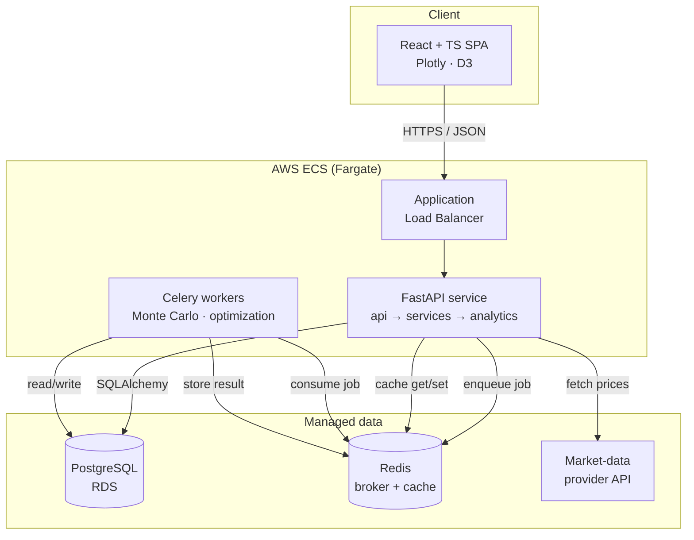
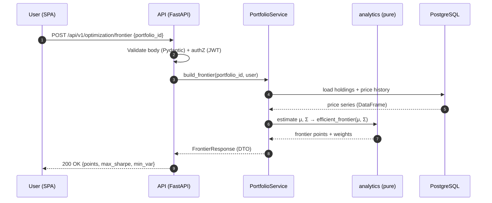
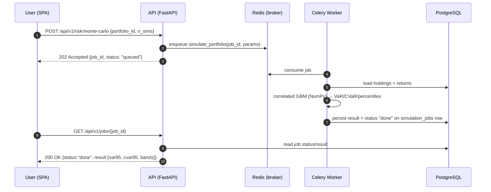

# Portfolio Management Dashboard — Architecture

## 2.1 Chosen Architectural Pattern

**Modular (layered) monolith for the API + an asynchronous compute tier.**

The system is a single deployable FastAPI application organized into strict
layers (`api → services → analytics/db`), paired with a horizontally scalable
**worker tier** (Celery) that absorbs CPU-heavy, bursty workloads — Monte Carlo
simulations and large constrained optimizations.

### Why this pattern

| Force | How the pattern addresses it |
| --- | --- |
| Small/mid team, fast iteration | One codebase, one deploy, shared types — no cross-service version drift or distributed transactions. |
| Strong consistency for money data | Portfolios/holdings live in one PostgreSQL DB; updates are simple ACID transactions, not sagas. |
| Bursty, expensive compute (Monte Carlo) | Offloaded to stateless workers that scale independently of the API, so a 50k-path simulation never blocks request threads. |
| Clear domain core | The quant logic in `analytics/` is pure and isolated — the most valuable, most-tested code has zero framework coupling. |
| Future growth | Layer boundaries + the pure analytics core make later extraction of a "quant-engine" service low-risk if scale ever demands it. |

**Why not microservices (yet):** the domain has no proven seams that justify
network boundaries; premature splitting would add operational cost (service
discovery, distributed tracing, eventual consistency) with no scaling benefit.
The async worker split is the *one* boundary the workload actually demands.

---

## 2.2 Key Component Interactions

- **API calls:** SPA ↔ API over HTTPS/JSON (`/api/v1/...`), JWT bearer auth.
- **Direct database access:** API and workers both use SQLAlchemy against the
  same RDS PostgreSQL instance (workers for writing simulation results).
- **Message queue:** Redis is the Celery broker. Heavy endpoints return `202`
  with a `job_id`; clients poll `/jobs/{id}` (or receive a WS push) for results.
- **Cache:** Redis also memoizes deterministic, expensive results (e.g. an
  efficient frontier for a fixed covariance window) keyed by input hash.
- **External:** a pluggable market-data adapter fetches OHLCV price series.

---

## 2.3 Data Flow

### Synchronous request (fast: e.g. Sharpe ratio, simple frontier)

### Asynchronous request (heavy: Monte Carlo)

---

## 2.4 Scalability & Performance Strategy

- **Stateless services:** API and workers hold no session state → scale
  horizontally behind the ALB; ECS service autoscaling on CPU + ALB request
  count (API) and queue depth (workers, via custom CloudWatch metric).
- **Separate the bursty path:** Monte Carlo never runs in a request thread.
  Worker count scales on Redis queue length, isolating expensive jobs.
- **Vectorize the hot path:** all quant math is NumPy/Pandas (BLAS-backed),
  not Python loops; Monte Carlo uses one vectorized `(n_sims × n_days × n_assets)`
  draw + Cholesky rather than per-path iteration.
- **Cache determinism:** identical inputs ⇒ identical frontier/metrics, so
  cache by a hash of (asset set, window, params). TTL tied to the data window.
- **Database:** read replicas for analytics-heavy reads; partition `price_bars`
  by month; composite index `(asset_id, ts)`; connection pooling (PgBouncer).
- **Payload control:** down-sample Monte Carlo paths server-side (return
  percentile bands, not 50k raw paths) to keep responses small.

---

## 2.5 Security Considerations

- **Authentication:** JWT access tokens (short-lived) + refresh tokens;
  passwords hashed with bcrypt/argon2 (`passlib`). OAuth2 password flow.
- **Authorization:** every portfolio query is scoped to `owner_id`; a
  `get_current_user` dependency injects identity, and the service layer enforces
  ownership (defense in depth — never trust the client-supplied id alone).
- **Data protection:** TLS in transit (ALB + RDS `sslmode=require`); RDS
  encryption at rest (KMS); PII minimized; financial figures treated as
  confidential.
- **API security:** strict Pydantic validation on all input; CORS allow-list;
  rate limiting (per-user + per-IP); security headers; no stack traces leaked
  to clients (generic error envelope).
- **Secret management:** **never** in the image or repo. Secrets come from AWS
  Secrets Manager / SSM Parameter Store, injected into ECS tasks at runtime.
  `.env` is local-dev only and git-ignored.
- **Supply chain:** pinned dependencies, `pip-audit`/`npm audit` in CI,
  minimal non-root container images.

---

## 2.6 Error Handling & Logging Philosophy

**Error handling**
- A small exception hierarchy in `core/` (`AppError → NotFoundError,
  ValidationError, AuthError, DomainError`). Services raise domain exceptions;
  a single FastAPI exception handler maps them to HTTP status + a consistent
  JSON envelope: `{ "error": {code, message, request_id} }`.
- `analytics/` raises plain `ValueError`/`numpy`-level errors for bad math
  inputs (non-PSD covariance, NaN prices); the service layer translates them
  into `DomainError` with actionable messages — the SPA shows them inline.
- Never expose internals: validation details are safe to return; tracebacks are
  logged, not shipped.

**Logging**
- Structured **JSON logs** to stdout (CloudWatch captures them on Fargate).
- A `request_id` (and `job_id` for async work) is generated per request and
  threaded through all log lines and the error envelope for correlation.
- Levels: `INFO` for request lifecycle + business events, `WARNING` for
  recoverable/degraded paths (e.g. market-data fallback), `ERROR` for handled
  failures with context, `CRITICAL` for startup/dependency outages.
- No secrets or full price payloads in logs; log identifiers and shapes.
- Future: OpenTelemetry spans across API → Redis → worker for distributed
  tracing of the async path.
