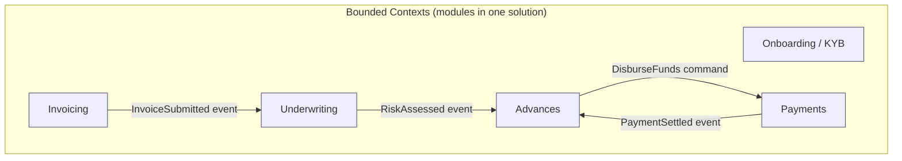
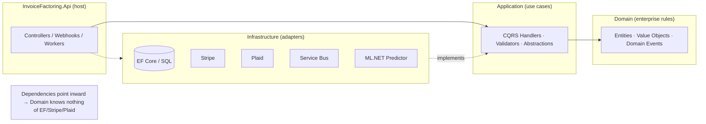
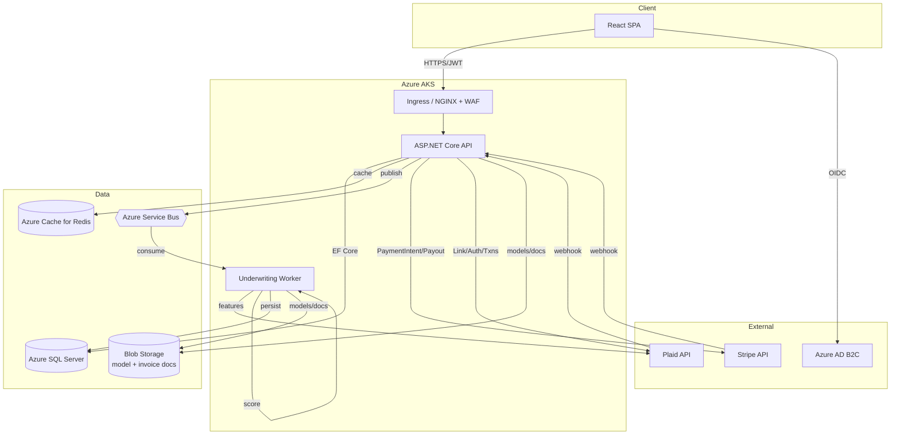
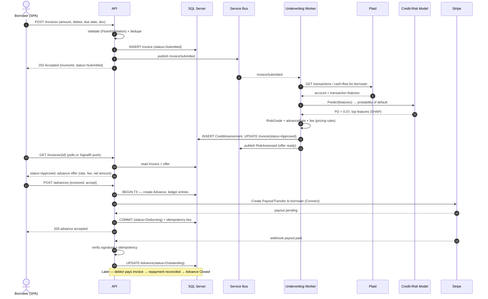
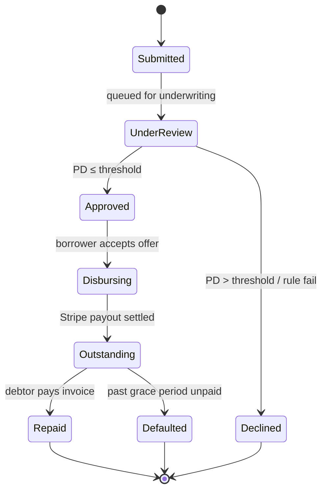
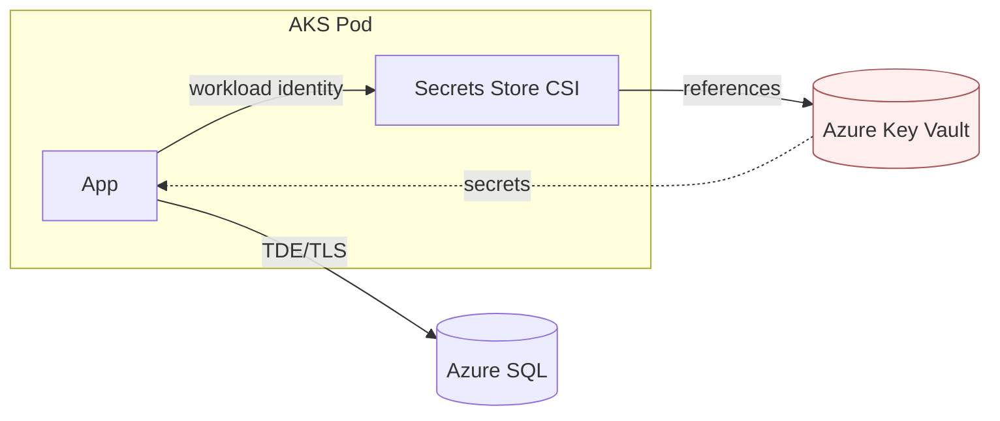
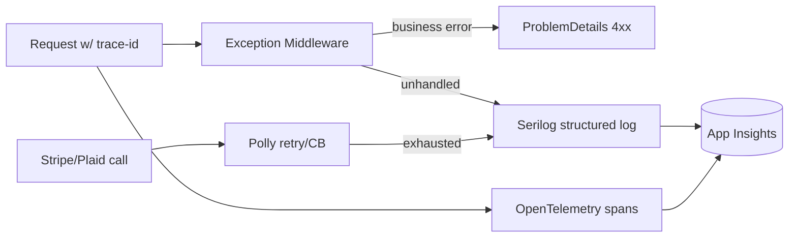

# Invoice Factoring Platform — Architecture

**Audience:** Engineers, SRE, security reviewers · **Last updated:** 2026-06-30

---

## 2.1 Chosen Architectural Pattern

### Decision: **Modular Monolith (Clean Architecture) + asynchronous underwriting workers**, deployed as containers on AKS.

The system is built as a **single deployable ASP.NET Core application** internally organized
into strict layers and bounded contexts (Onboarding, Invoicing, Underwriting, Advances,
Payments). Long-running and spiky work — ML scoring, Plaid enrichment, payment
reconciliation — is handled **asynchronously** through Azure Service Bus by background
workers hosted in the same image (toggled by role) or split into their own deployment.

### Why a modular monolith (and not microservices) at this stage

| Driver | Rationale |
| ------ | --------- |
| **Team size & velocity** | A single team ships fastest with one codebase, one deploy, atomic refactors across contexts. Distributed transactions across factoring + payments are notoriously hard — keeping them in-process avoids premature saga complexity. |
| **Strong consistency where money lives** | Advance + ledger + invoice state must update transactionally. A monolith gets ACID via SQL Server transactions; microservices would force eventual consistency on financial records. |
| **Async where it pays off** | Underwriting (ML + Plaid I/O) is bursty and slow, so it runs off a queue — giving microservice-style elasticity *for the part that needs it* without fragmenting the whole system. |
| **Clean Architecture = optionality** | Bounded contexts are isolated behind interfaces, so any context (e.g. Underwriting) can be extracted into its own service later with minimal churn. We adopt the *modular* discipline now and defer the *distributed* cost. |
| **AKS still fits** | Containerized on AKS we get autoscaling, rolling deploys, and a clear path to peeling off services — without paying the distributed-systems tax up front. |

> **Evolution path:** When underwriting or payments needs independent scaling/ownership,
> the module is promoted to a standalone service. The Service Bus contracts already exist,
> so extraction is a deployment change, not a redesign.

### Logical layering (Clean Architecture)

Dependencies point **inward**: `Infrastructure` and `Api` depend on `Application` and
`Domain`; `Domain` depends on nothing. Vendor SDKs (Stripe.net, Going.Plaid, ML.NET) are
referenced **only** in `Infrastructure`/`ML`, behind `Application.Abstractions` interfaces.

---

## 2.2 Key Component Interactions

| Interaction | Mechanism | Notes |
| ----------- | --------- | ----- |
| Browser → API | HTTPS REST + JWT bearer | OpenAPI-described; JSON; idempotency keys on money-moving POSTs |
| Browser → Auth | OIDC (Azure AD B2C) | SPA uses PKCE; API validates JWT |
| API ↔ Database | EF Core 8 over TDS | Repository + Unit-of-Work; transactions for financial writes |
| API → Underwriting | **Azure Service Bus** (async command/event) | Decouples slow ML + Plaid I/O from the request thread |
| API → Cache | Redis | Debtor risk lookups, dashboard aggregates, idempotency store |
| API ↔ Stripe | Stripe.net SDK + inbound webhooks | Disbursements (payouts/transfers), repayment intents |
| API ↔ Plaid | Plaid REST + inbound webhooks | Bank verification + transaction/cash-flow features |
| Worker → ML | In-process ML.NET `PredictionEnginePool` | Model loaded from Blob Storage, hot-swappable |

**Communication principles**

- **Synchronous** for user-facing reads/writes that need an immediate answer.
- **Asynchronous (events/commands over Service Bus)** for underwriting, payment
  reconciliation, and notifications — anything slow, retryable, or fan-out.
- **Webhooks** are the source of truth for external state (Stripe/Plaid); they are
  validated (signature), made **idempotent**, and translated into internal domain events.

---

## 2.3 Data Flow — Invoice submission → advance disbursement

The canonical "happy path": a borrower submits an invoice and receives a funded advance.

**State machine of an Invoice/Advance**

---

## 2.4 Scalability & Performance Strategy

| Concern | Strategy |
| ------- | -------- |
| **Stateless API** | API pods hold no session state → scale horizontally behind the AKS ingress. HPA on CPU + request latency; sessions/JWT carry identity. |
| **Spiky underwriting** | Decoupled via Service Bus. Worker deployment scales on **queue depth** (KEDA `azure-servicebus` scaler) independently of the API — month-end invoice surges drain without degrading user-facing latency. |
| **ML inference** | `PredictionEnginePool` (thread-safe, pooled) avoids per-request model load. CPU-bound LightGBM scoring is fast (sub-ms–low-ms); scoring co-located with the worker. Batch/retrain runs as a separate AKS Job on a spot node pool. |
| **Database** | Azure SQL Hyperscale: read replicas for reporting/dashboard reads; primary for writes. Proper indexing on `Invoice(CompanyId, Status)`, `Advance(Status)`. Pagination everywhere; no unbounded queries. |
| **Caching** | Redis for hot, read-heavy data (debtor risk snapshots, reference data, dashboard aggregates) and as the **idempotency** + rate-limit store. Cache-aside with short TTLs; events invalidate. |
| **Payload & N+1** | EF Core projections to DTOs (`Select`), `AsNoTracking` for reads, compiled queries on hot paths. Response compression + ETags. |
| **Async I/O** | All I/O is `async/await` end-to-end → high throughput per pod, no thread-pool starvation under Stripe/Plaid latency. |
| **Cost-aware scaling** | Cluster Autoscaler + node pools: general pool for API, **spot pool** for ML training jobs, scale-to-min off-peak. |

**Target SLOs (initial):** p95 API read < 200 ms · invoice submit (accepted) < 400 ms ·
end-to-end underwriting decision < 30 s (async) · 99.9% monthly availability.

---

## 2.5 Security Considerations

Fintech handling bank credentials, PII, and money movement — security is foundational.

### Authentication & Authorization
- **Azure AD B2C** (OIDC) for borrower identity; SPA uses **Authorization Code + PKCE**,
  no tokens in localStorage where avoidable (prefer in-memory + refresh via secure cookie).
- API validates JWT (issuer, audience, signature, expiry). **Role/policy-based**
  authorization (`Borrower`, `Underwriter`, `Admin`) plus **resource-based** checks so a
  borrower can only read *their* company's invoices.
- Service-to-service (worker → external) uses **Managed Identity**, not shared secrets.

### Data Protection
- **In transit:** TLS 1.2+ everywhere (ingress, DB `Encrypt=True`, all vendor calls).
- **At rest:** Azure SQL TDE; Blob Storage SSE; encrypted Redis.
- **PII / financial data:** column-level encryption (Always Encrypted) for tax IDs and
  bank tokens; **never store raw bank credentials** — Plaid `access_token` only, kept in
  Key Vault references. Stripe handles card/account data (we stay out of heavy PCI scope by
  not touching PANs).
- Data minimization + retention policy; right-to-erasure workflow for GDPR/CCPA.

### API Security
- Input validation (FluentValidation) on every command; output encoding on the SPA.
- **Idempotency keys** on all money-moving endpoints to prevent double-disbursement.
- Rate limiting (ASP.NET `RateLimiter` + ingress) and WAF (Azure Application Gateway/Front
  Door) for OWASP Top 10. CORS locked to known origins. Security headers (HSTS, CSP,
  X-Content-Type-Options).
- **Webhook verification:** Stripe signature (`whsec`) and Plaid JWT verification; reject
  unverified payloads; replay protection via event-id dedupe.

### Secret Management
- **Azure Key Vault** as the single source of secrets; AKS reads them via the **Secrets
  Store CSI driver** with a workload-identity-bound service account. No secrets in images,
  env files, or git. Local dev uses `.env` / .NET user-secrets only.
- Automated secret rotation; least-privilege RBAC on Key Vault.

### Auditing & Compliance
- Immutable **audit log** of every state transition on money/risk (who, what, when,
  before/after) — required for lending compliance and dispute resolution.
- ML underwriting decisions store **reason codes / feature attributions** to support
  **adverse-action notices** (US ECOA/Reg B) and fair-lending review.

---

## 2.6 Error Handling & Logging Philosophy

### Errors
- **Domain layer** throws/returns explicit domain errors (e.g. `InvoiceAlreadyFundedException`,
  or a `Result<T>` for expected business failures) — never leaks infrastructure exceptions.
- **Application layer** distinguishes *validation* (400), *not-found* (404),
  *conflict/business-rule* (409/422), and *unexpected* (500). A **MediatR pipeline behavior**
  runs validators and maps failures consistently.
- **API layer** has one global exception-handling middleware that converts everything into
  **RFC 7807 `ProblemDetails`** with a stable `traceId`. Stack traces are never returned to
  clients in non-dev environments.
- **External calls** (Stripe/Plaid/Service Bus) are wrapped with **Polly**: timeouts,
  retries with jittered backoff for transient faults, and **circuit breakers** to fail fast
  when a vendor is down. Money operations are **idempotent** so a retry can never
  double-charge or double-disburse.
- **Async/queue failures** use Service Bus retry + **dead-letter queue**; poison messages
  are quarantined and alerted, never silently dropped.

### Logging & Observability
- **Structured logging** (Serilog) — JSON, with a **correlation/trace id** propagated from
  ingress through API → Service Bus → worker, so one request is traceable across hops.
- **OpenTelemetry** traces + metrics exported to **Application Insights**; distributed
  traces span HTTP → DB → external calls.
- **Log levels:** `Information` for business milestones (invoice submitted, advance
  disbursed), `Warning` for handled/retried faults, `Error` for failures needing attention.
  **Never log secrets, full bank data, or PII** — scrub/redact at the sink.
- **Health checks:** `/health/live` (process) and `/health/ready` (DB, Redis, Service Bus,
  Stripe/Plaid reachability) feed AKS probes.
- **Alerting** on SLO burn (latency/error budgets), DLQ depth, payment-webhook failures,
  and ML drift/score anomalies.

