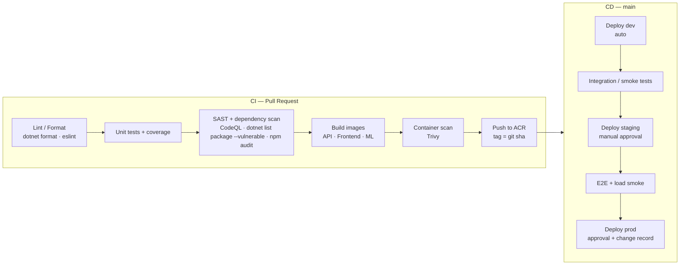
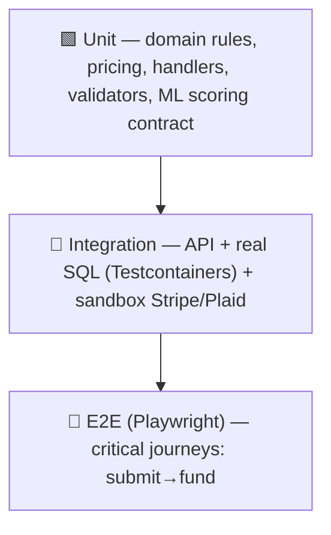
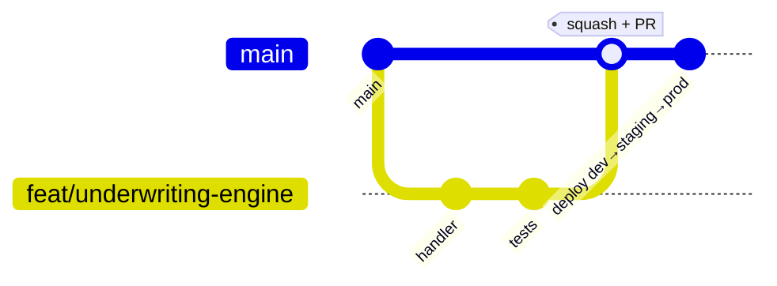

# Invoice Factoring Platform — Technical Notes

Actionable guidance for building, testing, shipping, and operating the platform.

---

## 3.1 CI/CD Pipeline Design (Azure DevOps)

Two pipelines: **CI** (every PR) gates merges; **CD** (on merge to `main`) promotes a single
immutable artifact through environments with approvals.



**Stages**

1. **Lint / static analysis** — `dotnet format --verify-no-changes`, `eslint`, `prettier
   --check`, `.editorconfig` enforcement. Fail fast (cheap).
2. **Test** — `dotnet test` (unit + architecture tests) with Coverlet coverage gate;
   `npm test` (Vitest). Publish results + coverage to the run summary.
3. **Security** — CodeQL (C#/JS), `dotnet list package --vulnerable --include-transitive`,
   `npm audit --audit-level=high`, Trivy on built images, secret scanning.
4. **Build** — multi-stage Dockerfiles produce small runtime images; tag with **immutable
   git SHA** (never `latest` for deploys). Push to **Azure Container Registry**.
5. **Deploy** — `kubectl`/Kustomize (or Helm) apply per environment. **The same image SHA**
   promotes dev → staging → prod (build once, deploy many).
6. **Post-deploy** — DB migrations as a pre-deploy Kubernetes **Job**; smoke tests against
   `/health/ready`; automatic rollback on failed readiness.

**Principles:** build artifacts once; environment differences come only from config/secrets;
prod requires a manual approval gate + linked change record; pipeline-as-code in
`.azuredevops/pipelines/`.

---

## 3.2 Testing Strategy

Follow the **test pyramid** — many fast unit tests, fewer integration tests, a handful of
E2E journeys.



| Level | Tooling | Targets / coverage |
| ----- | ------- | ------------------ |
| **Unit** | xUnit + FluentAssertions + NSubstitute (BE); Vitest + Testing Library (FE) | Domain logic (factoring math, risk grading, state transitions), CQRS handlers, validators. **≥ 80% line / ≥ 90% on `Domain` + pricing**. |
| **Architecture** | NetArchTest | Enforce Clean Architecture: Domain has no outward deps; Infrastructure not referenced by Application. |
| **Integration** | xUnit + **Testcontainers** (SQL Server) + WebApplicationFactory; Stripe/Plaid **sandbox** + recorded fixtures | Real EF Core migrations + queries, webhook handling, idempotency, transactional money writes. |
| **Contract** | Sandbox calls + snapshot of vendor payloads | Detect Stripe/Plaid schema drift early. |
| **E2E** | Playwright | Happy path (onboard → connect bank → submit invoice → accept advance) + auth + a decline path. Runs against staging. |
| **Load** | k6 / Azure Load Testing | Validate SLOs (p95 latency, underwriting throughput) before prod sign-off. |

**Conventions:** Arrange-Act-Assert; deterministic (no real network in unit tests; freeze
clock/ids); one logical assertion theme per test; tests run in CI on every PR and block merge.

---

## 3.3 Deployment Strategy

- **Containerization:** every service ships as a Docker image built with **multi-stage**
  builds (SDK build stage → slim `aspnet:8.0` / `nginx` runtime). Non-root user, read-only
  filesystem where possible, pinned base-image digests.
- **Orchestration:** **Azure AKS**. Manifests via **Kustomize** (`base/` + per-env
  `overlays/`). Each service: `Deployment` + `Service` + `HPA`; ingress via NGINX (or AGIC)
  with TLS from cert-manager / Key Vault.
- **Progressive delivery:** rolling updates by default; **blue-green or canary** (Argo
  Rollouts) for the API and payment paths so money flows are validated on a small slice
  before full cutover. Readiness probes gate traffic; failed rollout auto-rolls-back.
- **Database migrations:** run as a **pre-deploy Job** (EF Core bundle) — *expand/contract*
  pattern so schema changes are backward-compatible across the rolling window (add column →
  deploy code → backfill → drop later). Never destructive in the same release.
- **ML model deployment:** model artifacts versioned in Blob Storage; the app loads by
  version from config → roll a new model by changing config + restart (no image rebuild).
  Shadow/parallel scoring before promoting a new model to primary.
- **Secrets/config:** Key Vault + CSI driver; per-env values in Kustomize overlays /
  pipeline variable groups — **no secrets in images**.
- **Rollback:** `kubectl rollout undo` / previous image SHA; DB changes are
  forward-compatible so app rollback is safe.

---

## 3.4 Environment Management

Three long-lived environments — **dev** (auto-deploy, ephemeral data), **staging**
(prod-like, sandbox vendors), **prod** (real money, real data). Config precedence in .NET:
`appsettings.json` → `appsettings.{Env}.json` → environment variables → Key Vault (highest).

- Config is **per-environment, secrets are per-environment**, code is identical.
- Vite env vars must be `VITE_`-prefixed to reach the browser; **never** put server secrets
  there (they end up in the JS bundle).
- Local development uses `.env` + .NET user-secrets and the `docker-compose.yml` for SQL /
  Redis / Azurite. See the root **`.env.example`** for the full, documented template:

```dotenv
# excerpt — full file at repo root: .env.example
ASPNETCORE_ENVIRONMENT=Development
CONNECTIONSTRINGS__SQLSERVER=Server=localhost,1433;Database=InvoiceFactoring;User Id=sa;Password=Your_strong_Pass123;TrustServerCertificate=True
CONNECTIONSTRINGS__REDIS=localhost:6379
STRIPE__SECRETKEY=sk_test_xxx
STRIPE__WEBHOOKSECRET=whsec_xxx
PLAID__CLIENTID=xxx
PLAID__SECRET=xxx
PLAID__ENVIRONMENT=sandbox
ML__MODELPATH=./models/credit-risk-v1.zip
ML__SCORINGTHRESHOLD=0.35
VITE_API_BASE_URL=https://localhost:7080
VITE_STRIPE_PUBLISHABLE_KEY=pk_test_xxx
```

> `__` (double underscore) maps to nested keys in .NET config (`STRIPE__SECRETKEY` →
> `Stripe:SecretKey`), which is what makes env-var overrides line up with `appsettings.json`.

---

## 3.5 Version Control Workflow

**Recommended: Trunk-Based Development with short-lived feature branches.**



- **`main` is always releasable.** Branch `feat/*`, `fix/*`, `chore/*` off `main`, keep them
  short (< ~2 days), open a PR, **squash-merge** after green CI + review.
- **Why trunk-based (not Gitflow):** the platform deploys continuously to AKS; Gitflow's
  long-lived `develop`/`release` branches add merge overhead and delay integration. Trunk
  keeps integration continuous and pairs naturally with feature flags + the CI/CD above.
  Gitflow only earns its complexity with scheduled, versioned releases — not our model.
- **Protections:** required PR review, green CI, signed commits, linear history, no direct
  pushes to `main`. **Conventional Commits** drive changelog + semver of images.
- **Risky/unfinished work** hides behind **feature flags**, not long-lived branches, so it
  can merge to `main` safely.

---

## 3.6 Common Pitfalls (this stack)

**Payments / money (highest stakes)**
- **Non-idempotent disbursement** → double payouts. Always pass idempotency keys to Stripe
  *and* dedupe inbound webhooks by event id.
- **Trusting client-reported payment state.** The Stripe **webhook** is the source of truth,
  not the SPA redirect. Verify the signature; handle out-of-order/duplicate events.
- **Floating-point money.** Use `decimal` (and minor units / a `Money` value object), never
  `double`. Define rounding rules for fees explicitly.

**Plaid / banking**
- Storing the wrong token (use `access_token`, never raw credentials); not handling
  `ITEM_LOGIN_REQUIRED` re-auth; sandbox vs production data shape differences.
- Treating Plaid latency as instant — it isn't; do it async in the worker, not in the
  request path.

**ML underwriting**
- **Training/serving skew** — features computed differently in training vs inference.
  Compute features once, share the code path.
- **No explainability** → can't issue legally required adverse-action reasons. Capture
  feature attributions at scoring time.
- **Silent model drift.** Monitor PD calibration and input distributions; alert + retrain.
- Class imbalance (defaults are rare) — use proper metrics (AUC-PR, calibration), not raw
  accuracy.

**.NET / EF Core**
- **N+1 queries** and accidental client-side evaluation; missing `AsNoTracking()` on reads.
- **`async void`** and sync-over-async (`.Result`/`.Wait()`) → deadlocks/thread starvation.
- DbContext is **not thread-safe** — never share one across the parallel worker handlers;
  use scoped/pooled contexts.
- Long-running EF transactions holding locks under load.

**React / TypeScript**
- Leaking secrets into the bundle via non-`VITE_`-guarded config.
- Unmanaged server state (manual `useEffect` fetching) → races/stale data. Use **TanStack
  Query** for caching, retries, and invalidation.
- `any` creep eroding type safety; validate API responses at the boundary (zod) since the
  wire is untyped.

**Azure / AKS**
- Secrets baked into images instead of Key Vault + CSI.
- No resource `requests/limits` → noisy-neighbor evictions and unschedulable pods.
- Missing/mis-scoped readiness probes causing traffic to hit not-ready pods during deploys.
- Service Bus sessions/locks misconfigured → message reprocessing or stuck partitions.
