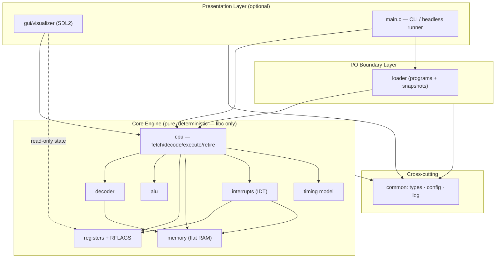
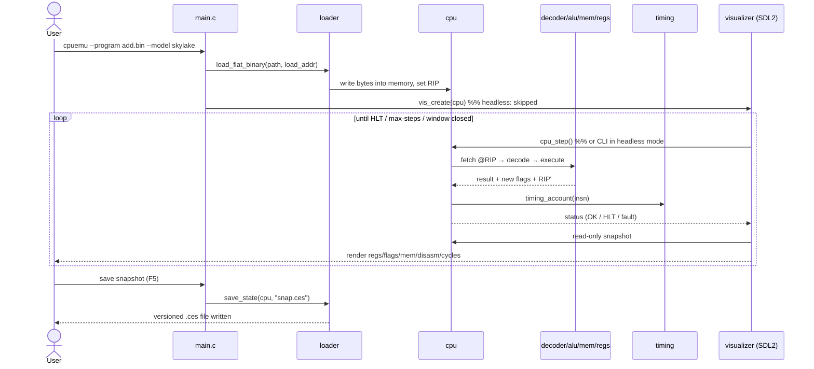
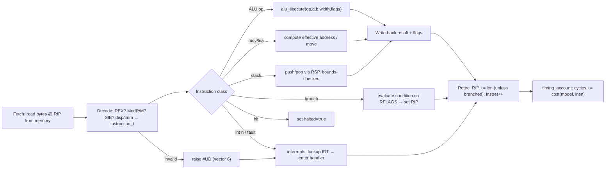
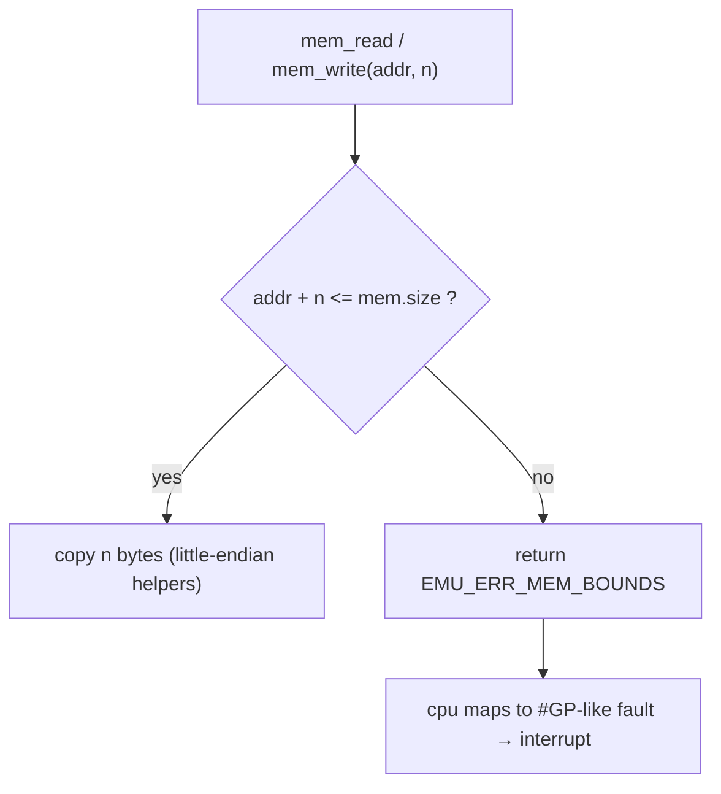
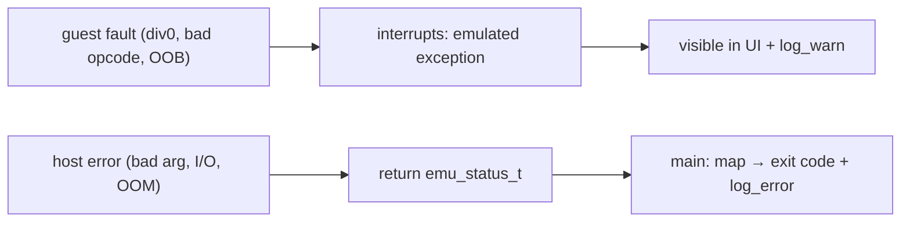

# Architecture — Custom CPU Emulator

This document describes the architecture of the emulator: the chosen pattern and
why, how components interact, how data flows, and the strategies for
performance, security, and error handling.

---

## 2.1 Chosen Architectural Pattern

**Pattern: Layered, Modular Monolith with a pure functional core (a "Clean/Hexagonal" core).**

The system is a single native process organized into strict layers whose
dependencies point **inward** toward a side-effect-free core engine:

### Why this pattern fits

- **Right-sized.** The product is a *single local interactive binary*, not a
  distributed service. Microservices, queues, or serverless would add network,
  serialization, and operational complexity with zero benefit. A monolith is the
  correct scale.
- **A pure core is the killer feature for an emulator.** Determinism is a
  *requirement*: the same program + same inputs must yield identical state and
  cycle counts every run. Keeping `core/` free of I/O, threads, and UI makes it
  reproducible, unit-testable, and snapshot-able.
- **Testability & teaching value.** Each concern (decode, ALU, flags, timing,
  interrupts) is an isolated module with a small header API, so it can be taught,
  tested, and reasoned about independently.
- **Swap-ability at the edges.** Because the GUI and loader only depend on the
  core (never the reverse), we can ship headless (CI), with SDL2, or later with a
  web/Wasm or remote front-end **without touching the engine**.

---

## 2.2 Key Component Interactions

All interaction is **in-process synchronous function calls** across header APIs —
there is deliberately *no* message queue, event bus, or database. The "contracts"
are the C headers; the "wire format" is plain structs.

| From → To            | Mechanism                        | Contract / Notes                                   |
|----------------------|----------------------------------|----------------------------------------------------|
| `main` → `loader`    | function call                    | `loader_load_flat_binary`, `loader_save/load_state`|
| `main`/`gui` → `cpu` | function call                    | `cpu_step`, `cpu_run`, `cpu_reset`                  |
| `cpu` → `decoder`    | function call                    | `decode_instruction(mem, rip) → instruction_t`     |
| `cpu` → `alu`        | pure function                    | `alu_execute(op,a,b,width,flags) → {result,flags}` |
| `cpu` → `registers`  | struct read/write                | width-aware `reg_read/reg_write`, flag get/set     |
| `cpu` → `memory`     | bounds-checked read/write        | returns `emu_status_t`; never traps the host       |
| `cpu` → `interrupts` | function call                    | `cpu_raise_interrupt(vector)` on fault/`INT n`     |
| `cpu` → `timing`     | function call                    | `timing_account(insn)` after each retire           |
| `gui` → `registers`  | **read-only** snapshot per frame | UI never mutates engine state except via `cpu_step`|
| any → `common/log`   | macro → vararg sink              | level filtered at runtime via `CPUEMU_LOG_LEVEL`   |

**Concurrency model.** The engine runs on one thread and is the single source of
truth. The optional GUI runs its event/render loop on the main thread and
*pulls* a read-only view of `struct cpu` each frame — there is no shared mutable
state across threads in v1, eliminating data races by construction. (A future
"run on a worker thread + double-buffered snapshot" design is noted in §2.4.)

---

## 2.3 Data Flow

### A. Program lifecycle (load → execute → visualize → persist)

### B. Single instruction: fetch → decode → execute → retire

### C. Memory access (the bounds-check guard)

> **Persistence note.** This emulator has no SQL database; its *durable state* is
> the machine snapshot. The "schema" is the versioned snapshot header plus the
> `register_file_t` + `memory_t` layout (see `loader.c` and `registers.h`). Data
> flows **state → loader (serialize) → .ces file → loader (deserialize) → state**.

---

## 2.4 Scalability & Performance Strategy

"Scalability" here means **extensibility** (more of the ISA, more CPU models) and
**throughput** (instructions emulated per host-second), not horizontal scaling.

**Extensibility (scale of features)**
- **Table-driven decode & dispatch.** New opcodes are rows in tables, not new
  control flow. New microarchitectures are new latency/throughput tables in
  `timing.c` — no engine changes.
- **Stable inward dependencies.** Adding SSE, paging, or a second front-end never
  forces edits to existing core modules (Open/Closed by layering).

**Throughput (scale of execution speed) — staged roadmap**
1. **v1: clean switch-based interpreter** (correctness first; current scaffold).
2. **Computed-goto / tail-call threaded dispatch** to cut branch-misprediction
   in the decode loop (often 1.5–3× over a `switch`).
3. **Decoded-instruction cache** keyed by guest address (skip re-decoding hot
   loops) + optional **hand-written NASM hot paths** (`src/asm/alu_fast.asm`).
4. **Block/trace JIT** (translate hot basic blocks of guest x86 to host code).
5. **Concurrency:** run the engine on a worker thread; the GUI consumes a
   lock-free **double-buffered snapshot** so rendering never stalls execution.

**Capacity knobs**
- Memory size is configurable (`--mem-size` / `CPUEMU_MEM_SIZE`); allocated once.
- Headless batch mode scales to many programs for regression/perf suites in CI.

---

## 2.5 Security Considerations

A CPU emulator's threat model is **"run untrusted guest code without harming the
host."** We treat every guest byte as hostile.

- **Authentication & authorization.** Not an exposed service — there is no
  network surface and no multi-user model in v1, so there is nothing to
  authenticate. *If* a remote-control/debug socket is ever added, it must bind to
  loopback only, require a token, and stay opt-in (documented as a non-default
  build flag). Until then, the safest posture is "no listening sockets."
- **Guest isolation (the core control).** Guest code executes only inside the
  emulator's interpreter; it **cannot** issue real host syscalls or touch host
  memory. Every guest memory access is **bounds-checked** (`mem_read/mem_write`),
  out-of-range access becomes an emulated fault, never a host crash. Division by
  zero, invalid opcodes, etc. are converted to emulated exceptions (#DE/#UD).
- **Data protection.** Snapshots may contain arbitrary guest memory; they are
  written with restrictive file permissions and a magic/version header, and the
  loader validates sizes **before** allocating/copying (no trust in file fields).
- **Input / "API" security.** The loader rejects oversized or malformed images;
  the decoder treats truncated/invalid encodings as #UD; all length math is done
  in `uint64_t`/`size_t` with overflow checks to prevent integer-overflow →
  out-of-bounds.
- **Host-side memory safety.** Build & CI run AddressSanitizer + UBSan and
  `-Wall -Wextra -Werror`; the headless path is checked under Valgrind. The
  emulator is the classic place where a guest can probe host UB, so this is
  non-negotiable.
- **Secret management.** The app has no secrets of its own. Runtime config comes
  from env vars / `.env` (see `.env.example`) — **never commit a real `.env`**;
  CI secrets (e.g., coverage tokens) live in the CI provider's secret store, not
  in the repo.
- **Supply chain.** Few dependencies (SDL2 + toolchain). The Docker build pins a
  base image; CI can run `cppcheck`/`clang-tidy` and dependency scanning.

---

## 2.6 Error Handling & Logging Philosophy

**Two distinct error domains — keep them separate:**

1. **Emulated (guest) faults** are *expected program behavior*, not bugs in the
   emulator. A guest dividing by zero must produce an emulated **#DE**, not a
   host crash. These flow through the **interrupt/exception** path (`interrupts`)
   and are visible in the UI/log as CPU exceptions.

2. **Host (emulator) errors** — bad CLI args, unreadable files, allocation
   failure, internal invariant violations — are reported via a single typed
   result enum and never via `exit()` deep in the call stack.

**Mechanics**
- Every fallible core/loader function returns **`emu_status_t`** (`EMU_OK`,
  `EMU_ERR_MEM_BOUNDS`, `EMU_ERR_DECODE`, `EMU_ERR_DIV_ZERO`,
  `EMU_ERR_INVALID_OPCODE`, `EMU_ERR_IO`, `EMU_ERR_NULL`, `EMU_ERR_HALT`).
  Callers **must** check it; the value bubbles up to `main`, which maps it to a
  process exit code and a human-readable message.
- **No silent failure, no `errno`-style globals** in the core. Pointers are
  validated at API boundaries (`EMU_ERR_NULL`).
- **Logging** is leveled (`log_trace … log_fatal`) and centralized in
  `common/log`. The level is set at runtime by `CPUEMU_LOG_LEVEL`, so production
  runs stay quiet while `trace` exposes the full F-D-E pipeline for teaching.
  Logs carry `file:line`; the core logs *facts* (decoded insn, raised vector),
  the edges log *outcomes* (loaded N bytes, snapshot saved).

**Mapping table (representative)**

| Condition                  | Emulated vector | `emu_status_t`           | Surfaced as            |
|----------------------------|-----------------|--------------------------|------------------------|
| Divide by zero             | #DE (0)         | `EMU_ERR_DIV_ZERO`       | UI exception + warn    |
| Invalid/truncated opcode   | #UD (6)         | `EMU_ERR_INVALID_OPCODE` | UI exception + warn    |
| Guest OOB memory access    | (#GP-like) 13   | `EMU_ERR_MEM_BOUNDS`     | UI exception + warn    |
| `HLT` executed             | —               | `EMU_ERR_HALT`           | clean stop, info       |
| File unreadable/oversized  | —               | `EMU_ERR_IO`             | `main` error + exit ≠0 |
| NULL/invalid argument      | —               | `EMU_ERR_NULL`           | assert/log + exit ≠0   |
