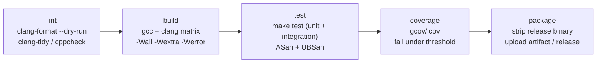

# Technical Notes — Custom CPU Emulator

Actionable engineering guidance for building, testing, shipping, and maintaining
the emulator with this C / NASM / SDL2 / Make / GDB stack.

---

## 3.1 CI/CD Pipeline Design

The pipeline is intentionally simple because the artifact is a **native binary**,
not a deployed service. Stages (see `.github/workflows/ci.yml`):



1. **Lint** — `make format` in check mode (`clang-format --dry-run -Werror`) plus
   `clang-tidy`/`cppcheck`. Fails fast on style/static-analysis regressions.
2. **Test (build matrix)** — compile with **both gcc and clang** under
   `-Wall -Wextra -Werror`; run unit + integration suites; one job builds with
   `-fsanitize=address,undefined` so guest-triggered UB in the host is caught.
3. **Coverage** — `gcov`/`lcov`; PRs fail below the line-coverage threshold for
   `core/` (target ≥ 85% — the engine is the part that *must* be correct).
4. **Package** — on tags, strip and upload the headless binary as a release
   artifact for Linux (and optionally a Wasm build); GUI builds are produced per
   platform where SDL2 is available.

> GUI tests don't need a display in CI: the core is tested headless, and SDL is
> exercised under `xvfb-run` or simply not built (`make core`) for the test jobs.

---

## 3.2 Testing Strategy

A correctness-first emulator lives or dies by its test suite.

- **Unit tests (`tests/unit/`)** with a **zero-dependency header harness**
  (`tests/test_framework.h`). Frameworks like Unity/Criterion are fine, but a
  tiny `ASSERT_*` set keeps the build trivial and portable.
  - `test_alu.c` — **golden flag truth tables**: for representative operands,
    assert CF/PF/AF/ZF/SF/OF exactly (cross-checked against real hardware / the
    Intel SDM). This is the highest-value test in the repo.
  - `test_registers.c` — sub-register aliasing: writing `AL` must not clobber the
    upper bits of `RAX`; writing `EAX` *zero-extends* into `RAX` (a real x86-64
    quirk worth a dedicated test).
  - `test_memory.c` — bounds rejection, little-endian width helpers, overflow of
    `addr + n`.
  - `test_decoder.c` — bytes → `instruction_t` for each supported encoding;
    truncated input → `EMU_ERR_DECODE`.
- **Integration tests (`tests/integration/`)** — load tiny programs into a real
  `cpu_t`, run to `HLT`, and assert **final register/flag state and cycle count**.
  Fixtures live in `tests/programs/*.asm` and are assembled by `make fixtures`
  (`nasm -f bin`). This is where the timing model gets validated against expected
  cycle counts (within a documented tolerance).
- **Differential testing (recommended next step).** For supported instructions,
  generate random operands and compare the emulator's result+flags against the
  *real* host CPU executing the same instruction (a tiny NASM stub). Any mismatch
  is a decoder/ALU bug. This finds far more than hand-written cases.
- **Property tests.** E.g. `decode(encode(x)) == x` for the encodings we emit;
  `push` then `pop` is identity; snapshot → restore round-trips state exactly.
- **Coverage targets.** `core/` ≥ 85% lines; `alu`/`decoder` ≥ 95% (they are
  pure and table-shaped — high coverage is cheap and essential). GUI is exempt.

---

## 3.3 Deployment Strategy

This is a **locally-run developer tool**, so "deployment" = distributing a binary.

- **Primary:** `make` produces `build/cpuemu`. `make install` copies it to
  `PREFIX` (default `/usr/local`). Releases attach prebuilt, **stripped** Linux
  binaries (headless + GUI) per Git tag.
- **Containerization (for reproducibility & CI, not for "serving").** The
  `Dockerfile` builds a pinned Ubuntu image with the toolchain + SDL2 so anyone
  gets byte-reproducible builds and the exact CI environment locally:
  ```bash
  docker build -t cpuemu .
  docker run --rm cpuemu --selftest          # headless smoke test
  ```
  For the GUI inside Docker, forward X11 (`-e DISPLAY -v /tmp/.X11-unix:/tmp/.X11-unix`).
- **Stretch — browser build.** Because the core is pure C with no host syscalls,
  it compiles cleanly to **WebAssembly** via Emscripten (`emcc`), and SDL2 maps
  to `<canvas>`. That yields a zero-install, shareable teaching demo — a strong
  fit for an educational tool. Tracked as a roadmap item.

---

## 3.4 Environment Management

Configuration is read from environment variables (12-factor style), with sane
compiled-in defaults from `common/config.h`. Local dev uses a `.env` file
(loaded by the shell / `make run`), **never committed**. Template:

```dotenv
# .env.example  — copy to .env and adjust;  .env is gitignored
CPUEMU_LOG_LEVEL=info        # trace|debug|info|warn|error|fatal
CPUEMU_CPU_MODEL=skylake     # 8086|i486|pentium|core2|skylake
CPUEMU_MEM_SIZE=1048576      # guest RAM in bytes (default 1 MiB)
CPUEMU_HEADLESS=0            # 1 = no SDL window (CI / scripting)
CPUEMU_MAX_STEPS=0           # 0 = unlimited; >0 = safety cap on instructions
CPUEMU_LOAD_ADDR=0x1000      # where flat binaries are loaded
CPUEMU_ENTRY=0x1000          # initial RIP
CPUEMU_SNAPSHOT_DIR=./snapshots
```

- **Precedence:** CLI flag > environment variable > `config.h` default. This lets
  CI pin behavior via env, while a developer overrides per-run on the command line.
- **Per-environment intent:** `dev` → `trace/debug` logging, GUI on; `staging/CI`
  → `info`, headless, deterministic seeds, sanitizers on; `prod/release` → `warn`,
  optimized, stripped.

---

## 3.5 Version Control Workflow

**Recommended: Trunk-Based Development with short-lived feature branches.**

- A single long-lived `master`/`main` that is **always green** (CI gate on PRs).
- Small branches (`feat/decoder-sib`, `fix/af-flag`, `docs/timing`) merged within
  a day or two via PR → squash merge. Keeps history linear and bisectable.
- **Why trunk-based here:** one or a few contributors, a single deliverable
  binary, no parallel release trains to maintain. Gitflow's release/hotfix branch
  ceremony would be pure overhead. (If formal versioned releases become a need,
  layer **release tags** + a `release/x.y` branch only when actually shipping LTS.)
- **Conventions:** Conventional Commits (`feat:`, `fix:`, `test:`, `docs:`,
  `perf:`, `refactor:`) to enable changelog generation; PRs require green CI +
  one review; SemVer tags (`vMAJOR.MINOR.PATCH`).
- **Bisectability matters for an emulator:** a single failing differential test
  should `git bisect` cleanly to one small commit — another reason to keep
  changes small and the trunk always-buildable.

---

## 3.6 Common Pitfalls (this stack & domain)

**x86 decoding**
- **Variable-length, prefix-heavy ISA.** Order matters: legacy prefixes → REX
  (0x40–0x4F) → opcode → ModR/M → SIB → displacement → immediate. The **REX.W**
  bit selects 64-bit operands; **REX.R/X/B** extend ModR/M/SIB register fields.
  Forgetting REX extension silently maps `R8..R15` to `RAX..RDI`.
- **ModR/M corner cases:** `mod=00, r/m=101` means **RIP-relative** (disp32), not
  `[RBP]`; `r/m=100` means "there's a SIB byte." These special cases cause most
  decoder bugs — cover them with explicit tests.

**ALU / flags (the subtle stuff)**
- **AF (auxiliary carry)** = carry out of bit 3; easy to forget, needed for BCD.
- **OF (overflow)** is *signed* overflow: `OF = (sign(a)==sign(b)) && (sign(res)!=sign(a))`
  for add; it is **not** the same as CF (unsigned carry). Mixing them is a classic bug.
- **PF (parity)** is computed over the **low 8 bits only**, always.
- **Operand width:** do all math in `uint64_t`, then **mask to 1/2/4/8 bytes** and
  compute flags on the masked result. Writing a 32-bit result must **zero-extend**
  to 64 bits (hardware behavior); writing 8/16-bit must **preserve** upper bits.

**C undefined behavior (an emulator pokes all of it)**
- **Shifts:** `x << n` / `x >> n` with `n >= width` is UB in C. Mask the count
  (`n & 63`) and special-case per operand width — exactly as the hardware does.
- **Signed overflow is UB.** Never compute flags by overflowing `int`; use
  unsigned types and derive OF from the sign bits explicitly.
- **Strict aliasing & unaligned access:** read/write guest words via `memcpy`
  into typed locals, not pointer casts, to stay defined and portable.

**Memory / endianness**
- x86 is **little-endian**; centralize all multi-byte load/store in `memory.c`
  width helpers so endianness lives in exactly one place.
- Always check `addr + n` for **overflow before** comparing to `size` (a huge
  `addr` can wrap past the bound check otherwise).

**SDL2 / GUI**
- SDL event polling and rendering should stay on the thread that created the
  window; don't render from the engine thread. Keep the GUI a **read-only view**
  and drive state changes through `cpu_step` (see `ARCHITECTURE.md §2.2`).
- Guard the entire SDL layer behind a build flag so the headless core (and CI)
  never needs the dependency.

**NASM / linking**
- **Calling conventions differ:** the bundled `alu_fast.asm` uses the **System V
  AMD64** ABI (args in RDI, RSI, RDX…). On Windows the convention is RCX, RDX, R8.
  The asm path is therefore optional (`CPUEMU_USE_ASM_ALU=1`) and Linux-first.
- Match object format to platform: `nasm -f elf64` (Linux), `-f win64` (Windows),
  `-f macho64` (macOS). Mismatches produce confusing link errors.

**GDB workflow**
- Build with `-g -O0` for debugging (`make debug`); `-O2` reorders code and
  optimizes locals away. Handy: `gdb --args build/cpuemu --program add.bin`,
  then break in `cpu_step` and watch `cpu->regs`.
