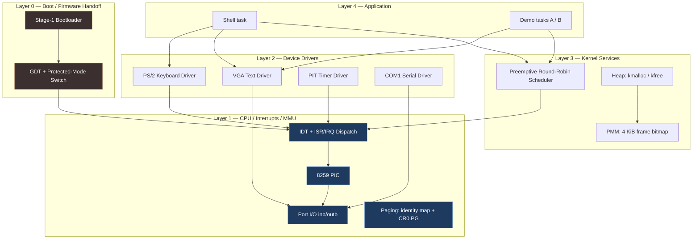
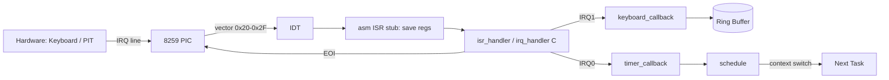
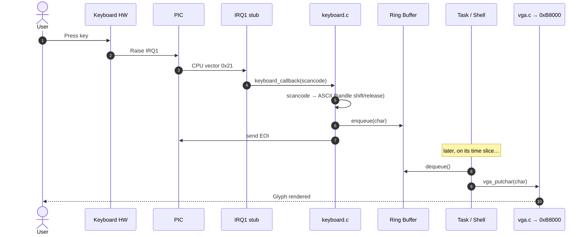
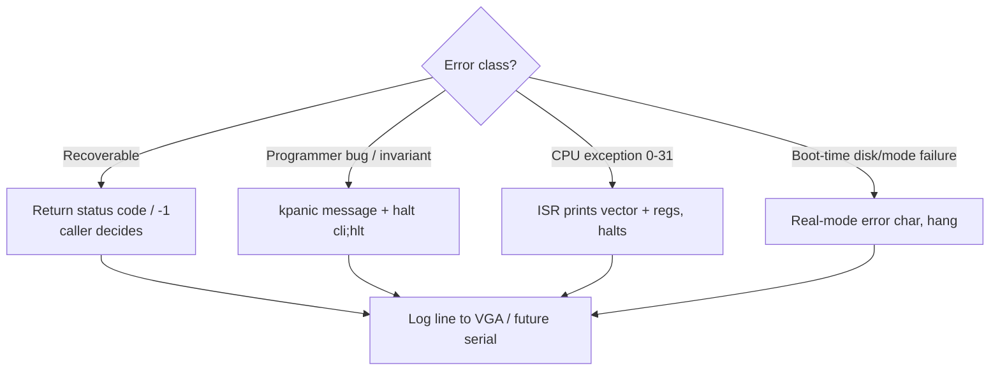

# Bootloader & Mini-OS — Architecture

## 2.1 Chosen Architectural Pattern

**Layered monolith with a privileged monolithic kernel.**

An operating-system kernel of this scope is the textbook case *against*
microservices, event buses, or serverless functions — there is no network, no
process isolation yet, and every "service" runs in the same address space at
ring 0. The right pattern is a **strictly layered monolith**, where each layer
may call *downward* but never *upward*, giving us a clean dependency graph
despite everything sharing memory.



### Why layered, not the alternatives

| Pattern | Verdict for this project |
|---------|--------------------------|
| **Layered monolith** ✅ | Single address space, ring 0, deterministic. Layers give testability and a clean call direction without IPC overhead we cannot afford pre-paging. |
| Microservices ❌ | Requires process isolation, an MMU, and a message transport we haven't built. Pure overhead for a teaching kernel. |
| Event-driven ⚠️ | We *do* use interrupts (hardware events), but globally event-sourcing the kernel would obscure the linear boot story students need to follow. Interrupts are an implementation detail inside Layer 1, not the top-level pattern. |
| Serverless ❌ | No host, no runtime, no scheduler-as-a-service. Nonsensical at ring 0. |

---

## 2.2 Key Component Interactions

There is **no network and no RPC**. Components interact through exactly three
mechanisms, all in-process:

1. **Direct function calls (downward through layers).** The dominant mechanism.
   `kernel_main` → `vga_print`; `scheduler` → `timer`; drivers → `outb`.
2. **Hardware interrupts (upward, asynchronous).** Devices signal the CPU; the
   IDT routes the vector to an assembly stub, which calls a C handler. This is
   the *only* way control flows "up" a layer — and it always lands in Layer 1's
   dispatcher first, never directly in application code.
3. **Shared in-memory tables (the "database").** The GDT, IDT, the scheduler's
   task array, and the heap free-list are global structures read/written by
   multiple subsystems under the protection of `cli`/`sti` critical sections.



### Memory map (the physical "wiring")

| Address | Contents | Set by |
|---------|----------|--------|
| `0x000000–0x0003FF` | Real-mode IVT (abandoned after PM switch) | BIOS |
| `0x0007C00` | Stage-1 bootloader (512 B, ends `0xAA55`) | BIOS loads it here |
| `0x0001000` | **Kernel load address / entry** | `boot.asm` `disk_load` |
| `0x0009000` | Real-mode then kernel stack (grows down) | `boot.asm` |
| `0x00B8000` | VGA text framebuffer (80×25×2 bytes) | hardware |
| `0x0100000` | Kernel heap region (1 MiB, reserved in the PMM) | `memory.c` |
| `0x0200000+` | Free physical frames handed out by the PMM | `pmm.c` |
| (kernel BSS) | Page directory + first page table (4 KiB-aligned, 8 KiB) | `paging.c` |

After `paging.c` runs, virtual address 0 maps onto physical 0 for the first
4 MiB (identity map), so every address above is both virtual and physical.

The bootloader's GDT at `0x7C00` is **discarded**: kernel BSS overgrows it, so
`gdt.c` rebuilds an identical flat GDT inside kernel memory at boot (otherwise
the first IRQ triple-faults reloading CS — see TECH-NOTES §3.6).

---

## 2.3 Data Flow

### Cold-boot sequence (firmware → first C instruction)

```mermaid
sequenceDiagram
    autonumber
    participant BIOS
    participant Boot as boot.asm @0x7C00
    participant Disk as BIOS int 0x13
    participant GDT as GDT / CR0
    participant Entry as kernel_entry @0x1000
    participant K as kernel_main (C)
    participant Out as VGA + COM1

    BIOS->>Boot: Load sector 1, jump (drive in DL)
    Boot->>Boot: Set segments, stack @0x9000, save boot drive
    Boot->>Disk: Read 50 sectors → 0x1000
    Disk-->>Boot: Kernel image in memory (CF=0)
    Boot->>GDT: lgdt; set CR0.PE=1
    Boot->>GDT: far jump CODE_SEG:init_pm (flush pipeline)
    GDT->>Entry: Reload DS/SS/ES, stack; jmp 0x1000
    Entry->>K: call kernel_main()
    K->>Out: vga_init(); serial_init(); kprintf("Mini-OS booting...")
    K->>K: PIC, IDT, PMM, paging, heap, scheduler, timer, keyboard
    K->>K: task_create(shell/A/B); sti; become idle task
    Note over K,Out: Banner on VGA + serial proves the handoff
```

### Steady-state input/output flow (the "request/response" of an OS)

A keypress is this kernel's equivalent of a user request; a character on screen
is the response.



### Scheduler tick (preemption)

The switch happens at *interrupt-return* time: the handler returns the next
task's saved stack pointer, and the assembly stub's `mov esp, eax` makes the
following `pop`/`iret` restore that task instead. One instruction is the entire
context switch.

```mermaid
sequenceDiagram
    participant PIT as PIT @100Hz
    participant Stub as IRQ0 stub (asm)
    participant Timer as timer.c
    participant IRQ as irq_handler
    participant Sched as scheduler.c

    PIT->>Stub: IRQ0 every 10ms (pushes register frame)
    Stub->>Timer: timer_callback()
    Timer->>Sched: scheduler_request_resched() (quantum elapsed)
    Stub->>IRQ: irq_handler(regs)  [EOI sent]
    IRQ->>Sched: scheduler_on_interrupt_return(esp)
    Sched->>Sched: save cur->esp ; pick next READY ; current = next
    Sched-->>Stub: return next->esp
    Stub->>Stub: mov esp,eax ; pop regs ; iret  (resumes NEXT task)
```

---

## 2.4 Scalability & Performance Strategy

"Scalability" for a kernel means *vertical* scaling within one machine and
*structural* room to grow features — not horizontal fan-out.

- **Deterministic O(1)/O(n_tasks) hot paths.** The scheduler is a fixed-size
  array scanned round-robin — no allocation on the tick path. Interrupt handlers
  do the minimum (enqueue + EOI) and defer work to task context, keeping
  interrupt latency low and bounded.
- **Zero-copy I/O.** VGA writes go straight to the `0xB8000` framebuffer; the
  keyboard path is a single-producer/single-consumer lock-free ring buffer.
- **Headroom for paging & multitasking.** The flat GDT and isolated `pmm.c`
  mean enabling paging later is additive, not a rewrite. The task struct already
  carries a saved register frame, so the jump from cooperative to fully
  preemptive multitasking is a context-switch implementation detail.
- **Build scalability.** Per-object compilation + a linker script means adding a
  subsystem is "drop a `.c` in, add to `OBJ`," with no monolithic recompile of
  hand-written assembly.
- **Known ceilings, made explicit.** The 512-byte boot sector loads a fixed
  sector count; the documented Phase-3 *stage-2 loader* lifts that ceiling when
  the kernel outgrows it. Naming the limit is the strategy.

---

## 2.5 Security Considerations

A ring-0 teaching kernel has no users, no network, and no secrets — so classic
AuthN/AuthZ does not apply *yet*. The security posture is instead about
**CPU-enforced isolation and defensive robustness**, framed in the standard
categories:

- **Authentication & Authorization → Privilege rings.** Today everything runs at
  ring 0 (DPL 0 descriptors in the GDT). The growth path is user-mode tasks at
  ring 3 with a separate stack and a `syscall` gate (DPL 3 IDT entry) — the
  kernel/user boundary *is* the authorization boundary.
- **Data Protection → Memory isolation.** The flat segmentation model offers no
  protection between tasks; the documented next step (paging, `pmm.c`) gives each
  future process its own address space so one task cannot corrupt another.
- **API Security → Validated interrupt/syscall surface.** The IDT is the kernel's
  "API gateway." Every gate has an explicit selector and type; CPU exception
  vectors (0–31) are installed with handlers so a fault is *caught*, not a silent
  triple-fault reboot. A future syscall ABI must validate all register-passed
  pointers/lengths before dereferencing.
- **Secret Management → N/A at ring 0, but build hygiene applies.** No secrets
  live in the kernel. `.env.example` carries only non-sensitive build/run knobs;
  nothing in this repo should ever hold credentials, and CI runs with no secrets.
- **Defensive robustness (the real "security" here):** disk-read error checks in
  `disk_load.asm`, bounds-checked ring buffer and heap, `-no-reboot
  -d int,cpu_reset` in debugging so faults are observable rather than masked.

> ⚠️ **Threat-model honesty:** this is educational. It has no exploit-resistant
> boundaries until paging and ring-3 land. Don't run it as anything but a QEMU
> toy.

---

## 2.6 Error Handling & Logging Philosophy

Bare metal has no `stderr`, no `errno`, no stack unwinding. The philosophy is
**fail loud, fail visible, never fail silent** — a silent failure here is a
triple-fault reboot that tells you nothing.



- **Three severity tiers.**
  1. *Recoverable* (e.g. allocation failure, empty buffer) → return a sentinel
     (`NULL`/`-1`); the caller handles it. No global state corruption.
  2. *Invariant violation* (e.g. corrupt free-list, scheduler with zero tasks) →
     `kpanic("message")`: print, then `cli; hlt`. Better a frozen, readable
     screen than a reboot loop.
  3. *CPU exceptions* (divide-by-zero, GPF, page fault) → dedicated ISRs print
     the vector number, error code, and a register dump, then halt.
- **Logging is layered and synchronous.** During boot, single-character BIOS
  prints (cheap, pre-C). After the VGA driver is up, structured `[OK]/[!!]`
  lines with color. Phase 3 adds a **COM1 serial logger** so CI and `qemu
  -serial stdio` can capture a transcript *without* screen-scraping `0xB8000`.
- **No swallowed errors.** Every `int 0x13` disk read checks the carry flag and
  the returned sector count. Every handler that gets an IRQ sends an EOI exactly
  once. The cardinal rule: an error must reach a human's eyes (screen or serial)
  before the CPU halts.
