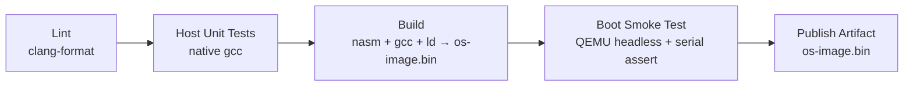

# Bootloader & Mini-OS — Technical Notes

Actionable, opinionated guidance for building, testing, and shipping this
bare-metal project. Read alongside `ARCHITECTURE.md`.

---

## 3.1 CI/CD Pipeline Design

There is no "deploy to prod" for an OS image — the artifact *is* the deliverable.
The pipeline's job is to guarantee the image **assembles, links, and boots**.



| Stage | Tooling | Gate / pass criterion |
|-------|---------|------------------------|
| **Lint** | `clang-format --dry-run --Werror`, `nasm -X gnu` warnings | No formatting drift; assembler warnings fail the build |
| **Test** | Native `gcc -std=c11` on `tests/` | All host unit tests exit 0 |
| **Build** | `make` (nasm `-f bin`/`-f elf32`, `gcc -m32 -ffreestanding`, `ld -T linker.ld`) | `os-image.bin` produced; size and `0xAA55` signature checked |
| **Boot smoke test** | `qemu-system-i386 -nographic -serial stdio` + `timeout` | Expected banner string captured on serial within N seconds |
| **Publish** | CI artifact upload | `os-image.bin` attached to the run (and to releases on tags) |

**Design principles**

- **Fail fast, cheapest-first.** Lint (ms) → host tests (sub-second) → build
  (seconds) → QEMU boot (slowest). A formatting nit never waits on QEMU.
- **Headless & deterministic.** `-nographic -no-reboot -no-shutdown`. Assert on
  **serial** output, never on a screenshot of `0xB8000` — pixels are flaky,
  text on COM1 is exact.
- **Pin the toolchain.** Build inside the repo `Dockerfile` (or apt-pin exact
  versions) so "works on my machine" == "works in CI". NASM and GCC codegen
  differences across versions can silently shift the boot sector.
- **`environments`, not branches, gate releases.** Tag `v*` → attach
  `os-image.bin` to a GitHub Release. There is no staging server; the
  "environments" are *QEMU* (every push) and *real hardware / a release image*
  (tags, manual approval).

---

## 3.2 Testing Strategy

A bare-metal project can't `import` itself into a test runner, so split testing
into **what runs on the host** and **what must run on the target**.

### Unit testing (host, native compiler) — fast, the bulk of coverage
- **Framework:** header-only assert harness (`tests/test_framework.h`). No
  external dependency — vital because the kernel links no libc. Optionally
  graduate to **Unity** or **Criterion** if the suite grows.
- **What to cover:** *pure logic* extracted to be platform-independent — the
  round-robin pick order, ring-buffer wrap-around, `kmalloc` free-list merging,
  `string.c`, `itoa`. These compile with native `gcc` and need no QEMU.
- **Coverage target:** **≥ 80 %** of `kernel/lib`, `kernel/sched`, and the
  allocator logic (the testable core). Hardware glue (`outb`, IDT loads) is
  *intentionally excluded* — you can't meaningfully unit-test `lidt`. **Measured
  at ~90 %** (line coverage) across the tested modules; reproduce with
  `gcc --coverage -fno-builtin tests/test_*.c <modules> && gcov <module>.c`.
  The uncovered remainder is unreachable-on-host code (e.g. `task_exit`'s halt
  loop), which the QEMU boot test exercises instead.
- **Tip:** guard hardware calls behind a thin seam (`port_io.h`) so tests link a
  mock `outb`/`inb`. Keep logic and I/O in separate translation units.

### Integration testing (target, QEMU) — proves the pieces fit
- **Boot smoke test:** boot under QEMU, assert the kernel banner reaches serial.
  This single test exercises the *entire* Layer 0–2 stack (disk load, GDT, PM
  switch, VGA/serial) end to end.
- **Scenario tests:** feed scripted keystrokes via QEMU monitor / `-serial`, and
  assert the echoed output — validates the IRQ → driver → buffer → screen path.

### End-to-end testing (the "user journey")
- **Tool:** `qemu-system-i386` driven by a `pexpect`/`expect` script, or
  QEMU's QMP socket for programmatic control.
- **Pattern:** boot → wait for prompt → send input → assert screen/serial state
  → check it survives a timer tick (no triple-fault). Run headless in CI with a
  hard `timeout` so a hang fails instead of blocking forever.

| Level | Runs where | Speed | Catches |
|-------|-----------|-------|---------|
| Unit | Host gcc | ⚡ ms | Logic bugs in scheduler/alloc/lib |
| Integration | QEMU | 🐢 seconds | Boot/handoff/driver wiring |
| E2E | QEMU + expect | 🐌 seconds+ | Whole input→output journeys |

---

## 3.3 Deployment Strategy

"Deployment" = producing a **bootable image** and getting it onto a boot medium.

- **Primary target — QEMU.** `qemu-system-i386 -drive
  format=raw,file=os-image.bin`. This *is* the default deployment; it's
  reproducible and CI-friendly.
- **The artifact:** `os-image.bin` = `boot.bin` (512 B, exactly one sector) **+**
  `kernel.bin` (flat-binary kernel), concatenated. Padded so the kernel starts
  on a sector boundary.
- **Containerization — for the *toolchain*, not the OS.** You don't containerize
  a kernel, but you *do* containerize the **build environment** (`Dockerfile`
  with pinned nasm/gcc/ld/qemu). This is the single biggest reliability win:
  every developer and CI runner uses byte-identical tools.
  ```bash
  docker build -t mini-os-build .
  docker run --rm -v "$PWD":/src mini-os-build make
  ```
- **Real hardware (optional, advanced):** `dd if=os-image.bin of=/dev/sdX` to a
  USB stick, or write a `.img` for a floppy. Strictly opt-in and dangerous
  (wrong `/dev/sdX` destroys a disk) — documented but never automated.
- **No blue/green, no rollback in the OS sense.** Versioning is handled by
  tagging releases and attaching the corresponding `os-image.bin`; "rollback" =
  boot the previous tagged image.

---

## 3.4 Environment Management

There are no runtime "environments" inside a kernel, so configuration is
**build-time** and **launch-time**, surfaced through the Makefile and `.env`.

- **Build-time config** lives in the Makefile and `linker.ld` (load address,
  sector count, optimization, cross-compiler prefix). Override per invocation:
  `make CC=i686-elf-gcc OPT=-O2`.
- **Launch-time config** is QEMU flags (memory size, graphics vs. `-nographic`,
  serial routing, debug logging).
- **`.env.example`** documents every knob. Copy to `.env` (git-ignored) and the
  Makefile/run script source it. Keys are *non-secret* by nature.

```dotenv
# .env.example — copy to .env (git-ignored) and adjust

# --- Toolchain ---
# Prefer a real cross-compiler. Falls back to host gcc with -m32 if unset.
CROSS_PREFIX=i686-elf-
CC=gcc
LD=ld
NASM=nasm

# --- Build ---
BUILD_DIR=build
OPT=-O2                # -O0 -g for debugging
KERNEL_SECTORS=15      # sectors boot.asm loads; raise as the kernel grows
KERNEL_LOAD_ADDR=0x1000

# --- QEMU run ---
QEMU=qemu-system-i386
QEMU_MEM=64M
QEMU_EXTRA=-no-reboot -no-shutdown
SERIAL=stdio           # route COM1 to terminal for logging/CI

# --- Debug (qemu -s -S + gdb) ---
DEBUG_PORT=1234
```

| Concern | Dev | "Staging" (CI) | "Prod" (release) |
|---------|-----|----------------|------------------|
| Toolchain | host or cross | pinned Docker image | pinned Docker image |
| Optimization | `-O0 -g` | `-O2` | `-O2` |
| Display | graphical QEMU | `-nographic` | n/a (image artifact) |
| Assertion | eyeball | serial string match | release checks |

---

## 3.5 Version Control Workflow

**Trunk-based development** with short-lived feature branches.

- **Why trunk-based, not Gitflow:** this is a small/solo educational codebase
  that progresses linearly through phases. Gitflow's `develop` + `release` +
  `hotfix` ceremony is pure overhead here. A protected `master`, branches that
  live hours-to-days, and CI gating every merge keeps history readable — which
  *matters* for a teaching repo people will read commit-by-commit.
- **Branch naming:** `feat/keyboard-driver`, `fix/disk-load-cf-check`,
  `docs/architecture`, `chore/ci`.
- **Every PR must:** pass lint + host tests + the QEMU boot smoke test before
  merge. No green pipeline, no merge to `master`.
- **Commit hygiene:** small, buildable commits. A bisect should never land on a
  commit that triple-faults. Conventional-commit prefixes (`feat:`, `fix:`,
  `docs:`) make the changelog self-writing.
- **Tags = releases:** `v0.1.0` when Phase 1 boots, `v0.2.0` at multitasking,
  etc. Each tag's CI publishes the matching `os-image.bin`.

```mermaid
gitGraph
   commit id: "boot banner"
   branch feat/protected-mode
   commit id: "gdt + pm switch"
   checkout master
   merge feat/protected-mode tag: "v0.1.0"
   branch feat/scheduler
   commit id: "round-robin"
   commit id: "timer preempt"
   checkout master
   merge feat/scheduler tag: "v0.2.0"
```

---

## 3.6 Common Pitfalls (x86 / NASM / GCC / QEMU)

Hard-won, stack-specific traps — each has cost someone a day:

- **`bits 16` vs `bits 32` mismatch.** Assembling 32-bit code as 16-bit (or vice
  versa) silently produces garbage that triple-faults. *One CPU mode per file*;
  put the `bits` directive at the top and never mix.
- **Forgetting the far jump after setting `CR0.PE`.** You **must** `jmp
  CODE_SEG:label` to flush the prefetch pipeline and load CS. A near jump leaves
  CS stale → instant fault. Classic week-one bug.
- **The kernel must install its OWN GDT — don't trust the bootloader's.** The
  boot GDT lives in the boot sector at ~`0x7C00`. The kernel loads at `0x1000`
  and its BSS (IDT, PMM bitmap, page tables) easily grows *past* `0x7C00` and
  silently overwrites that GDT. Nothing breaks immediately — CS/DS are cached in
  the hidden segment registers — until the **first hardware interrupt** forces
  the CPU to re-read the GDT to reload CS, which now finds garbage → `#GP`
  (error code = the code selector) → double → **triple fault / reboot**. Fix:
  `gdt_init()` rebuilds a flat GDT in kernel memory before `sti`. This bug is
  invisible to host unit tests and only surfaces in QEMU — it's exactly why the
  CI boot smoke test asserts on the *shell prompt* (post-context-switch), not
  just the pre-`sti` banner.
- **Linker order: `kernel_entry.o` must be first.** The bootloader jumps to
  `0x1000` blind. If your `_start`/entry stub isn't physically first in the
  link, you call into the middle of some other function. Enforce in `linker.ld`
  and the `OBJ` order in the Makefile.
- **Boot sector not exactly 512 bytes / missing `0xAA55`.** `times 510-($-$$)
  db 0` then `dw 0xAA55`. Off by one byte and BIOS/QEMU won't recognize it as
  bootable. Verify size in CI.
- **Host `gcc` injects stuff you can't have.** Without `-ffreestanding
  -nostdlib -fno-stack-protector -fno-pic`, GCC emits stack-canary calls, PLT
  references, or a `.note.gnu.property` that the bare-metal link can't resolve.
  Prefer an **`i686-elf` cross-compiler**; it removes a whole class of these.
- **`-fno-pie -no-pie` on modern distros.** Default-PIE toolchains generate
  position-independent code that breaks a fixed-load-address kernel. Pin it off.
- **Struct packing for descriptors.** GDT/IDT entries are hardware-defined bit
  layouts — forget `__attribute__((packed))` and the compiler inserts padding,
  corrupting the table. Triple-fault with no message.
- **Reading the keyboard data port without draining it.** Not reading `0x60`
  inside the IRQ1 handler leaves the controller's output buffer full → no
  further keyboard interrupts. Always `inb(0x60)`.
- **Missing PIC EOI.** Forget to write `0x20` to the PIC after an IRQ and that
  line (and lower-priority ones) never fire again. Symptom: "keyboard works
  once, then dies."
- **PIT/IRQ firing before the IDT is installed.** Enable interrupts (`sti`)
  *only after* the IDT and PIC remap are in place, or the first tick faults into
  an empty vector. Order: remap PIC → load IDT → unmask → `sti`.
- **QEMU caches a stale image.** If "nothing changed," you're likely booting an
  old `os-image.bin`. Make the run target depend on the build, and use `make
  clean` when in doubt.
- **Debugging a triple-fault blind.** Run `qemu-system-i386 -d
  int,cpu_reset -no-reboot` to see the faulting vector and the register state at
  reset instead of an endless reboot loop. This one flag turns "it reboots
  forever" into an actionable stack trace.
- **A20 line (mostly historical).** QEMU enables it for you, but on real
  hardware a disabled A20 wraps memory at 1 MiB. Know it exists before you test
  on metal.
