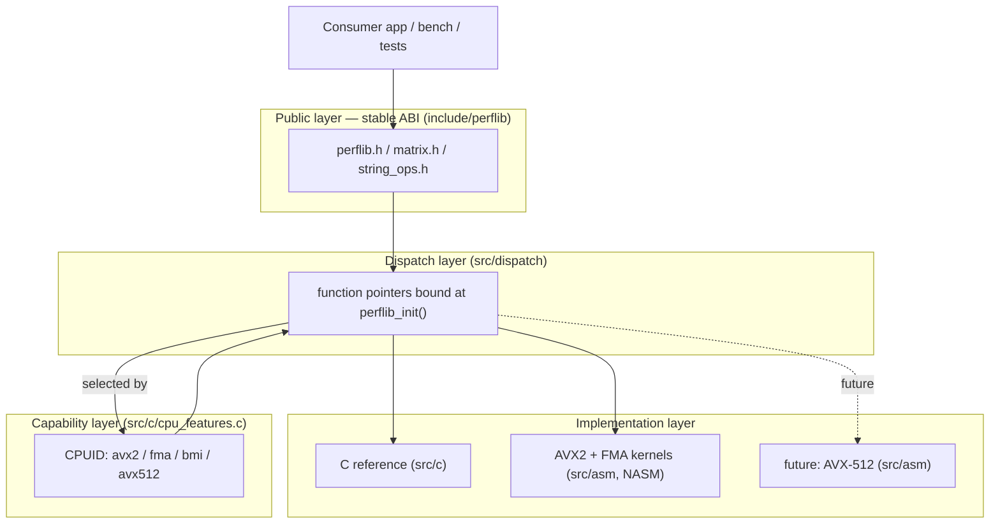
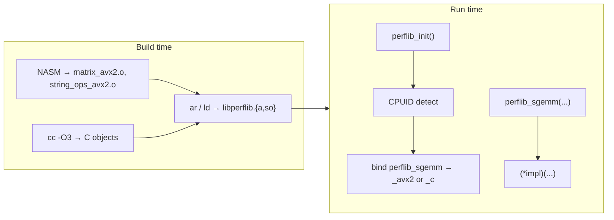
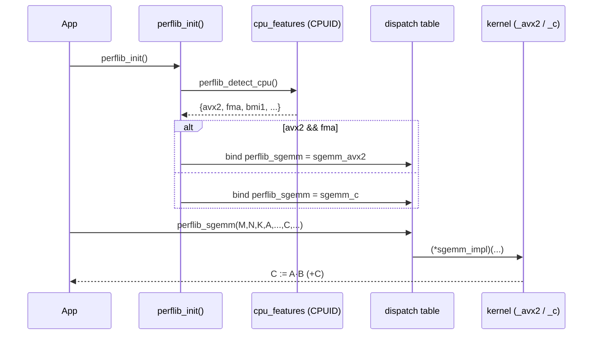
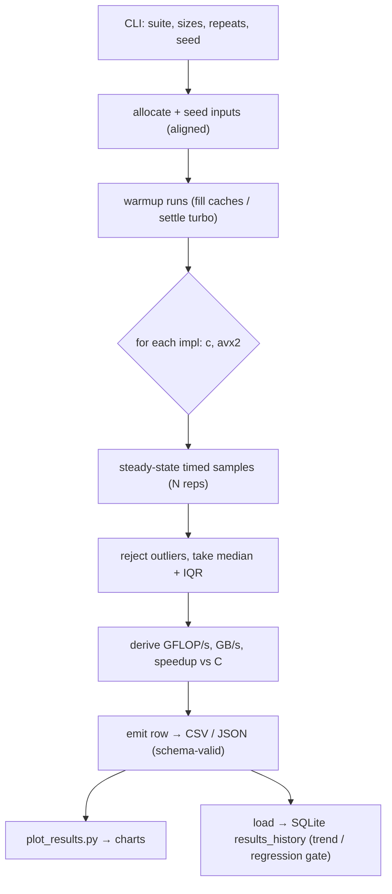

# Architecture — Performance-Critical Routines (`perflib`)

This document describes the architecture of `perflib`: a library whose "business
logic" is *speed*. The architecture exists to make three things cheap and
reliable: **selecting** the fastest legal implementation at runtime, **proving**
each hand-written kernel equals its C reference, and **measuring** the two
against each other honestly.

---

## 2.1 Chosen Architectural Pattern

**Pattern: Layered library with runtime strategy dispatch (a "fat binary" of
implementations behind a thin stable ABI).**

It is *not* microservices, serverless, or event-driven — those solve
distributed-systems problems this project does not have. A native compute
library has different forces:

- A **stable C ABI** is the integration surface (consumers link, they don't call
  over a network).
- The same logical operation has **multiple physical implementations** (scalar
  C, AVX2, future AVX-512) and the *correct* one depends on the **CPU at runtime**.
- **Correctness and performance are separable concerns** that must both be
  testable in isolation.

The pattern that fits is **layered**:

**Justification for this scale.** The library is a single linkable unit with a
handful of public symbols. A layered design gives clean seams (capability →
dispatch → implementation) without the operational tax of a distributed system.
The **Strategy pattern at the dispatch layer** is the one piece of genuine
runtime indirection, and it is exactly where the variability lives (which CPU,
which ISA). One `call` through a function pointer per top-level invocation is
negligible against kernels that run for microseconds to milliseconds.

---

## 2.2 Key Component Interactions

There are **no** network calls, message queues, or databases on the hot path —
all interaction is **in-process function calls**. The "communication" worth
documenting is *binding* (who points at whom) and *boundaries* (what is stable).

| Boundary | Mechanism | Stability |
|---|---|---|
| Consumer ↔ library | C function call across stable ABI | **Frozen** (SemVer) |
| Public symbol ↔ implementation | Function pointer set in `perflib_init()` | Internal |
| Dispatch ↔ capability | One-time `CPUID` query, cached | Internal |
| Library ↔ benchmark harness | Direct call to *both* `_c` and `_avx2` symbols | Internal/test |
| Bench ↔ results store | Emits JSON/CSV (schema-versioned) → optional SQLite | **Versioned** |

The dispatch layer exposes, for every routine, **three** symbols:

- `perflib_sgemm(...)` — public, dispatched (what apps call)
- `perflib_sgemm_c(...)` — explicit C reference (what tests/bench compare to)
- `perflib_sgemm_avx2(...)` — explicit AVX2 kernel (what tests/bench compare)

Exposing the explicit variants is deliberate: it lets the **test** layer assert
`avx2 == c` and the **bench** layer time them head-to-head, independent of
whatever the dispatcher would have chosen on the current machine.

---

## 2.3 Data Flow

### Initialization & dispatch (control flow)

### Benchmark data flow (the product's "main" use case)

The data itself is tiny and ephemeral: numeric matrices/strings generated from a
**fixed seed** (so runs are reproducible), processed entirely in memory, and the
only thing that *persists* is the **measurement record** — which is why the only
formal schema in the project describes a benchmark result, not the compute data.

---

## 2.4 Scalability & Performance Strategy

"Scalability" here means **scaling the work per core and scaling the library's
reach across CPUs**, not horizontal fan-out.

**Scaling performance of a single kernel**

- **Vectorization:** 8×`float` per AVX2 register; FMA folds multiply+add.
- **Register blocking:** keep a tile of `C` resident in `ymm` registers across
  the `K` loop to maximize arithmetic intensity (FLOPs per byte loaded).
- **Cache blocking:** tile `M/N/K` so reused panels of `A`/`B` stay in L1/L2 —
  this is what moves `sgemm` from memory-bound toward compute-bound.
- **Prefetching:** issue software prefetches for the next panel while computing.
- **Alignment:** 32-byte-aligned buffers enable `vmovaps` and avoid split loads.
- **AVX↔SSE hygiene:** `vzeroupper` before returning to avoid transition stalls.

**Scaling across hardware (reach)**

- **Runtime dispatch** means one binary runs correctly from an old Core 2
  (scalar path) to a modern AVX2 CPU (fast path), and is forward-compatible with
  an added AVX-512 path — no recompilation, no consumer changes.
- **Baseline floor:** the C reference is always built and always correct, so the
  library degrades gracefully rather than crashing on unsupported ISA.

**Roofline framing.** Each routine is classified as memory-bound (`saxpy`,
`strlen`, `memchr`) or compute-bound-once-blocked (`sgemm`). Benchmarks report
both GFLOP/s and GB/s so a result can be read against the machine's roofline,
making "are we near the limit?" answerable rather than guessed.

> Out of scope by design: multithreading. The library targets **single-core**
> peak; threading/NUMA is a layer a consumer composes on top (and would muddy
> the "asm vs auto-vectorizer" comparison this project exists to make).

---

## 2.5 Security Considerations

A native library has no auth/session model, but it has a real and often-ignored
attack surface: **untrusted sizes and buffers crossing the ABI**, and **supply
chain**.

- **Authentication & authorization** — *N/A at the library boundary.* The
  trust boundary is the calling process; `perflib` runs with the caller's
  privileges and makes no network or filesystem access on the hot path.
- **Memory safety / input validation (the real risk surface):**
  - Treat all pointer/length arguments as untrusted: validate non-negative
    dimensions, reject overflowing `M*N`, `n*sizeof(float)` computations.
  - String kernels are **page-boundary aware** — aligned 32-byte loads never
    span a page they shouldn't, so `strlen`/`memchr` cannot fault past the
    terminator. This invariant is tested explicitly (string at end of a guard
    page).
  - No out-of-bounds writes: the masked `sgemm` epilogue must store only valid
    columns, never the padded tail.
- **API / ABI security:** stable, documented ABI; no hidden global mutable state
  beyond the one-time-initialized dispatch table (set before first use, then
  read-only → no data races).
- **Secret management:** the library holds no secrets. *CI* secrets (release
  token, package signing key) live only in GitHub Actions encrypted secrets and
  are never echoed; release artifacts are checksummed (`sha256`) and, optionally,
  signed.
- **Supply chain:** pinned toolchain versions in CI and `Dockerfile`; minimal
  dependencies (libc + assembler only); reproducible build flags recorded in the
  benchmark metadata so a result is attributable to an exact toolchain.

---

## 2.6 Error Handling & Logging Philosophy

A microsecond kernel cannot afford branches, allocation, or logging on the hot
path. The strategy is therefore **layered by cost**:

| Layer | Failure mode | Strategy |
|---|---|---|
| **Kernels (hot path)** | Bad input is a *programming* error | **No internal error handling.** Documented preconditions (non-null, aligned-or-not, valid sizes). Violations are UB — caught by tests/asserts in debug, never checked in release. Kernels are pure: no I/O, no `errno`, no logging. |
| **Public API edge** | Caller mistakes | Lightweight contract checks compiled with `assert()` in **debug** builds (`-DPERFLIB_DEBUG`); compiled out in release. Return values where meaningful (e.g., `perflib_init()` returns selected ISA). |
| **Init/dispatch** | No supported fast path | Always succeeds — falls back to C reference. `perflib_init()` reports which path was chosen so the caller can log it once. |
| **Bench/test harness (cold path)** | Anything | Full, *loud* error handling: validate CLI, check allocations, fail fast with a clear message and non-zero exit. This is where logging lives. |

**Logging philosophy:** the *library* does not log. The *harness* logs to
`stderr` in a structured, greppable form (`level=… routine=… size=… msg=…`) and
emits machine-readable results to files. This keeps the shippable artifact silent
and dependency-free while keeping the development feedback loop verbose.

**Determinism over recovery.** For a numeric library, the most valuable
"error handling" is *reproducibility*: fixed RNG seeds, recorded toolchain/flags,
and ULP-bounded equivalence checks turn "it's slightly wrong sometimes" into a
hard, debuggable CI failure rather than a silent drift.
