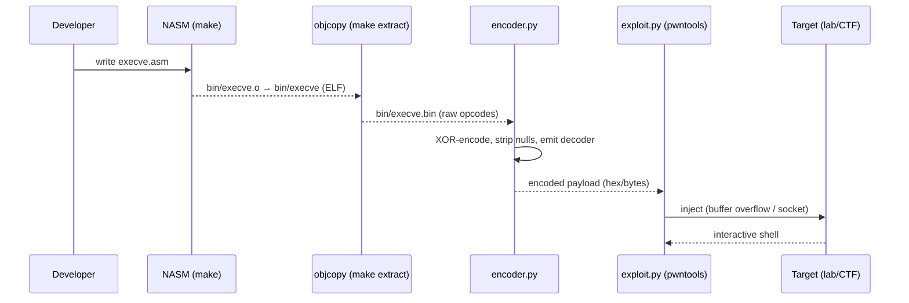

# Architecture: Shellcode Development

## 2.1 Chosen Architectural Pattern — Pipeline / Toolchain

A shellcode project is a **build pipeline**, not a service. Source (`.asm`) flows
through deterministic transformations — *assemble → extract → encode → deliver* —
to produce an exploit payload. This pattern fits because correctness depends on
**reproducibility**: every byte of the payload must be inspectable and testable
in CI, not generated by a long-running process.

(Traditional layered / microservice / event-driven patterns are **N/A** here;
there is no API, message queue, or database. Those sections are omitted.)

## 2.2 Key Component Interactions

There is no network RPC or event bus. Components communicate **through the
filesystem** — each stage reads a file the previous stage wrote:

| Stage | Tool | Input → Output |
|---|---|---|
| Assemble | `nasm` | `src/shellcode/*.asm` → `bin/*.o` (ELF64 object) |
| Link | `ld` | `bin/*.o` → `bin/<name>` (ELF executable) |
| Extract | `objcopy` | `bin/<name>` → `bin/<name>.bin` (raw `.text` bytes) |
| Encode | `scripts/encoder.py` | `bin/<name>.bin` → null-free payload + decoder stub |
| Deliver | `scripts/exploit.py` (pwntools) | payload → local process or remote socket |

## 2.3 Data Flow

## 2.4 Scalability & Performance Strategy

- **Scalability = breadth, not load.** The pipeline scales by adding payload
  modules under `src/shellcode/`; the wildcard `Makefile` picks them up
  automatically. New architectures (ARM/MIPS) slot in as parallel source trees
  sharing the same `scripts/` and `tests/`.
- **Performance is irrelevant at runtime** (shellcode is microseconds of native
  code). The interesting metric is **build latency**, kept low by `nasm` + `ld`
  (milliseconds) and parallelizable CI.

## 2.5 Security Considerations

This project *is* a security artifact, so the considerations are about handling
it responsibly, not adding authn/authz to a service:

- **Execution environment:** all payload execution happens in an isolated
  container or VM. The `Dockerfile` is the lab; never run extracted shellcode on
  a host you care about.
- **Secret management:** CTF target IPs/ports and tokens live in `.env` (git-
  ignored) and are injected into CI via repository secrets — never committed.
- **Opsec / detection:** Phase 3 adds polymorphic encoders so the payload
  defeats naive byte-signature AV/EDR. This is for *understanding* detection,
  not for evading defenders in the wild.

## 2.6 Error Handling & Logging Philosophy

- **Assembly level:** development uses `int3` traps and `strace` to trace
  syscalls. A failed payload segfaults loudly rather than failing silently —
  that segfault *is* the error signal.
- **Python level:** pwntools `context.log_level` (set via `LOG_LEVEL` in `.env`)
  drives verbosity; `exploit.py` warns explicitly when null bytes are present
  and refuses to build a silently-broken payload without a `--force`.
- **CI level:** the pipeline fails fast — assemble errors, null-byte regressions,
  or length-budget overruns each fail the build with a clear message.
