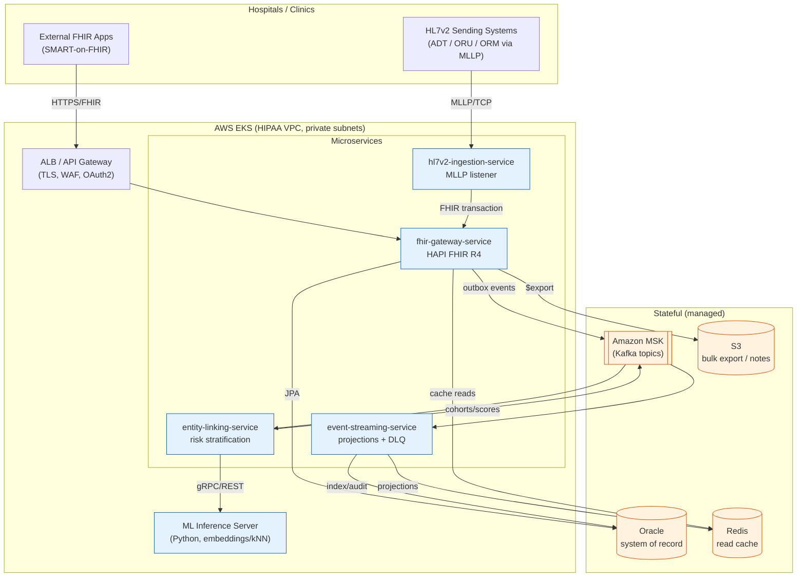
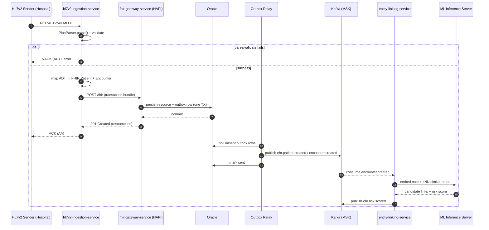
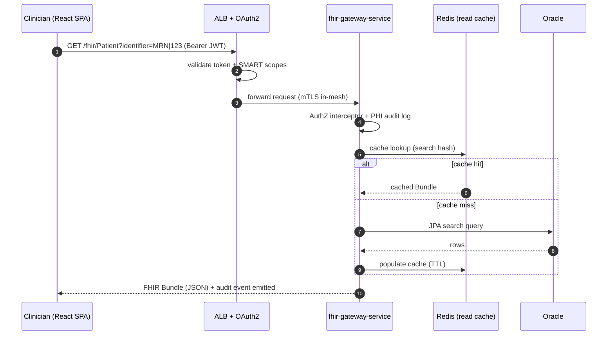
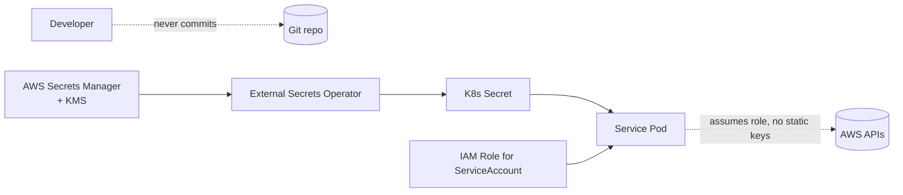
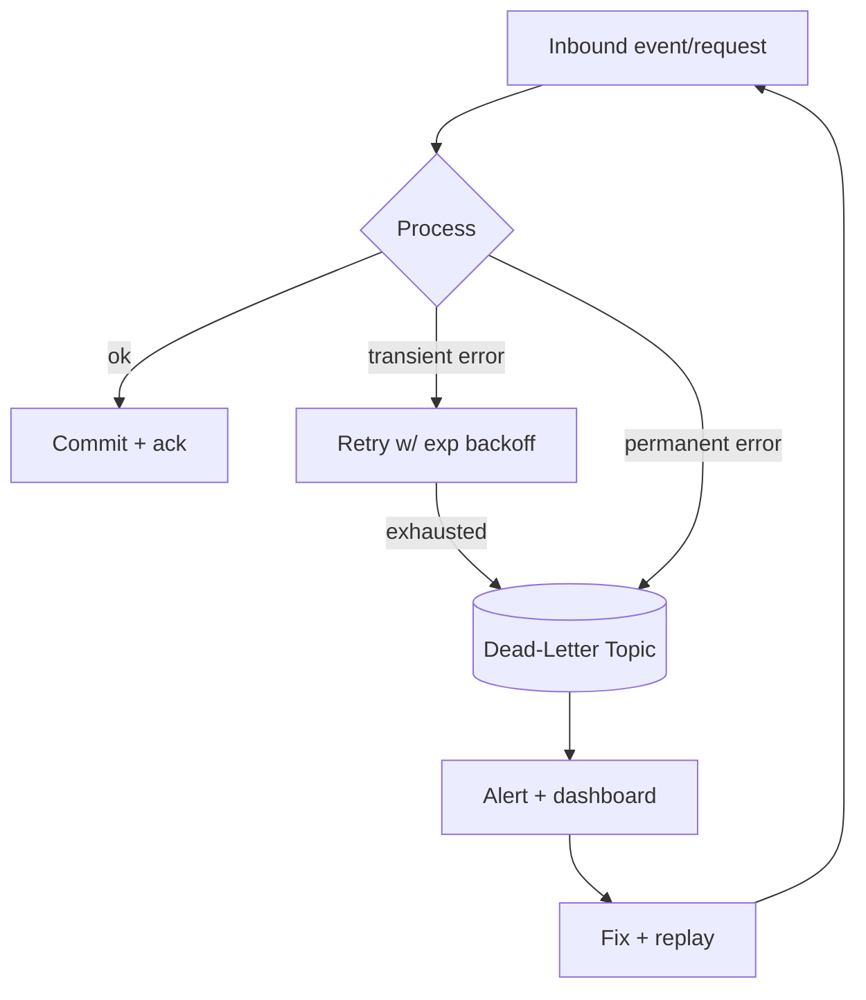

# EHR Integration Platform — Architecture

This document describes the system architecture, component interactions, data
flows, and the cross-cutting strategies for scalability, security, and
observability.

---

## 2.1 Chosen Architectural Pattern

**Event-driven microservices** with a **transactional outbox** and **CQRS-style
read projections**, deployed on **AWS EKS**.

### Why this pattern

Healthcare integration has three properties that dominate the design:

1. **Heterogeneous, bursty inputs.** HL7v2 feeds arrive over long-lived MLLP
   sockets; FHIR clients call synchronous REST. These have wildly different
   throughput, latency, and failure characteristics and must scale and fail
   independently.
2. **Asynchronous fan-out.** A single admission (HL7 `ADT^A01`) must update the
   system of record, notify downstream subscribers, refresh search indexes, and
   trigger ML re-scoring. A message bus (Kafka) decouples producers from an
   open-ended set of consumers.
3. **Auditability & eventual consistency are acceptable** for analytics/ML, while
   the FHIR API needs strong consistency for the record itself. CQRS lets the
   write side stay authoritative (Oracle) while read models are rebuilt from the
   event log.

| Alternative considered | Why not |
|---|---|
| **Layered monolith** | Couples MLLP ingestion to the FHIR API lifecycle; one slow HL7 feed degrades clinician-facing reads. Hard to scale ML independently. |
| **Pure serverless (Lambda)** | MLLP needs long-lived TCP connections; HAPI FHIR server is a stateful long-running process. Cold starts hurt sub-second FHIR SLAs. EKS chosen for HIPAA control maturity + persistent workloads. |
| **Microservices without a bus (REST mesh)** | Synchronous fan-out creates tight temporal coupling and cascading failures; retries/back-pressure become bespoke per call. Kafka gives durable buffering + replay. |

### Service catalog

| Service | Responsibility | Sync API | Async role |
|---|---|---|---|
| `fhir-gateway-service` | FHIR R4 system-of-record API (HAPI) | REST/FHIR | Outbox **producer** |
| `hl7v2-ingestion-service` | Parse HL7v2, map to FHIR, persist | MLLP (inbound) | Calls gateway / publishes |
| `event-streaming-service` | Kafka topology, projections, DLQ | — | **Producer + consumer** |
| `entity-linking-service` | ML entity linking + risk stratification | REST | (corpus fed via API; event consumption is the documented evolution) |
| `frontend` | Clinician console (SPA) | REST → gateway + ML | — |

> **Implementation status.** The gateway, HL7 ingestion (ADT/ORU → FHIR), the
> transactional outbox → Kafka relay, the event-streaming CQRS projection
> (+ DLQ), and the entity-linking REST scorer are implemented and tested. The
> entity-linking service currently exposes synchronous REST scoring and accepts
> notes via an ingest API; wiring it as a Kafka consumer (auto re-score on
> encounter events) is the documented next step. The ML model is a real,
> in-process cosine-kNN over note TF vectors; a remote embedding server is the
> production scale-out.

---

## 2.2 Key Component Interactions

**Interaction styles**

- **Synchronous REST/FHIR** — clinician console and external SMART apps call the
  gateway through the ALB (TLS + OAuth2 + WAF). Used where the caller needs the
  authoritative answer *now* (read a chart, create an order).
- **MLLP (TCP)** — legacy HL7v2 senders hold long-lived sockets to the ingestion
  service, which returns `ACK`/`NACK` per message (HL7 lower-layer protocol).
- **Message queue (Kafka/MSK)** — the durable spine. The gateway writes domain
  changes to an **outbox** table in the same DB transaction as the resource;
  a relay publishes them to Kafka, guaranteeing *at-least-once* delivery with no
  dual-write inconsistency.
- **Event bus fan-out** — `event-streaming-service` and `entity-linking-service`
  subscribe independently. New consumers can be added without touching producers.
- **Direct DB access** — **only** `fhir-gateway-service` owns the Oracle schema
  (database-per-service ownership). Other services consume events or call the
  gateway API — never the DB directly.

---

## 2.3 Data Flow

### Flow A — Inbound HL7v2 admission → FHIR + downstream fan-out

### Flow B — Clinician reads a patient chart (synchronous)

**Narrative.** Data enters either as legacy HL7v2 (Flow A) or as native FHIR
writes. The gateway is the single writer to Oracle and the single source of
domain events. Everything downstream — search projections, caches, ML scoring —
is derived from the event log and can be **rebuilt by replaying Kafka**. Reads
are served from the authoritative store with a Redis read-through cache for hot
paths.

---

## 2.4 Scalability & Performance Strategy

| Concern | Strategy |
|---|---|
| **Independent scaling** | Each service is a separate Deployment with its own HPA (CPU + custom Kafka-lag metric via KEDA). FHIR reads scale on RPS; ML scales on consumer lag. |
| **Back-pressure & buffering** | Kafka absorbs ingestion spikes; consumers pull at their own rate. MLLP listener bounds in-flight messages and applies flow control. |
| **Stateless services** | All services hold no session state → horizontal scale-out is linear. State lives in Oracle, MSK, Redis. |
| **Partitioning** | Kafka topics partitioned by patient id → per-patient ordering preserved while parallelizing across patients. |
| **Read scaling (CQRS)** | Hot reads served from Redis projections; Oracle protected by cache + read replicas for analytics. |
| **DB performance** | FHIR search params indexed in Oracle; HAPI's `HFJ_*` index tables tuned; connection pooling via HikariCP. |
| **ML isolation** | Embedding/kNN runs in a dedicated inference server (GPU node group) so model latency never blocks FHIR/ingestion. |
| **Bulk operations** | FHIR `$export` writes NDJSON to S3 asynchronously instead of streaming through the API. |
| **EKS elasticity** | Cluster Autoscaler / Karpenter; separate node groups for general, memory-heavy (Oracle clients), and GPU (ML). |

**Targets (initial SLOs):** FHIR read p95 < 300 ms; FHIR write p95 < 600 ms;
HL7→FHIR end-to-end p95 < 2 s; ingestion sustained ≥ 500 msg/s/partition.

---

## 2.5 Security Considerations

Healthcare data is **PHI** — security is a first-class, non-negotiable concern
(HIPAA Privacy & Security Rules, HITECH breach notification).

### Authentication & Authorization
- **OAuth2 / OIDC** with **SMART-on-FHIR** scopes (`patient/*.read`,
  `user/Observation.read`, …). JWTs validated at the ALB and re-validated in-app.
- **RBAC + ABAC**: role (clinician, admin, system) plus attribute checks
  (treating relationship, organization, purpose-of-use).
- **Service-to-service**: mTLS inside the mesh; workloads authenticate to AWS via
  **IRSA** (IAM Roles for Service Accounts) — no static cloud keys.

### Data protection
- **Encryption in transit**: TLS 1.2+ everywhere; MLLP wrapped in TLS or run only
  over private links/VPN from sending facilities.
- **Encryption at rest**: Oracle TDE, MSK encryption, EBS/S3 with **KMS** CMKs;
  field-level encryption for the most sensitive identifiers.
- **Minimum necessary / de-identification**: ML pipelines operate on
  de-identified or tokenized notes where possible; re-identification keys are
  segregated.
- **PHI audit trail**: every read/write of PHI emits an immutable audit event
  (who, what, when, why) — append-only, exportable for HIPAA accounting of
  disclosures.

### API security
- WAF (OWASP rules) + rate limiting at the edge; strict input validation against
  FHIR profiles/`StructureDefinition`s.
- No PHI in URLs, logs, or error messages; FHIR `OperationOutcome` returns safe,
  non-leaking error detail.
- CORS locked to known SPA origins; CSP + security headers on the frontend.

### Secret management
- **AWS Secrets Manager** + **External Secrets Operator** sync into K8s; secrets
  mounted as files/env at runtime, **never** committed. KMS-encrypted, rotated.
- Local dev uses `.env` (git-ignored) seeded from `.env.example` with dummy
  values only.

---

## 2.6 Error Handling & Logging Philosophy

**Principles:** fail loud internally, fail safe externally, never leak PHI, and
make every failure traceable end-to-end.

### Error handling
- **Typed exception hierarchy** in `common` (`EhrPlatformException` →
  `ResourceNotFound`, `ValidationException`, `IntegrationException`, …).
- **FHIR boundary**: all errors render as a FHIR `OperationOutcome` with an
  appropriate `issue.severity`/`code`; HTTP status mapped consistently
  (`404 not-found`, `422 invalid`, `409 conflict`).
- **HL7v2 boundary**: parse/validation failures return `NACK` (AR/AE) with a
  diagnostic segment; the original message is preserved for replay.
- **Kafka boundary**: retry with backoff → **Dead-Letter Queue** after N attempts;
  DLQ messages carry full failure context and are replayable after a fix.
- **Idempotency**: consumers are idempotent (dedupe by event id) since delivery is
  at-least-once; producers use the outbox to avoid dual-write loss.

### Logging & observability
- **Structured JSON logs** (one event per line) with a **correlation/trace id**
  propagated across MLLP → REST → Kafka via W3C `traceparent`.
- **OpenTelemetry** for traces + metrics; exported to CloudWatch /
  Prometheus + Grafana; distributed traces stitch a single HL7 message across all
  services.
- **PHI-safe logging**: a logging filter redacts known PHI fields; logs carry
  *resource ids and types*, never names/identifiers/clinical content.
- **Golden signals** per service (RED: rate, errors, duration) + Kafka consumer
  lag + DLQ depth as primary alerting SLIs.
- **Audit vs. application logs are separate streams** with different retention and
  access controls (audit retained ≥ 6 years per HIPAA).
