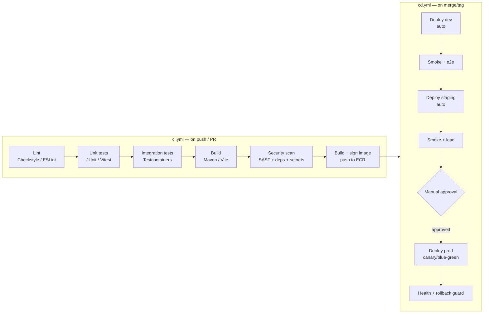
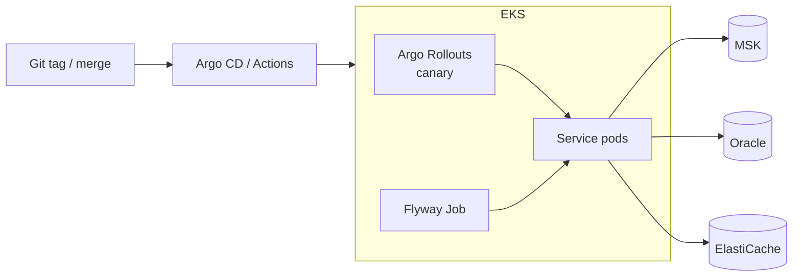
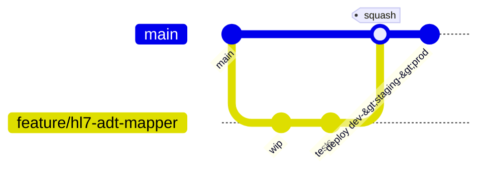

# EHR Integration Platform — Technical Notes

Actionable engineering guidance for building, testing, shipping, and operating
the platform.

---

## 3.1 CI/CD Pipeline Design

Two GitHub Actions workflows: **`ci.yml`** (every push/PR) and **`cd.yml`**
(deploy on merge / tag). HIPAA requires that everything reaching prod is
traceable to a reviewed commit and a signed, scanned image.



**Stage detail**

1. **Lint / format** — Checkstyle + Spotless (Java), ESLint + Prettier (TS). Fails fast, cheap.
2. **Test** — unit first, then integration with **Testcontainers** (Oracle XE 11g / `gvenzl/oracle-xe:11`, Kafka, Redis) so tests run against real engines.
3. **Build** — `mvn -T1C verify` (parallel modules) + `npm run build`. Only modules touched by the diff rebuild (path filters / `--also-make`).
4. **Security scan** — SAST (CodeQL/Semgrep), dependency CVEs (OWASP Dependency-Check / Trivy), secret scan (gitleaks), IaC scan (tfsec/checkov). Build **fails** on High/Critical.
5. **Containerize** — multi-stage build, image scanned (Trivy/Grype), **signed (cosign)**, pushed to **Amazon ECR** with immutable tag = git SHA.
6. **Deploy** — GitOps (Argo CD) or `kubectl`/Helm via OIDC-federated IAM (no static AWS keys in CI). Prod gated by manual approval + canary.

---

## 3.2 Testing Strategy

| Layer | Tools | Target | Notes |
|---|---|---|---|
| **Unit (backend)** | JUnit 5, Mockito, AssertJ | **80%** line / 70% branch on business logic | Pure logic: mappers, services, validators. Fast, no I/O. |
| **Unit (frontend)** | Vitest, React Testing Library | 70% on components/hooks | Test behavior, not implementation. |
| **Integration** | Spring Boot Test + **Testcontainers** | Critical paths covered | Real Oracle, Kafka, Redis in Docker. `@DataJpaTest` for repos. |
| **Contract** | Pact / Spring Cloud Contract | All inter-service + FHIR APIs | Prevents event-schema & API drift between services. |
| **HL7/FHIR conformance** | HAPI validator, **Inferno**, Touchstone | All published FHIR profiles | Validate resources against R4 `StructureDefinition`s and US Core. |
| **End-to-end** | Playwright (UI), k6/REST-assured (API) | Happy paths + key failures | Run in `dev`/`staging` after deploy. |
| **Load / soak** | Gatling, k6 | Meet SLOs in §2.4 | Ingestion throughput + FHIR read p95 under sustained load. |
| **Security** | OWASP ZAP (DAST), pen-test | No High/Critical | DAST in pipeline; annual third-party pen-test. |

**Conventions:** Arrange-Act-Assert; one behavior per test; **synthetic PHI only**
(never real patient data in any environment); deterministic tests (fixed clock,
seeded data); flaky tests are quarantined and fixed, not retried.

---

## 3.3 Deployment Strategy

- **Containerization**: every service ships as a minimal, multi-stage Docker image
  (distroless or `eclipse-temurin:21-jre` slim base; non-root user; read-only
  root FS). Frontend builds to static assets served by nginx.
- **Orchestration**: **AWS EKS** (HIPAA-eligible). Each service = Deployment +
  Service + HPA; ingress via ALB Ingress Controller; pod identity via **IRSA**.
- **Config & secrets**: ConfigMaps for non-secret config; **External Secrets
  Operator** pulls from AWS Secrets Manager. Twelve-factor: config from env.
- **Progressive delivery**: **canary or blue/green** (Argo Rollouts) in prod —
  shift 5% → 25% → 100% with automated metric analysis and **auto-rollback** on
  SLO breach.
- **Database migrations**: **Flyway** runs as an init step / Job *before* new pods
  serve traffic; migrations are **backward-compatible** (expand-then-contract) so
  rollout and rollback are safe.
- **Managed stateful deps**: Oracle (RDS for Oracle or self-managed on EC2),
  **Amazon MSK** (Kafka), ElastiCache (Redis), S3 — not run as pets in-cluster.
- **Infra as Code**: **Terraform** provisions VPC/EKS/MSK/KMS/IAM; **Kustomize**
  (base + per-env overlays) or Helm for K8s manifests. No click-ops.



---

## 3.4 Environment Management

Four environments: **local**, **dev**, **staging**, **prod** — identical images,
different config. Config flows from env vars → Spring `application-{profile}.yml` /
Vite `import.meta.env`.

| Setting | local | dev | staging | prod |
|---|---|---|---|---|
| Data | docker-compose | shared dev | prod-like (synthetic) | real PHI |
| Secrets | `.env` (dummy) | Secrets Manager | Secrets Manager | Secrets Manager (rotated) |
| Scaling | 1 replica | 1–2 | prod-like | HPA, multi-AZ |
| Log level | DEBUG | DEBUG | INFO | INFO + audit |

See **`.env.example`** in the repo root for the full, documented contract. Copy it
to `.env` for local development:

```bash
cp .env.example .env   # fill in local values; .env is git-ignored
docker compose up        # Kafka + Oracle XE + Redis + services
```

> **Rule:** no environment-specific code branches (`if (prod)`). Behavior differs
> only by injected configuration. Never put real PHI anywhere but `prod`.

---

## 3.5 Version Control Workflow

**Trunk-based development with short-lived feature branches** + PR review.



- **`main` is always releasable.** Protected: required PR review, green CI, signed
  commits, no force-push, linear history (squash-merge).
- **Branches**: `feature/*`, `fix/*`, `chore/*` — small, < ~2 days, rebased on
  `main`. Merge via squash to keep history readable.
- **Releases**: tag `vMAJOR.MINOR.PATCH` (SemVer) on `main`; tag triggers prod
  deploy. Hotfixes branch from the tag and forward-merge to `main`.
- **Commits**: Conventional Commits (`feat:`, `fix:`, `docs:`…) → automated
  changelog + version bump.

**Rationale:** trunk-based minimizes merge hell and long-lived divergence, gives
fast feedback, and pairs naturally with feature flags + continuous delivery — far
better fit for a small/medium team shipping daily than heavyweight Gitflow.

---

## 3.6 Common Pitfalls (this stack)

### FHIR / HAPI
- **`Resource versioning & concurrency`**: respect `ETag`/`If-Match`; HAPI uses
  optimistic locking — handle `409` conflicts, don't blind-overwrite.
- **Search parameter performance**: unindexed FHIR search params table-scan
  Oracle. Index `HFJ_SPIDX_*` and define only the search params you actually
  serve. Avoid unbounded `_include`/`_revinclude`.
- **Validation cost**: full profile validation on every write is expensive — cache
  the `ValidationSupport` chain and consider async validation for bulk loads.

### HL7v2
- **Encoding & segment variability**: real-world HL7 is messy — vendors deviate
  from spec. Be liberal in parsing, strict in mapping; never assume optional
  segments/fields exist (`OBX`, `PID-3` repetitions).
- **MLLP framing & ACKs**: get the lower-layer protocol bytes right (`0x0B … 0x1C
  0x0D`); always return a correct `ACK`/`NACK` or senders retransmit and flood you.
- **Character sets**: handle `MSH-18` (e.g., latin-1 vs UTF-8) or names corrupt.

### Oracle
- **Driver/licensing**: use `ojdbc8` for Oracle **11.2 (XE 11g)** — a modern
  `ojdbc11` driver throws `ORA-28040` against 11.2. Mind Oracle licensing for
  non-XE. Local dev uses `gvenzl/oracle-xe:11` (Docker / Testcontainers).
- **`ORA-01882: timezone region not found`** on 11.2 — the driver sends the JVM
  TZ as a region 11.2's old TZ files lack. Fix with
  `-Doracle.jdbc.timezoneAsRegion=false` (set in the gateway's `JAVA_OPTS`).
- **`CLOB` handling & batch**: clinical notes are large CLOBs — stream them, batch
  inserts, and tune HikariCP; default fetch sizes are too small for bulk.
- **Case & identifiers**: Oracle uppercases unquoted identifiers — keep
  naming consistent between Flyway DDL and JPA mappings.

### Kafka
- **Dual-write trap**: never write DB *and* publish to Kafka in two separate steps
  — use the **transactional outbox** (implemented here) or lose events on crash.
- **At-least-once = duplicates**: consumers **must** be idempotent (dedupe by event
  id). Partition by patient id to preserve per-patient ordering.
- **Schema evolution**: use a Schema Registry + backward-compatible changes; a
  breaking event-schema change silently corrupts every consumer.
- **Poison messages**: always have a DLQ + bounded retries, or one bad message
  stalls a partition forever.

### React / TypeScript
- **PHI in the browser**: never log PHI to the console, persist it in
  `localStorage`, or send it to third-party analytics. Short-lived tokens, memory
  only.
- **Server state ≠ client state**: use TanStack Query for FHIR data (caching,
  retries, dedupe); don't hand-roll fetch + `useEffect` everywhere.
- **`strict` TypeScript**: enable `strict`; model FHIR types explicitly — partial
  resources cause silent `undefined` bugs in clinical UIs.

### Cross-cutting (HIPAA / EKS)
- **PHI leakage in logs/errors/traces** is the #1 risk — redact by default,
  allow-list what's safe, and review log output in CI.
- **Time zones & clinical timestamps**: store UTC, render local; mixing them
  causes real clinical errors (wrong med-admin times).
- **EKS cost/security**: right-size node groups, use IRSA (no static keys),
  network policies (default-deny), and keep PHI workloads in private subnets only.
