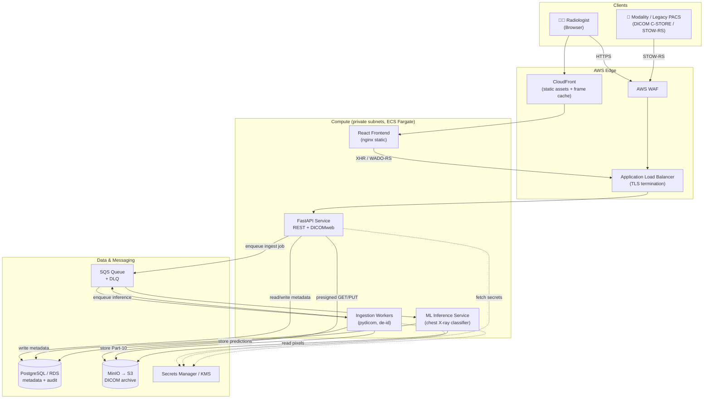
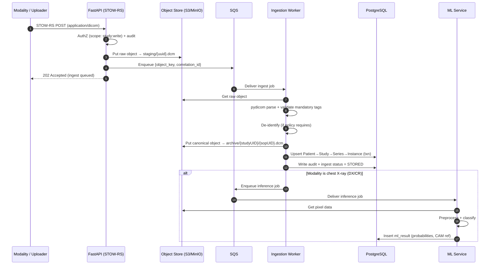
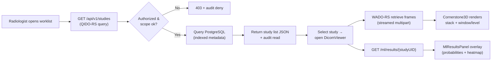
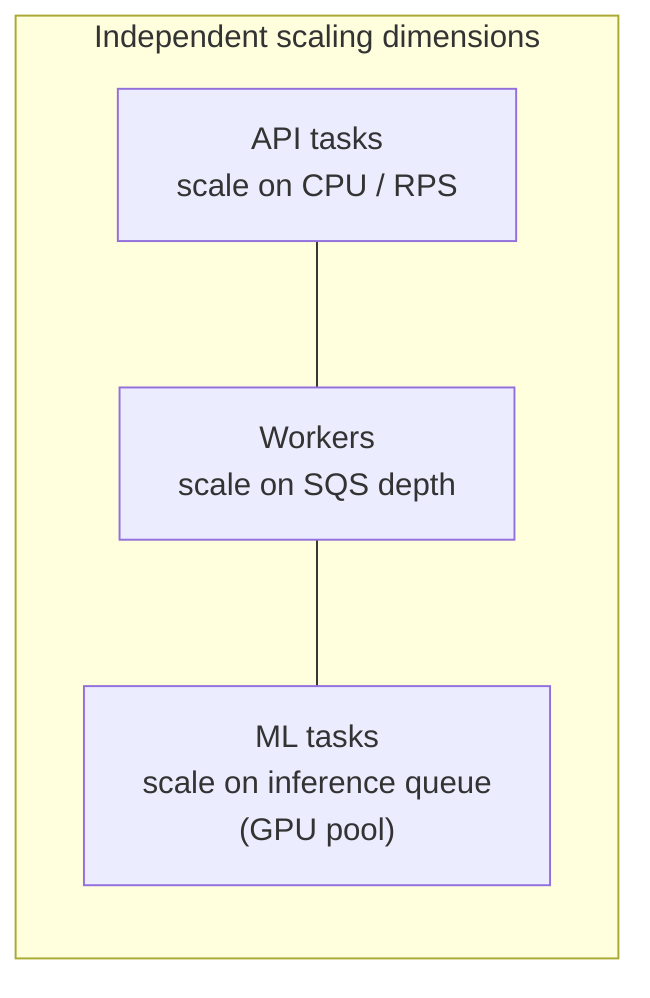
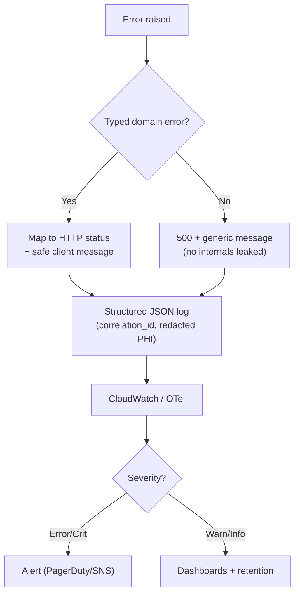

# Medical Imaging Platform — Architecture

This document describes the system architecture for the Medical Imaging Platform:
a HIPAA-aligned PACS that ingests DICOM studies, archives them, serves a
web-based viewer, and provides ML-assisted chest X-ray classification.

---

## 2.1 Chosen Architectural Pattern

**Pattern: Modular Monolith (API) + Event-Driven Asynchronous Workers.**

The system is split into two cooperating planes:

1. **Synchronous request plane** — a modular FastAPI application exposing REST +
   DICOMweb. Internally organized into clear modules (`api` → `services` →
   `models`) with strict boundaries, but deployed as a single horizontally
   scalable service.
2. **Asynchronous processing plane** — stateless workers that consume a queue to
   do the heavy, latency-tolerant work: DICOM parsing, de-identification, object
   archiving, thumbnailing, and ML inference.

### Why this pattern (and not full microservices)

| Driver | How this pattern addresses it |
|---|---|
| **Bursty, CPU-heavy ingestion** | A CT study can be hundreds of multi-MB instances. Pushing parsing/ML to queue-driven workers keeps the API p99 low and lets the two halves **scale on different signals** (HTTP RPS vs. queue depth). |
| **Right-sized for the scale** | One radiology enterprise, not internet-scale. Microservices' distributed-transaction and operational overhead would be premature. A modular monolith keeps deployment, debugging, and transactions simple. |
| **Clear seams for later split** | Modules already communicate through service interfaces. If ML or ingestion outgrows the monolith, it lifts out into its own service with minimal churn — and the **ML service is already a separate deployable** because of its GPU profile. |
| **HIPAA auditability** | Fewer moving parts and a single audit-logging chokepoint make it far easier to prove that *every* PHI access is recorded. |

> **Net:** Start as a modular monolith with async workers. Evolve specific
> bounded contexts into services only when scale or team-topology demands it.

---

## 2.2 System Context & Components

### Component responsibilities

| Component | Responsibility |
|---|---|
| **Frontend** | Worklist, Cornerstone3D viewer, ML overlay. Static assets via CloudFront; talks to API over HTTPS. |
| **FastAPI Service** | AuthN/Z, REST worklist, DICOMweb (QIDO/WADO/STOW), presigned URL brokering, audit logging. Stateless. |
| **Ingestion Workers** | Consume jobs: parse DICOM (pydicom), validate, de-identify, archive to object store, persist metadata, fan out ML jobs. |
| **ML Inference Service** | Load classifier weights, run chest X-ray inference, persist per-pathology probabilities + class-activation map. GPU-capable. |
| **PostgreSQL** | DICOM information model (Patient/Study/Series/Instance), users, ML results, **audit trail**. |
| **Object Store (MinIO/S3)** | Immutable DICOM Part-10 files, rendered frames, thumbnails. Encrypted at rest (KMS). |
| **Queue (SQS)** | Decouples ingest/ML from the request path; DLQ for poison messages. |

---

## 2.3 Key Component Interactions

- **API ⇄ Frontend:** HTTPS/JSON for REST; **DICOMweb** (`multipart/related`,
  `application/dicom`, `image/jpeg`) for image retrieval. The viewer uses WADO-RS
  to stream frames so it never needs direct object-store credentials.
- **API → Object store:** The API **brokers presigned URLs** rather than
  proxying bytes for large objects — offloads bandwidth to S3/MinIO while keeping
  access controlled and time-boxed.
- **API → Workers:** Fire-and-forget via **SQS** (message = study/instance
  reference + correlation ID). No synchronous coupling; retries + DLQ give
  at-least-once delivery with idempotent handlers.
- **Workers → DB / Object store:** Direct, transactional. Metadata write and
  object write are ordered so the DB only references objects that already exist.
- **Workers → ML:** A second queue hop; only modalities of interest (`DX`/`CR`
  chest) are enqueued for classification.
- **Everything → Secrets/KMS:** No secrets in images or env files in prod;
  fetched at boot from Secrets Manager; data keys from KMS.

---

## 2.4 Data Flow

### 2.4.1 Ingestion (write path) — sequence

### 2.4.2 Viewing (read path) — flowchart

---

## 2.5 Scalability & Performance Strategy

- **Stateless, horizontally scaled API.** ECS Fargate service behind the ALB;
  target-tracking autoscaling on CPU + ALB RequestCount. No session affinity
  (JWT-based), so any task serves any request.
- **Queue-driven worker autoscaling.** Workers scale on `ApproximateNumberOf
  MessagesVisible`. A bulk study import spikes the queue, not API latency.
- **GPU ML pool scales separately.** Inference runs on its own task family; can
  use GPU instances and scale to zero when idle.
- **Object store is the elastic archive.** S3 is effectively unbounded; tiering
  (Intelligent-Tiering → Glacier Deep Archive) controls long-term cost without
  app changes. MinIO mirrors the S3 API for local/dev parity.
- **Read scaling for worklists.** Worklist/QIDO queries dominate read load →
  RDS **read replica** + composite indexes on `(patient_id, study_date)`,
  `StudyInstanceUID`, `Modality`.
- **Bandwidth offload.** Presigned URLs + WADO-RS streaming move pixel bytes
  S3↔browser directly; CloudFront caches immutable rendered frames/thumbnails.
- **Backpressure & idempotency.** At-least-once delivery + idempotent upserts
  (keyed by SOPInstanceUID) make retries safe; DLQ isolates poison messages.

**Indicative SLOs:** worklist query p95 < 300 ms · first-frame render p95 < 1.5 s
· ingest-to-available p95 < 30 s/instance · API availability ≥ 99.9%.

---

## 2.6 Security Considerations (HIPAA)

> All AWS services used are **HIPAA-eligible** and covered by a signed **BAA**.
> The guiding principles are *least privilege*, *defence in depth*, and
> *PHI minimisation*.

### Authentication & Authorization
- **AuthN:** OAuth2 / OIDC. Dev uses local JWT (password grant); prod federates
  to **Amazon Cognito** (or hospital SSO via SAML/OIDC). Short-lived access
  tokens + refresh rotation.
- **AuthZ:** Role-Based Access Control with scoped permissions
  (`radiologist`, `technologist`, `referring_physician`, `admin`). Enforced as
  FastAPI dependencies; default-deny.
- **Object access:** No long-lived object credentials reach the browser — only
  time-boxed presigned URLs scoped to a single object.

### Data Protection
- **In transit:** TLS 1.2+ everywhere (ALB, internal service mesh, DB).
- **At rest:** S3 SSE-KMS, RDS encryption, EBS encryption — all customer-managed
  KMS keys with rotation.
- **PHI minimisation & de-identification:** DICOM PS3.15 basic profile scrubbing
  for any research/ML/training data path; production viewer shows PHI only to
  authorized roles.

### API Security
- Input validation via Pydantic at the boundary; strict DICOM tag validation in
  ingestion. Rate limiting + AWS WAF (OWASP rules) at the edge. CORS locked to
  known origins. Security headers (CSP, HSTS, X-Content-Type-Options) at nginx.

### Secret Management
- **AWS Secrets Manager** for DB creds, JWT signing keys, third-party tokens;
  fetched at boot, never baked into images or committed. KMS for envelope
  encryption. IAM roles per task (no static keys) via GitHub OIDC in CI.

### Auditability (HIPAA §164.312(b))
- An append-only `audit_log` records **who / what / when / from where** for every
  PHI create/read/update/delete — a non-bypassable middleware concern, shipped to
  CloudWatch/immutable storage for tamper-evidence.

---

## 2.7 Error Handling & Logging Philosophy

- **Typed domain errors → consistent HTTP contract.** Services raise domain
  exceptions (e.g. `StudyNotFound`, `InvalidDicom`, `Unauthorized`); a single
  exception-handler layer maps them to RFC-7807-style problem responses. Internal
  details never leak to clients.
- **Structured, correlation-tracked logging.** JSON logs carry a `correlation_id`
  propagated from API → queue → worker → ML, so one ingest is traceable
  end-to-end. **PHI is redacted by the logging formatter** — patient names/IDs
  never hit logs.
- **Fail safe on the write path.** Ingestion is idempotent and retried via SQS;
  unrecoverable messages land in a DLQ for inspection rather than silent loss.
- **Observability:** Logs (CloudWatch), metrics (RED + queue depth + ingest
  latency), and traces (OpenTelemetry → X-Ray). Alerting on error rate, DLQ
  depth, ingest backlog, and inference failures.
