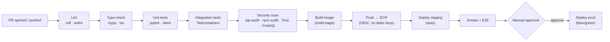
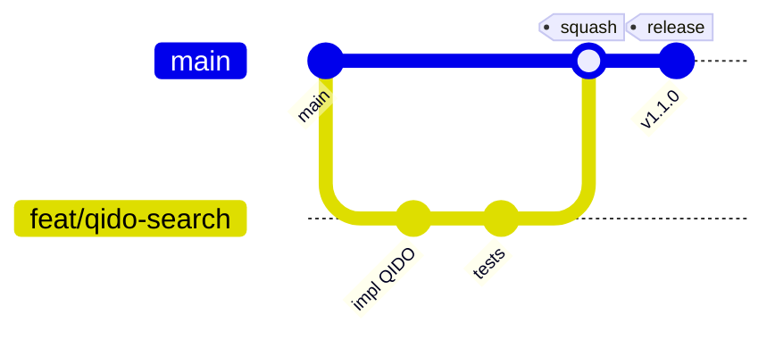

# Medical Imaging Platform — Technical Notes

Actionable engineering guidance for building, testing, and operating the
platform. Pairs with `PROJECT-PLAN.md` (what to build) and `ARCHITECTURE.md`
(how it fits together).

---

## 3.1 CI/CD Pipeline Design

Three build pipelines (backend, frontend, ml) on PRs, one deploy pipeline on
merge to a release branch. Pipelines fail fast — cheapest checks first.



**Stages**

1. **Lint** — `ruff` (py), `eslint` + `prettier --check` (ts). Seconds; blocks junk early.
2. **Type-check** — `mypy --strict` on `app/`, `tsc --noEmit` on frontend.
3. **Unit tests** — `pytest` w/ coverage gate, `vitest`. Mock I/O boundaries.
4. **Integration tests** — spin **real** Postgres + MinIO via Testcontainers; exercise ingest + DICOMweb.
5. **Security** — `pip-audit`/`npm audit` (deps), **Trivy** (image CVEs), **CodeQL** (SAST), `detect-secrets`.
6. **Build** — multi-stage Docker, pinned base digests, non-root, SBOM emitted.
7. **Deploy** — GitHub **OIDC** assumes an AWS role (no long-lived keys) → push to ECR → ECS rolling/blue-green.

**Environments:** `dev` (compose, local) → `staging` (auto-deploy, synthetic data only) → `prod` (manual approval, blue/green via CodeDeploy, instant rollback).

---

## 3.2 Testing Strategy

| Layer | Tooling | Target | Scope |
|---|---|---|---|
| **Unit** | pytest, vitest | **≥ 85%** on `services/` & domain logic | Pure logic: DICOM parsing, de-id, RBAC, mappers. Mock S3/DB. |
| **Integration** | pytest + **Testcontainers**, httpx `AsyncClient` | Critical paths | Real Postgres + MinIO. Ingest pipeline, QIDO/WADO/STOW, auth. |
| **Contract** | schemathesis (OpenAPI), DICOMweb conformance | DICOMweb routes | Fuzz the generated schema; assert PS3.18 conformance. |
| **E2E** | **Playwright** | Top user journeys | Upload → worklist → open viewer → see ML overlay, on seeded staging. |
| **Load** | Locust / k6 | SLOs in §2.5 | STOW burst, QIDO concurrency, WADO frame streaming. |

**Principles**
- **Test with real DICOM, never real PHI.** Use synthetic studies (`pydicom`
  can build datasets in code; or de-identified public sets). Commit a few tiny
  fixtures; generate large/edge cases at runtime.
- **Cover DICOM edge cases explicitly:** missing mandatory tags, mixed transfer
  syntaxes (implicit/explicit VR, JPEG2000/RLE), multi-frame, non-square pixels,
  wrong `PhotometricInterpretation`, planar config, truncated files.
- **Coverage is a floor, not a goal.** Gate at 85% on logic packages; don't chase
  100% on glue/IO.
- **Determinism for ML:** pin seeds, assert prediction *shape/contract* and a
  golden-output tolerance, not exact floats.

---

## 3.3 Deployment Strategy

- **Containerised everywhere.** Each unit ships a multi-stage image (build →
  slim runtime), non-root user, pinned base image **by digest**, healthcheck.
- **Orchestration: ECS Fargate** (serverless containers) — three services: `api`,
  `worker`, `ml`. Fargate avoids node management; GPU ML can move to EC2 launch
  type or SageMaker endpoint if needed.
- **Blue/green** via CodeDeploy: new task set drained-in behind the ALB, smoke
  checks, then traffic shift; automatic rollback on alarm.
- **Migrations** run as a one-off ECS task (or pipeline step) **before** the new
  app version takes traffic; migrations must be backward-compatible (expand →
  migrate → contract) so blue and green coexist.
- **Config & secrets** injected at runtime from SSM Parameter Store / Secrets
  Manager — never baked into images.
- **IaC: Terraform** is the single source of truth for all AWS resources;
  no click-ops in staging/prod.

**Local dev** mirrors prod topology with `docker-compose` (Postgres, MinIO, API,
worker, frontend) so "works on my machine" ≈ "works in staging".

---

## 3.4 Environment Management

- **12-factor config:** everything via environment variables, validated at boot
  by a single Pydantic `Settings` object (`core/config.py`). Fail fast on missing
  required vars.
- **Per-environment sources:** `.env` (local) → SSM/Secrets Manager (staging/prod).
  The `.env.example` below is the **contract**; keep it in sync with `Settings`.
- **Never commit real secrets.** `.env` is git-ignored; `detect-secrets` runs in
  pre-commit and CI.

### `.env.example` (also written to `backend/.env.example`)

```dotenv
# ── App ───────────────────────────────────────────────
APP_ENV=development            # development | staging | production
LOG_LEVEL=INFO
API_V1_PREFIX=/api/v1
CORS_ORIGINS=http://localhost:5173

# ── Security ──────────────────────────────────────────
JWT_SECRET_KEY=change-me-in-prod-use-secrets-manager
JWT_ALGORITHM=HS256
ACCESS_TOKEN_EXPIRE_MINUTES=30
REFRESH_TOKEN_EXPIRE_DAYS=7

# ── PostgreSQL ────────────────────────────────────────
POSTGRES_HOST=localhost
POSTGRES_PORT=5432
POSTGRES_DB=medimaging
POSTGRES_USER=medimaging
POSTGRES_PASSWORD=change-me

# ── Object store (MinIO locally / S3 in AWS) ──────────
S3_ENDPOINT_URL=http://localhost:9000   # empty/unset → real AWS S3
S3_REGION=us-east-1
S3_ACCESS_KEY=minioadmin
S3_SECRET_KEY=minioadmin
S3_BUCKET_DICOM=dicom-archive
S3_BUCKET_STAGING=dicom-staging
S3_USE_SSL=false

# ── Queue ─────────────────────────────────────────────
QUEUE_URL=                      # SQS URL in AWS; empty → in-proc fallback (dev)
INGEST_QUEUE_NAME=ingest-jobs
INFERENCE_QUEUE_NAME=inference-jobs

# ── ML service ────────────────────────────────────────
ML_SERVICE_URL=http://localhost:8001
ML_MODEL_S3_URI=s3://dicom-models/chexnet/densenet121.pt
ML_CONFIDENCE_THRESHOLD=0.5

# ── De-identification ─────────────────────────────────
DEIDENTIFY_ON_INGEST=false      # true for research/training data paths
```

---

## 3.5 Version Control Workflow

**Recommended: Trunk-based development with short-lived feature branches.**

- `main` is always releasable and protected (required reviews, green CI, no
  direct pushes, signed commits).
- Feature branches are **short-lived** (< 1–2 days), merged via PR with squash.
- **Release** by tagging `main` (`vX.Y.Z`) → triggers `deploy.yml`. Optionally a
  `release/*` branch for hotfix hardening in a regulated setting.



**Why trunk-based over Gitflow:** in a HIPAA setting you want a small number of
auditable, frequently-integrated changes and a straight line from commit →
staging → prod. Gitflow's long-lived `develop`/`release` branches add merge
drift and slow the audit trail. Trunk-based + feature flags keeps integration
continuous and rollbacks trivial.

**Conventions:** Conventional Commits (`feat:`, `fix:`, `chore:`…) for
changelog automation; PRs reference a ticket; CODEOWNERS gates the `migrations/`,
`infrastructure/`, and `security` paths.

---

## 3.6 Common Pitfalls (this stack)

**DICOM / pydicom**
- **Transfer syntax sprawl.** Files arrive implicit/explicit VR, little/big
  endian, or compressed (JPEG, JPEG2000, RLE). Decoding compressed pixels needs
  `pylibjpeg` / `gdcm` plug-ins — install them or `pixel_array` throws. Normalise
  on ingest.
- **`PixelData` is huge & lazy.** Don't `pixel_array` in the API request path or
  in bulk QIDO responses — only metadata. Pixels belong to WADO-RS / workers.
- **MONOCHROME1 vs MONOCHROME2.** X-rays are often MONOCHROME1 (inverted);
  apply `PhotometricInterpretation` + VOI LUT / window-center-width or images
  render inverted/washed-out. Cornerstone needs correct modality & VOI LUT.
- **UID identity.** `SOPInstanceUID`/`SeriesInstanceUID`/`StudyInstanceUID` are
  the natural keys — make ingestion **idempotent** on them (upsert), or retries
  duplicate studies.
- **PHI hides in pixels & private tags.** De-identification must scrub the tag
  set **and** consider burned-in annotations and private tags, per PS3.15.

**FastAPI / async**
- **Don't block the event loop.** pydicom, image decode, and `boto3` are
  blocking/CPU-bound — run them in workers or a threadpool, never inline `await`.
- **Async session discipline.** One `AsyncSession` per request via dependency;
  don't share sessions across tasks; commit/rollback explicitly.

**Storage / S3 / MinIO**
- **MinIO ≠ S3 100%.** Path-style vs virtual-host addressing, some lifecycle/replication
  features differ. Keep an S3-compatibility test matrix; target the S3 API, set
  `S3_ENDPOINT_URL` to switch.
- **Presigned URL expiry & clock skew.** Short TTLs are good for PHI but break if
  container clocks drift — keep NTP/chrony correct.

**ML**
- **Preprocessing must match training.** Resize, normalisation, and channel
  layout have to exactly mirror the training pipeline or accuracy silently
  collapses. Version the preprocessing with the weights.
- **Decision support ≠ diagnosis.** Surface probabilities as *assistance*, log
  model + version with every prediction, and keep a human in the loop. (Regulatory:
  treat as CADe/CADx — know your FDA/CE posture before clinical use.)

**HIPAA / ops**
- **Audit everything that touches PHI**, including *reads*. A missing read-audit
  is a compliance gap, not just a feature gap.
- **Logs leak PHI** if you log request bodies or DICOM datasets — redact at the
  formatter, and scrub before shipping to third-party log sinks.
- **Backups are PHI too** — encrypt, restrict, and test restores; document
  retention per policy.
