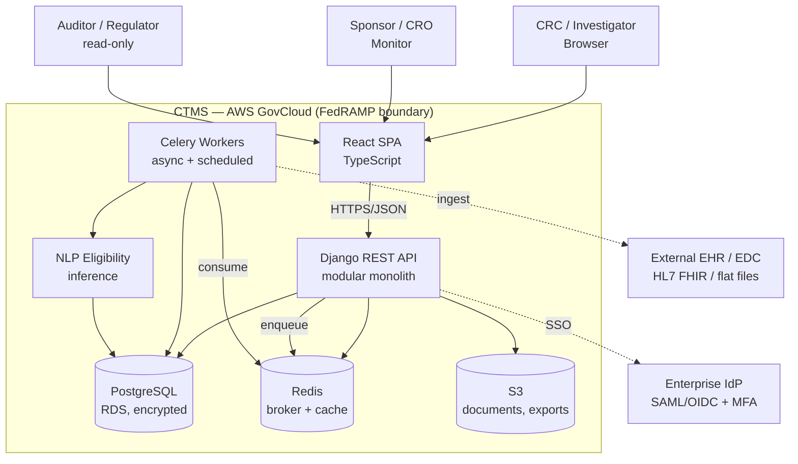
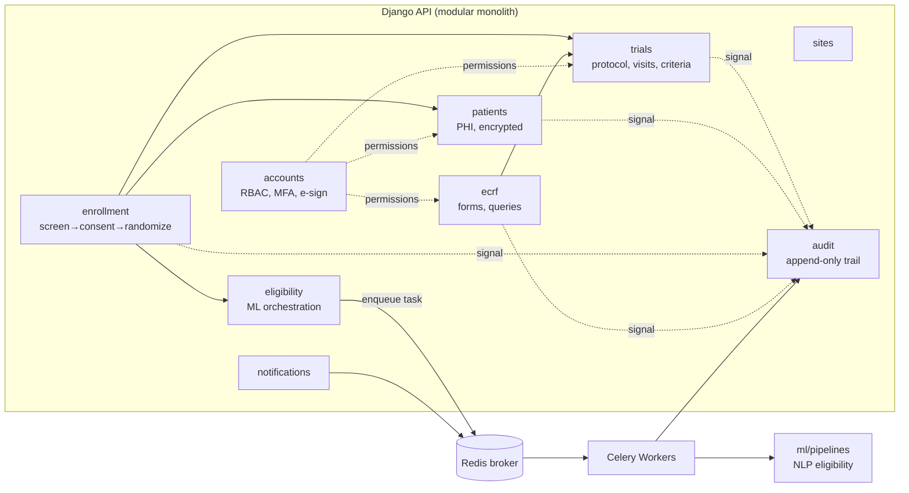
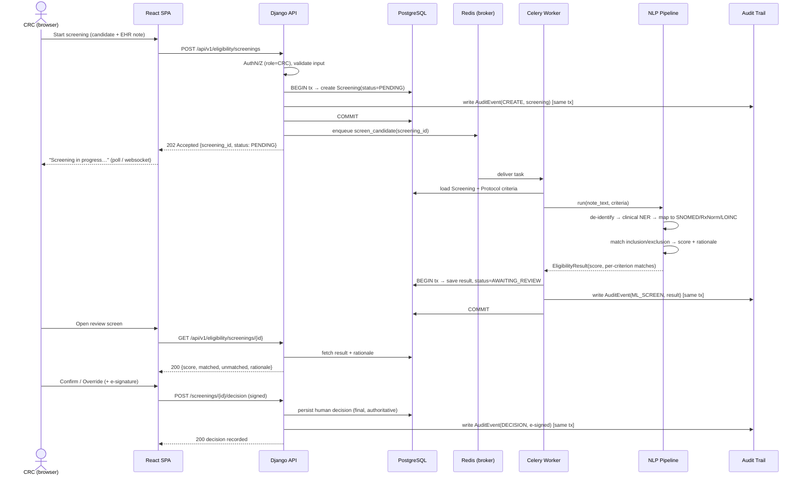
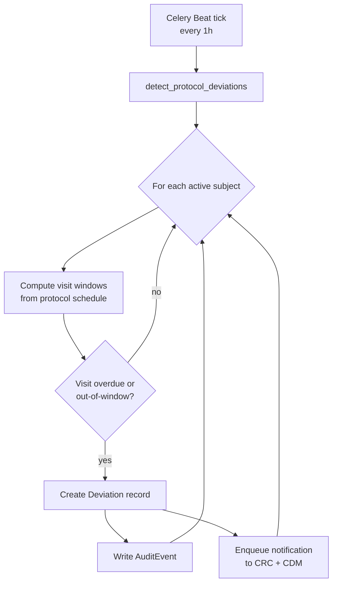
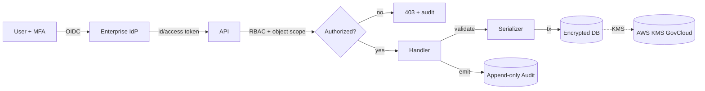

# Architecture — Clinical Trial Management System

This document describes the architecture of the CTMS: the chosen pattern,
how components interact, how data flows, and how the system addresses
scalability, security, and operability **within a regulated (21 CFR Part 11 /
HIPAA / FedRAMP) envelope**.

---

## 2.1 Chosen Architectural Pattern

**Pattern: Modular Monolith + Event-Driven Asynchronous Tier + Separable ML Service.**

The core application is a **single deployable Django service** internally
partitioned into **bounded contexts** (`apps/trials`, `apps/patients`,
`apps/enrollment`, `apps/eligibility`, …). Long-running, scheduled, and
fan-out work runs on a **Celery** worker tier driven by a Redis broker. The
**NLP eligibility model** lives behind a thin orchestration boundary so it can
run in-process today and be promoted to an independent service (SageMaker
endpoint / dedicated container) tomorrow.

### Why not full microservices (yet)?

| Force | Implication |
|------|-------------|
| **Regulatory validation cost** | Each independently deployable unit must be *validated* (CSV). Fewer deployables = dramatically less validation overhead. A monolith is the pragmatic default in regulated healthcare. |
| **Transactional integrity** | Enrollment + consent + randomization + audit must commit atomically. A single relational DB with ACID transactions is far simpler than sagas/eventual consistency. |
| **Team size / cognitive load** | One codebase, one CI pipeline, one set of migrations. Microservices' operational tax isn't justified at this scale. |
| **Strong consistency for audit** | The audit trail must never lose an event. Co-locating it with the writing transaction guarantees this. |

### Why these async / ML seams *are* split out

- **Celery tier**: ML inference, batch re-screening, reminder fan-out and report
  generation are bursty and slow. Running them in the request path would blow
  latency budgets and threaten the web tier's availability. They scale on a
  different axis (CPU/throughput vs. request concurrency).
- **ML boundary**: Models retrain on their own cadence, need GPU/large memory,
  and carry data-versioning concerns. Keeping `ml/` portable behind an interface
  avoids a costly rewrite when it graduates to SageMaker.

> **Net:** a "majestic monolith" core for the parts that need consistency and
> validation, with asynchronous and ML concerns peeled off where the scaling and
> lifecycle pressures actually differ.

### System context (C4 level 1)



---

## 2.2 Key Component Interactions

| Interaction | Mechanism | Notes |
|-------------|-----------|-------|
| SPA ↔ API | **HTTPS / REST (JSON)**, versioned `/api/v1/` | OpenAPI schema generated; short-lived JWT access + rotating refresh. |
| API ↔ DB | **Direct ORM** (psycopg, PgBouncer pool) | All clinical writes inside DB transactions; audit row written in the *same* transaction. |
| API → Workers | **Message queue** (Celery over Redis) | API never blocks on ML/reporting; returns `202 Accepted` + task handle. |
| Workers ↔ ML | **In-process call** (today) → **HTTPS to SageMaker** (later) | Same `EligibilityScreener` interface either way. |
| Workers → EHR/EDC | **Scheduled pull** (FHIR REST / SFTP batch) | De-identification applied at ingestion boundary. |
| Scheduled jobs | **Celery Beat** | Visit reminders, deviation detection, re-screening, audit-integrity checks. |
| Notifications | **Async events** → email/in-app | Fired from domain events, never inline in request. |
| Auth | **OIDC/SAML to enterprise IdP** + enforced **MFA** | App holds roles/permissions; IdP holds identity. |

### Component view (C4 level 2 — backend)



> **Audit is a cross-cutting sink.** Every context emits domain change signals;
> the `audit` app persists them append-only. No business code can bypass it
> because the middleware + model `save()` interception capture mutations centrally.

---

## 2.3 Data Flow

### Flow A — Subject enrollment with ML eligibility screening



**Key property:** the ML result is **advisory**. The authoritative eligibility
decision is the **human, e-signed** action — satisfying both clinical safety and
21 CFR Part 11 §11.50/§11.70 (signature manifestation & record linking).

### Flow B — Scheduled protocol-deviation detection (Celery Beat)



---

## 2.4 Scalability & Performance Strategy

| Tier | Strategy |
|------|----------|
| **Web/API** | Stateless gunicorn/uvicorn behind ALB; **horizontal autoscaling** on CPU + request concurrency. Sessions are JWT — no sticky state. |
| **Database** | RDS PostgreSQL Multi-AZ; **PgBouncer** connection pooling; **read replicas** for reporting/monitor dashboards; partition high-volume `audit` + `ecrf_datapoint` tables by month. |
| **Caching** | Redis for hot reads (protocol definitions, criteria), idempotency keys, and rate-limit counters. |
| **Async tier** | Celery workers autoscale independently; **separate queues** (`ml`, `notifications`, `reports`, `default`) so a slow ML backlog can't starve reminders. Priority + rate limits per queue. |
| **ML inference** | Start in-process; promote to **SageMaker async/batch endpoints** for GPU and elastic scale; cache concept-mapping results. |
| **Storage** | S3 for documents/exports with lifecycle policies; pre-signed URLs avoid proxying large files through the API. |
| **Frontend** | Static SPA via CloudFront CDN; route-level code-splitting; server-driven pagination. |

**Performance budgets (targets):** API p95 < 300 ms for reads, < 600 ms for
writes; ML screening completes async < 60 s p95; dashboard first-contentful-paint
< 2 s.

---

## 2.5 Security Considerations

> The system processes **PHI** and operates in **AWS GovCloud** under FedRAMP
> controls. Security is a primary architectural driver, not a layer added later.

### Authentication & Authorization
- **Federated SSO** (OIDC/SAML) to the enterprise IdP; **MFA mandatory** for all users.
- Short-lived JWT **access** tokens + rotating **refresh** tokens; refresh
  rotation with reuse detection.
- **RBAC** with least privilege (Sponsor, PI, CRC, CDM, Monitor, Auditor) plus
  **site- and study-scoped** object permissions — a CRC only sees subjects at
  their delegated site. Auditor role is **read-only by construction**.
- **Electronic signatures** (21 CFR Part 11 §11.200): signing requires
  re-authentication; each signature records *who, when, why (meaning)* and is
  cryptographically bound to the signed record.

### Data Protection
- **TLS 1.2+** in transit everywhere (ALB, internal mesh, DB).
- **Encryption at rest** via **AWS KMS** (GovCloud CMKs) for RDS, S3, EBS, Redis.
- **Field-level encryption** for direct identifiers (name, DOB, MRN) so PHI is
  protected even within DB dumps.
- **De-identification at the ML boundary**: clinical notes are de-identified
  (Safe Harbor) before NLP processing; re-identification keys never leave the
  secure enclave.
- Data residency constrained to GovCloud regions; no PHI in logs (scrubbed).

### API Security
- Centralized input validation (DRF serializers) + output filtering by permission.
- **Rate limiting / throttling** per user and per IP; **WAF** (AWS WAF) in front of ALB.
- Strict security headers (HSTS, CSP, `X-Content-Type-Options`, `Referrer-Policy`).
- **Idempotency keys** on mutating endpoints to prevent duplicate enrollment.
- CORS locked to known SPA origins; CSRF protections for any cookie-based flows.

### Secret Management
- **AWS Secrets Manager** + **SSM Parameter Store** (SecureString); no secrets in
  env files or images. Rotation enabled for DB credentials.
- CI/CD authenticates to AWS via **GitHub OIDC** (no long-lived AWS keys in CI).
- Local dev uses `.env` (git-ignored); `.env.example` documents required keys.

### Audit & Integrity (21 CFR Part 11)
- **Append-only** `AuditEvent` table; updates/deletes denied at the DB grant level.
- Each event: actor, action, entity, **before/after diff**, UTC timestamp,
  reason-for-change, source IP. Periodic **integrity checksum** job detects
  tampering. Audit records are retained per regulatory retention schedules.



---

## 2.6 Error Handling & Logging Philosophy

**Principles:** fail safe, never lose an audit event, never leak PHI, make every
failure traceable end-to-end.

### Errors
- **Typed domain exceptions** (`EnrollmentError`, `EligibilityError`, …) mapped to
  a **consistent API error envelope**:
  ```json
  { "error": { "code": "ELIGIBILITY_CRITERIA_INVALID",
               "message": "Human-readable, PHI-free",
               "correlation_id": "req-7f3a…",
               "details": [] } }
  ```
- **4xx vs 5xx discipline:** validation/permission = 4xx (no alert); unexpected =
  5xx (alert). Clients receive a `correlation_id`, never a stack trace.
- **Async failures:** Celery tasks are **idempotent** with bounded retries
  (exponential backoff + jitter); exhausted tasks land on a **dead-letter queue**
  and raise an alert. A failed ML screening leaves the screening in a clear
  `FAILED` state — it never silently marks a subject eligible/ineligible.
- **Transactions:** clinical mutation + its audit row commit atomically; partial
  writes are impossible by design.

### Logging & Observability
- **Structured JSON logs** with a **correlation/trace id** propagated from the SPA
  request through API → Celery task → ML call.
- **PHI scrubbing** filter on every log handler; identifiers are masked/hashed.
- **Three signals:** logs (events), metrics (RED/USE — rate, errors, duration),
  traces (**OpenTelemetry**) shipped to CloudWatch / managed Grafana.
- **Severity routing:** WARN for expected-but-notable, ERROR for actionable, with
  on-call paging for SLO breaches and DLQ growth.
- **Audit log ≠ application log.** The compliance audit trail is a *database
  record* (durable, queryable, immutable), distinct from operational logs which
  are retained on a shorter ops schedule.

```mermaid
sequenceDiagram
    participant SPA
    participant API
    participant Worker
    participant Obs as Observability (CW/Grafana)
    SPA->>API: request (X-Correlation-Id: abc)
    API->>Obs: log+span (corr=abc)
    API->>Worker: enqueue (carry corr=abc)
    Worker->>Obs: log+span (corr=abc)
    Note over API,Worker: One id stitches the whole flow;<br/>PHI scrubbed at every hop.
```
