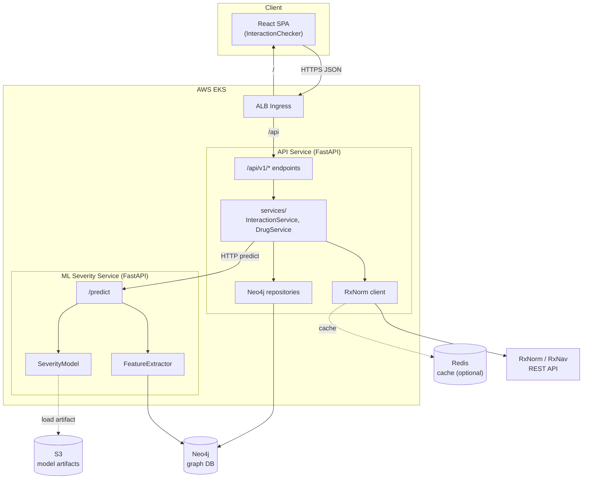
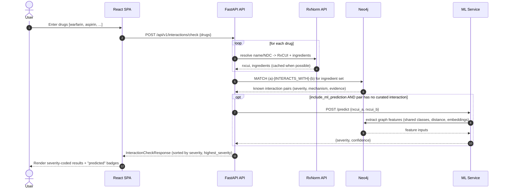
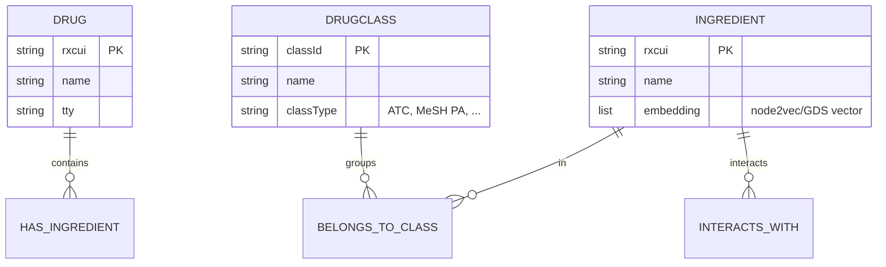

# Architecture — Drug Interaction Checker

## 2.1 Chosen Architectural Pattern

**Service-oriented modular monolith with a separable ML inference tier,
backed by a graph database — deployed as independently scalable workloads on
Kubernetes (EKS).**

Concretely:

- A **FastAPI API service** owns request handling, RxNorm normalization,
  graph queries, and orchestration.
- An **ML severity service** (same codebase, different entrypoint
  `app.ml_main:app`) serves predictions. It is a *separate Deployment* so it can
  scale and be resourced independently of the API.
- **Neo4j** is the system of record for the drug-property network and curated
  interactions.
- The **React SPA** is a static bundle served by nginx / behind the ALB.

### Why this pattern (and not full microservices or a plain monolith)

| Force | How the pattern addresses it |
| --- | --- |
| Team/scale is moderate; we want velocity | One backend codebase, one CI, shared models → low coordination cost. |
| ML has different scaling/resource profile | ML runs as its own Deployment + HPA; API latency is insulated from model load. |
| Domain is graph-shaped (interactions, classes, pathways) | Native graph DB (Neo4j) makes pairwise/transitive queries and graph-ML features first-class. |
| External dependency (RxNorm) is slow/flaky | Isolated in a client + service with timeouts, caching, graceful degradation. |
| Future extraction to microservices | Clear module + repository boundaries make later splits mechanical, not surgical. |

> **Pragmatic stance:** start as a modular monolith + separable ML tier. Split a
> module into its own service only when an independent scaling, deployment, or
> ownership need is *demonstrated* — not speculatively.

---

## 2.2 Key Component Interactions

**Communication mechanisms**

- **Client ↔ API:** synchronous HTTPS/JSON (REST). OpenAPI/Swagger at `/docs`.
- **API ↔ Neo4j:** direct Bolt connection via the async Neo4j driver (connection
  pool), Cypher executed only inside repositories.
- **API ↔ RxNorm:** outbound HTTPS to the public RxNav API via `httpx`
  (per-request timeout; optional Redis cache).
- **API ↔ ML service:** synchronous HTTP (`POST /predict`) — advisory and
  **fail-soft** (a failed/slow prediction never fails the interaction check).
- **ML service ↔ S3:** model artifact pulled on startup, cached in memory.
- **Offline training ↔ Neo4j/S3:** batch job (CI/cron) reads labeled pairs,
  writes a versioned artifact to S3.

> Today's prediction call is synchronous HTTP. If batch/throughput demands grow,
> the same boundary can move behind a queue (SQS) without changing callers.

---

## 2.3 Data Flow — Interaction Check

**Graph data model**

- `(:Drug)-[:HAS_INGREDIENT]->(:Ingredient)` — combination products expand to
  their active ingredients; interactions are evaluated at **ingredient** level.
- `(:Ingredient)-[:INTERACTS_WITH {severity, mechanism, evidenceLevel, source,
  description}]->(:Ingredient)` — stored once, queried undirected.
- `(:Ingredient)-[:BELONGS_TO_CLASS]->(:DrugClass)` — powers ML features and
  class-level interaction reasoning.

---

## 2.4 Scalability & Performance Strategy

- **Stateless API & ML pods** behind a Service + HPA (CPU/RPS targets). Scale
  horizontally; no sticky sessions.
- **Independent ML scaling** — prediction load (potentially many pairwise calls)
  does not contend with API request handling.
- **Neo4j**: causal cluster (core + read replicas) for HA and read scale-out;
  constraints/indexes on `rxcui`/`classId`; a **full-text index** for name
  search. Pairwise interaction lookups are O(1)-ish per indexed relationship.
- **Bounded fan-out:** an N-drug check is O(N²) ingredient pairs — cap N,
  short-circuit known pairs before calling ML, and batch/parallelize predictions.
- **Caching:** RxNorm responses cached in Redis (TTL ~24h; RxNorm changes
  slowly). Model artifact cached in memory per pod.
- **Async I/O end-to-end** (async FastAPI + async Neo4j + async httpx) keeps
  pods efficient under I/O-bound load.
- **Precomputed embeddings:** node embeddings are computed offline (Neo4j GDS)
  and materialized on nodes, so request-time feature extraction stays cheap.

---

## 2.5 Security Considerations

- **AuthN/AuthZ:** OIDC/JWT bearer tokens (e.g., AWS Cognito or Okta). Pharmacy
  integration endpoints require a valid token and a scope check
  (e.g. `pharmacy:check`). Service-to-service uses mTLS or signed requests.
- **Data protection / PHI:** treat patient context as PHI — **never log
  identifiers**; pass an opaque `patient_ref`. TLS in transit (ALB→pod via
  cert), encryption at rest (Neo4j volumes, S3 SSE-KMS). Minimize PHI retention.
- **API security:** strict Pydantic input validation, output models, CORS
  allow-list, rate limiting per client/API key, security headers, request size
  limits. OWASP API Top-10 review.
- **Secret management:** no secrets in images or git. AWS Secrets Manager synced
  into K8s via External Secrets Operator; pods assume IAM roles via **IRSA**
  (no long-lived keys). CI authenticates to AWS via **GitHub OIDC**.
- **Supply chain:** pinned dependencies, image scanning (Trivy), SBOM, signed
  images; least-privilege IAM and NetworkPolicies.
- **Clinical safety disclaimer:** ML predictions are advisory and labeled as
  such; curated, sourced interactions are distinguished from model output.

---

## 2.6 Error Handling & Logging Philosophy

- **Typed domain errors** (`DomainError` subclasses: `DrugNotFoundError`,
  `RxNormUnavailableError`, `MLServiceError`) map to consistent HTTP responses
  via centralized exception handlers. The wire format is always
  `{"error": {"code": "...", "message": "..."}}`.
- **Fail-soft on advisory paths:** RxNorm or ML failures degrade gracefully —
  the check returns known interactions plus an `unresolved` list rather than a
  hard 5xx, because partial safety information beats none.
- **Fail-fast on integrity paths:** bad input → `422`; missing required
  reference → `404`; unexpected → `500` with a generic message (no internals
  leaked) while the full context is logged.
- **Structured JSON logging** (`structlog`) with correlation IDs; logs are
  event-oriented (`event="rxnorm_request_failed"`) and **PHI-free**.
- **Observability:** RED metrics (Rate/Errors/Duration) per endpoint and per
  downstream (Neo4j, RxNorm, ML); distributed tracing across API→ML→Neo4j.
- **Resilience:** timeouts on every outbound call; retries with backoff for
  idempotent reads; circuit-breaker around RxNorm; readiness probe gates traffic
  until Neo4j connectivity is verified.
