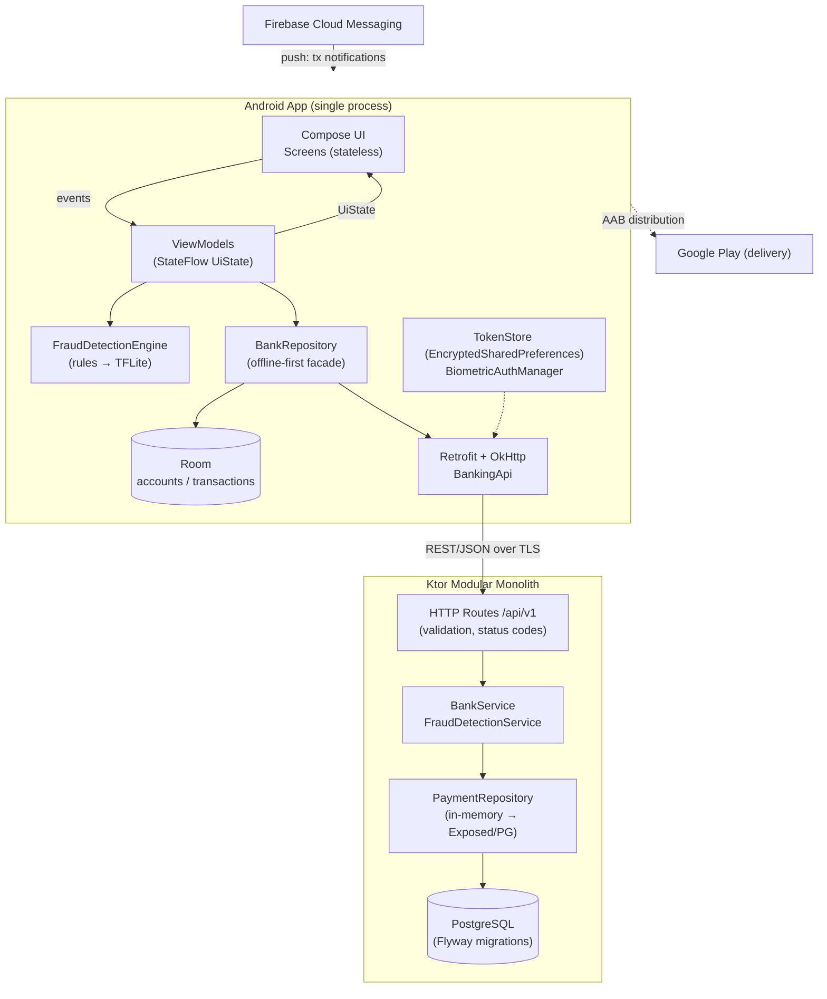
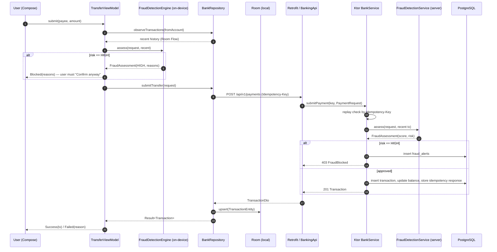
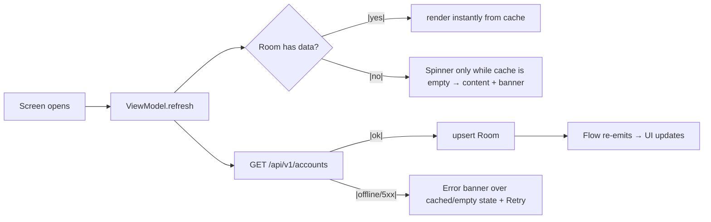

# Architecture — Android Banking App

## 2.1 Chosen Architectural Pattern

**Client: layered MVVM with unidirectional data flow (offline-first).**
**Backend: modular monolith (Ktor) with a layered core (routes → services → repositories).**

**Why this fits the project**

- **Two deployables, one repo.** A banking app + its demo backend share contracts (DTOs); a modular
  monolith keeps the backend in one Gradle build without microservice overhead for this scale.
- **Offline-first demands a repository facade.** The UI never talks to Retrofit directly; Room is the
  single source of truth, refreshed from the network. Flaky connectivity is the norm on mobile.
- **UDF (events up / state down) with immutable `UiState`** makes every screen trivially testable and
  eliminates the "state restored wrong after process death" class of bugs.
- **Fraud detection on both tiers**: on-device rules give instant UX feedback (and work offline);
  the server engine is authoritative. Same inputs (`TransferRequest` + recent history), different
  runtimes.

## 2.2 Key Component Interactions

| Interaction | Mechanism | Contract |
|---|---|---|
| App ↔ Backend | REST over HTTPS (Retrofit/OkHttp) | `/api/v1/accounts`, `/api/v1/accounts/{id}/transactions`, `POST /api/v1/payments` |
| Idempotency | `Idempotency-Key` HTTP header | Server replays stored response → no double charges on retry |
| App local cache | Room (`Flow` reactivity) | UI observes DB; network refresh writes back into DB |
| Push | Firebase Cloud Messaging | `TransactionPushService` → local notification (Phase 2) |
| Backend layers | Direct in-process calls (no bus needed at this scale) | Routes validate → Services decide → Repositories persist |
| Fraud (client) | Synchronous rule scoring before submit | `HIGH` risk → blocked pending explicit user confirm |
| Fraud (server) | Service-side scoring before persistence | `HIGH` risk → 403 + `fraud_alerts` row for review queue |

No message queue yet: single-instance Ktor with in-process calls. The natural extraction point
later is a Kafka/topic bus for `transaction.submitted` events feeding the ML scorer — see §2.4.

## 2.3 Data Flow

### Money transfer (happy path + fraud block)

### Offline read path (accounts screen)

## 2.4 Scalability & Performance Strategy

- **Backend is stateless** (JWT auth in Phase 2, no sessions) → scale horizontally behind a load
  balancer; sticky nothing. In-memory repo is explicitly a Phase-1 scaffold; the Flyway schema and
  `PaymentRepository` interface already model the PostgreSQL target.
- **Read path scales by cache**: Room answers reads; the API sees refresh traffic, not render
  traffic. Phase 2 adds `Paging 3` (RemoteMediator) so transaction history streams in pages.
- **Fraud scoring stays out of the hot write path** as it grows: rules are O(recent tx) now; the ML
  model will be served behind a pool (or extracted to an async consumer on `transaction.submitted`
  events) so payment latency stays single-digit-ms + DB write.
- **Mobile perf**: Compose + baseline profiles, `LazyColumn` keys, immutable state classes; R8 in
  Phase 3 shrinks cold start and APK.
- **Idempotency keys** make retries cheap and safe — clients can retry aggressively on flaky links.

## 2.5 Security Considerations

| Area | Approach |
|---|---|
| Authentication | Phase 2: OAuth2 password/refresh tokens from backend JWT; access token in `TokenStore` (EncryptedSharedPreferences, AES-256-GCM key in Android Keystore). Refresh via authenticator interceptor. |
| Local auth gate | `BiometricAuthManager` — `BIOMETRIC_STRONG` required for transfers; fallback policy documented (no silent downgrade to PIN alone for high-value). |
| Authorization | Server-side per-user account scoping (never trust client-supplied account ownership); Hilt `@Singleton` services assume authenticated context. |
| Data protection | TLS everywhere in release; secrets never in the APK — only `BACKEND_BASE_URL` is build config. Cleartext is denied by default, with a **debug-only** network security config (`app/src/debug/res/xml/`) whitelisting `10.0.2.2`/`127.0.0.1`/`localhost` so debug builds can talk to the local Ktor backend over HTTP. Room unencrypted for demo; SQLCipher is the Phase 3 option. |
| API security | Idempotency-Key on all money mutations; strict validation (422 with field reasons); rate limiting + auth in `ktor-server-auth` (Phase 2); TLS pinning (Phase 3). |
| Secret management | Backend: env vars (`DB_PASSWORD`, see `application.conf` overrides) — never committed. CI: GitHub encrypted secrets; keystore + Play service account injected as base64. |
| Fraud/abuse | Server is authoritative; client rules are UX only. `fraud_alerts` feeds a review queue. |
| Compliance note | Demo scope only — no real PSP, no PAN storage, Play data-safety form filled before public release. |

## 2.6 Error Handling & Logging Philosophy

**Client — errors are states, not exceptions, past the repository boundary.**

- `BankRepository` returns `Result<T>` from network operations; Room `Flow`s never throw to UI.
- ViewModels fold failures into **sealed `UiState`s** (`Error(message)`, `Blocked(reasons)`,
  `Failed(msg)`) so every screen has an explicit render for failure + a recovery action (`Retry`).
- `kotlinx.coroutines`: work in `viewModelScope` (structured concurrency cancels with the screen);
  no `GlobalScope`; `CoroutineExceptionHandler` only at the root if ever needed.
- Logging: `HttpLoggingInterceptor` (BASIC) in debug, stripped in release; Crashlytics in Phase 2.
  No PII (amounts, IBANs) in logs.

**Backend — fail fast, correlate, never leak internals.**

- `StatusPages` maps every exception to a JSON `ErrorEnvelope`: 400 malformed body, 422 validation
  (field-level reasons), 403 fraud-blocked, 409 insufficient funds, 500 generic ("Internal error" —
  details only in logs).
- `CallId` middleware stamps a correlation ID per request, threaded into logs (`callIdMdc`) and
  returnable to clients — one ID follows a payment from app log to server log.
- SLF4J/logback structured logging; secrets and full card/account data are never logged.
