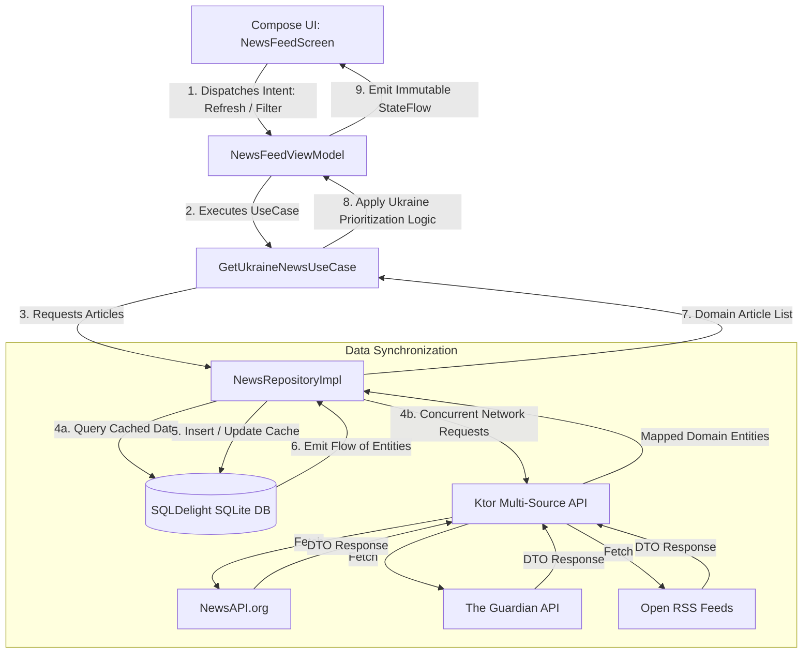
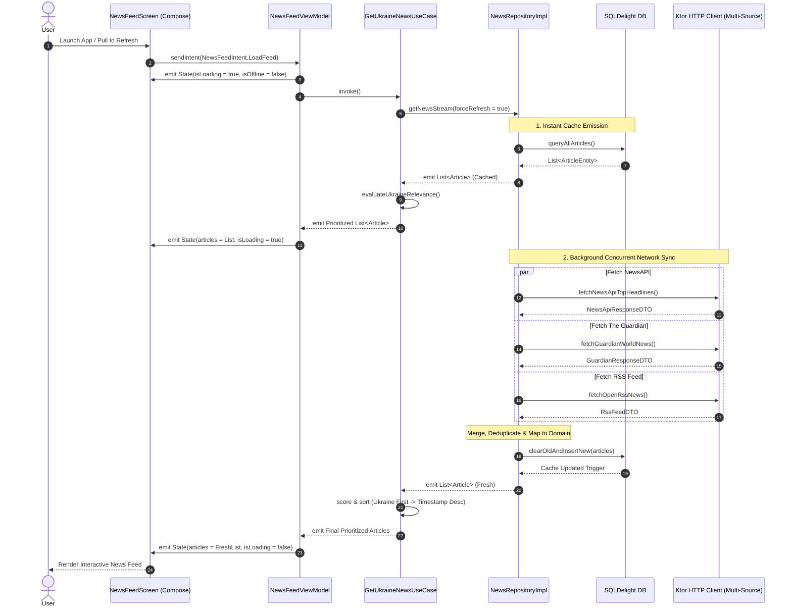

# Cross-Platform KMP News App — Architecture Documentation

## 2.1 Chosen Architectural Pattern: Clean Architecture + MVI (Model-View-Intent)

The **Cross-Platform KMP News App** is built following **Clean Architecture** principles combined with the **MVI (Model-View-Intent)** presentation pattern.

```
┌─────────────────────────────────────────────────────────────────────────┐
│                           Presentation Layer                            │
│   Compose Multiplatform UI  ◄───  NewsFeedState  ◄───  NewsFeedViewModel│
│             │                                                    ▲      │
│             └─────────────── NewsFeedIntent ─────────────────────┘      │
└────────────────────────────────────┬────────────────────────────────────┘
                                     │ Invokes
┌────────────────────────────────────▼────────────────────────────────────┐
│                              Domain Layer                               │
│           GetUkraineNewsUseCase  ◄───►  NewsRepository (Interface)      │
│                         (Pure Kotlin / Zero Deps)                       │
└────────────────────────────────────┬────────────────────────────────────┘
                                     │ Implements
┌────────────────────────────────────▼────────────────────────────────────┐
│                               Data Layer                                │
│       NewsRepositoryImpl (Offline-First Cache & Multi-Source Sync)       │
│                  ┌──────────────────┴──────────────────┐                │
│                  ▼                                     ▼                │
│       Ktor Remote Multi-API                   SQLDelight Local Cache    │
│  (NewsAPI, Guardian, RSS Feeds)               (SQLite Multiplatform)    │
└─────────────────────────────────────────────────────────────────────────┘
```

### Architectural Rationale
1. **Unidirectional Data Flow (UDF)**: MVI guarantees that UI state is predictable and immutable. User interactions trigger `Intents`, the `ViewModel` processes them through Use Cases, and produces a single, immutable `State` stream via Kotlin `StateFlow`.
2. **Strict Separation of Concerns**: The `Domain` layer has zero dependencies on Android, iOS, JVM UI frameworks, Ktor, or SQLDelight. It contains pure business rules (such as ranking and prioritizing Ukraine-related news).
3. **Multiplatform Code Sharing (>85%)**: Presentation (Compose Multiplatform), Domain (Pure Kotlin), and Data (Ktor + SQLDelight) are 100% shared across Android, iOS, and Desktop. Only platform bridges (Activity, ViewController, Desktop Window) and SQLite drivers are platform-specific.

---

## 2.2 Key Component Interactions



### Component Roles
- **Presentation (MVI)**:
  - `NewsFeedScreen`: Declarative Compose Multiplatform UI components reacting to state changes.
  - `NewsFeedViewModel`: Manages coroutine lifecycles, collects use case outputs, handles side effects (e.g. snackbars, opening browser links).
  - `NewsFeedContract`: Strictly defines `NewsFeedState`, `NewsFeedIntent`, and `NewsFeedEffect`.
- **Domain**:
  - `Article`: Core business model with properties (`id`, `title`, `description`, `source`, `url`, `imageUrl`, `publishedAt`, `isUkraineRelated`, `relevanceScore`).
  - `GetUkraineNewsUseCase`: Executes regex-based multi-lingual keyword analysis (`Ukraine`, `Ukrainian`, `Kyiv`, `Україна`, `ЗСУ`, etc.), boosting relevant articles to the top of the feed while maintaining secondary chronological sorting.
  - `NewsRepository`: Gateway contract providing reactive `Flow<List<Article>>`.
- **Data**:
  - `NewsRepositoryImpl`: Implements the Network-Bound Resource pattern. Emits cached articles immediately, executes background API sync across 3 sources concurrently using Kotlin Coroutines `async/await`, updates local DB, and re-emits updated state.
  - `KtorNewsApi`: Configured with JSON serialization, timeout controls, logging, and multi-source aggregation.
  - `ArticleDao` & `NewsDatabase`: SQLDelight SQLite storage ensuring full offline usability.

---

## 2.3 Data Flow & Synchronization Lifecycle

The diagram below details the complete request-to-render lifecycle during a user pull-to-refresh or initial launch.



---

## 2.4 Scalability & Performance Strategy

1. **Lazy Compose Lists**: `LazyColumn` with stable, deterministic keys (`key = { it.id }`) prevents unnecessary recompositions when new articles are added.
2. **Asynchronous Image Loading**: Coil 3 (Multiplatform) handles disk/memory caching and background decoding for article thumbnails with shimmer placeholders.
3. **Coroutines & Dispatchers**:
   - Network requests run on `Dispatchers.IO`.
   - SQLite queries execute on background worker threads.
   - UI state updates dispatch smoothly on `Dispatchers.Main`.
4. **Structured Concurrency**: Network fetches from different news sources run concurrently via `coroutineScope { awaitAll(...) }` with individual try-catch isolation—if one news source times out, the other two continue without failing the entire feed.
5. **Memory Footprint**: Database entries older than 7 days are automatically pruned during database maintenance routines.

---

## 2.5 Security Considerations

1. **Secret Management**:
   - API keys are injected at build time via Gradle `local.properties` or CI environment variables (e.g. `NEWS_API_KEY`, `GUARDIAN_API_KEY`).
   - Keys are compiled into `BuildConfig` / internal constants and never committed to version control.
2. **Network Security**:
   - Strict HTTPS enforcement with TLS 1.3.
   - Ktor `HttpTimeout` configuration (Connect: 10s, Socket: 15s) prevents denial-of-service hanging.
   - Cleartext HTTP traffic is disabled in Android `AndroidManifest.xml` (`android:usesCleartextTraffic="false"`) and iOS `Info.plist` (App Transport Security).
3. **Data Protection**:
   - Local SQLite database stored in application-sandboxed storage.
   - SQLCipher integration ready for encrypted storage if user bookmarks or personal feeds are added.

---

## 2.6 Error Handling & Logging Philosophy

1. **Result Wrappers**: Operations return a sealed `NetworkResult<T>` (`Success`, `Error`, `Loading`) rather than throwing raw exceptions across architecture layers.
2. **Graceful Degradation**:
   - When network connectivity is unavailable, the app falls back to cached SQLite articles and displays an unobtrusive `OfflineBanner`.
   - Individual news source failures are caught independently so partial feeds are still presented.
3. **User-Facing Error Communication**:
   - Transient errors trigger a `Snackbar` or inline `ErrorView` with a direct **"Retry"** action button.
4. **Structured Logging**: Multiplatform logger (e.g., Napier / Kermit) with debug-only logging levels to ensure no sensitive URL query parameters or tokens are leaked in production releases.
