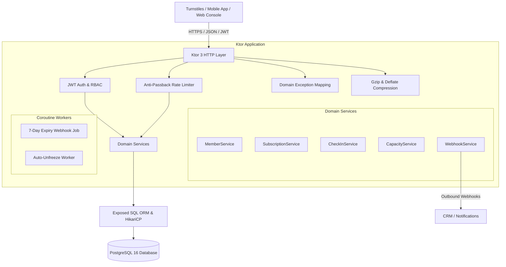

# Gym Membership & Turnstile Access API

A production-ready, high-performance REST API and Turnstile Access Control system built with **Kotlin 2.1**, **Ktor 3.1**, **Exposed ORM**, **PostgreSQL 16**, **Koin DI**, **JWT Authentication**, and **Kotlin Coroutines**.

---

## Architecture & System Highlights



### Core Business Rules & Features
* **Tiered Subscription Plans:**
  * `BASIC`: Gym Floor & Locker Room access ($29.99/mo).
  * `PREMIUM`: Gym Floor, Pool, Sauna & Spa, Group Classes + 2 Guest Passes/mo ($59.99/mo).
  * `VIP`: All-Access (VIP Lounge, Personal Trainer consult, Towel service) + 5 Guest Passes/mo ($599.99/yr).
* **Anti-Passback Defense:** Prevents badge sharing via a sliding window rate limiter (15-minute cooldown per badge code).
* **30-Day Annual Freeze Limit:** Members can freeze subscriptions up to 30 calendar days per rolling year. Subscription end dates automatically extend by the freeze duration.
* **Turnstile Access & Capacity Gating:** Validates active subscription status, zone permissions, and facility occupancy limits before granting gate entry.
* **Proactive 7-Day Renewal Webhook:** Coroutine background job scans for expiring memberships and dispatches automated webhook notifications.
* **Pagination & Search:** Member directory and check-in history endpoints support standardized pagination (`page`, `pageSize`, `totalCount`, `totalPages`).
* **High Test Coverage:** JaCoCo-verified test coverage of **81%** across domain, security, jobs, routes, services, and repositories.

---

## 📋 Concrete System Capabilities (35 Core Features)

1. **Register members** with full name, email, badge/RFID code, and password.
2. **Hash passwords** securely using BCrypt (12 salt rounds) before storing in the database.
3. **Authenticate/Log in members** using email and password.
4. **Issue JWT tokens** (HMAC256 signed) with embedded user ID, email, role, issuer, and expiration claims.
5. **Protect API endpoints** requiring JWT Bearer token authentication.
6. **Fetch member profiles by Member ID**.
7. **Fetch member profiles by physical Badge/RFID code**.
8. **Retrieve paginated member lists** with configurable `page` and `pageSize` parameters.
9. **Browse the gym plan catalog** (Basic Monthly, Premium Monthly, VIP Annual).
10. **Fetch single plan details** including pricing, duration, features, and guest pass quotas.
11. **Create/purchase a subscription** for a member, calculating exact start and end dates.
12. **Block duplicate active subscriptions** so a member cannot buy two active memberships at once.
13. **Freeze a membership** for 1 to 30 calendar days upon member request.
14. **Automatically extend the subscription expiration date** by the exact number of days frozen.
15. **Enforce a 30-day annual freeze cap**, rejecting requests exceeding the yearly quota.
16. **Block freeze attempts** on already frozen or inactive memberships.
17. **Manually unfreeze a membership** early, immediately restoring active gym access.
18. **Auto-unfreeze expired freezes** in the background via a periodic coroutine worker.
19. **Redeem allocated guest passes** (2/mo for Premium, 5/mo for VIP).
20. **Track remaining guest passes** and reject redemption when the balance reaches 0.
21. **Block guest pass redemption** if the member's subscription is currently frozen.
22. **Scan badges at turnstiles** (`POST /api/v1/check-in`) for real-time physical access control.
23. **Enforce anti-passback protection**, blocking the same badge from re-entering within 15 minutes.
24. **Gate access by gym zone**, allowing or denying entry to Pool, Sauna, Class Studio, or VIP Lounge based on membership tier.
25. **Track live gym occupancy atomically** in memory across concurrent gate scans.
26. **Block entry at turnstiles** when the facility reaches maximum capacity limit (e.g. 250 people).
27. **Record an audit trail** of every check-in attempt (timestamp, turnstile ID, zone, granted/denied status, denial reason).
28. **Retrieve paginated check-in history** for any member, sorted newest to oldest.
29. **Query live facility occupancy stats** (`currentOccupancy`, `maxCapacity`, `isAtCapacity`) via `GET /api/v1/occupancy`.
30. **Scan for memberships expiring in 7 days** in the background and dispatch outbound HTTP alert webhooks.
31. **Provide a health check endpoint** (`GET /health`) for container and load balancer monitoring.
32. **Serve an interactive web dashboard** (`GET /`) for staff to test turnstiles, scan badges, and view capacity gauges.
33. **Compress API responses** automatically using Gzip and Deflate.
34. **Translate domain errors to HTTP status codes** (400 Invalid Input, 401 Unauthorized, 403 Tier/Frozen Block, 404 Not Found, 409 Capacity/Duplicate Conflict, 429 Anti-Passback Violation).
35. **Automatically seed default plans and an admin user** (`admin@gym.com` / `AdminSecret123!`) on database startup.

---

## Quick Start (with Docker Compose)

### 1. Launch the Stack
```powershell
# Build fat JAR and start PostgreSQL + API container
.\gradlew.bat buildFatJar
docker compose up -d
```

### 2. Access the Live Dashboard
Open your browser and navigate to:
* **Interactive Operations Console:** `http://localhost:8088/` (or `http://<server-ip>:8088/`)
* **Health Check:** `http://localhost:8088/health`

### 3. Default Seed Accounts & Plans
* **Admin Email:** `admin@gym.com`
* **Admin Password:** `AdminSecret123!`
* **Pre-seeded Plans:** `plan-basic-monthly`, `plan-premium-monthly`, `plan-vip-annual`

---

## Local Development (without Docker)

### Prerequisites
* JDK 11 or higher (JDK 17/21 recommended)
* Gradle 8.14+ (or use included `gradlew.bat`)

### Run Locally:
```powershell
# Run the API locally on port 8080 (in-memory H2 database by default)
.\gradlew.bat run
```

### Execute Test Suite & Generate Coverage:
```powershell
# Run all unit, service, integration tests and generate JaCoCo report
.\gradlew.bat test jacocoTestReport --rerun-tasks
```
JaCoCo HTML report is generated at `build/reports/jacoco/test/html/index.html`.

---

## API Reference & Examples

### 1. Authentication & Registration
#### `POST /api/v1/auth/register`
```bash
curl -X POST http://localhost:8088/api/v1/auth/register \
  -H "Content-Type: application/json" \
  -d '{
    "fullName": "Alex Runner",
    "email": "alex@example.com",
    "badgeCode": "BADGE-ALEX-01",
    "password": "Password123!"
  }'
```

#### `POST /api/v1/auth/login`
```bash
curl -X POST http://localhost:8088/api/v1/auth/login \
  -H "Content-Type: application/json" \
  -d '{
    "email": "alex@example.com",
    "password": "Password123!"
  }'
```

---

### 2. Turnstile Access & Check-In
#### `POST /api/v1/check-in`
```bash
curl -X POST http://localhost:8088/api/v1/check-in \
  -H "Content-Type: application/json" \
  -d '{
    "badgeCode": "BADGE-ALEX-01",
    "zone": "GYM_FLOOR",
    "turnstileId": "GATE-01"
  }'
```

#### `GET /api/v1/occupancy`
```bash
curl http://localhost:8088/api/v1/occupancy
```
**Response:**
```json
{
  "currentOccupancy": 42,
  "maxCapacity": 250,
  "isAtCapacity": false
}
```

#### `GET /api/v1/check-ins/member/{memberId}?page=1&pageSize=10`
Returns paginated turnstile scan history for a member.

---

### 3. Plans & Subscriptions
#### `GET /api/v1/plans`
Returns the catalog of active plans (`BASIC`, `PREMIUM`, `VIP`).

#### `GET /api/v1/plans/{id}`
Returns details for a single plan by ID.

#### `POST /api/v1/subscriptions`
```bash
curl -X POST http://localhost:8088/api/v1/subscriptions \
  -H "Authorization: Bearer <JWT_TOKEN>" \
  -H "Content-Type: application/json" \
  -d '{
    "memberId": "member-uuid",
    "planId": "plan-premium-monthly",
    "autoRenew": true
  }'
```

#### `POST /api/v1/subscriptions/member/{memberId}/freeze`
```bash
curl -X POST http://localhost:8088/api/v1/subscriptions/member/{memberId}/freeze \
  -H "Authorization: Bearer <JWT_TOKEN>" \
  -H "Content-Type: application/json" \
  -d '{
    "days": 14,
    "reason": "Annual vacation"
  }'
```

#### `POST /api/v1/subscriptions/member/{memberId}/unfreeze`
Reactivates a frozen membership back to `ACTIVE`.

#### `POST /api/v1/subscriptions/member/{memberId}/guest-pass`
Redeems one guest pass from the member's remaining monthly allocation.

---

### 4. Member Management (Protected)
#### `GET /api/v1/members?page=1&pageSize=20`
Returns paginated member directory:
```json
{
  "items": [ ... ],
  "page": 1,
  "pageSize": 20,
  "totalCount": 150,
  "totalPages": 8
}
```

#### `GET /api/v1/members/{id}`
#### `GET /api/v1/members/badge/{badgeCode}`

---

## Troubleshooting Guide

| Issue | Cause | Solution |
|---|---|---|
| **Port 8088 already in use** | Another local service is listening on 8088 | Modify `PORT` or `docker-compose.yml` port mapping |
| **401 Unauthorized** | Missing or expired JWT Bearer token | Call `/api/v1/auth/login` to obtain fresh token and supply `Authorization: Bearer <token>` |
| **429 Anti-Passback Violation** | Same badge scanned within 15 minutes | Wait for the 15-minute cooldown or test with a distinct badge |
| **403 Feature Gated** | Tier does not permit access to requested zone | Upgrade subscription tier to `PREMIUM` (Pool/Sauna) or `VIP` (Lounge) |
| **Database Connection Failure** | PostgreSQL container not yet healthy | Verify `docker compose ps` and check `DATABASE_URL` in `.env` |

---

## Project Structure

```
3-Gym-Membership-API/
├── docs/
│   ├── ARCHITECTURE.md            # System architecture & Mermaid sequence diagrams
│   ├── PROJECT-PLAN.md            # Roadmap & file structure plan
│   └── TECH-NOTES.md              # CI/CD, testing, & deployment notes
├── frontend/
│   └── src/components/
│       └── MemberCheckIn.tsx      # React/TS turnstile scanner component
├── src/main/
│   ├── kotlin/com/gym/
│   │   ├── domain/                # Entities, Enums, DTOs, Validation, Domain Exceptions
│   │   ├── repository/            # Exposed SQL tables & DAOs with indices
│   │   ├── service/               # Pure business services (Freeze, CheckIn, Capacity)
│   │   ├── security/              # Anti-passback rate limiter, JWT, BCrypt
│   │   ├── jobs/                  # Scheduled coroutine workers (ExpiryWarning, AutoUnfreeze)
│   │   ├── routes/                # REST Controllers (Auth, Members, Plans, CheckIns)
│   │   ├── di/                    # Koin Dependency Injection module
│   │   └── plugins/               # Ktor plugins (Routing, StatusPages, Koin, DB, HTTP)
│   └── resources/
│       ├── application.conf       # Native HOCON configuration with env bindings
│       ├── static/index.html      # Operations & Turnstile Web Console
│       └── db/migration/          # Flyway SQL migrations
├── .github/workflows/
│   ├── ci-build-test.yml          # GitHub Actions CI with JaCoCo report upload
│   └── cd-deploy-ecs.yml          # AWS ECS Deployment CD
├── docker-compose.yml             # Local PostgreSQL + API
└── Dockerfile                     # Multi-stage production container
```

---

## CI/CD Deployment to AWS ECS
The GitHub Actions workflow at [`.github/workflows/cd-deploy-ecs.yml`](file:///.github/workflows/cd-deploy-ecs.yml) automatically builds the container image, pushes it to **Amazon ECR**, and performs zero-downtime rolling deployment to **AWS ECS Fargate** upon tagged releases (`v*.*.*`).
