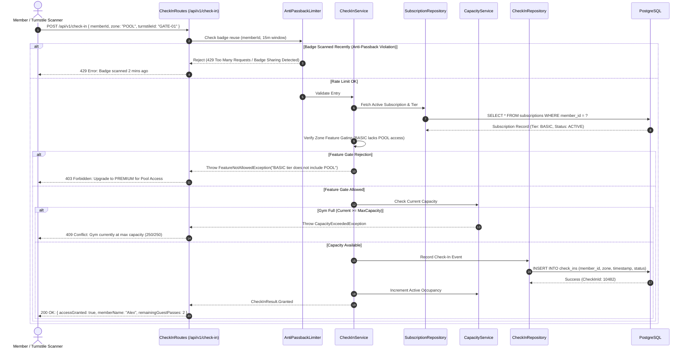
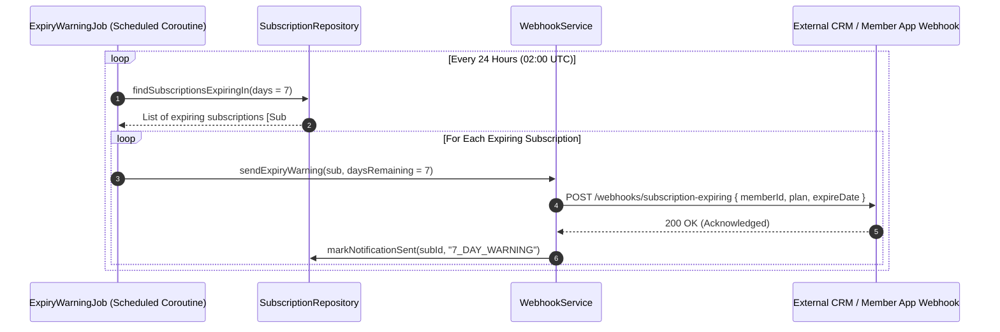

# Architecture Documentation: Gym Membership API

## 1. System Overview & Architectural Pattern

The **Gym Membership API** is designed following the **Modular Layered Architecture (Clean / Hexagonal Ports & Adapters)** pattern built atop **Kotlin** and **Ktor 3**.

```mermaid
graph TD
    Client[Mobile App / Web UI / Turnstile Hardware] -->|HTTPS / JSON / JWT| API[Ktor HTTP Routing & Plugins]
    
    subgraph Ktor Application Layer
        API --> Auth[JWT Security & RBAC]
        API --> RateLimit[Anti-Passback Limiter]
        API --> StatusPages[Global StatusPages Error Handler]
        
        Auth --> ServiceLayer[Domain Services]
        RateLimit --> ServiceLayer
        
        subgraph Domain Service Layer
            MemberSvc[Member Service]
            SubSvc[Subscription Service]
            CheckInSvc[Check-In & Capacity Service]
            WebhookSvc[Webhook Dispatcher Service]
        end
        
        subgraph Background Jobs (Kotlin Coroutines)
            ExpiryJob[7-Day Expiry Warning Job]
            UnfreezeJob[Auto-Unfreeze Worker]
        end
        
        ExpiryJob --> SubSvc
        ExpiryJob --> WebhookSvc
        UnfreezeJob --> SubSvc
    end

    subgraph Data Access Layer (Exposed ORM & HikariCP)
        ServiceLayer --> Repositories[Repositories: Member, Sub, CheckIn]
        Repositories --> DB[(PostgreSQL 16 Database)]
    end

    WebhookSvc -->|HTTP Webhook POST| ExternalGymCRM[External Webhook Consumers / CRM / Push Notification Gateway]
```

### Justification for Pattern
1. **Low Latency & High Concurrency:** Turnstiles and mobile access apps require sub-50ms validation latencies. Ktor's native coroutine-based non-blocking I/O effortlessly handles spikes during peak gym hours (e.g. 5:00 PM – 8:00 PM).
2. **Type Safety & Maintainability:** Kotlin combined with Exposed ORM offers compile-time checked SQL queries and domain isolation, eliminating runtime schema mismatch bugs.
3. **Decoupled Business Logic:** Clean separation between HTTP routing, domain rules (freeze limits, tier gating), and data persistence ensures high testability and straightforward migration paths.

---

## 2. Key Component Interactions

| Component | Responsibility | Interaction Protocol |
| :--- | :--- | :--- |
| **Ktor Routing & Plugins** | Receives inbound requests, parses JSON via `kotlinx.serialization`, executes CORS, JWT validation, and logging. | HTTP/1.1 & HTTP/2 over TLS |
| **Koin Dependency Injection** | Manages application lifecycle, injecting singleton repositories, thread-safe services, and database clients. | In-Process JVM Dependency Injection |
| **Domain Services** | Executes business rules: 30-day freeze cap, tier feature gating, guest pass balance, gym capacity checking. | Pure Kotlin suspending functions |
| **Anti-Passback Rate Limiter** | Prevents badge sharing by maintaining a sliding-window cache of recent member scans per turnstile/gate. | In-Memory Token Bucket / Sliding Log |
| **Exposed ORM & HikariCP** | Manages JDBC connection pooling with PostgreSQL, executing ACID transactions with optimistic locking. | JDBC / PostgreSQL protocol |
| **Coroutine Scheduled Workers** | Nightly cron-like workers checking 7-day expiration thresholds and auto-reactivating frozen memberships. | Kotlin `CoroutineScope` + `TickerChannel` / `delay` |
| **Webhook Dispatcher** | Asynchronously delivers JSON payload notifications to partner systems when subscriptions near expiration. | Asynchronous non-blocking HTTP client (`Ktor CIO Client`) |

---

## 3. Data Flow & Sequence Diagrams

### 3.1 Turnstile Check-In Validation Flow



### 3.2 7-Day Expiry Warning Webhook Flow



---

## 4. Scalability & Performance Strategy

1. **Non-Blocking Coroutines:** All route handling and outbound webhook dispatches leverage Kotlin Coroutines on Ktor's Netty/CIO event-loop engine, minimizing thread-context switching overhead.
2. **Database Connection Pooling:** HikariCP with optimized max pool size ($N_{threads} \times 2 + N_{disks}$), prepared statement caching, and aggressive idle timeout management.
3. **Optimized Indexes:** B-Tree indexing on `member_id`, `(member_id, status)`, `expiration_date`, and composite index on `(member_id, created_at)` for instant check-in lookups.
4. **Horizontal Scaling on AWS ECS Fargate:** The service is stateless. Session state is represented via signed stateless JWTs. ECS Service Auto Scaling scales container tasks based on CPU and Request Count per Target metrics.

---

## 5. Security Considerations

1. **Authentication & Authorization (JWT):**
   * High-entropy HMAC-SHA256 / RSA256 signed JWT tokens containing `memberId`, `email`, and `roles` (`ROLE_MEMBER`, `ROLE_TRAINER`, `ROLE_ADMIN`).
   * Short-lived access tokens (15 minutes) with revocable refresh tokens stored securely in PostgreSQL.
2. **Anti-Passback Defense (Badge Sharing Prevention):**
   * Sliding window validation restricts consecutive check-ins from the same `memberId` within a configurable 15-minute threshold.
3. **Password Security:**
   * Passwords salted and hashed with BCrypt (Work factor = 12).
4. **Input Sanitization & Injection Defense:**
   * Exposed ORM utilizes parameterized SQL queries exclusively, eliminating SQL injection vectors.
5. **Secret Management:**
   * Secrets (`DATABASE_URL`, `JWT_SECRET`, `WEBHOOK_SECRET`) injected as environment variables via AWS Secrets Manager / Parameter Store into ECS task definitions.

---

## 6. Error Handling & Logging Philosophy

1. **Domain-Driven Exception Hierarchy:**
   * Base domain exception: `GymException`.
   * Granular exceptions: `MembershipFrozenException`, `CapacityExceededException`, `BadgeSharingException`, `InsufficientGuestPassesException`.
2. **Unified StatusPages Interceptor:**
   * All domain exceptions map to standard REST HTTP status codes (400, 401, 403, 404, 409, 429, 500).
   * Standard JSON error envelope:
     ```json
     {
       "status": 403,
       "error": "FEATURE_GATED",
       "message": "Basic tier does not have access to the Sauna & Spa area.",
       "timestamp": 1787848800000
     }
     ```
3. **Structured Logging:** Logback configured with JSON encoder and correlation request IDs (`X-Request-ID`) attached via Ktor `CallLogging` for end-to-end tracing.
