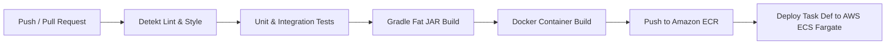

# Technical Notes: Gym Membership API

## 1. CI/CD Pipeline Design

The CI/CD pipeline leverages **GitHub Actions** for automated quality gates and container deployment to **AWS ECS (Elastic Container Service - Fargate)**.



### Key Stages:
1. **Lint & Code Analysis:** Detekt & ktlint enforce idiomatic Kotlin standards and fail PRs on violations.
2. **Automated Test Matrix:** Runs unit tests, domain rule validation, and integration tests using Ktor `testApplication`.
3. **Container Build & Security Scan:** Builds multi-stage minimal JRE Docker image; runs Trivy / AWS ECR vulnerability scanning.
4. **Environment Deployment:**
   * **Staging:** Automatic deployment on merge to `main`.
   * **Production:** Tagged release (`v*.*.*`) or manual approval gate in GitHub Actions Environments.

---

## 2. Testing Strategy

### 2.1 Test Pyramid Targets
* **Unit Tests (Coverage Target $\ge$ 80%):**
  * Business rules: 30-day freeze calculation, tier feature gating, rate limiting calculations.
  * Framework: `kotlin.test`, JUnit 5, MockK.
* **Integration Tests (Coverage Target $\ge$ 70%):**
  * HTTP routing, serialization, JWT authentication headers, StatusPages exception handling.
  * Framework: `io.ktor.server.testing.testApplication`.
* **End-to-End & Concurrency Tests:**
  * Turnstile race conditions: multiple simultaneous badge scans against anti-passback filters.
  * Database transaction rollbacks during capacity limits.

---

## 3. Deployment Strategy (AWS ECS Fargate)

1. **Multi-Stage Containerization:**
   * Build Stage: Gradle 8 + Eclipse Temurin JDK 17/21 on Alpine Linux.
   * Runtime Stage: Eclipse Temurin JRE 17/21 on Alpine Linux (final image size < 180MB).
2. **AWS ECS Fargate Task Definition:**
   * Memory: 512 MB – 1024 MB per task.
   * CPU: 0.25 – 0.5 vCPU.
   * Health Check: HTTP `GET /health` with 10s interval, 5s timeout, 3 retries.
3. **Application Load Balancer (ALB):**
   * Terminates TLS/HTTPS (ACM Certificate).
   * Forwards requests to ECS target group on port 8080.

---

## 4. Environment Management & `.env.example`

Configuration is managed via **Hocon/YAML** with environment variable substitution.

```ini
# Server Configuration
PORT=8080
HOST=0.0.0.0
ENVIRONMENT=development

# Database Configuration (PostgreSQL)
DATABASE_URL=jdbc:postgresql://localhost:5432/gym_db
DATABASE_USER=gym_user
DATABASE_PASSWORD=gym_secure_pass
DATABASE_MAX_POOL_SIZE=10

# JWT Security
JWT_SECRET=super-secret-hex-key-minimum-32-chars-long-example
JWT_ISSUER=https://api.gymmembership.com/
JWT_AUDIENCE=gym-api-consumers
JWT_REALM=GymMembershipRealm
JWT_EXPIRATION_MS=900000

# Gym Capacity & Anti-Passback Configuration
MAX_GYM_CAPACITY=250
ANTI_PASSBACK_WINDOW_MINUTES=15
EXPIRE_WARNING_DAYS_BEFORE=7

# Webhooks
WEBHOOK_EXPIRATION_URL=https://webhook.site/gym-expiry-alerts
WEBHOOK_SECRET=whsec_sample_secret_key
```

---

## 5. Version Control Workflow

We adhere to **Trunk-Based Development with Short-Lived Feature Branches**:
1. Branch naming: `feature/GYM-<ticket>-short-description`, `fix/GYM-<ticket>`, `chore/...`.
2. Pull Requests require:
   * 1 approved peer code review.
   * Passing CI pipeline (detekt + unit/integration tests).
   * Linear commit history via **Squash and Merge**.

---

## 6. Common Pitfalls & How We Mitigate Them

| Pitfall | Impact | Mitigation in this Architecture |
| :--- | :--- | :--- |
| **Exposed Transactions in Coroutines** | Calling `transaction { ... }` inside coroutines can block the Dispatcher worker threads. | Wrap all Exposed DB calls in `newSuspendedTransaction(Dispatchers.IO) { ... }`. |
| **Hikari Connection Pool Starvation** | Slow queries or background worker batch jobs consuming all DB pool connections. | Configure dedicated background job coroutine throttles and set strict Hikari `connectionTimeout` (3000ms). |
| **Anti-Passback Race Conditions** | Two friends scanning the same badge simultaneously at adjacent turnstiles within 100ms. | Utilize atomic compare-and-set or Redis Lua script / synchronized sliding window timestamps. |
| **JWT Clock Skew** | Client tokens rejected due to slight time discrepancies across servers. | Configure `withLeeway(30)` in Ktor's `JWTVerifier` to permit a 30-second time tolerance. |
| **30-Day Freeze Multi-Year Rollover** | Calculating 30 days across calendar year boundaries (e.g. Dec 20 to Jan 15). | Aggregate freeze days strictly partitioned by calendar year segments in `FreezeService`. |
