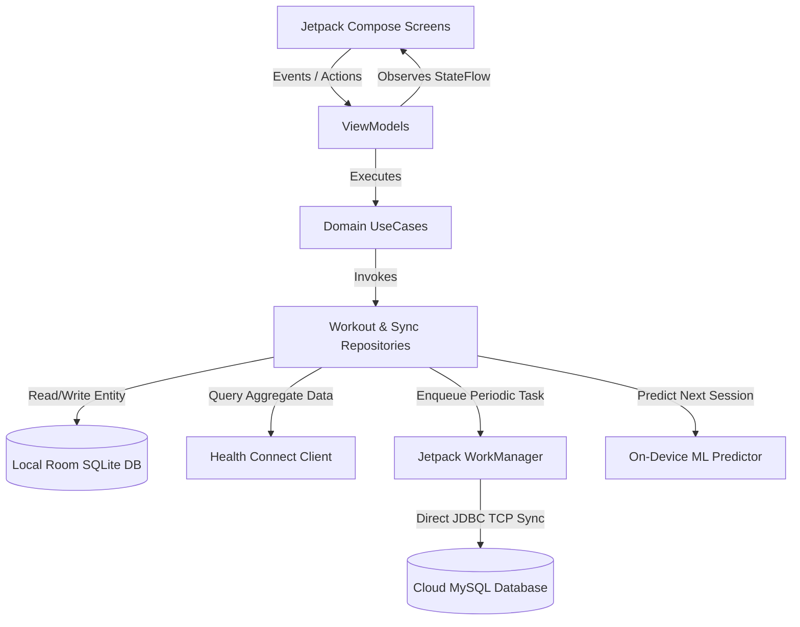
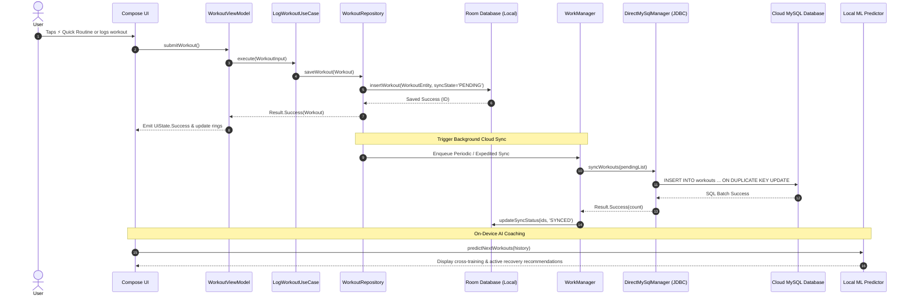

# System Architecture: Fitness Tracker App (Standalone Android + Cloud MySQL)

## 2.1 Chosen Architectural Pattern

The Fitness Tracker system employs **Clean Architecture with MVVM (Model-View-ViewModel)** on the Android client, communicating **directly with Cloud MySQL via JDBC over SSL/TCP**.

```
+-----------------------------------------------------------------------------------+
|                              PRESENTATION LAYER                                   |
|   Jetpack Compose UI (Material 3)  <--->  StateFlow / ViewModels (Unidirectional) |
+-----------------------------------------+-----------------------------------------+
                                          |
+-----------------------------------------v-----------------------------------------+
|                                DOMAIN LAYER                                       |
|           UseCases / Interactors   <--->   Domain Models & Interfaces             |
+--------------------+------------------------------------+-------------------------+
                     |                                    |
+--------------------v-------------------+   +------------v-------------------------+
|           DATA LAYER (LOCAL)           |   |          DATA LAYER (DIRECT SYNC)    |
| - Room Database (SQLite Engine)        |   | - DirectMySqlManager (JDBC Driver)   |
| - Health Connect Android API           |   | - WorkManager Background Sync Engine |
| - On-Device ML Workout Predictor       |   | - Cloud MySQL Relational DB          |
+----------------------------------------+   +--------------------------------------+
```

### Justification:
1. **Zero Backend Maintenance:** No separate Ktor/Spring server or Docker containers are required. The phone syncs directly to Cloud MySQL.
2. **Offline-First Resilience:** Room SQLite acts as the local Single Source of Truth (SSOT). All logging and viewing works without an internet connection.
3. **On-Device AI Recommendation Engine:** The ML predictor runs 100% locally on device, analyzing fatigue, intensity, and cross-training patterns without cloud latency.
4. **Health Connect Compliant:** Handles Google Health Connect steps, active calories, and exercise records seamlessly.

---

## 2.2 Key Component Interactions



---

## 2.3 Data Flow & Sequence Diagram


