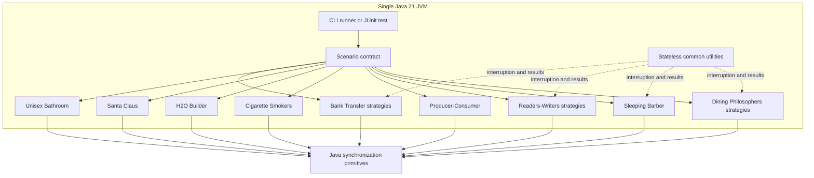
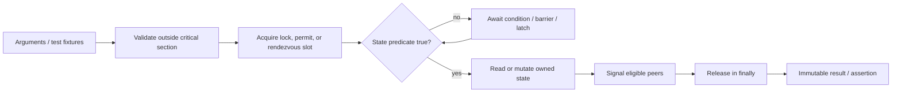
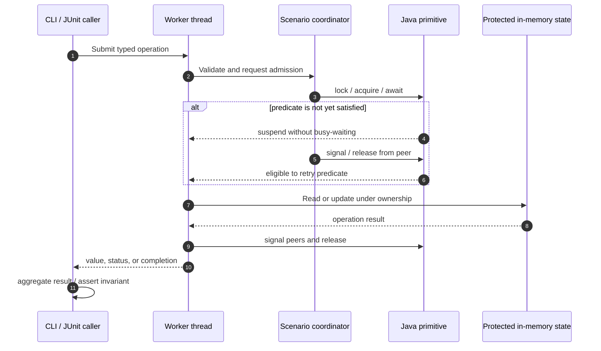

# Classical Concurrency Problems — Architecture

## 1. Architectural pattern

The project uses a **modular, single-process application** with a strategy-oriented design. It is structurally similar to a modular monolith, but its modules are independent concurrency scenarios rather than business services.

This pattern fits because the behavior under study is coordination between threads in one JVM. Network services, brokers, and databases would introduce unrelated failure modes and make demonstrations harder to understand and test. Package boundaries still provide modularity: each problem owns its state and primitives, while alternative algorithms implement the same small scenario contract where comparison is useful.

### Architectural rules

1. A synchronization object has one clear owner; locks and mutable collections are never shared across scenario packages.
2. Public methods validate arguments before acquiring locks or permits.
3. Condition predicates are checked in `while` loops because wakeups may be spurious or another thread may win the race.
4. Every lock and permit release is paired structurally with acquisition, normally in `finally`.
5. Interrupts are either propagated or restored; they are never silently consumed.
6. Unsafe demonstrations are explicitly named and excluded from the default runner and routine tests.
7. Tests use timeouts and coordinated starts rather than arbitrary sleeps wherever practical.

## 2. Components and responsibilities

| Component | Responsibility | Primary primitive(s) | Core invariant |
|---|---|---|---|
| Dining Philosophers | Coordinate exclusive forks | `ReentrantLock`, `Semaphore` | Adjacent philosophers never own the same fork concurrently. |
| Sleeping Barber | Bound waiting room and dispatch customers | `Semaphore`, blocking handoff | Customers admitted never exceed chairs plus active service. |
| Readers-Writers | Permit concurrent reads and exclusive writes | `ReadWriteLock`, `Condition` | No writer overlaps any other reader or writer. |
| Producer-Consumer | Bound a FIFO buffer | `ReentrantLock`, two `Condition`s | Size remains between zero and capacity. |
| Cigarette Smokers | Match agent resources to exactly one smoker | `Semaphore` | One agent round releases one matching smoker. |
| H2O Builder | Form groups of two H and one O | `Semaphore`, `CyclicBarrier` | Each completed generation contains exactly three atoms in a 2:1 ratio. |
| Santa Claus | Prioritize reindeer and group elves | `CountDownLatch`, `Semaphore` | Reindeer proceed as nine; elves receive help as groups of three. |
| Unisex Bathroom | Enforce capacity and single-category occupancy | fair `ReentrantLock`, `Condition` | Opposing groups never occupy the resource together. |
| Bank Transfers | Demonstrate and prevent circular wait | intrinsic locks, `ReentrantLock`, `tryLock` | Safe transfers conserve total balance and avoid circular wait. |
| Deadlock Detector | Inspect JVM-owned synchronizers | `ThreadMXBean` | Detection is observational and never mutates scenario state. |
| Phase/batch examples | Coordinate dynamic phases and swap ownership | `Phaser`, `Exchanger` | Registered phase participants advance together; each exchange has exactly two parties. |

## 3. Component interactions

All communication is synchronous and in-process. “API” means a typed Java method call, not HTTP.

| Interaction mechanism | Usage | Rationale |
|---|---|---|
| Java API calls | The CLI or a test constructs a scenario and invokes operations. | Keeps inputs typed and scenarios easy to embed and test. |
| Direct shared state | Private state is accessed only under the owning synchronization policy. | Shared-memory coordination is the subject of the project. |
| In-memory handoff | Semaphores, conditions, barriers, latches, and queues transfer readiness or ownership. | Represents coordination without external infrastructure. |
| Message queue | No external queue. A local blocking queue may be an implementation detail in a scenario. | A broker would not improve the learning objective. |
| Event bus | None. Completion callbacks/barrier actions remain local. | Avoids hidden control flow and global mutable state. |
| Database access | None. Results are returned to the caller and discarded after the process. | Persistence is neither required nor desirable for isolated runs. |
| Network/API endpoint | None. | The deployment target is local Java execution. |

`PhasedSimulation` provides a small lifecycle wrapper around `Phaser` for dynamically
registered demo participants. `BatchExchanger` demonstrates a two-party ownership swap
using immutable outgoing snapshots, complementing the shared bounded-buffer example.

## 4. Typical data flow

State is transient. A caller supplies identifiers or values, the scenario validates them, and a worker interacts with the synchronization coordinator. The coordinator admits or suspends the worker according to an explicit predicate. Once admitted, the worker changes protected in-memory state, wakes eligible peers, releases its resource, and returns a value or contributes to an immutable summary.

There is no storage round-trip. Reproducibility comes from constructing fresh scenario objects per run and recording inputs, thread names, strategy, iteration count, and final invariant measurements.

## 5. Concurrency design by problem

### Dining Philosophers

- **Deadlock demonstration:** every philosopher takes the left fork before requesting the right. A coordinated start can produce circular wait. It is opt-in and must run in a disposable JVM or daemon threads.
- **Resource hierarchy:** forks have a total order; every philosopher locks the lower-numbered fork first. This removes circular wait.
- **Arbitrator:** a fair semaphore with `N - 1` permits limits entry to the fork-acquisition region. At least one philosopher can obtain both forks, so circular wait cannot encompass all participants.

### Sleeping Barber

A fair semaphore represents waiting-room capacity. A customer that cannot acquire a chair immediately leaves. Accepted customers enter an in-memory queue; barber workers block until work is present, then free the waiting-room permit before serving. Shutdown uses an explicit lifecycle flag and worker interruption/poison handoff rather than abandoned non-daemon threads.

### Readers-Writers

`ReadWriteLockDocument` exposes fair and non-fair `ReentrantReadWriteLock` policies. The fair variant reduces barging at some throughput cost; Java's fairness setting is not a hard real-time guarantee. `WriterPriorityDocument` explicitly prevents new readers from entering when writers are waiting, using predicate loops and Conditions.

### Producer-Consumer

One `ReentrantLock` protects the bounded FIFO. Producers wait on `notFull`; consumers wait on `notEmpty`. State changes signal the opposite condition. The API is generic, rejects null elements, and propagates interruption.

### Cigarette Smokers

An agent publishes one pair per round and releases only the smoker who owns the missing ingredient. An acknowledgement semaphore prevents the next round from overwriting the logical table. Shutdown releases blocked participants and is idempotent.

### H2O Builder

Two hydrogen permits and one oxygen permit control admission to a three-party cyclic barrier. A barrier action records molecule completion. Permits are returned only after rendezvous so atoms from unbounded groups cannot cross the intended capacity boundary.

### Santa Claus

Reindeer use a nine-party arrival latch for the seasonal rendezvous. Elves acquire three group slots and wait on a group completion latch. A Santa notification semaphore avoids polling. Production-strength evolution should model repeated seasons with replaceable latches or a Phaser.

### Unisex Bathroom

A fair lock guards the active group, occupancy, waiting counts, and turn. Conditions block each group independently. When the room becomes empty, the turn prefers the opposite waiting group, bounding repeated barging and reducing starvation. Capacity is enforced under the same lock.

### Bank transfer and deadlock

- The unsafe operation locks source then destination and can create circular wait.
- Ordered locking acquires account locks by stable account ID, removing circular wait.
- Timed transfer uses `tryLock` with a shared deadline and always unlocks partial acquisition; the caller may retry with bounded backoff.
- `ThreadMXBean.findDeadlockedThreads()` detects owned-synchronizer deadlocks for diagnostics.

## 6. Scalability and performance strategy

“Scale” here means more participants, iterations, and strategies inside one JVM—not horizontal service scaling.

- Keep critical sections small and never perform console I/O while holding a lock.
- Prefer targeted condition signaling when the eligibility predicate is unambiguous; use broader signaling only when multiple predicates may have changed.
- Use fair locks only for examples that require admission fairness; unfair locks usually offer higher throughput.
- Avoid unbounded thread creation. Demos should use a bounded executor or virtual threads when the example is not specifically about platform-thread scheduling.
- Separate coordination metrics from the hot path. `LongAdder` is suitable for high-contention counters that are not part of a compound invariant.
- Parameterize participant and iteration counts so stress tests can grow without changing algorithms.
- Use JMH for performance comparisons and jcstress for Java Memory Model correctness; wall-clock assertions in JUnit are not benchmarks.
- Capture Java Flight Recorder data for lock contention before optimizing.

Because each scenario is isolated, a slow or highly contended implementation cannot corrupt another scenario. Independent modules can later become separate Maven modules if build time or educational scope grows, without changing their public contracts.

## 7. Security considerations

The application has no remote interface and handles no persistent or sensitive data, so its attack surface is small. Security requirements still inform safe local execution.

| Concern | Approach |
|---|---|
| Authentication and authorization | Not applicable for a local CLI/library. If an HTTP adapter is ever added, keep identity outside scenario packages and authorize before scheduling work. |
| Data protection | Do not include secrets or personal data in fixtures, logs, thread names, or thread dumps. Thread dumps can expose in-memory values and must be handled as diagnostic artifacts. |
| API security | Validate capacities, counts, IDs, amounts, and timeouts; reject invalid values before acquiring synchronization resources. Bound queues and participant counts to resist accidental resource exhaustion. |
| Secret management | No secrets or environment variables are required. `.env.example` explicitly records that contract. Future secrets belong in CI secret storage or an OS secret manager, never Git. |
| Dependency risk | Keep runtime dependencies at zero where possible; pin build/test plugin versions and review automated dependency updates. |
| Unsafe demos | Deadlock demonstrations are opt-in, clearly named, and excluded from default execution to avoid denial of service through a hung process. |

## 8. Error handling and logging philosophy

### Error categories

| Category | Handling |
|---|---|
| Invalid caller input | Throw `IllegalArgumentException` or `NullPointerException` before resource acquisition. |
| Interruption | Propagate `InterruptedException` from blocking APIs. At top-level boundaries, restore the interrupt flag before returning/failing. |
| Timeout/contention | Return a typed outcome such as `false`; do not treat normal contention as an exception. |
| Broken barrier | Preserve the underlying cause, restore interruption where relevant, and leave the object in a documented recoverable or closed state. |
| Invariant violation | Throw `IllegalStateException` with identifiers and state values; fail tests immediately. |
| Deliberate deadlock | Observe through `ThreadMXBean` or an external thread dump; never attempt unsafe lock recovery. |

The core library does not require a logging framework. It returns results and lets the CLI boundary format concise messages. This avoids logging under locks and keeps runtime dependencies minimal. If structured logging is later added, log scenario name, run ID, strategy, thread name, and outcome; avoid recording every synchronization transition by default because logging changes scheduling and can hide races (the observer effect).

Top-level runners must have an uncaught-exception handler, a bounded completion wait, and a clear non-zero exit status on failure. Tests should attach thread-state diagnostics to timeout failures so a stalled build explains what was waiting and which locks were owned.

## 9. Extensibility

To add a solution, implement the relevant package contract, keep synchronization state private, document the invariant and progress guarantee, and add a test that runs the same behavioral assertions as sibling strategies. A new classical problem receives a new peer package; it must not add knowledge to existing problems or the `common` package unless the abstraction is genuinely shared and stateless.
