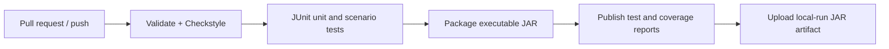

# Classical Concurrency Problems — Technical Notes

## 1. Prerequisites

| Tool | Required version | Check |
|---|---:|---|
| JDK | 21 | `java -version` and `javac -version` |
| Maven | 3.9+ | `mvn -version` |
| Git | Recent supported version | `git --version` |

Use a full JDK rather than a runtime-only installation because thread-dump and diagnostic tools such as `jcmd`, `jstack`, and Java Flight Recorder are part of the JDK toolset.

## 2. CI/CD pipeline design

The GitHub Actions workflow is intentionally a CI-and-artifact pipeline. “Deployment” means publishing a tested JAR artifact for local use; there are no always-on dev, staging, or production environments.



| Stage | Maven command / action | Failure policy |
|---|---|---|
| Checkout and toolchain | Set up Temurin Java 21 with Maven cache | Stop if the required toolchain cannot be installed. |
| Lint/validate | `mvn -B -ntp validate checkstyle:check` | Stop on malformed project metadata or style violations. |
| Test | `mvn -B -ntp test` | Stop on assertion, timeout, leaked-thread, or uncaught-worker failure. |
| Build | `mvn -B -ntp package` | Stop if compilation or packaging fails. |
| Coverage | JaCoCo report and check during `verify` | Fail the build below 80% line coverage and publish the report. |
| Deploy dev | Download workflow artifact and run locally | Manual; never starts the unsafe deadlock demo by default. |
| Deploy staging | Not applicable | No hosted staging environment exists. A release-candidate JAR is the closest equivalent. |
| Deploy production | Attach a signed/checksummed JAR to a tagged release if distribution is desired | Manual approval; no server rollout. |

Recommended CI hardening:

- Give workflow tokens read-only permissions unless a release job explicitly needs more.
- Cancel superseded runs for the same branch.
- Set job-level timeouts; concurrency tests must not consume a runner indefinitely.
- Store Surefire text/XML and JaCoCo HTML reports when tests fail.
- Avoid rerunning a flaky test until green. A retry hides scheduling defects; quarantine and diagnose it instead.
- Run a separate scheduled stress profile so pull requests remain fast and deterministic.

## 3. Testing strategy

### Test layers

| Layer | Tools | What to verify | Target |
|---|---|---|---|
| Unit | JUnit Jupiter 6 | Argument validation, simple state transitions, lock-order selection, result values | Enforced 80%+ line coverage, supplemented by invariant and error-path tests. |
| In-process scenario/integration | JUnit Jupiter, executors, barriers/latches, `assertTimeoutPreemptively` used cautiously | Multiple participants, conservation rules, exclusivity, capacity, progress, clean shutdown | At least one bounded multi-thread scenario per strategy. |
| Stress/memory model | jcstress in an opt-in Maven profile | Racy outcomes and Java Memory Model behavior across many schedules | Nightly or manual; analyze allowed/forbidden outcomes rather than line coverage. |
| Performance | JMH | Throughput, latency distribution, and contention across fair/unfair strategies | Manual or scheduled; never assert benchmark timings in normal CI. |
| End-to-end | Maven Failsafe or a process-level harness | Launch the packaged CLI, verify exit status/output, ensure no process hang | One smoke test for safe default examples. |

### Concurrency test patterns

1. Construct a fresh scenario per test; never share synchronization state between tests.
2. Coordinate worker starts with `CountDownLatch`, `CyclicBarrier`, or `Phaser`, not long arbitrary sleeps.
3. Put a timeout around every operation that could block. A timeout is a diagnostic boundary, not proof of correctness.
4. Capture exceptions from worker futures. An executor task can fail while the main test otherwise appears successful.
5. Verify invariants after all futures complete: total balance, buffer accounting, maximum occupancy, molecule ratio, or meals eaten.
6. Shut down executors in `finally`, request cancellation, and assert termination.
7. Repeat small scenarios enough to explore schedules, but keep deterministic pull-request tests bounded.
8. On timeout, include thread names/states and `ThreadMXBean` deadlock results in the assertion message.

### Coverage policy

Do not optimize only for a coverage percentage. Deliberately blocking branches are dangerous to execute in the regular test JVM, and a line can be covered without exercising an adverse interleaving. Track line/branch coverage for ordinary control flow while separately maintaining an invariant matrix:

| Invariant type | Examples |
|---|---|
| Safety | No mixed bathroom occupancy; no overlapping writer; no shared fork. |
| Capacity | Buffer never exceeds bound; waiting room and bathroom respect capacity. |
| Conservation | Deposits/transfers conserve funds; produced count equals consumed plus buffered. |
| Grouping | H2O is 2H:1O; elves group by three; reindeer group by nine. |
| Progress | Every accepted customer is eventually handled under the test assumptions. |
| Cancellation | Interrupted waits release partial resources and leave the object usable or closed. |

## 4. Deployment strategy

### Local build and execution

```shell
mvn clean verify
java -jar target/classical-concurrency-problems-1.0.0-SNAPSHOT.jar list
java -jar target/classical-concurrency-problems-1.0.0-SNAPSHOT.jar all-safe
```

The packaged JAR exposes every algorithm through an explicit command. `all-safe` excludes
the two intentional deadlock workloads. Those deadlock commands use daemon workers,
confirm the cycle through `ThreadMXBean`, print a bounded summary, and exit; a modified
non-daemon version should be launched in a disposable process for manual thread-dump work.

### Artifact lifecycle

1. A pull request validates style, tests, and packaging.
2. A merge to `main` creates a downloadable snapshot artifact.
3. A semantic version tag may create a release JAR plus SHA-256 checksum.
4. Users run the artifact with a compatible Java 21 runtime locally.

### Containerization

No Dockerfile or container configuration is supplied. Containers add image maintenance, resource-limit behavior, signal forwarding, and diagnostic-access concerns without benefiting a local Java concurrency lab. If a future remote sandbox requires isolation, use a minimal Java 21 runtime image, set explicit CPU/memory/PID limits, forward termination signals, retain `jcmd`/JFR access in a diagnostic image, and never grant host-level privileges.

## 5. Environment management

This project does not require environment-specific secrets, services, or environment
variables. Use the documented JAR command names for reproducible runs. Java SE does not
automatically load `.env` files.

The checked-in `.env.example` explicitly records that no variables are consumed:

```dotenv
# No environment variables are required or consumed by this Java SE project.
# This placeholder is retained to make that operational contract explicit.
```

| Environment | Configuration approach |
|---|---|
| Development | IDE run configuration or command-line arguments; small iterations and verbose summaries. |
| CI | Fixed Maven/JDK versions; bounded deterministic parameters; job timeout. |
| Stress | Separate Maven profile; higher iterations; JFR/jcstress output retained. |
| Release/local production | Versioned JAR and explicit CLI arguments; safe scenarios only by default. |

Never make correctness depend on machine core count or thread timing. Record relevant parameters in run output so a result can be reproduced.

## 6. Version-control workflow

Use **GitHub Flow** with short-lived branches:

1. Branch from `main` for one problem, strategy, or infrastructure change.
2. Commit code, invariant-focused tests, and documentation together.
3. Open a pull request; require CI and at least one review for synchronization changes.
4. Rebase or merge the latest `main`, then squash-merge when checks pass.
5. Tag releases from `main` using semantic versioning.

This is lighter than Gitflow and fits a library/demo repository with no parallel production release trains. Protect `main`; do not keep long-lived integration branches where concurrency fixes diverge.

Suggested commit prefixes are `feat:`, `fix:`, `test:`, `docs:`, `build:`, and `refactor:`. A concurrency bug fix should describe the violated invariant and why the new ordering or predicate restores it.

## 7. Diagnostics

### Thread dump

Find the Java process, then capture a dump:

```shell
jcmd -l
jcmd <pid> Thread.print -l
```

An alternative is `jstack -l <pid>`. Capture multiple dumps a few seconds apart to distinguish a stable deadlock from transient contention. Look for `BLOCKED`, `WAITING`, and lock ownership cycles. Java-level detection is available through `ThreadMXBean.findDeadlockedThreads()`.

### Java Flight Recorder

For a bounded run, enable a recording and inspect monitor/lock contention in JDK Mission Control:

```shell
java -XX:StartFlightRecording=filename=concurrency.jfr,dumponexit=true -jar target/classical-concurrency-problems-1.0.0-SNAPSHOT.jar
```

Tracing changes timing. Reproduce an issue both with and without heavy logging/diagnostics before drawing conclusions.

## 8. Common pitfalls

| Pitfall | Consequence | Mitigation |
|---|---|---|
| Calling `wait()`/`notify()` without owning the monitor | `IllegalMonitorStateException` or missed coordination | Encapsulate monitor operations in synchronized methods/blocks and document the predicate. |
| Using `if` around `wait()`/`await()` | State may be false after spurious wakeup or barging | Always re-check in a `while` loop. |
| Swallowing `InterruptedException` | Cancellation and shutdown become unreliable | Propagate it; at a non-throwing boundary, restore the flag with `Thread.currentThread().interrupt()`. |
| Acquiring locks in inconsistent order | Circular-wait deadlock | Define a stable global order or use an arbitrator/timed acquisition with complete rollback. |
| Forgetting `finally` | Locks/permits leak on exceptional paths | Pair successful acquisition with release in the narrowest possible `try/finally`. |
| Releasing a permit that was not acquired | Semaphore capacity silently grows | Track acquisition with control flow or a boolean and release only on success. |
| Assuming fair locks guarantee strict FIFO scheduling | Misleading starvation claims | Describe fairness as reduced barging, measure it, and use explicit turns/conditions for stronger policy. |
| Holding locks during I/O, callbacks, or sleeps | Convoying, high contention, re-entrancy hazards | Copy required state, unlock, then invoke external work. |
| Busy-waiting on a flag | Wasted CPU and potential visibility bugs | Use conditions, semaphores, latches, barriers, or properly published state. |
| Treating `volatile` as compound-operation atomicity | Lost updates and broken invariants | Use locks/atomics appropriate to the whole invariant. |
| Using `Thread.sleep()` to prove ordering | Flaky tests on different loads/machines | Coordinate with barriers/latches and assert bounded outcomes. |
| Leaving executors/workers alive | Maven/CI process hangs after tests | Provide lifecycle methods and assert executor termination. |
| Running deliberate deadlock in Surefire's main fork | Entire test suite can hang | Use a disposable subprocess or daemon-only demonstration plus external timeout. |
| Resetting a broken `CyclicBarrier` without a protocol | Threads from different logical generations can mix | Treat barrier failure as a scenario failure or coordinate reset under one owner. |
| Reusing a `CountDownLatch` | Later rounds never block | Create a new latch per generation or use `CyclicBarrier`/`Phaser`. |
| Incorrect timed `tryLock` budgeting | Total wait exceeds caller timeout | Compute one deadline and pass only the remaining time to each acquisition. |
| Overflow in monetary comparisons/order keys | Incorrect validation or lock order | Use stable IDs for order and checked/exact arithmetic for balances. |

## 9. Maintenance checklist

- Run `mvn clean verify` before merging.
- Review synchronization changes with a lock/permit acquisition-order sketch.
- Confirm blocking APIs document interruption and timeout behavior.
- Confirm all worker exceptions reach the caller or test.
- Keep unsafe examples quarantined from default execution.
- Update diagrams and invariant tests whenever an admission policy changes.
- Prefer the smallest primitive that expresses the coordination rule clearly; clarity is more valuable here than clever lock-free code.
