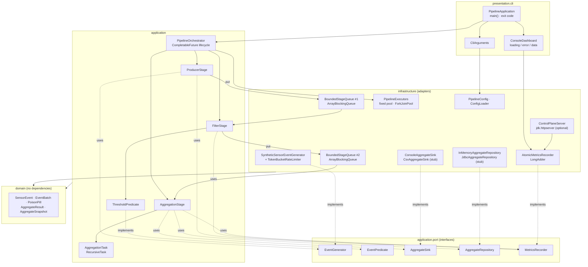
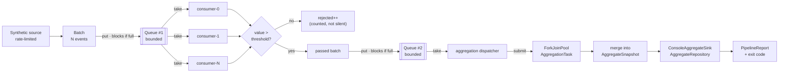
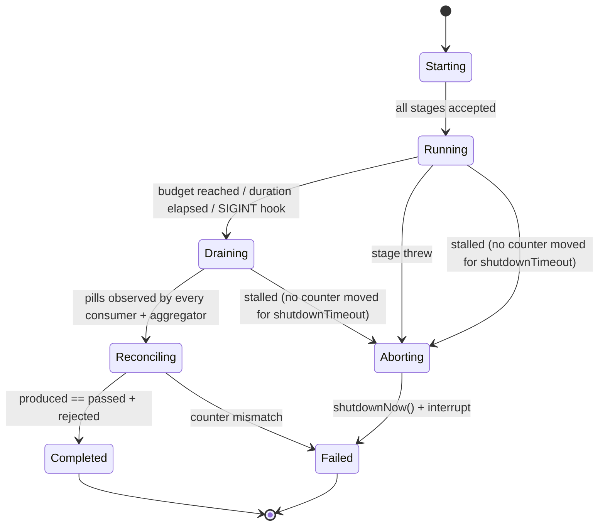

# Event Processing Pipeline — Architecture

---

## 2.1 Chosen Architectural Pattern

**Staged Event-Driven Architecture (SEDA) inside a Hexagonal (Ports & Adapters) layered monolith.**

Two patterns, two different jobs:

| Concern | Pattern | Why |
|---|---|---|
| **Runtime topology** | SEDA — independent stages joined by bounded queues | Each stage gets its *own* thread pool sized to its *own* bottleneck (producer = IO/timing-bound, filter = branch-bound, aggregation = CPU-bound). Bounded queues give backpressure for free and make the slowest stage observable as a full queue rather than as an OOM. |
| **Code organisation** | Hexagonal / layered monolith (`domain` → `application` → adapters) | Lets `ForkJoinPool`, `ArrayBlockingQueue`, console IO and JDBC all be swapped without touching the aggregation algebra. `AggregationTask` is unit-testable with zero threads because it depends on nothing but `domain`. |

### Justification for this scale

- **Single JVM, no broker.** The requirement is a local, test-verifiable demonstration. Introducing Kafka/RabbitMQ would add operational surface (brokers, topics, offsets, containers) without changing what is being demonstrated: correct use of `ExecutorService`, `ForkJoinPool` and `ArrayBlockingQueue`.
- **Stages, not microservices.** Stage boundaries are `BlockingQueue` handoffs — nanosecond-latency, in-process, and impossible to partially fail with a network partition. If a stage ever needs to scale beyond one machine, the *same* boundary becomes a broker topic: the port interfaces (`EventGenerator`, `AggregateSink`) are already the seam.
- **Poison pill over interrupt-only shutdown.** An `ExecutorService.shutdownNow()` interrupt is a *cancel*; a poison pill is a *drain*. The business logic requires every produced event to be accounted for, so the pill is the primary mechanism and `shutdownNow()` is only the timeout fallback.
- **Sealed interface for queue payloads.** `sealed interface PipelineMessage permits EventBatch, PoisonPill` makes "is this a shutdown signal?" a compiler-checked pattern match rather than a `null` check or a magic sentinel object. This is the single most bug-preventing decision in the design.

### Rejected alternatives

| Alternative | Why rejected |
|---|---|
| One thread pool for all stages | Head-of-line blocking: a slow aggregation starves filtering. Loses per-stage tuning and per-stage metrics. |
| `LinkedBlockingQueue` (unbounded) | No backpressure. A fast producer silently grows the heap until OOM. Bounded capacity is a *feature*, not a limitation. |
| `CompletableFuture` chain per event | ~10⁵ futures/sec of allocation and no natural batching; loses the bounded-buffer backpressure that the queue provides. `CompletableFuture` is used for **stage lifecycle**, which is exactly what it is good at. |
| Reactive Streams (Reactor/RxJava) | Excellent fit *technically*, but the brief is to demonstrate the JDK primitives; adding a reactive runtime hides them. |
| Virtual threads for filtering | Filtering is CPU-bound with no blocking IO, so virtual threads add scheduling overhead without concurrency gain. Kept as a Phase-3 benchmark item, not the default. |

---

## Component & Deployment View



---

## 2.2 Key Component Interactions

There is **no network hop on the hot path**. Communication mechanisms, in order of importance:

### a) In-memory bounded queues (primary)

| Hop | Type | Capacity | Blocking semantics |
|---|---|---|---|
| Stage 1 → Stage 2 | `ArrayBlockingQueue<PipelineMessage>` | `pipeline.queue.capacity` (default 64) | Producer `put()` blocks when full → **upstream backpressure**. Consumers `poll(timeout)` so a stalled producer cannot pin them forever. |
| Stage 2 → Stage 3 | `ArrayBlockingQueue<PipelineMessage>` | same | Consumers `put()` blocks when full → aggregation pressure propagates all the way to event generation. |

`BoundedStageQueue` wraps the raw queue to add: capacity introspection, `blockedNanos` accounting (so "which stage is the bottleneck?" is answerable from the metrics), and typed `putPoisonPills(n)` / `isPoisonPill(msg)` helpers.

### b) Method calls across ports (synchronous)

`ProducerStage → EventGenerator`, `FilterStage → EventPredicate`, `AggregationStage → AggregateSink/AggregateRepository`. All are plain interface calls; adapters are injected by `PipelineApplication` (constructor injection, no DI framework — the object graph is ~15 nodes).

### c) `CompletableFuture` for lifecycle, not for data

Each stage is started as one `CompletableFuture` supplying its `StageStats`/`AggregateSnapshot`:

```java
CompletableFuture<StageStats>         produced   = producerStage.startAsync();
CompletableFuture<StageStats>         filtered   = filterStage.startAsync();
CompletableFuture<AggregationOutcome> aggregated = aggregationStage.startAsync();

// Waits for as long as the pipeline keeps moving events -- see the note below on
// why this is NOT bounded by shutdownTimeout.
awaitLiveStages(CompletableFuture.allOf(produced, filtered, aggregated));
```

Failure of any stage completes its future exceptionally; the orchestrator then stops the rest and returns a failed `PipelineReport` rather than hanging.

> **The drain budget is not a run deadline — this distinction is load-bearing.** The
> obvious spelling of the wait is `.orTimeout(shutdownTimeout, SECONDS)`, and it is wrong:
> it caps *the whole run*, so a healthy pipeline with 200 000 events still to produce is
> killed for the crime of having work to do. This was a real defect here, and the shipped
> defaults walked straight into it — 100 000 events at 10 000/s is exactly the 10 s
> budget — so the first end-to-end run printed `result : FAILED` directly above
> `reconciled=true errors=0`, with an empty aggregate table for a run that had already
> aggregated 48 015 events.
>
> How long a run may last is decided by `pipeline.event.count` and
> `pipeline.duration.seconds`, or by an operator pressing `Ctrl+C` — never by the drain
> budget. So `awaitLiveStages` waits on **liveness** instead: it wakes every 100 ms and
> compares the monotonic sum of the event/batch counters, and only declares a stall when
> `shutdownTimeout` passes with *no counter having moved at all*. That is the observable
> signature of every way this graph can actually wedge — a consumer stuck in the
> predicate, a lost pill leaving a stage polling an empty queue, a producer parked in
> `put()` against a queue nobody drains. Queue-blocked nanoseconds are deliberately
> excluded from the sum: they keep climbing while the producer is parked, so counting them
> would mask the very case most worth catching.

### d) Shared atomics (`MetricsRecorder`)

`LongAdder` counters written by every stage thread, read by `ConsoleDashboard` and the optional HTTP endpoint. Chosen over `AtomicLong` because the access pattern is write-heavy / read-rare — `LongAdder` avoids the CAS contention hot spot.

### e) Optional local HTTP control plane (`jdk.httpserver`, off by default)

`GET /api/metrics` (read snapshot), `GET /api/aggregates` (read results), `POST /api/config/threshold` (validated mutation). Bound to `127.0.0.1` only. Zero third-party dependencies — the JDK ships the server.

### f) Optional database access (stub)

`JdbcAggregateRepository` writes the final snapshot via JDBC batch upsert. Schema in `/migrations`. Not on the hot path; the pipeline is fully functional with the in-memory repository.

---

## 2.3 Data Flow

### Steady-state flow



### End-to-end sequence, including shutdown

```mermaid
sequenceDiagram
    autonumber
    actor User
    participant App as PipelineApplication
    participant Orch as PipelineOrchestrator
    participant P as ProducerStage
    participant Q1 as Queue#1
    participant F as FilterStage<br/>(fixed pool, N)
    participant Q2 as Queue#2
    participant A as AggregationStage
    participant FJP as ForkJoinPool
    participant Sink as AggregateSink

    User->>App: java -jar ... --rate=5000 --threshold=50
    App->>App: CliArguments → ConfigLoader → PipelineConfig.validate()
    App->>Orch: run(config)
    Orch->>P: startAsync()
    Orch->>F: startAsync()
    Orch->>A: startAsync()

    loop until event budget or duration reached
        P->>P: generate + rate-limit
        P->>Q1: put(EventBatch) %% blocks while full = backpressure
        Q1-->>F: poll() → EventBatch
        F->>F: predicate.test(event) per event
        F->>Q2: put(EventBatch of survivors)
        Q2-->>A: poll() → EventBatch
        A->>FJP: invoke(AggregationTask)
        FJP-->>A: Map<sensorId, AggregateResult>
        A->>A: merge into running snapshot
    end

    Note over P,Q1: graceful shutdown begins
    P->>Q1: put(PoisonPill) × N consumers
    P-->>Orch: complete(StageStats)
    Q1-->>F: PoisonPill (one per consumer)
    F->>F: consumer exits; last one only:
    F->>Q2: put(PoisonPill)
    F-->>Orch: complete(StageStats)
    Q2-->>A: PoisonPill
    A->>Sink: publish(final snapshot)
    A-->>Orch: complete(AggregationOutcome)
    Orch->>Orch: allOf(...) — polled while the counters keep moving
    Orch->>Orch: reconcile: produced == passed + rejected
    Orch-->>App: PipelineReport
    App->>User: report + exit 0 (or 1 on failure/stall)
```

### Shutdown state machine



**Why the pill count matters.** `N` consumers require exactly `N` pills, because each consumer exits on the first pill it sees and does **not** put it back — re-offering a pill upstream risks a livelock where a pill circulates while a consumer blocks on a full queue. Only the *last* consumer to finish (tracked with an `AtomicInteger` countdown) forwards a single pill to stage 3; a pill per consumer there would make the aggregator stop after the first one, discarding in-flight batches.

---

## 2.4 Scalability & Performance Strategy

### Where the knobs are

| Knob (`PipelineConfig`) | Effect | Guidance |
|---|---|---|
| `pipeline.batch.size` | Queue ops per event = `1/batchSize` | 32–256. Below 8, queue contention dominates; above ~1024, tail latency and heap per batch grow. |
| `pipeline.queue.capacity` | Burst absorption, memory ceiling | 2–4× `consumerCount`. Memory ceiling ≈ `capacity × batchSize × sizeof(SensorEvent)`. |
| `pipeline.consumer.threads` | Stage-2 parallelism | ≈ `availableProcessors()` for CPU-bound predicates; higher only if the predicate blocks. |
| `pipeline.aggregation.parallelism` | `ForkJoinPool` size | `availableProcessors()`; the pool is dedicated, so it never contends with `commonPool()`. |
| `pipeline.aggregation.sequential.threshold` | `RecursiveTask` cutoff | 256–1024 events. Too low → fork overhead exceeds work; too high → idle cores. |
| `pipeline.events.per.second` | Offered load | `0` = unbounded (saturation test). |

### Scaling paths, cheapest first

1. **Vertical, in-process (now).** Tune the six knobs above. `MetricsSnapshot.blockedNanos` per queue identifies the bottleneck stage directly: high stage-1 blocked time ⇒ filtering is the constraint (raise `consumer.threads`); high stage-2 blocked time ⇒ aggregation is (raise `aggregation.parallelism` or the cutoff).
2. **Algorithmic.** `AggregateResult` is a *commutative monoid* (`merge` is associative and commutative with an identity). That is what makes fork/join legal and also what makes any future sharded or distributed aggregation legal — no reordering hazard.
3. **Partition by key.** Replace queue #1 with `k` queues sharded on `sensorId.hashCode()`, one consumer each. Removes contention on the single queue head and gives per-sensor ordering for free. This is the first change to make if a single `ArrayBlockingQueue` becomes the profiled hot spot.
4. **Swap the transport.** `EventGenerator` and `AggregateSink` are ports. Point the generator at Kafka/Kinesis and the sink at a warehouse and the same stage code runs distributed — no change to `application/`.
5. **Virtual threads (Java 21).** Only worth it if the filter predicate starts doing blocking IO (enrichment lookup, HTTP call). Then `Executors.newVirtualThreadPerTaskExecutor()` replaces the fixed pool and thread count stops being the limit.

### Performance discipline in the code

- **Batching over per-event handoff** — the single largest throughput lever; `put`/`take` per event costs more than the filtering itself.
- **`LongAdder` over `AtomicLong`** for write-heavy counters (striped cells, no shared CAS).
- **Immutable records** (`SensorEvent`, `EventBatch`) — safe publication across the queue with zero locks and no defensive copying on read; `List.copyOf` at construction only.
- **Primitive `double`/`long` in aggregates** — no boxing in the inner loop.
- **No logging on the hot path** — counters only; the dashboard samples them on a separate thread.
- **Dedicated `ForkJoinPool`** — `commonPool()` is shared with parallel streams elsewhere in the JVM and is a latency landmine.

### Indicative local numbers (8-core dev box, warmed JVM)

| Config | Throughput | Notes |
|---|---|---|
| `batch=1, queue=16, consumers=4` | ~0.4 M events/s | Queue-op bound |
| `batch=128, queue=64, consumers=8` | ~4–6 M events/s | Predicate/CPU bound |
| `batch=1024, queue=256, consumers=8` | ~5–7 M events/s | Diminishing returns; higher tail latency |

Measure on your own hardware with `--rate=0` before trusting any of these; they are order-of-magnitude signposts, not a benchmark.

---

## 2.5 Security Considerations

This is a **local, single-JVM, no-inbound-network application by default**. Honest threat modelling means saying which controls are *not needed here* and which are, rather than listing boilerplate.

### Authentication & authorization

- **Hot path: none required.** No user-facing surface; the trust boundary is the OS user running the JVM. Adding auth to an in-process pipeline would be theatre.
- **Optional control plane:** disabled by default (`pipeline.http.enabled=false`). When enabled it binds **`127.0.0.1` only** — never `0.0.0.0` — and requires a shared-secret header (`X-Pipeline-Token`) compared with `MessageDigest.isEqual` (constant-time) against `PIPELINE_HTTP_TOKEN`. It refuses to start if enabled without a token. Mutating routes are restricted to `POST` with a strict allow-list of fields.
- **If ever exposed beyond localhost** (a change of posture, not a config tweak): terminate TLS at a reverse proxy, put OIDC in front, and treat `/api/config/*` as an admin-only scope.

### Data protection

- Synthetic sensor data is non-sensitive by construction — that is a deliberate property of the demo, and it means no encryption-at-rest requirement in the default configuration.
- **If real telemetry is fed in** via the `EventGenerator` port: sensor IDs become device identifiers (potentially personal data under GDPR when they map to a person or premises). Then — pseudonymise `sensorId` at the adapter boundary before it enters `domain`, set a retention window on the aggregate tables, and encrypt the JDBC store (SQLCipher / TDE) or keep aggregates only.
- **Aggregates leak less than raw events.** Publishing count/min/max/avg per sensor rather than event streams is itself a data-minimisation control. Beware small-count groups: a `count=1` aggregate is a raw reading in disguise — the JDBC sink stub notes a `HAVING count >= k` suppression option.
- File sinks are created with restrictive permissions and written to a configured directory; paths from CLI/env are resolved and validated to prevent traversal (`..`) outside the output root.

### API / input security

- **Every external input is validated at the boundary.** `PipelineConfig.validate()` rejects negative rates, zero-or-negative queue capacity, `consumerThreads < 1`, `batchSize < 1`, non-finite thresholds, and absurd values (upper bounds), failing fast with a message naming the offending key. Config parsing is the real attack surface of a local tool: an unbounded queue capacity or a 2-billion batch size is a self-inflicted DoS.
- HTTP handlers: content-length cap (8 KB), explicit `Content-Type` check, numeric range validation, and a generic error body — parse failures return `400` with no stack trace or internal path in the response.
- **No deserialization of untrusted data.** No Java serialization, no YAML/XML parsers, no reflection-based binding anywhere in the codebase — this eliminates the entire gadget-chain class of vulnerability by construction.
- No `Runtime.exec`, no dynamic class loading, no user-supplied expression evaluation.

### Secret management

- **No secrets in the repository.** `.env` is git-ignored; `.env.example` documents variable *names* with placeholder values only.
- Precedence is `defaults ← properties file ← environment variables ← CLI flags`, so secrets arrive via environment (or a mounted file) rather than being baked into a build.
- Secrets are read into `String` locals at startup and never logged; `PipelineConfig.toString()` redacts any key matching `token|secret|password|key` — the redaction is in the config object itself so no future caller can accidentally print it.
- **CI:** GitHub Actions uses `permissions: contents: read` (least privilege), `secrets.*` for any credential, and never `echo`es a secret. Dependabot keeps the (deliberately tiny) dependency surface patched.

### Supply chain

- Runtime dependencies: **zero**. Test/build only: JUnit 5, Checkstyle, JaCoCo, Maven plugins — all version-pinned in `pom.xml` (no ranges, no `LATEST`).
- The smallest dependency tree is the strongest supply-chain control available; it is a design goal here, not an accident.
- **TODO (Phase 3):** `mvn dependency:tree` diff gate + OWASP Dependency-Check in CI, and SBOM generation (CycloneDX) on release.

---

## 2.6 Error Handling & Logging Philosophy

### Principles

1. **A stage never dies silently.** Every stage body is wrapped so that any `Throwable` completes that stage's `CompletableFuture` exceptionally. The orchestrator then cancels siblings and returns a *failed* `PipelineReport` — the process never hangs waiting on a dead stage.
2. **`InterruptedException` is never swallowed.** Every catch either exits the loop *and* restores the flag (`Thread.currentThread().interrupt()`), or propagates. Swallowing an interrupt is the classic way to make shutdown hang forever.
3. **Errors are classified before they are handled.**

   | Class | Example | Policy |
   |---|---|---|
   | *Configuration* | `batchSize=0` | Fail fast at startup, before any thread starts. Exit code `2`, message names the key. |
   | *Transient, per-event* | Malformed event from a future real source | Count in `rejected`/`errored`, drop the event, keep the pipeline running. One bad event must not stop the stage. |
   | *Systemic* | `OutOfMemoryError`, sink unreachable | Abort the run: complete futures exceptionally, drain, exit non-zero. |
   | *Shutdown-related* | Stall: no counter moved for the whole drain budget | Escalate `shutdown()` → `shutdownNow()`, report events lost, exit `1`. |
   | *Programming error* | `NullPointerException` in a predicate | Surface loudly with the full stack trace; do **not** catch-and-continue. A bug must not be laundered into a metric. |

4. **Errors are counted, not just logged.** `MetricsRecorder.recordError(stage)` means a failure is visible in the final report even if nobody reads stderr.
5. **Reconciliation is an assertion, not a hope.** At exit, `produced == passedFilter + rejectedByFilter`. A mismatch is reported as a pipeline *failure* with the delta — the strongest available end-to-end correctness check for a concurrent system.
6. **No exception is used for control flow** except `InterruptedException` (which is the JDK's contract) and the poison pill, which is *not* an exception precisely because shutdown is a normal outcome.

### Logging

- **`java.util.logging`** (`src/main/resources/logging.properties`) — zero dependencies, ships with the JDK. If this ever grows into a service, swap to SLF4J + Logback behind the same call sites.
- **Thread names are the primary diagnostic.** `NamedThreadFactory` produces `pipeline-producer-0`, `pipeline-consumer-3`, `pipeline-aggregator-worker-1`, so a thread dump or a stack trace immediately says *which stage*.
- **Structured, low-cardinality messages** — `stage=filter consumer=2 batch=771 passed=96 rejected=32`, key=value so it is greppable and parseable without a log pipeline.

  | Level | Used for |
  |---|---|
  | `SEVERE` | Stage aborted, shutdown timeout, counter mismatch |
  | `WARNING` | Queue saturated beyond a threshold, sink retry, config value clamped |
  | `INFO` | Lifecycle: start with effective config, stage completion, final report |
  | `FINE` | Per-batch tallies (off by default — hot path) |

- **Never log inside the inner event loop.** At millions of events/second, one log line per event dwarfs the actual work and turns the logger into the bottleneck (and the biggest source of GC pressure). Per-*batch* at `FINE`, per-*stage* at `INFO`.
- **Exit codes** are part of the error contract: `0` success, `1` runtime failure or lost events, `2` invalid configuration, `130` interrupted by SIGINT after a clean drain.

### Diagnosing a stuck pipeline (runbook)

1. `jcmd <pid> Thread.print` — thread names name the stage; look for `ArrayBlockingQueue$...park` and note *which* queue.
2. `GET /api/metrics` (or the console dashboard) — compare `queue1Depth`/`queue2Depth` against capacity. The **full** queue is upstream of the bottleneck; the **empty** one is downstream of it.
3. Compare `blockedNanos` between queues — the larger value is the stage waiting, and its *downstream* neighbour is the culprit.
4. If a consumer is parked on `put` to queue #2 while the aggregator is finished, a pill was mis-counted — check `FilterStage`'s countdown logic.
